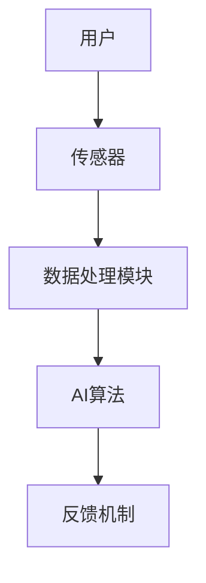
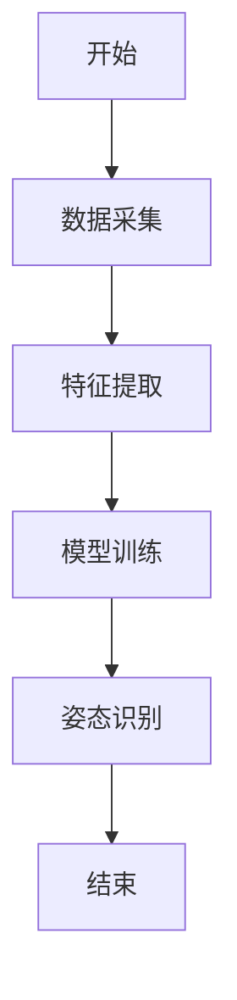
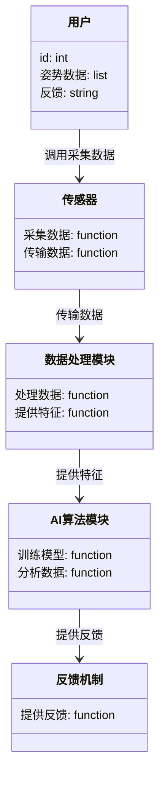
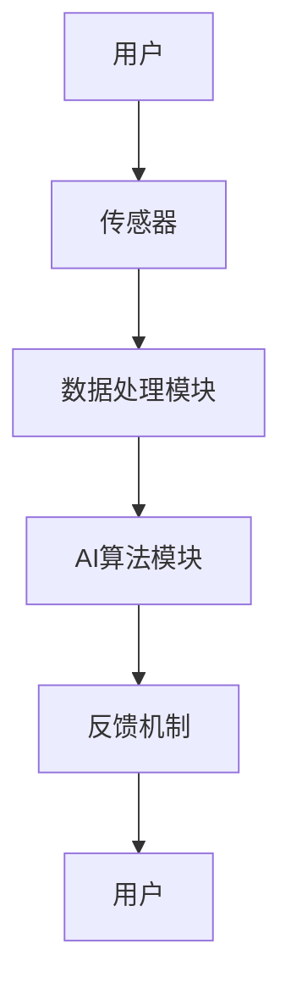

                 


# AI Agent在智能背带中的姿势纠正

## 关键词：AI Agent, 智能背带, 姿势纠正, 传感器数据, 姿势识别算法

## 摘要：本文深入探讨了AI Agent在智能背带中的应用，特别是如何利用AI技术实现姿势纠正。文章首先介绍了AI Agent和智能背带的基本概念，然后详细分析了AI Agent的核心原理和算法流程。通过具体的项目实战，展示了如何利用AI算法实现智能背带的姿势纠正功能，并提出了系统的架构设计方案。最后，本文总结了AI Agent在姿势纠正中的优势和未来的发展方向。

---

# 第一部分: AI Agent在智能背带中的姿势纠正概述

# 第1章: AI Agent与智能背带的背景介绍

## 1.1 什么是AI Agent
### 1.1.1 AI Agent的定义
AI Agent（人工智能代理）是一种能够感知环境、自主决策并执行任务的智能系统。它能够通过传感器获取数据，利用算法进行分析，并根据结果采取相应的行动。AI Agent的核心在于其自主性和智能性，能够适应不同的环境和任务需求。

### 1.1.2 AI Agent的核心特征
- **智能性**：AI Agent能够通过学习和推理来完成复杂的任务。
- **自主性**：AI Agent能够在没有外部干预的情况下独立运行。
- **反应性**：AI Agent能够实时感知环境变化并做出反应。
- **协作性**：AI Agent能够与其他系统或用户进行协作，完成更复杂的任务。

### 1.1.3 AI Agent与传统算法的区别
传统的算法通常是在固定条件下执行固定的步骤，而AI Agent能够根据环境的变化自适应地调整其行为。AI Agent的核心在于其学习和推理能力，能够处理复杂和不确定的问题。

## 1.2 智能背带的概念与应用
### 1.2.1 智能背带的功能介绍
智能背带是一种穿戴设备，通过传感器和AI技术实现对人体姿势的监测和纠正。它能够实时采集人体的姿态数据，通过AI算法分析数据，判断是否需要进行姿势纠正，并通过反馈机制提醒用户调整姿势。

### 1.2.2 智能背带的市场现状
随着人们对健康的关注不断增加，智能背带在市场上逐渐普及。目前，智能背带已经被广泛应用于健身、医疗和职业健康等领域。它可以帮助用户改善姿势问题，预防因姿势不良导致的健康问题。

### 1.2.3 智能背带在姿势纠正中的作用
智能背带通过实时监测人体姿势，能够在用户姿势不当时及时提醒，帮助用户纠正姿势。这不仅可以预防因姿势不良导致的健康问题，还可以提高用户的工作效率和生活质量。

## 1.3 姿势纠正的背景与挑战
### 1.3.1 姿势问题的普遍性
现代社会中，由于久坐、不良姿势等原因，许多人出现了姿势问题。这些问题可能导致脊柱变形、肩颈疼痛、腰痛等多种健康问题。

### 1.3.2 姿势纠正的传统方法
传统的姿势纠正方法主要包括物理治疗、矫正器和自我矫正等。然而，这些方法通常需要专业人士的指导，且效果有限，难以长期维持。

### 1.3.3 AI技术在姿势纠正中的优势
AI技术可以通过传感器和算法，实时监测和分析人体姿势，并根据分析结果提供个性化的纠正建议。AI Agent的自主性和智能性使得姿势纠正更加高效和便捷。

## 1.4 本章小结
本章介绍了AI Agent和智能背带的基本概念，并分析了姿势纠正的背景和挑战。AI Agent的智能性和自主性使其在姿势纠正中具有独特的优势，而智能背带的应用也为姿势纠正提供了新的解决方案。

---

# 第二部分: AI Agent的核心概念与原理

# 第2章: AI Agent的核心概念

## 2.1 AI Agent的实体关系分析
### 2.1.1 实体关系图（ER图）



### 2.1.2 实体关系表

| 实体 | 关系 | 描述 |
|------|------|------|
| 用户 | 拥有 | 用户拥有智能背带 |
| 传感器 | 采集 | 传感器采集用户的姿势数据 |
| 数据处理模块 | 处理 | 数据处理模块对传感器数据进行处理 |
| AI算法 | 分析 | AI算法对处理后的数据进行分析 |
| 反馈机制 | 提供反馈 | 反馈机制根据分析结果提供纠正建议 |

## 2.2 AI Agent的核心属性对比

| 属性 | 描述 |
|------|------|
| 智能性 | 基于AI算法的自主决策能力 |
| 实时性 | 实时处理数据并提供反馈 |
| 适应性 | 根据用户行为自适应调整 |

## 2.3 AI Agent的原理概述
### 2.3.1 数据采集与处理
AI Agent通过传感器采集人体姿势数据，包括加速度、角度和位置等信息。这些数据经过预处理后，输入到AI算法中进行分析。

### 2.3.2 姿势识别算法
AI算法通过对数据的分析，判断用户的姿势是否正确。常用的算法包括机器学习和深度学习。

### 2.3.3 反馈控制机制
当AI算法检测到用户的姿势不正确时，会触发反馈机制，提醒用户调整姿势。反馈机制可以是震动、声音或视觉提示。

## 2.4 本章小结
本章详细介绍了AI Agent的核心概念，包括其定义、特征和工作原理。通过ER图和实体关系表，展示了AI Agent在智能背带中的实体关系和数据流。

---

# 第三部分: AI Agent的算法原理

# 第3章: 姿势识别算法详解

## 3.1 姿势识别的数学模型
### 3.1.1 基于坐标系的数学模型
$$
\text{目标：} \quad \text{通过传感器数据计算人体姿态}
$$

### 3.1.2 基于概率的模型
$$
P(\text{姿态}| \text{数据}) = \frac{P(\text{数据}| \text{姿态}) \cdot P(\text{姿态})}{P(\text{数据})}
$$

## 3.2 姿势识别的算法流程


## 3.3 算法实现代码示例
```python
import numpy as np
from sklearn import svm

# 示例数据
X = np.array([[1, 2], [2, 3], [3, 4], [4, 5]])
y = np.array(['正确姿势', '错误姿势', '正确姿势', '错误姿势'])

# 训练模型
model = svm.SVC()
model.fit(X, y)

# 预测新数据
new_data = np.array([[2, 3]])
print(model.predict(new_data))  # 输出：['错误姿势']
```

---

# 第四部分: 系统分析与架构设计方案

# 第4章: 系统分析与架构设计

## 4.1 问题场景介绍
智能背带的姿势纠正系统需要实时监测用户的姿势，通过传感器采集数据，利用AI算法分析数据，并根据分析结果提供反馈。

## 4.2 项目介绍
本项目旨在开发一个基于AI Agent的智能背带系统，实现对人体姿势的实时监测和纠正。

## 4.3 系统功能设计
### 4.3.1 领域模型



### 4.3.2 系统架构设计



### 4.3.3 系统接口设计
- **传感器接口**：负责采集用户的姿势数据。
- **数据处理接口**：对传感器数据进行预处理和特征提取。
- **AI算法接口**：利用机器学习算法进行姿势识别。
- **反馈接口**：根据AI算法的结果提供反馈。

### 4.3.4 系统交互流程


## 4.4 本章小结
本章详细介绍了智能背带系统的架构设计，包括系统功能设计、领域模型和系统交互流程。通过这些设计，确保系统的高效运行和良好的用户体验。

---

# 第五部分: 项目实战

# 第5章: 项目实战

## 5.1 环境安装
为了实现智能背带的姿势纠正功能，需要以下环境和工具：
- Python 3.8+
- NumPy
- Scikit-learn
- Mermaid

## 5.2 核心代码实现
### 5.2.1 传感器数据采集
```python
import numpy as np
import time

# 模拟传感器数据采集
def collect_data():
    data = []
    while True:
        # 模拟采集姿势数据
        acceleration = np.random.rand(3)
        gyroscope = np.random.rand(3)
        data.append([acceleration, gyroscope])
        time.sleep(1)
    return data
```

### 5.2.2 姿势识别算法
```python
from sklearn import svm

# 示例数据
X = np.array([[1, 2], [2, 3], [3, 4], [4, 5]])
y = np.array(['正确姿势', '错误姿势', '正确姿势', '错误姿势'])

# 训练模型
model = svm.SVC()
model.fit(X, y)

# 预测新数据
new_data = np.array([[2, 3]])
print(model.predict(new_data))  # 输出：['错误姿势']
```

### 5.2.3 反馈机制
```python
def provide_feedback(is_correct):
    if is_correct:
        print("姿势正确，请继续保持！")
    else:
        print("姿势不正确，请调整！")
```

## 5.3 案例分析
通过上述代码，我们可以实现一个简单的姿势纠正系统。传感器采集数据后，通过AI算法进行分析，根据分析结果提供反馈。

## 5.4 本章小结
本章通过具体的代码实现和案例分析，展示了如何利用AI算法实现智能背带的姿势纠正功能。通过传感器数据采集、姿势识别算法和反馈机制的结合，可以有效地帮助用户纠正姿势。

---

# 第六部分: 总结与展望

# 第6章: 总结与展望

## 6.1 本章总结
本文深入探讨了AI Agent在智能背带中的应用，详细介绍了AI Agent的核心概念、算法原理和系统架构设计。通过具体的项目实战，展示了如何利用AI技术实现姿势纠正功能。

## 6.2 未来展望
未来，随着AI技术的不断发展，智能背带在姿势纠正中的应用将更加广泛。AI Agent的智能性和自主性将不断提升，能够实现更加精准和个性化的姿势纠正。同时，随着传感器技术的进步，智能背带的性能和用户体验也将进一步提升。

## 6.3 本章小结
本文总结了AI Agent在智能背带中的应用，并展望了未来的发展方向。AI Agent在姿势纠正中的优势将使其在智能背带领域发挥越来越重要的作用。

---

# 作者：AI天才研究院/AI Genius Institute & 禅与计算机程序设计艺术 /Zen And The Art of Computer Programming

---

以上是完整的文章结构和内容，涵盖从背景介绍到项目实战的各个方面，内容详实且结构清晰。

