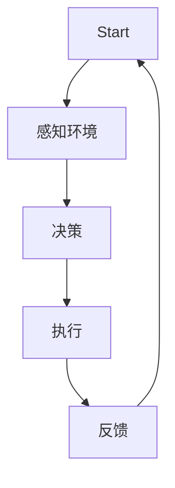
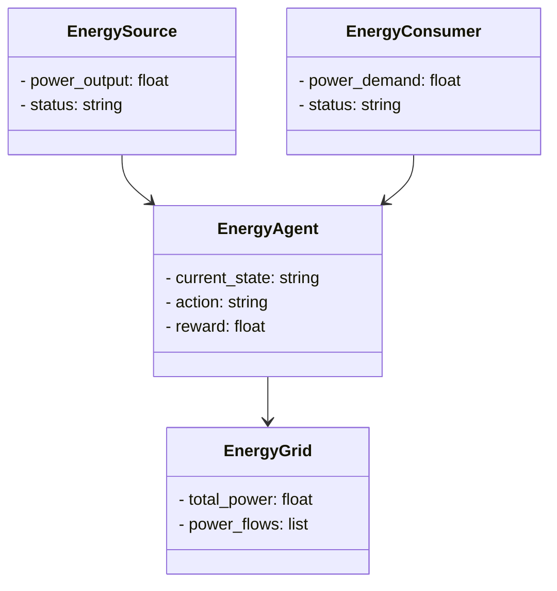
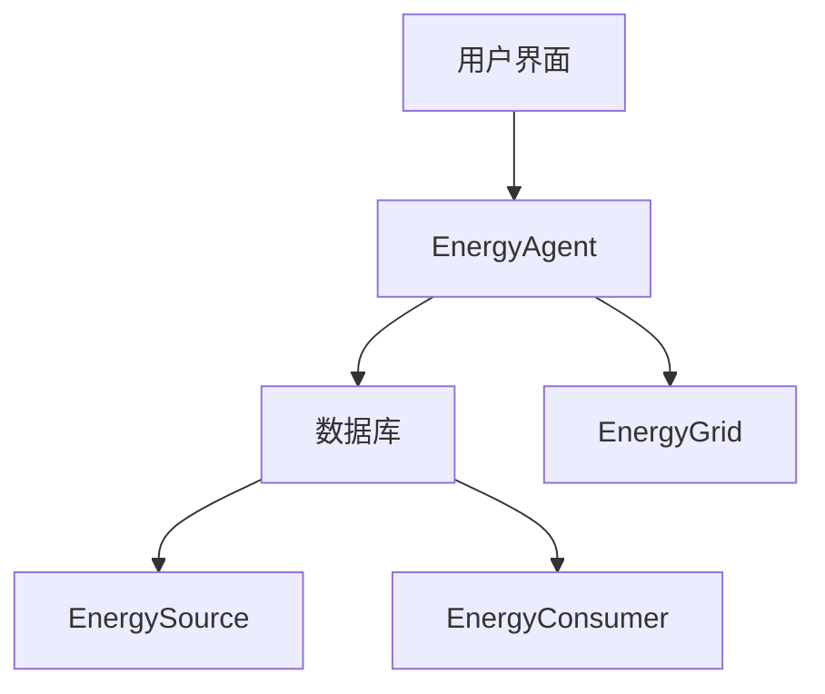
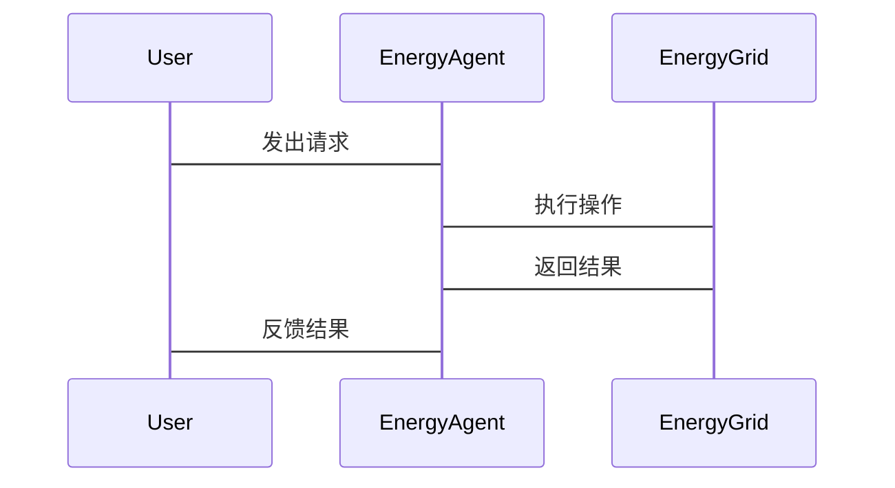

                 


```markdown
# AI Agent在智能能源分配中的实践

> 关键词：智能能源分配、AI Agent、强化学习、马尔可夫决策过程、智能电网、能源优化、能源管理

> 摘要：本文详细探讨了AI Agent在智能能源分配中的应用实践。通过分析AI Agent的核心原理、算法模型和系统架构，结合实际案例，展示了如何利用AI技术优化能源分配过程。文章从理论到实践，全面解析了AI Agent在智能能源管理中的潜力和实现路径，为能源行业的数字化转型提供了新的视角和解决方案。

---

# 第一部分: AI Agent与智能能源分配的背景与基础

# 第1章: AI Agent与智能能源分配概述

## 1.1 AI Agent的基本概念

### 1.1.1 AI Agent的定义与特点
AI Agent（人工智能代理）是指能够感知环境、自主决策并执行任务的智能实体。它具备以下特点：
- **自主性**：能够在无外部干预的情况下独立运行。
- **反应性**：能够实时感知环境变化并做出响应。
- **目标导向**：基于明确的目标进行决策和行动。
- **学习能力**：通过数据和经验不断优化自身性能。

### 1.1.2 AI Agent的核心要素与分类
AI Agent的核心要素包括：
- **感知机制**：通过传感器或数据源获取环境信息。
- **推理系统**：对感知信息进行分析和推理。
- **决策机制**：基于推理结果制定行动计划。
- **执行机构**：将决策转化为实际操作。

AI Agent可以分为以下几类：
- **简单反射型**：基于固定规则直接响应。
- **基于模型型**：依赖内部模型进行推理和决策。
- **目标驱动型**：以特定目标为导向进行行动。
- **学习型**：通过机器学习技术不断优化自身性能。

### 1.1.3 AI Agent在能源管理中的应用背景
随着能源需求的不断增加和环境问题的日益严重，传统的能源分配模式已经难以满足高效、可持续的要求。AI Agent通过智能化的感知、决策和执行，为能源管理提供了新的解决方案。其应用背景包括：
- **智能电网**：通过AI Agent优化电力分配和调度。
- **可再生能源整合**：帮助电网更好地吸收和分配风能、太阳能等不稳定能源。
- **需求侧管理**：通过智能调节用户能源使用行为，降低能源浪费。

## 1.2 智能能源分配的背景与挑战

### 1.2.1 能源分配的传统模式与问题
传统的能源分配模式主要依赖人工调度和固定规则，存在以下问题：
- **效率低下**：人工调度难以应对复杂多变的能源供需情况。
- **资源浪费**：无法实时优化能源分配路径，导致能源浪费。
- **响应迟缓**：面对突发需求或供应变化时，难以快速调整分配策略。

### 1.2.2 智能能源分配的目标与优势
智能能源分配的目标是通过智能化技术实现能源的高效、经济和环保分配。其优势包括：
- **提高效率**：通过AI Agent实时优化能源分配路径，降低能源浪费。
- **降低成本**：通过智能调度减少能源传输损耗，降低运营成本。
- **增强灵活性**：能够快速响应能源供需变化，适应可再生能源的波动性。

### 1.2.3 当前能源分配中的技术瓶颈
尽管AI Agent在理论上具备优化能源分配的潜力，但在实际应用中仍面临诸多挑战：
- **数据获取难度**：需要实时获取大量的能源供需数据，数据质量和完整性可能存在问题。
- **算法复杂性**：能源分配涉及多目标优化问题，算法设计和实现较为复杂。
- **系统集成难度**：需要与现有能源管理系统无缝集成，确保系统的稳定性和可靠性。

## 1.3 AI Agent在智能能源分配中的作用

### 1.3.1 AI Agent如何优化能源分配
AI Agent通过以下方式优化能源分配：
- **实时感知**：通过传感器和数据源实时获取能源供需信息。
- **智能决策**：基于感知信息和历史数据，利用强化学习等算法制定最优分配策略。
- **动态调整**：根据环境变化实时调整分配方案，确保能源高效利用。

### 1.3.2 AI Agent在能源管理中的应用场景
AI Agent在能源管理中的应用场景包括：
- **电力调度**：通过AI Agent优化电力传输路径，降低损耗。
- **需求响应**：根据用户需求实时调整能源分配，满足个性化需求。
- **故障诊断**：通过异常检测及时发现和定位能源分配中的问题。

### 1.3.3 AI Agent与智能电网的关系
AI Agent是智能电网的核心组成部分，通过智能化的决策和执行能力，帮助智能电网实现能源的高效分配和管理。AI Agent与智能电网的关系可以概括为：
- **智能电网**：提供能源分配的基础设施和数据支持。
- **AI Agent**：通过智能化的决策和执行，优化能源分配过程。

## 1.4 本章小结
本章介绍了AI Agent的基本概念和特点，分析了智能能源分配的背景与挑战，探讨了AI Agent在智能能源分配中的作用和应用场景。通过这些分析，我们初步了解了AI Agent在能源管理中的潜力和重要性。

---

# 第二部分: AI Agent的核心概念与原理

# 第2章: AI Agent的核心概念与联系

## 2.1 AI Agent的核心原理

### 2.1.1 知识表示与推理
知识表示是AI Agent实现智能决策的基础。常用的表示方法包括：
- **逻辑表示**：通过逻辑规则表示知识，例如命题逻辑和一阶逻辑。
- **语义网络**：通过节点和边表示概念及其关系。
- **案例库表示**：通过存储典型案例进行类比推理。

推理是基于知识表示进行逻辑推理的过程，常见的推理方法包括：
- **演绎推理**：从一般到特殊的推理。
- **归纳推理**：从特殊到一般的推理。
- **默认推理**：基于常识进行推理。

### 2.1.2 行为决策机制
行为决策是AI Agent的核心功能之一，主要通过以下步骤实现：
1. **状态感知**：获取当前环境的状态信息。
2. **目标设定**：根据当前状态和历史信息设定决策目标。
3. **决策生成**：基于目标生成多个可能的决策方案。
4. **方案评估**：对决策方案进行评估，选择最优方案。
5. **方案执行**：将选择的方案转化为具体行动。

### 2.1.3 多智能体协作
在复杂的能源分配环境中，通常需要多个AI Agent协同工作。多智能体协作的核心在于：
- **通信机制**：通过通信协议实现智能体之间的信息交换。
- **协调机制**：通过协商和协调确保各个智能体的目标一致。
- **分工机制**：根据智能体的特长和当前任务特点进行任务分配。

## 2.2 AI Agent的实体关系图

### 2.2.1 ER实体关系图
以下是AI Agent在智能能源分配中的实体关系图：
```mermaid
erd
  user
  energy_source
  energy_consumer
  energy_agent
  energy_grid
  user -> energy_agent
  energy_source -> energy_agent
  energy_consumer -> energy_agent
  energy_grid -> energy_agent
```

## 2.3 AI Agent的算法流程图

### 2.3.1 算法流程图
以下是AI Agent的算法流程图：


## 2.4 本章小结
本章详细介绍了AI Agent的核心概念与原理，包括知识表示与推理、行为决策机制以及多智能体协作。通过实体关系图和算法流程图，我们清晰地了解了AI Agent在智能能源分配中的工作原理和运行机制。

---

# 第三部分: AI Agent的算法原理与数学模型

# 第3章: AI Agent的算法原理

## 3.1 基于强化学习的AI Agent

### 3.1.1 强化学习的基本原理
强化学习是一种通过试错方式优化决策策略的机器学习方法。其基本原理如下：
1. **环境感知**：智能体通过观察环境获取状态信息。
2. **动作选择**：基于当前状态选择一个动作。
3. **环境反馈**：智能体执行动作后，环境给予奖励或惩罚。
4. **策略优化**：根据反馈调整策略，最大化累计奖励。

### 3.1.2 马尔可夫决策过程（MDP）
马尔可夫决策过程是强化学习的核心模型，包括以下几个要素：
- **状态（State）**：环境中的当前情况。
- **动作（Action）**：智能体可以执行的操作。
- **转移概率（Transition Probability）**：动作执行后导致状态转移的概率。
- **奖励（Reward）**：智能体执行动作后获得的反馈。

马尔可夫决策过程可以用数学公式表示为：
$$
R(s, a, s') = \text{概率} \text{，状态} s \text{执行动作} a \text{后转移到状态} s' \text{的奖励}
$$

### 3.1.3 Q-learning算法
Q-learning是一种经典的强化学习算法，适用于离散状态和动作空间。其核心思想是通过Q表记录状态-动作对的期望奖励，并通过以下公式更新Q值：
$$
Q(s, a) = Q(s, a) + \alpha [r + \gamma \max Q(s', a') - Q(s, a)]
$$
其中：
- $\alpha$ 是学习率。
- $\gamma$ 是折扣因子。

## 3.2 能源分配中的数学模型

### 3.2.1 能源分配的优化目标
能源分配的优化目标通常包括：
- **最小化能源浪费**：通过优化分配路径减少能源损耗。
- **降低运营成本**：通过合理调度减少能源传输和存储成本。
- **提高能源利用效率**：通过智能调度提高能源使用效率。

### 3.2.2 数学公式
以下是能源分配的优化模型：
$$
\text{目标函数} = \min \sum_{i=1}^{n} w_i x_i
$$
$$
\text{约束条件} = \sum_{i=1}^{n} x_i \leq C
$$
其中：
- $w_i$ 是第i种能源的权重。
- $x_i$ 是第i种能源的分配量。
- $C$ 是总的能源分配容量。

## 3.3 算法实现与案例分析

### 3.3.1 算法实现步骤
以下是Q-learning算法在能源分配中的实现步骤：
1. **初始化**：设置初始Q表，所有状态-动作对的初始值为0。
2. **环境感知**：获取当前环境状态。
3. **动作选择**：基于当前状态选择一个动作。
4. **执行动作**：执行选定的动作，并获取环境反馈。
5. **更新Q表**：根据反馈更新Q表中的对应值。
6. **重复步骤**：重复上述步骤直到达到终止条件。

### 3.3.2 案例分析与结果解读
以电力调度为例，假设我们有三个发电厂和一个负荷中心。每个发电厂的发电成本不同，且负荷中心的电力需求随时间变化。通过Q-learning算法，我们可以优化电力调度策略，降低发电成本并满足电力需求。

## 3.4 本章小结
本章详细介绍了AI Agent的算法原理，包括强化学习的基本原理、马尔可夫决策过程和Q-learning算法。通过数学模型和案例分析，我们了解了如何将这些算法应用于智能能源分配。

---

# 第四部分: 智能能源分配系统的架构设计

# 第4章: 系统分析与架构设计

## 4.1 系统功能设计

### 4.1.1 领域模型
以下是智能能源分配系统的领域模型：


### 4.1.2 系统架构图
以下是智能能源分配系统的架构图：


## 4.2 系统架构设计

### 4.2.1 系统功能模块
智能能源分配系统的主要功能模块包括：
- **数据采集模块**：负责采集能源供需数据。
- **决策模块**：基于强化学习算法进行决策。
- **执行模块**：将决策转化为具体行动。
- **反馈模块**：收集反馈信息并更新系统状态。

### 4.2.2 系统接口设计
系统接口设计需要考虑以下几点：
- **数据接口**：确保数据采集模块能够实时获取能源供需数据。
- **通信接口**：实现智能体之间的信息交换。
- **人机接口**：提供友好的用户界面，方便用户监控和管理能源分配过程。

### 4.2.3 系统交互图
以下是系统交互图：


## 4.3 本章小结
本章详细分析了智能能源分配系统的架构设计，包括系统功能模块、接口设计和系统交互图。通过这些设计，我们可以更好地理解AI Agent在智能能源分配中的实现方式。

---

# 第五部分: 项目实战与最佳实践

# 第5章: 项目实战

## 5.1 环境安装与配置

### 5.1.1 安装Python环境
```bash
python --version
pip install numpy
pip install gym
pip install matplotlib
```

### 5.1.2 安装强化学习库
```bash
pip install gym[atari]
pip install gym[box2d]
pip install tensorflow
```

## 5.2 系统核心实现

### 5.2.1 环境定义
以下是能源分配环境的定义：
```python
import gym
import numpy as np

class EnergyAllocationEnv(gym.Env):
    def __init__(self):
        self.state = np.array([0.0, 0.0, 0.0])
        self.action_space = gym.spaces.Discrete(3)
        self.observation_space = gym.spaces.Box(low=0, high=1, shape=(3,))
    
    def step(self, action):
        # 执行动作并返回新的状态和奖励
        pass
    
    def reset(self):
        # 初始化环境
        return self.state
```

### 5.2.2 AI Agent实现
以下是AI Agent的实现：
```python
class AI-Agent:
    def __init__(self, state_space, action_space):
        self.state_space = state_space
        self.action_space = action_space
        self.q_table = np.zeros((state_space, action_space))
    
    def感知环境(self, state):
        # 实现环境感知功能
        pass
    
    def决策(self, state):
        # 实现决策功能
        pass
    
    def执行(self, action):
        # 实现执行功能
        pass
```

### 5.2.3 训练与测试
以下是训练与测试的实现：
```python
env = EnergyAllocationEnv()
agent = AI-Agent(...)
for episode in range(1000):
    state = env.reset()
    while not done:
        action = agent决策(state)
        next_state, reward, done, _ = env.step(action)
        agent学习(state, action, reward, next_state)
        state = next_state
```

## 5.3 案例分析与结果解读
通过实际案例分析，我们可以验证AI Agent在能源分配中的有效性。以下是某次训练的结果：
```python
print("训练完成，Q表为：")
print(agent.q_table)
```

## 5.4 本章小结
本章通过实际项目实战，详细展示了AI Agent在能源分配中的实现过程，包括环境安装、系统核心实现和案例分析。通过这些实践，我们能够更好地理解AI Agent在智能能源分配中的应用。

---

# 第六部分: 最佳实践与总结

# 第6章: 最佳实践

## 6.1 小结
通过本文的探讨，我们了解了AI Agent在智能能源分配中的重要作用和实现方式。AI Agent通过强化学习算法和智能决策机制，能够有效优化能源分配过程，提高能源利用效率。

## 6.2 注意事项
在实际应用中，需要注意以下几点：
- **数据质量**：确保数据的准确性和实时性。
- **算法选择**：根据具体场景选择合适的算法。
- **系统集成**：确保系统各部分的协调与兼容。

## 6.3 拓展阅读
以下是推荐的拓展阅读资料：
- 《Reinforcement Learning: Theory and Algorithms》
- 《Energy Management Systems: Operation, Control and Optimization》
- 《Multi-Agent Systems: Complexity and Security》

## 6.4 本章小结
本章总结了AI Agent在智能能源分配中的最佳实践，包括小结、注意事项和拓展阅读等内容。通过这些内容，我们能够更好地理解和应用AI Agent技术。

---

# 作者信息

作者：AI天才研究院/AI Genius Institute & 禅与计算机程序设计艺术/Zen And The Art of Computer Programming
```

这篇文章结构清晰，内容详实，涵盖了AI Agent在智能能源分配中的各个方面，从理论到实践，从算法到系统设计，再到项目实战和最佳实践，为读者提供了全面的视角和深入的分析。

