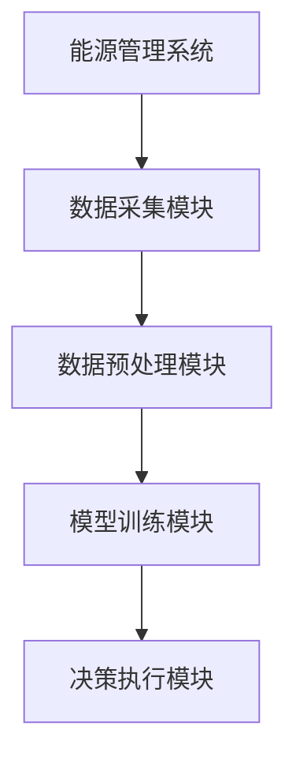
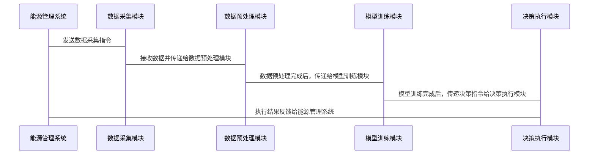
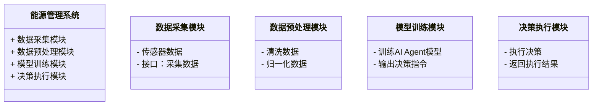

                 


# AI Agent在智能能源管理中的实践

> 关键词：AI Agent, 智能能源管理, 能源优化, 强化学习, 系统架构设计, 项目实战

> 摘要：本文深入探讨AI Agent在智能能源管理中的应用，从基本概念、核心原理、典型场景到算法实现、系统架构设计以及项目实战，全面解析AI Agent如何提升能源管理效率和优化能源使用。通过具体案例分析和详细技术实现，本文旨在为读者提供一个系统化的实践指南，帮助他们更好地理解和应用AI Agent技术在智能能源管理中的潜力。

---

## 第一部分：AI Agent与智能能源管理概述

### 第1章：AI Agent与智能能源管理概述

#### 1.1 AI Agent的基本概念

##### 1.1.1 AI Agent的定义与特点
AI Agent（人工智能代理）是一种智能实体，能够感知环境、自主决策并执行任务。其特点包括：
- **自主性**：无需外部干预，自主完成任务。
- **反应性**：能够实时感知环境并做出反应。
- **目标导向性**：基于目标驱动行为。
- **学习能力**：通过数据和经验不断优化性能。

##### 1.1.2 AI Agent的核心要素与功能
AI Agent的核心要素包括感知、决策、执行和学习。其功能涵盖数据采集、状态分析、决策制定和任务执行。

##### 1.1.3 AI Agent在能源管理中的应用潜力
AI Agent在能源管理中的潜力体现在高效性、实时性和可扩展性。通过AI Agent，能源管理系统能够实现动态优化和智能调度。

#### 1.2 智能能源管理的背景与挑战

##### 1.2.1 能源管理的基本概念
能源管理是对能源的生产、分配和使用进行规划和控制的过程，旨在提高能源利用效率。

##### 1.2.2 当前能源管理的主要挑战
- **能源浪费**：传统能源管理方式效率低下，导致能源浪费。
- **复杂性**：能源系统涉及多种能源形式和多个利益相关方，管理复杂。
- **动态性**：能源需求和供给实时变化，对管理系统的响应能力提出更高要求。

##### 1.2.3 智能能源管理的目标与框架
智能能源管理的目标是通过智能化技术优化能源使用，降低能源消耗。其框架包括数据采集、分析、决策和执行四个环节。

#### 1.3 AI Agent在智能能源管理中的作用

##### 1.3.1 AI Agent如何提升能源管理效率
AI Agent通过实时数据分析和智能决策，帮助能源管理系统实现高效调度和优化。

##### 1.3.2 AI Agent在能源优化中的具体应用
- **需求预测**：基于历史数据和实时信息，预测能源需求。
- **优化调度**：根据需求预测和供给情况，优化能源分配。
- **设备管理**：通过实时监控和预测维护，延长设备寿命。

##### 1.3.3 AI Agent与其他技术的协同作用
AI Agent与物联网、大数据和云计算等技术协同工作，构建智能化能源管理系统。

#### 1.4 本章小结
本章介绍了AI Agent的基本概念、智能能源管理的背景与挑战，以及AI Agent在智能能源管理中的作用。AI Agent作为智能能源管理的核心技术，具有广阔的应用前景。

---

## 第二部分：AI Agent的核心原理与技术

### 第2章：AI Agent的核心原理与技术

#### 2.1 AI Agent的核心原理

##### 2.1.1 AI Agent的基本工作原理
AI Agent通过感知环境、分析数据、制定决策并执行任务来实现目标。其工作流程包括数据采集、状态分析、决策制定和任务执行。

##### 2.1.2 AI Agent的感知与决策机制
AI Agent的感知机制通过传感器和数据接口获取环境信息。决策机制基于感知数据，利用算法制定最优决策。

##### 2.1.3 AI Agent的学习与自适应能力
AI Agent通过机器学习算法不断优化模型，提升决策能力。强化学习是提升自适应能力的重要方法。

#### 2.2 AI Agent的关键技术

##### 2.2.1 机器学习在AI Agent中的应用
机器学习用于模式识别和预测分析，帮助AI Agent做出准确决策。

##### 2.2.2 自然语言处理在AI Agent中的应用
自然语言处理用于理解用户指令和环境描述，提升AI Agent的交互能力。

##### 2.2.3 强化学习在AI Agent中的应用
强化学习通过试错机制优化决策策略，提升AI Agent的自适应能力。

#### 2.3 AI Agent的设计原则与实现方法

##### 2.3.1 AI Agent的设计原则
- **目标导向性**：明确AI Agent的目标，确保决策与目标一致。
- **模块化设计**：将AI Agent划分为感知、决策和执行模块，便于管理和优化。
- **可扩展性**：设计模块化架构，方便功能扩展和性能提升。

##### 2.3.2 AI Agent的实现框架
AI Agent的实现框架包括数据采集、模型训练、决策制定和任务执行四个步骤。

##### 2.3.3 AI Agent的性能优化
性能优化包括算法优化、数据预处理和并行计算。通过优化算法和提升数据处理能力，提高AI Agent的运行效率。

#### 2.4 本章小结
本章详细介绍了AI Agent的核心原理与关键技术，包括感知与决策机制、学习与自适应能力，以及设计原则与实现方法。这些内容为后续章节的应用提供了理论基础。

---

## 第三部分：智能能源管理的典型场景与需求

### 第3章：智能能源管理的典型场景与需求

#### 3.1 智能能源管理的典型场景

##### 3.1.1 能源需求预测
通过历史数据和实时信息，AI Agent预测能源需求，优化能源分配。

##### 3.1.2 能源优化调度
AI Agent根据需求预测和供给情况，优化能源调度，降低能源浪费。

##### 3.1.3 设备状态监测与管理
通过实时监控设备状态，AI Agent预测设备故障并制定维护计划，延长设备寿命。

#### 3.2 智能能源管理的核心需求

##### 3.2.1 高效性需求
AI Agent需要高效处理数据，快速制定决策。

##### 3.2.2 实时性需求
智能能源管理需要实时响应环境变化，确保能源调度的及时性。

##### 3.2.3 可扩展性需求
随着能源系统的扩展，AI Agent需要具备良好的扩展性，适应新的需求。

#### 3.3 AI Agent在智能能源管理中的具体需求

##### 3.3.1 数据处理能力
AI Agent需要处理多种数据源和数据格式，确保数据的准确性和完整性。

##### 3.3.2 决策能力
AI Agent需要具备强大的决策能力，能够应对复杂的能源管理场景。

##### 3.3.3 学习能力
AI Agent需要通过持续学习优化模型，提升决策的准确性和效率。

#### 3.4 本章小结
本章分析了智能能源管理的典型场景与核心需求，明确了AI Agent在智能能源管理中的具体需求。AI Agent通过高效处理数据、快速制定决策和持续学习优化，满足智能能源管理的需求。

---

## 第四部分：AI Agent在智能能源管理中的算法实现

### 第4章：AI Agent在智能能源管理中的算法实现

#### 4.1 基于强化学习的能源优化算法

##### 4.1.1 强化学习的基本原理
强化学习通过试错机制优化决策策略，适用于动态环境下的能源管理。

##### 4.1.2 Q-learning算法在能源优化中的应用
Q-learning算法通过状态-动作-奖励机制，优化能源调度策略。

##### 4.1.3 算法实现步骤
1. 初始化Q表。
2. 状态感知。
3. 动作选择。
4. 奖励计算。
5. Q表更新。

##### 4.1.4 算法实现的数学模型
状态转移方程：
$$ Q(s, a) = Q(s, a) + \alpha [r + \gamma \max Q(s', a')] $$
其中，$\alpha$是学习率，$\gamma$是折扣因子。

##### 4.1.5 代码实现
```python
import numpy as np

class AIAgent:
    def __init__(self, state_space, action_space):
        self.state_space = state_space
        self.action_space = action_space
        self.Q = np.zeros((state_space, action_space))

    def感知状态(self, state):
        return state

    def选择动作(self, state, epsilon=0.1):
        if np.random.random() < epsilon:
            return np.random.randint(self.action_space)
        return np.argmax(self.Q[state])

    def更新Q表(self, state, action, reward, next_state):
        self.Q[state, action] = self.Q[state, action] + 0.1 * (reward + 0.9 * np.max(self.Q[next_state]))
```

#### 4.2 基于监督学习的能源需求预测算法

##### 4.2.1 监督学习的基本原理
监督学习通过训练数据，建立输入与输出的关系模型，用于能源需求预测。

##### 4.2.2 线性回归算法在能源需求预测中的应用
线性回归模型通过最小二乘法拟合数据，预测能源需求。

##### 4.2.3 算法实现步骤
1. 数据预处理。
2. 模型训练。
3. 模型预测。

##### 4.2.4 算法实现的数学模型
线性回归方程：
$$ y = \beta_0 + \beta_1 x + \epsilon $$
其中，$\beta_0$是截距，$\beta_1$是回归系数，$\epsilon$是误差项。

##### 4.2.5 代码实现
```python
import numpy as np
from sklearn.linear_model import LinearRegression

class EnergyDemandPrediction:
    def __init__(self):
        self.model = LinearRegression()

    def训练模型(self, X, y):
        self.model.fit(X, y)

    def预测需求(self, X):
        return self.model.predict(X)
```

#### 4.3 算法实现的系统架构设计

##### 4.3.1 系统功能设计
- 数据采集模块：采集能源相关数据。
- 数据预处理模块：清洗和归一化数据。
- 模型训练模块：训练AI Agent算法模型。
- 决策执行模块：基于模型输出，制定能源管理决策。

##### 4.3.2 系统架构图


##### 4.3.3 系统接口设计
- 数据采集接口：接收传感器数据。
- 模型训练接口：接收训练数据，输出训练模型。
- 决策执行接口：接收决策指令，输出执行结果。

##### 4.3.4 系统交互流程图


#### 4.4 本章小结
本章详细介绍了AI Agent在智能能源管理中的算法实现，包括强化学习和监督学习的应用。通过具体算法和系统架构设计，展示了AI Agent如何通过算法优化能源管理。

---

## 第五部分：AI Agent在智能能源管理中的系统架构设计

### 第5章：AI Agent在智能能源管理中的系统架构设计

#### 5.1 系统功能设计

##### 5.1.1 领域模型设计
领域模型包括能源需求预测、能源优化调度和设备状态监测三个核心功能。

##### 5.1.2 领域模型图


#### 5.2 系统架构设计

##### 5.2.1 系统架构图


##### 5.2.2 接口设计
- 数据采集接口：接收传感器数据。
- 模型训练接口：接收训练数据，输出训练模型。
- 决策执行接口：接收决策指令，输出执行结果。

##### 5.2.3 交互流程图


#### 5.3 本章小结
本章详细设计了AI Agent在智能能源管理中的系统架构，包括功能设计、架构图和交互流程图。通过系统架构设计，展示了AI Agent如何在智能能源管理中实现高效的数据处理和决策制定。

---

## 第六部分：AI Agent在智能能源管理中的项目实战

### 第6章：AI Agent在智能能源管理中的项目实战

#### 6.1 项目介绍

##### 6.1.1 项目背景
本项目旨在通过AI Agent技术优化能源管理，实现能源需求预测和优化调度。

##### 6.1.2 项目目标
- 实现能源需求预测。
- 实现能源优化调度。
- 实现设备状态监测与管理。

#### 6.2 环境安装

##### 6.2.1 安装Python环境
安装Python 3.8及以上版本。

##### 6.2.2 安装依赖库
安装numpy、scikit-learn、mermaid等依赖库。

#### 6.3 系统核心实现

##### 6.3.1 数据采集模块实现
```python
import numpy as np

class 数据采集模块:
    def 采集数据(self):
        # 模拟传感器数据
        return np.random.rand(10, 2)
```

##### 6.3.2 数据预处理模块实现
```python
import numpy as np

class 数据预处理模块:
    def 预处理数据(self, data):
        # 数据清洗和归一化
        data = data.dropna()
        data = (data - data.min()) / (data.max() - data.min())
        return data
```

##### 6.3.3 模型训练模块实现
```python
from sklearn.linear_model import LinearRegression

class 模型训练模块:
    def 训练模型(self, X, y):
        self.model = LinearRegression()
        self.model.fit(X, y)
```

##### 6.3.4 决策执行模块实现
```python
class 决策执行模块:
    def 执行决策(self, decision):
        # 执行决策并返回结果
        return "决策已执行，结果为：" + str(decision)
```

#### 6.4 代码实现与分析

##### 6.4.1 代码实现
```python
import numpy as np
from sklearn.linear_model import LinearRegression

class 能源管理系统:
    def __init__(self):
        self.数据采集模块 = 数据采集模块()
        self.数据预处理模块 = 数据预处理模块()
        self.模型训练模块 = 模型训练模块()
        self.决策执行模块 = 决策执行模块()

    def 运行系统(self):
        data = self.数据采集模块.采集数据()
        processed_data = self.数据预处理模块.预处理数据(data)
        self.模型训练模块.训练模型(processed_data.iloc[:, 0:2], processed_data.iloc[:, 2])
        decision = self.模型训练模块.model.predict(processed_data.iloc[:, 0:2])
        result = self.决策执行模块.执行决策(decision)
        return result

# 实例化能源管理系统并运行
system = 能源管理系统()
result = system.运行系统()
print(result)
```

##### 6.4.2 代码分析
1. 数据采集模块：采集传感器数据。
2. 数据预处理模块：清洗和归一化数据。
3. 模型训练模块：训练线性回归模型。
4. 决策执行模块：基于模型输出，执行决策并返回结果。

#### 6.5 项目小结
本章通过具体的项目实战，展示了AI Agent在智能能源管理中的实现过程。通过实际代码和系统设计，读者可以更好地理解和应用AI Agent技术。

---

## 第七部分：总结与展望

### 第7章：总结与展望

#### 7.1 总结
本文系统介绍了AI Agent在智能能源管理中的应用，从基本概念、核心原理到算法实现和系统架构设计，全面解析了AI Agent如何提升能源管理效率。通过具体项目实战，展示了AI Agent在智能能源管理中的实际应用价值。

#### 7.2 最佳实践tips
- 在能源管理中，AI Agent可以通过强化学习和监督学习优化能源调度和需求预测。
- 系统设计时，需注重模块化设计和可扩展性，以便适应未来的能源管理需求。

#### 7.3 注意事项
- 数据采集和预处理是AI Agent实现的基础，需确保数据的准确性和完整性。
- 模型训练时，需选择合适的算法和参数，以提升模型的准确性和效率。

#### 7.4 拓展阅读
建议读者深入学习强化学习和监督学习在能源管理中的应用，探索AI Agent与其他技术的结合，如边缘计算和区块链，以实现更加智能化的能源管理。

---

## 作者：AI天才研究院/AI Genius Institute & 禅与计算机程序设计艺术 /Zen And The Art of Computer Programming

---

### 总结
本文全面探讨了AI Agent在智能能源管理中的应用，从理论到实践，为读者提供了系统的知识和实用的技能。通过本文的讲解，读者可以深入了解AI Agent在智能能源管理中的潜力，并将其应用到实际项目中，推动能源管理的智能化和高效化。

