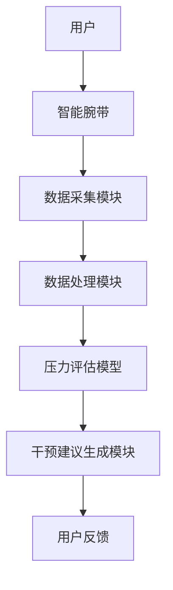

                 


# AI Agent在智能腕带中的压力管理系统

---

## 关键词：
AI Agent，智能腕带，压力管理，机器学习，健康监测，可穿戴设备

---

## 摘要：
本文深入探讨了AI Agent在智能腕带中的压力管理系统的设计与实现。通过分析压力管理的重要性，结合AI Agent的核心原理与技术，详细阐述了基于智能腕带的实时压力监测、个性化反馈与干预方案。文章从系统需求分析、功能设计、架构设计、算法实现等多个维度展开，提供了完整的压力管理系统解决方案，并通过实际案例分析验证了系统的可行性和有效性。

---

# 第1章: 压力管理与AI Agent概述

## 1.1 压力管理的重要性
### 1.1.1 压力的定义与分类
压力是人体对外界刺激的反应，可以是生理、心理或情感上的紧张状态。根据来源，压力可以分为工作压力、家庭压力、社交压力等。适度的压力可以激发人的潜能，但长期的压力过载则会对健康造成严重损害。

### 1.1.2 压力对个人和组织的影响
压力会导致焦虑、失眠、免疫力下降等健康问题，同时影响工作效率和团队协作。对于组织而言，员工压力过大可能导致生产力下降、 absenteeism（旷工）增加，甚至引发员工流失。

### 1.1.3 压力管理的必要性
有效的压力管理可以帮助个人保持心理健康，提高生活质量，同时也有助于企业提高员工满意度和工作效率。

## 1.2 AI Agent的基本概念
### 1.2.1 什么是AI Agent
AI Agent（智能代理）是一种能够感知环境、自主决策并执行任务的智能系统。它可以理解用户需求，主动提供解决方案，并根据反馈不断优化行为。

### 1.2.2 AI Agent的核心特征
- **自主性**：能够独立决策和行动。
- **反应性**：能够实时感知环境并做出响应。
- **学习能力**：通过数据和经验不断优化性能。

### 1.2.3 AI Agent与传统算法的区别
AI Agent不仅能够执行预设任务，还能够根据环境变化动态调整策略。与传统算法相比，AI Agent更加智能和灵活。

## 1.3 AI Agent在智能腕带中的应用
### 1.3.1 智能腕带的功能与特点
智能腕带是一种可穿戴设备，能够实时监测用户的身体指标，如心率、皮肤电活动、运动量等。

### 1.3.2 AI Agent在压力管理中的作用
AI Agent可以分析腕带采集的数据，识别用户的压力状态，并提供个性化的干预方案，如放松训练、呼吸调节等。

### 1.3.3 本章小结
本章介绍了压力管理的重要性以及AI Agent的基本概念和特点，重点探讨了AI Agent在智能腕带中的应用价值。

---

# 第2章: 压力管理的背景分析

## 2.1 现代社会中的压力问题
### 2.1.1 现代工作压力的现状
现代社会节奏快，竞争激烈，许多人长期处于高压状态。

### 2.1.2 压力对个人健康的影响
长期的压力会导致失眠、焦虑、抑郁等心理问题，甚至引发心脏病、高血压等身体疾病。

### 2.1.3 企业对压力管理的需求
企业希望员工保持良好的心理状态，以提高工作效率和团队凝聚力。

## 2.2 智能腕带的兴起
### 2.2.1 智能穿戴设备的发展历程
从简单的心率监测到多功能的健康助手，智能穿戴设备逐渐成为人们生活中不可或缺的一部分。

### 2.2.2 智能腕带的功能与市场定位
智能腕带不仅可以监测健康数据，还可以通过AI技术提供个性化的健康建议。

### 2.2.3 用户对智能腕带的需求分析
用户希望智能腕带能够提供实时健康监测、个性化建议和便捷的使用体验。

## 2.3 压力管理系统的必要性
### 2.3.1 压力管理系统的定义
压力管理系统是一种通过智能设备和AI技术帮助用户识别、评估和缓解压力的系统。

### 2.3.2 系统的目标与核心功能
- **目标**：帮助用户有效管理压力，改善心理健康。
- **核心功能**：实时监测压力、提供个性化干预、记录压力数据、生成报告。

### 2.3.3 系统的边界与外延
压力管理系统不仅关注个体压力，还与团队、组织的健康管理体系相连接。

---

# 第3章: AI Agent的核心原理与技术

## 3.1 AI Agent的核心原理
### 3.1.1 AI Agent的感知与决策机制
AI Agent通过传感器数据感知环境，利用机器学习算法进行分析和决策。

### 3.1.2 基于数据的分析与反馈
AI Agent能够实时分析压力数据，并根据用户反馈调整干预策略。

### 3.1.3 AI Agent的自适应能力
通过不断学习和优化，AI Agent能够更好地适应用户的需求和环境变化。

## 3.2 AI Agent的核心技术
### 3.2.1 机器学习算法
- **监督学习**：通过大量标注数据训练模型，识别压力状态。
- **无监督学习**：发现数据中的潜在模式，优化干预策略。
- **强化学习**：通过试错不断优化决策过程。

### 3.2.2 自然语言处理
AI Agent可以理解用户的语言输入，提供更自然的交互体验。

### 3.2.3 数据分析与可视化
通过对压力数据的分析和可视化，用户可以更好地理解自己的压力状态。

## 3.3 AI Agent与智能腕带的结合
### 3.3.1 数据采集与处理
智能腕带通过传感器采集用户的心率、皮肤电活动等数据，AI Agent对这些数据进行分析。

### 3.3.2 压力评估模型
基于机器学习算法，AI Agent构建压力评估模型，识别用户的压力状态。

### 3.3.3 个性化反馈机制
AI Agent根据用户的压力状态，提供个性化的干预建议，如放松训练、呼吸调节等。

---

# 第4章: 压力管理系统的技术实现

## 4.1 传感器数据采集
### 4.1.1 心率监测
心率是衡量压力的重要指标，AI Agent通过心率变异性（HRV）分析压力状态。

### 4.1.2 皮肤电活动监测
皮肤电活动（EDA）反映了自主神经系统的变化，是压力监测的重要指标。

### 4.1.3 加速度与运动监测
运动量与压力密切相关，AI Agent可以通过分析用户的运动数据，评估其压力水平。

## 4.2 机器学习算法实现
### 4.2.1 压力状态分类
- **数据预处理**：清洗和归一化传感器数据。
- **特征提取**：提取心率、EDA、加速度等特征。
- **模型训练**：使用随机森林、支持向量机（SVM）等算法训练分类模型。

### 4.2.2 个性化干预策略
AI Agent根据用户的压力状态和偏好，制定个性化的干预方案。

## 4.3 系统架构设计
### 4.3.1 数据流设计
- **数据采集**：传感器数据采集并传输到云端。
- **数据处理**：数据清洗、特征提取、模型推理。
- **结果反馈**：将压力评估结果和干预建议反馈给用户。

### 4.3.2 系统架构图


---

# 第5章: 项目实战

## 5.1 环境搭建
### 5.1.1 开发工具
- **Python**：主要编程语言。
- **TensorFlow/Scikit-learn**：机器学习库。
- **Matplotlib**：数据可视化库。

### 5.1.2 数据集
使用公开的压力相关数据集，或自行采集传感器数据。

## 5.2 核心代码实现
### 5.2.1 数据预处理
```python
import pandas as pd
import numpy as np

# 数据清洗
def preprocess_data(data):
    data = data.dropna()  # 删除缺失值
    data = (data - data.mean()) / data.std()  # 标准化
    return data
```

### 5.2.2 压力评估模型
```python
from sklearn.ensemble import RandomForestClassifier

# 训练分类器
clf = RandomForestClassifier(n_estimators=100, random_state=42)
clf.fit(X_train, y_train)
```

### 5.2.3 个性化反馈
```python
def generate_feedback压力状态：
    if pressure_level == 'high':
        return "请尝试深呼吸放松"
    elif pressure_level == 'medium':
        return "继续保持良好的心态"
    else:
        return "您目前的压力水平较低，继续保持"
```

## 5.3 系统实现与测试
### 5.3.1 系统实现
- **前端**：智能腕带的交互界面。
- **后端**：数据处理和模型推理。
- **接口设计**：RESTful API。

### 5.3.2 系统测试
- **功能测试**：确保系统能够实时监测压力并提供反馈。
- **性能测试**：评估系统的响应时间和处理能力。

---

# 第6章: 总结与展望

## 6.1 本章总结
本文详细探讨了AI Agent在智能腕带中的压力管理系统的设计与实现。通过结合传感器数据和机器学习算法，系统能够实时监测用户的压力状态，并提供个性化的干预建议。

## 6.2 未来展望
随着AI技术的不断发展，压力管理系统将更加智能化和个性化。未来的研究方向包括开发更精准的压力评估模型、优化干预策略，以及探索与其他健康管理系统（如睡眠监测、运动管理）的集成。

---

# 作者：AI天才研究院 & 禅与计算机程序设计艺术

