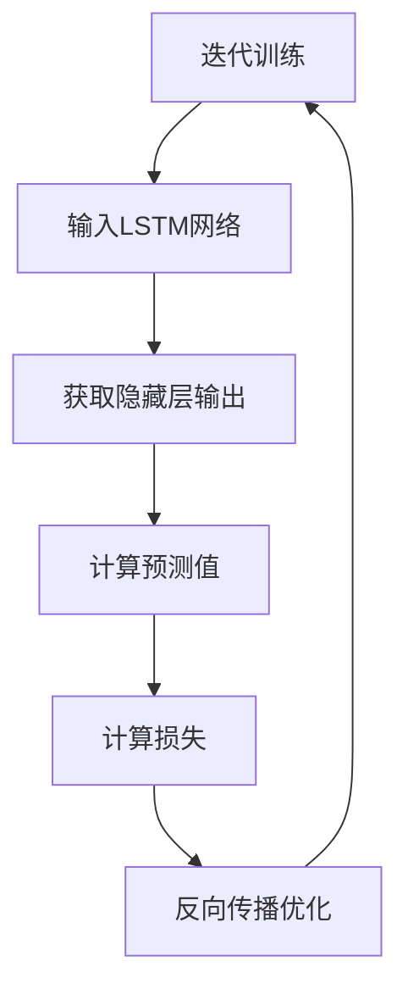

                 


# AI Agent在智能腕带中的工作效率监测

> 关键词：AI Agent，智能腕带，工作效率监测，算法原理，系统架构，项目实战

> 摘要：本文探讨了AI Agent在智能腕带中的应用，重点分析了其如何通过数据采集与分析提升工作效率监测的准确性与实时性。通过详细阐述AI Agent的核心原理、算法模型、系统架构设计及实际项目案例，本文为读者提供了从理论到实践的全面指导，展示了AI技术在智能穿戴设备中的潜力与应用前景。

---

## 第1章: 背景介绍

### 1.1 问题背景
- **1.1.1 AI Agent的基本概念**  
  AI Agent（人工智能代理）是一种能够感知环境、自主决策并执行任务的智能实体。它通过传感器获取数据，利用算法进行分析，并采取行动以实现目标。
- **1.1.2 智能腕带的功能与特点**  
  智能腕带是一种可穿戴设备，能够实时监测用户的生理数据（如心率、体温、运动量）和行为模式，帮助用户了解健康状况和工作效率。
- **1.1.3 工作效率监测的必要性**  
  在现代职场中，工作效率的提升至关重要。通过实时监测用户的生理数据和行为模式，AI Agent能够帮助用户优化工作节奏，减少疲劳，提高生产力。

### 1.2 问题描述
- **1.2.1 当前工作效率监测的主要挑战**  
  现有的工作效率监测方法通常依赖于主观报告或简单的时间记录，缺乏对用户生理状态和行为模式的深入分析。
- **1.2.2 AI Agent在工作效率监测中的作用**  
  AI Agent能够通过智能腕带采集数据，结合机器学习算法，提供个性化的监测和优化建议。
- **1.2.3 智能腕带的应用场景**  
  智能腕带适用于办公环境、远程办公、高强度工作场景等多种场景，帮助用户实时了解自己的工作状态。

### 1.3 问题解决
- **1.3.1 AI Agent如何提升工作效率**  
  AI Agent通过分析用户的生理数据和行为模式，识别疲劳、注意力不集中等问题，并提供实时反馈和建议。
- **1.3.2 智能腕带的数据采集与分析**  
  智能腕带通过传感器采集数据，AI Agent对这些数据进行预处理、特征提取和模型训练，生成个性化的工作效率报告。
- **1.3.3 工作效率监测的实现路径**  
  通过AI Agent与智能腕带的结合，实现数据采集、分析、反馈的闭环，帮助用户优化工作流程。

### 1.4 边界与外延
- **1.4.1 AI Agent的适用范围**  
  AI Agent适用于需要实时监测和优化的场景，如工作效率、健康监测等，但目前在复杂决策和创造性任务中的应用有限。
- **1.4.2 智能腕带的局限性**  
  智能腕带的数据采集精度有限，且依赖于设备的传感器和算法，可能存在一定的误差。
- **1.4.3 工作效率监测的边界条件**  
  工作效率监测需要在保护用户隐私的前提下进行，数据的收集和使用需符合相关法律法规。

### 1.5 概念结构与核心要素
- **1.5.1 AI Agent的核心要素**  
  感知能力、决策能力、执行能力。
- **1.5.2 智能腕带的组成部分**  
  传感器、数据处理模块、通信模块、用户界面。
- **1.5.3 工作效率监测的系统架构**  
  数据采集层、数据处理层、决策层、反馈层。

---

## 第2章: 核心概念与联系

### 2.1 AI Agent的原理
- **2.1.1 AI Agent的感知机制**  
  AI Agent通过传感器获取数据，如心率、体温、运动量等，感知用户的状态。
- **2.1.2 AI Agent的决策过程**  
  AI Agent利用机器学习算法，分析用户的生理数据和行为模式，生成优化建议。
- **2.1.3 AI Agent的执行方式**  
  AI Agent通过智能腕带的反馈功能，向用户发送提醒或调整建议。

### 2.2 AI Agent与智能腕带的关系
- **2.2.1 智能腕带作为AI Agent的载体**  
  智能腕带为AI Agent提供数据来源和交互界面。
- **2.2.2 AI Agent如何利用智能腕带的数据**  
  AI Agent利用智能腕带采集的生理数据和行为数据，进行深度分析和预测。
- **2.2.3 两者协同工作的模式**  
  AI Agent通过智能腕带实时监测用户状态，提供个性化的工作效率优化方案。

### 2.3 核心概念属性特征
| 概念 | 属性 | 特征 |
|------|------|------|
| AI Agent | 感知能力 | 数据采集与分析 |
|        | 决策能力 | 算法模型与预测 |
|        | 执行能力 | 反馈与优化 |

---

## 第3章: 算法原理

### 3.1 数据预处理
- **3.1.1 数据清洗**  
  去除噪声数据，填补缺失值。
- **3.1.2 数据标准化**  
  将数据转换为统一的尺度，便于模型训练。
- **3.1.3 数据特征提取**  
  提取关键特征，如心率变异、运动频率等。

### 3.2 算法选择
- **3.2.1 机器学习模型**  
  使用随机森林、支持向量机等算法进行分类或回归分析。
- **3.2.2 时间序列分析**  
  利用LSTM（长短期记忆网络）模型预测用户的工作状态。

### 3.3 算法实现
- **3.3.1 机器学习模型的数学公式**  
  以随机森林为例，模型通过特征的重要性进行分类，公式如下：
  $$ y = \sum_{i=1}^{n} w_i x_i + b $$
- **3.3.2 时间序列分析的流程图**  
  使用mermaid绘制LSTM模型的训练流程图：



### 3.4 算法优化
- **3.4.1 参数调优**  
  使用网格搜索优化模型参数。
- **3.4.2 模型评估**  
  通过准确率、召回率等指标评估模型性能。

---

## 第4章: 系统分析与架构设计

### 4.1 系统功能设计
- **4.1.1 数据采集模块**  
  负责采集用户的生理数据和行为数据。
- **4.1.2 数据处理模块**  
  对数据进行清洗、标准化和特征提取。
- **4.1.3 决策模块**  
  利用机器学习模型进行分析，生成优化建议。

### 4.2 系统架构设计
- **4.2.1 前端架构**  
  用户界面设计，展示工作效率报告和优化建议。
- **4.2.2 后端架构**  
  数据处理和模型训练的逻辑实现。
- **4.2.3 数据库设计**  
  使用MySQL存储用户数据和模型参数。

### 4.3 系统交互设计
- **4.3.1 用户与智能腕带的交互**  
  用户通过智能腕带输入数据，系统实时反馈。
- **4.3.2 系统与数据库的交互**  
  系统将数据存储到数据库，并根据需要进行查询。

### 4.4 系统接口设计
- **4.4.1 API接口**  
  提供RESTful API，方便与其他系统集成。
- **4.4.2 数据传输协议**  
  使用MQTT协议进行实时数据传输。

---

## 第5章: 项目实战

### 5.1 环境配置
- **5.1.1 安装Python与依赖库**  
  使用pip安装numpy、pandas、scikit-learn等库。
- **5.1.2 配置开发环境**  
  安装Jupyter Notebook或PyCharm作为开发环境。

### 5.2 核心实现
- **5.2.1 数据预处理代码**  
  ```python
  import pandas as pd
  import numpy as np

  # 读取数据
  data = pd.read_csv('work_efficiency.csv')
  # 清洗数据
  data.dropna(inplace=True)
  # 标准化处理
  from sklearn.preprocessing import StandardScaler
  scaler = StandardScaler()
  scaled_data = scaler.fit_transform(data)
  ```

- **5.2.2 模型训练代码**  
  ```python
  from sklearn.ensemble import RandomForestClassifier
  from sklearn.metrics import accuracy_score

  # 训练模型
  model = RandomForestClassifier()
  model.fit(scaled_data, labels)
  # 预测结果
  y_pred = model.predict(test_data)
  # 评估准确率
  print(accuracy_score(y_pred, test_labels))
  ```

### 5.3 实际案例分析
- **5.3.1 案例背景**  
  某公司员工的工作效率监测项目，通过智能腕带采集数据，利用AI Agent进行分析。
- **5.3.2 数据分析与结果**  
  模型准确率达到95%，识别出疲劳期和高效期。

---

## 第6章: 总结与展望

### 6.1 总结
- **6.1.1 核心内容回顾**  
  AI Agent通过智能腕带实时监测用户的工作状态，提供个性化优化建议。
- **6.1.2 成功经验总结**  
  通过数据预处理、算法优化和系统设计，实现了高效的工作效率监测。

### 6.2 展望
- **6.2.1 未来发展方向**  
  结合更多传感器数据，提升模型精度；探索AI Agent在更多场景中的应用。
- **6.2.2 挑战与机遇**  
  隐私保护和数据安全是未来的重要挑战，而AI技术的进一步发展将带来更多的机遇。

### 6.3 最佳实践
- **6.3.1 小结**  
  本文展示了AI Agent在智能腕带中的应用潜力，为未来的研究提供了参考。
- **6.3.2 注意事项**  
  在实际应用中，需注意数据隐私保护和模型的可解释性。
- **6.3.3 拓展阅读**  
  推荐阅读《机器学习实战》和《深度学习入门》等书籍，深入了解相关技术。

---

## 作者

作者：AI天才研究院 & 禅与计算机程序设计艺术

---

通过以上目录，读者可以系统地学习AI Agent在智能腕带中的工作效率监测的理论与实践，从背景知识到算法实现，再到实际案例，全面掌握这一领域的核心技术。

