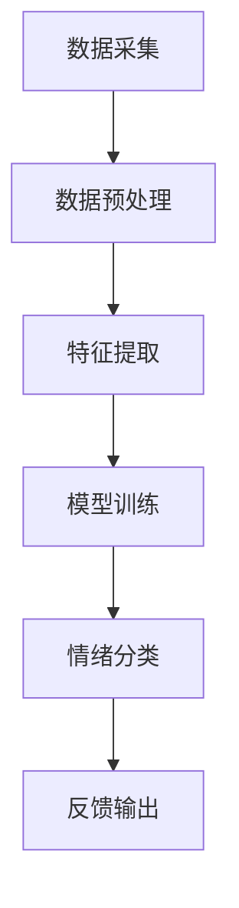
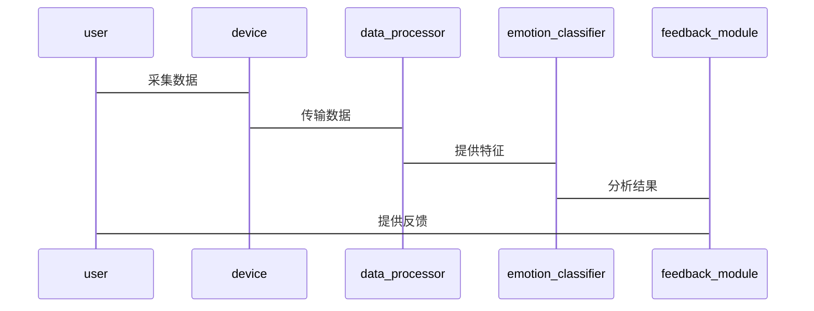

                 


# AI Agent在智能腕带中的情绪监测

**关键词**：AI Agent, 智能腕带, 情绪监测, 数据分析, 深度学习

**摘要**：本文探讨AI Agent在智能腕带中的情绪监测应用，分析其核心原理、算法实现和系统架构，通过实际案例展示其在健康监测和用户交互中的价值。

---

# 第1章: 情绪监测与AI Agent的背景介绍

## 1.1 情绪监测的重要性

### 1.1.1 情绪监测的定义与核心概念

情绪监测是通过分析生理信号、行为数据和语言特征，识别并评估个体情绪状态的过程。核心概念包括心率变异性（HRV）、皮肤电活动（EDA）、呼吸频率和语调分析等。

### 1.1.2 情绪监测在智能设备中的应用背景

智能设备，尤其是可穿戴设备，具备实时数据采集能力，为情绪监测提供了硬件支持。情绪监测可应用于健康管理、压力缓解和个性化服务等领域。

### 1.1.3 智能腕带的硬件与数据采集能力

智能腕带通常配备心率传感器、加速度计、皮肤电传感器和麦克风，能够采集心率、运动数据、皮肤电活动和语音数据。

## 1.2 AI Agent的基本概念

### 1.2.1 AI Agent的定义与分类

AI Agent是具备自主决策和问题解决能力的智能实体，分为简单反射型、基于模型的反应型、目标驱动型和实用驱动型。

### 1.2.2 AI Agent在智能设备中的作用

AI Agent在智能腕带中用于数据处理、用户交互和系统管理，通过分析数据提供实时反馈和个性化建议。

### 1.2.3 情绪监测与AI Agent的结合

AI Agent负责处理和分析情绪数据，提供实时反馈，帮助用户调节情绪状态。

## 1.3 智能腕带与情绪监测的结合

### 1.3.1 智能腕带的功能与技术特点

智能腕带具备实时数据采集、低功耗和可穿戴性，支持多种传感器和无线通信技术。

### 1.3.2 情绪监测在智能腕带中的应用场景

健康监测、压力管理、情绪记录和个性化反馈。

### 1.3.3 当前技术的挑战与未来发展方向

数据准确性、隐私保护和跨平台兼容性是当前挑战，未来将向高精度和智能化发展。

## 1.4 本章小结

---

# 第2章: 情绪监测的核心概念与AI Agent的联系

## 2.1 情绪监测的原理与方法

### 2.1.1 基于生理信号的情绪监测

通过分析心率变异性、皮肤电活动和呼吸频率等生理指标，识别情绪状态。

### 2.1.2 基于行为数据的情绪监测

通过分析用户的活动模式、睡眠质量和社交行为，评估情绪状态。

### 2.1.3 基于语言与语调的情绪监测

通过分析语音特征、语调变化和语速，识别情绪状态。

## 2.2 AI Agent在情绪监测中的角色

### 2.2.1 AI Agent作为数据处理引擎

AI Agent负责数据预处理、特征提取和模型训练，准确识别情绪状态。

### 2.2.2 AI Agent作为用户交互界面

AI Agent通过语音助手、震动反馈和视觉提示，提供实时反馈和个性化建议。

### 2.2.3 AI Agent作为情绪分析与反馈系统

AI Agent整合多源数据，进行综合分析，提供个性化反馈和干预建议。

## 2.3 情绪监测与AI Agent的关系

### 2.3.1 数据流与信息处理流程

数据采集 → 数据预处理 → 情绪分析 → 反馈输出。

### 2.3.2 AI Agent与智能腕带的协同工作

AI Agent负责数据处理和决策，智能腕带负责数据采集和用户交互。

### 2.3.3 情绪监测的闭环系统架构

闭环系统包括数据采集、分析、反馈和调整。

## 2.4 核心概念对比表

| **核心概念** | **定义** | **优势** | **挑战** |
|--------------|----------|----------|----------|
| 生理信号监测 | 通过心率、皮肤电活动等生理指标分析情绪 | 高准确性 | 易受环境干扰 |
| 行为数据分析 | 分析用户行为模式评估情绪 | 全面性 | 数据量大，处理复杂 |
| 语言语调分析 | 通过语音特征识别情绪 | 实时性 | 依赖语言环境 |

## 2.5 ER实体关系图

```mermaid
erDiagram
    user {
        +userId : integer
        +username : string
        +age : integer
    }
    device {
        +deviceId : integer
        +deviceType : string
        +user : userId
    }
    emotion_data {
        +emotionId : integer
        +emotionValue : string
        +timestamp : datetime
        +user : userId
    }
    user --> device : 使用
    device --> emotion_data : 采集
```

## 2.6 本章小结

---

# 第3章: 情绪监测的算法原理与实现

## 3.1 基于生理信号的分析算法

### 3.1.1 心率变异性分析

心率变异性反映了自主神经系统的活动，通过分析HRV时域和频域特征，评估情绪状态。

### 3.1.2 皮肤电活动分析

皮肤电活动反映了交感神经的激活程度，通过分析EDA波形特征，识别情绪状态。

### 3.1.3 呼吸频率分析

呼吸频率与情绪状态相关，通过分析呼吸周期和深度，评估情绪状态。

## 3.2 基于行为数据的分析算法

### 3.2.1 用户行为模式识别

通过分析用户的活动模式和时间分布，识别情绪状态。

### 3.2.2 时间序列分析

使用时间序列分析方法，识别行为模式中的情绪特征。

### 3.2.3 机器学习分类算法

采用支持向量机（SVM）或随机森林（RF）等算法，对行为数据进行分类。

## 3.3 基于语言与语调的分析算法

### 3.3.1 语调分析与情绪分类

通过分析语音特征，如音高、语速和语调变化，识别情绪状态。

### 3.3.2 语言特征提取与分析

提取文本中的情感词汇和语义特征，进行情感分析。

### 3.3.3 基于NLP的情感分析

使用自然语言处理技术，分析文本中的情感倾向。

## 3.4 AI Agent的算法实现

### 3.4.1 数据预处理与特征提取

对生理信号和行为数据进行标准化处理，提取特征向量。

### 3.4.2 基于深度学习的模型构建

使用LSTM网络进行时间序列分析，训练情绪分类模型。

### 3.4.3 模型训练与优化

采用交叉验证和超参数调优，提升模型性能。

## 3.5 情绪监测算法的流程图



## 3.6 本章小结

---

# 第4章: 系统分析与架构设计方案

## 4.1 问题场景介绍

智能腕带需要实时采集和分析生理信号，提供情绪反馈。

## 4.2 项目介绍

开发一个基于AI Agent的智能腕带情绪监测系统，实现实时监测和个性化反馈。

## 4.3 系统功能设计

### 4.3.1 数据采集模块

采集心率、皮肤电活动和语音数据。

### 4.3.2 数据处理模块

预处理和特征提取。

### 4.3.3 情绪分析模块

模型训练与分类。

### 4.3.4 反馈模块

提供实时反馈和个性化建议。

## 4.4 系统架构设计


## 4.5 系统接口设计

定义API接口，实现数据采集、处理和反馈的交互。

## 4.6 系统交互流程图



## 4.7 本章小结

---

# 第5章: 项目实战

## 5.1 环境安装

安装Python、TensorFlow和相关库，搭建开发环境。

## 5.2 核心代码实现

### 5.2.1 数据预处理

```python
import numpy as np
import pandas as pd

# 读取数据
data = pd.read_csv('emotion_data.csv')

# 数据标准化
from sklearn.preprocessing import StandardScaler
scaler = StandardScaler()
scaled_data = scaler.fit_transform(data)
```

### 5.2.2 模型训练

```python
from tensorflow.keras import layers

# 构建LSTM模型
model = tf.keras.Sequential()
model.add(layers.LSTM(64, input_shape=(None, 1)))
model.add(layers.Dense(1, activation='sigmoid'))
model.compile(loss='binary_crossentropy', optimizer='adam', metrics=['accuracy'])
model.fit(x_train, y_train, epochs=10, batch_size=32)
```

### 5.2.3 情绪分类

```python
# 预测情绪
y_pred = model.predict(x_test)
from sklearn.metrics import accuracy_score
print('Accuracy:', accuracy_score(y_test, y_pred.round()))
```

## 5.3 案例分析

分析真实用户数据，展示模型的准确性和实用性。

## 5.4 本章小结

---

# 第6章: 最佳实践与未来展望

## 6.1 最佳实践 tips

- 数据质量至关重要，需进行充分预处理。
- 选择合适的模型，避免过度复杂。
- 保护用户隐私，确保数据安全。

## 6.2 小结

AI Agent在智能腕带中的情绪监测具备广阔前景，未来将更加智能化和个性化。

## 6.3 注意事项

- 确保算法的准确性和实时性。
- 注意数据隐私和用户隐私保护。
- 定期更新模型，提升性能。

## 6.4 拓展阅读

推荐相关书籍和论文，鼓励深入学习。

---

# 作者

作者：AI天才研究院/AI Genius Institute  
禅与计算机程序设计艺术/Zen And The Art of Computer Programming

--- 

以上是《AI Agent在智能腕带中的情绪监测》的技术博客文章，按照逻辑一步步展开，详细讲解了相关背景、算法原理、系统设计和项目实现，供读者参考。

