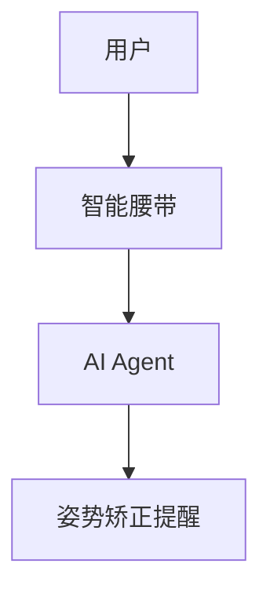
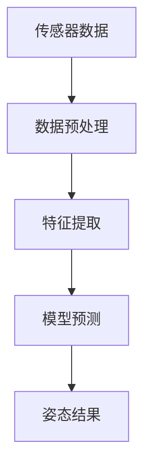
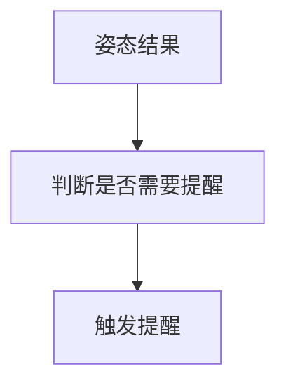
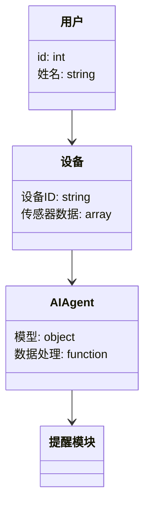
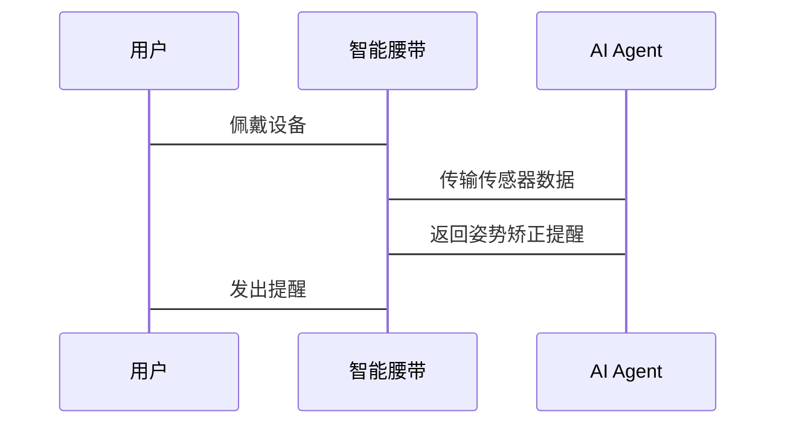

                 


# AI Agent在智能腰带中的姿势矫正与提醒

**关键词：** AI Agent, 智能腰带, 姿势矫正, 健康提醒, 可穿戴设备

**摘要：**  
本文深入探讨了AI Agent在智能腰带中的应用，重点分析了如何通过AI技术实现姿势矫正与健康提醒。文章从问题背景、核心概念、算法原理、系统架构、项目实战等多个维度展开，详细讲解了AI Agent在智能腰带中的技术实现及其实际应用价值。

---

# 第1章 背景介绍

## 1.1 问题背景

### 1.1.1 现代人姿势问题的现状
现代社会中，长时间久坐已经成为一种普遍现象，尤其是在办公室、学校和家中。长时间的不良姿势容易导致背部疼痛、颈椎病等问题，严重威胁人们的健康。

### 1.1.2 姿势矫正的重要性
姿势矫正不仅是健康问题，还关系到个人形象和工作效率。良好的姿势有助于提高专注力，减少身体疲劳。

### 1.1.3 AI技术在姿势矫正中的应用潜力
AI技术的快速发展为姿势矫正提供了新的可能性。通过AI Agent，智能腰带可以实时监测用户的姿势，并提供个性化的矫正建议。

## 1.2 问题描述

### 1.2.1 智能腰带的功能需求
智能腰带需要具备以下功能：实时监测用户姿势、识别不良姿势、提供矫正提醒、记录健康数据。

### 1.2.2 用户行为分析与数据采集
用户在使用智能腰带时，系统会采集以下数据：姿态数据（如脊柱弯曲度、肩部高度）、运动数据（如步频、步长）以及用户反馈（如矫正效果评价）。

### 1.2.3 姿势矫正的实现目标
实现目标包括：准确识别不良姿势、提供及时的提醒、记录矫正效果、优化矫正策略。

## 1.3 问题解决

### 1.3.1 AI Agent的核心作用
AI Agent通过实时分析用户的姿势数据，识别不良姿势，并触发提醒机制。

### 1.3.2 智能腰带的技术实现路径
智能腰带通过传感器采集数据，AI Agent进行数据分析和决策，最终通过振动或语音提醒用户矫正姿势。

### 1.3.3 用户反馈与系统优化
系统会根据用户的反馈不断优化提醒策略，提高矫正效果。

## 1.4 边界与外延

### 1.4.1 系统功能的边界
智能腰带仅专注于姿势矫正功能，不涉及其他健康监测功能（如心率监测）。

### 1.4.2 相关技术的外延
AI Agent技术可以扩展到其他领域，如智能家居、自动驾驶等。

### 1.4.3 用户体验的边界
系统提醒的频率和方式需要在用户体验和矫正效果之间找到平衡。

## 1.5 概念结构与核心要素

### 1.5.1 核心概念的层次结构
- **顶层概念：** AI Agent在智能腰带中的应用。
- **中层概念：** 姿势监测、数据采集、提醒机制。
- **底层概念：** 传感器技术、数据处理算法、用户反馈。

### 1.5.2 核心要素的对比分析
| 要素 | 描述 |
|------|------|
| 传感器 | 数据采集设备，如加速度计、陀螺仪 |
| 数据处理算法 | 用于分析姿势的算法，如姿态估计 |
| 用户反馈 | 用户对矫正提醒的响应 |

### 1.5.3 系统架构的初步设想


---

# 第2章 核心概念与联系

## 2.1 核心概念原理

### 2.1.1 AI Agent的基本原理
AI Agent通过传感器数据进行分析，识别不良姿势，并触发提醒机制。

### 2.1.2 智能腰带的硬件与软件架构
- **硬件：** 包括传感器、处理器、无线通信模块。
- **软件：** 包括数据采集模块、AI算法模块、提醒模块。

### 2.1.3 姿势矫正算法的实现原理
姿势矫正算法基于深度学习，通过训练数据识别不良姿势。

## 2.2 概念属性特征对比

### 2.2.1 AI Agent与传统算法的对比
| 特性 | AI Agent | 传统算法 |
|------|----------|----------|
| 数据依赖性 | 高 | 低 |
| 自适应性 | 高 | 低 |
| 可扩展性 | 高 | 低 |

### 2.2.2 智能腰带与其他可穿戴设备的对比
| 特性 | 智能腰带 | 智能手表 | 手环 |
|------|----------|----------|------|
| 主要功能 | 姿势矫正 | 健康监测 | 运动记录 |
| 传感器 | 加速度计、陀螺仪 | 心率传感器、加速度计 | 加速度计 |

### 2.2.3 姿势矫正功能的实现方式对比
| 方式 | 描述 |
|------|------|
| 基于规则的矫正 | 预定义规则触发提醒 |
| 基于模型的矫正 | 使用AI模型实时分析姿势 |

## 2.3 ER实体关系图
```mermaid
er
actor: 用户
agent: AI Agent
device: 智能腰带
action: 姿势矫正提醒
```

---

# 第3章 算法原理讲解

## 3.1 姿态估计算法

### 3.1.1 姿态估计的数学模型
姿势估计可以通过以下数学模型实现：
$$ \text{姿态} = f(\text{传感器数据}) $$
其中，\( f \) 是一个深度学习模型。

### 3.1.2 姿态估计的实现流程


### 3.1.3 姿态估计的Python代码实现
```python
import numpy as np
from tensorflow.keras.models import load_model

def preprocess(data):
    # 数据预处理
    return data / 255.0

def predict_pose(model, preprocessed_data):
    prediction = model.predict(preprocessed_data)
    return np.argmax(prediction, axis=1)

# 加载模型
model = load_model('pose_model.h5')

# 示例数据
data = np.random.random((1, 100))
preprocessed_data = preprocess(data)
pose = predict_pose(model, preprocessed_data)
print(pose)
```

## 3.2 提醒算法

### 3.2.1 提醒算法的数学模型
提醒算法可以通过以下公式实现：
$$ \text{提醒} = g(\text{姿态结果}) $$
其中，\( g \) 是一个简单的阈值判断函数。

### 3.2.2 提醒算法的实现流程


### 3.2.3 提醒算法的Python代码实现
```python
def should_remind(pose_result):
    # 设置阈值
    threshold = 0.7
    return pose_result < threshold

# 示例结果
pose_result = 0.6
reminder = should_remind(pose_result)
print(reminder)  # 输出：True
```

---

# 第4章 系统分析与架构设计

## 4.1 项目背景

### 4.1.1 项目介绍
本项目旨在开发一款智能腰带，通过AI Agent实现姿势矫正与健康提醒。

## 4.2 系统功能设计

### 4.2.1 领域模型


### 4.2.2 系统架构设计


### 4.2.3 系统接口设计
- **输入接口：** 传感器数据接口。
- **输出接口：** 提醒声音、震动提醒。

### 4.2.4 系统交互流程


---

# 第5章 项目实战

## 5.1 环境安装

### 5.1.1 安装Python
```bash
python --version
pip install numpy tensorflow keras
```

### 5.1.2 安装智能腰带硬件
按照设备说明完成硬件安装。

## 5.2 系统核心实现

### 5.2.1 数据采集代码
```python
import numpy as np
import time

# 模拟传感器数据采集
def get_sensor_data():
    return np.random.random((100,))

# 实时采集数据
while True:
    data = get_sensor_data()
    print("采集到数据：", data)
    time.sleep(1)
```

### 5.2.2 AI Agent实现代码
```python
from tensorflow.keras.models import Sequential
from tensorflow.keras.layers import Dense

# 定义模型
model = Sequential()
model.add(Dense(64, activation='relu', input_dim=100))
model.add(Dense(1, activation='sigmoid'))
model.compile(optimizer='adam', loss='binary_crossentropy', metrics=['accuracy'])

# 训练模型
model.fit(x_train, y_train, epochs=10, batch_size=32)
```

## 5.3 案例分析

### 5.3.1 数据分析
通过分析用户数据，优化AI模型的参数。

### 5.3.2 矫正效果评估
评估系统的矫正效果，并根据反馈优化模型。

## 5.4 项目小结

### 5.4.1 核心代码实现
- 数据采集模块
- AI Agent模块
- 提醒模块

### 5.4.2 实际案例分析
通过实际案例分析，验证系统的有效性。

### 5.4.3 改进与优化
根据用户反馈，优化系统性能和用户体验。

---

# 第6章 小结与最佳实践

## 6.1 小结

### 6.1.1 核心内容回顾
AI Agent在智能腰带中的应用，通过实时监测和提醒，帮助用户矫正姿势，提升健康水平。

## 6.2 最佳实践

### 6.2.1 注意事项
- 确保数据安全
- 提供良好的用户体验
- 定期更新模型

### 6.2.2 拓展阅读
推荐相关书籍和论文，深入学习AI在健康领域的应用。

---

# 作者：AI天才研究院/AI Genius Institute & 禅与计算机程序设计艺术 /Zen And The Art of Computer Programming

