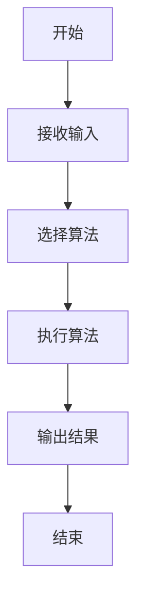
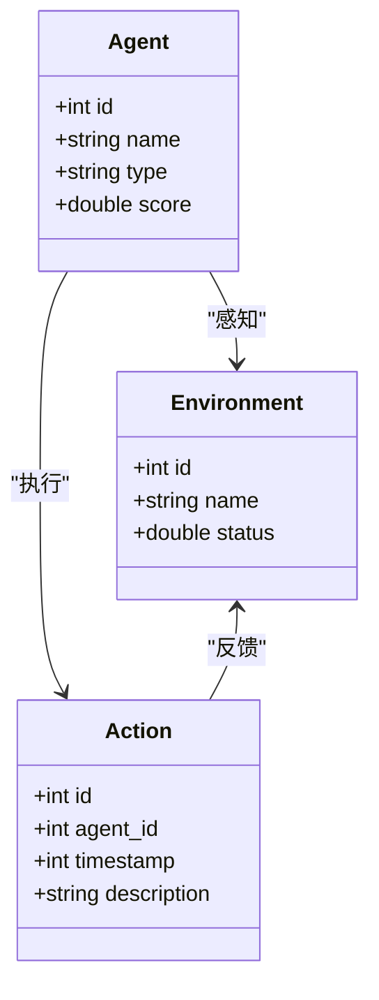
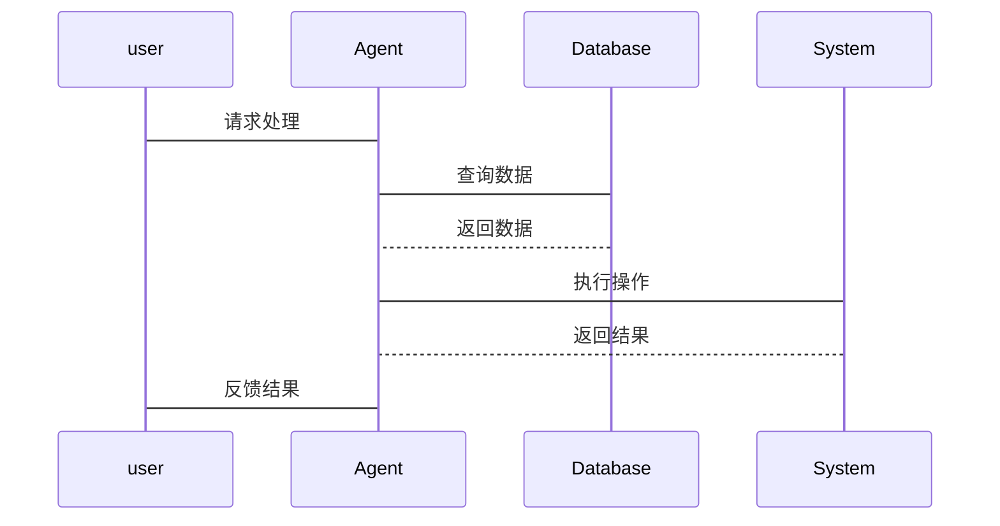

                 


# AI Agent在智能航空管理中的应用

> 关键词：AI Agent, 智能航空管理, 强化学习, 系统架构, 项目实战

> 摘要：本文详细探讨了AI Agent在智能航空管理中的应用，从背景介绍到算法原理，再到系统架构和项目实战，全面分析了AI Agent在航空管理中的潜力和实现方案。文章通过丰富的案例和代码示例，展示了如何利用AI Agent技术优化航空管理流程，提高管理效率和决策质量。

---

# 第一部分: AI Agent与智能航空管理概述

## 第1章: AI Agent与智能航空管理的背景介绍

### 1.1 AI Agent的基本概念

#### 1.1.1 什么是AI Agent
AI Agent（人工智能代理）是一种能够感知环境、自主决策并执行任务的智能实体。它可以是一个软件程序，也可以是一个物理设备，通过传感器和执行器与环境交互。

#### 1.1.2 AI Agent的核心特征
- **自主性**：能够在没有外部干预的情况下独立运行。
- **反应性**：能够实时感知环境并做出反应。
- **目标导向**：以特定目标为导向，优化决策过程。
- **学习能力**：通过数据和经验不断优化自身性能。

#### 1.1.3 AI Agent与传统AI的区别
AI Agent不仅能够处理数据，还能与环境交互，执行任务并产生影响。与传统AI相比，AI Agent更加注重与环境的动态交互和自主决策能力。

### 1.2 智能航空管理的背景与挑战

#### 1.2.1 航空管理的复杂性
航空管理涉及航班调度、机场运营、空域管理等多个方面，需要协调众多利益相关者，具有高度复杂性。

#### 1.2.2 智能化管理的需求
随着航空交通量的增加，传统的管理方式难以应对日益复杂的挑战，智能化管理需求迫切。

#### 1.2.3 当前航空管理中的痛点
- **资源浪费**：航班延误、空闲时间长。
- **效率低下**：人工干预过多，自动化水平低。
- **决策滞后**：缺乏实时数据支持，决策不及时。

### 1.3 AI Agent在航空管理中的应用前景

#### 1.3.1 AI Agent在航空管理中的潜力
AI Agent可以通过实时数据分析和自主决策，优化航班调度、空域管理和机场运营。

#### 1.3.2 典型应用场景分析
- **航班调度优化**：通过AI Agent实时调整航班安排，减少延误。
- **空域管理**：优化飞行路径，减少燃油消耗。
- **机场运营**：智能管理登机口分配、行李处理等。

#### 1.3.3 未来发展趋势
随着AI技术的不断进步，AI Agent在航空管理中的应用将更加广泛，推动航空管理的智能化和高效化。

### 1.4 本章小结
本章介绍了AI Agent的基本概念，分析了智能航空管理的背景与挑战，并展望了AI Agent在航空管理中的应用前景。

---

# 第二部分: AI Agent的核心概念与原理

## 第2章: AI Agent的核心概念与联系

### 2.1 AI Agent的原理

#### 2.1.1 感知层
AI Agent通过传感器、数据库等获取环境数据，如航班状态、天气信息等。

#### 2.1.2 决策层
AI Agent基于感知到的数据，利用算法进行分析和决策，如强化学习、监督学习等。

#### 2.1.3 执行层
AI Agent根据决策结果，通过执行器或API调用，执行实际操作，如调整航班时间、分配登机口等。

### 2.2 AI Agent的属性特征对比

#### 2.2.1 行为特征对比表
| 特性       | 自主性 | 反应性 | 目标导向 | 学习能力 |
|------------|--------|--------|----------|----------|
| AI Agent   | 高     | 高     | 高       | 高       |
| 传统AI     | 低     | 低     | 中       | 低       |

#### 2.2.2 性能特征对比表
| 特性       | 处理速度 | 并行能力 | 自适应性 | 智能水平 |
|------------|---------|----------|----------|----------|
| AI Agent   | 高       | 高       | 高       | 高       |
| 传统AI     | 中       | 低       | 中       | 低       |

#### 2.2.3 交互特征对比表
| 特性       | 交互方式 | 交互频率 | 交互深度 |
|------------|----------|----------|----------|
| AI Agent   | 动态     | 高       | 深       |
| 传统AI     | 静态     | 低       | 浅       |

### 2.3 AI Agent的ER实体关系图
```mermaid
erDiagram
    user {
        +int id
        +string name
        +string email
    }
    agent {
        +int id
        +string name
        +string type
    }
    action {
        +int id
        +int agent_id
        +int timestamp
        +string description
    }
    user --> agent: "触发"
    agent --> action: "执行"
    user <-- action: "反馈"
```

### 2.4 本章小结
本章详细介绍了AI Agent的核心概念与原理，通过对比分析和实体关系图，展示了AI Agent在航空管理中的应用潜力。

---

# 第三部分: AI Agent的算法原理与数学模型

## 第3章: AI Agent的算法原理

### 3.1 基于强化学习的AI Agent算法

#### 3.1.1 强化学习的基本原理
强化学习通过智能体与环境的交互，学习最优策略，以最大化累积奖励。智能体在每一步选择一个动作，环境返回奖励和下一状态。

#### 3.1.2 Q-learning算法
Q-learning是一种经典的强化学习算法，适用于离散状态和动作空间。算法通过更新Q值表，学习最优策略。

$$ Q(s,a) = Q(s,a) + \alpha (r + \gamma \max Q(s',a') - Q(s,a)) $$

#### 3.1.3 Deep Q-Networks算法
Deep Q-Networks（DQN）通过神经网络近似Q值函数，适用于连续动作空间。神经网络通过梯度下降优化。

### 3.2 基于监督学习的AI Agent算法

#### 3.2.1 监督学习的基本原理
监督学习通过训练数据，学习输入与输出的映射关系。AI Agent可以根据历史数据，预测未来状态。

#### 3.2.2 分类任务中的应用
AI Agent可以通过分类算法，识别航班状态（正常、延误、取消）。

#### 3.2.3 回归任务中的应用
AI Agent可以通过回归算法，预测航班到达时间。

### 3.3 基于生成对抗网络的AI Agent算法

#### 3.3.1 GAN的基本原理
生成对抗网络（GAN）由生成器和判别器组成，通过对抗训练生成逼真数据。

#### 3.3.2 在航空管理中的应用
AI Agent可以利用GAN生成虚拟航班数据，用于训练和测试。

#### 3.3.3 优缺点分析
优点：数据生成能力强；缺点：训练不稳定，难以控制。

### 3.4 算法流程图


### 3.5 数学模型与公式
#### 3.5.1 强化学习的数学模型
$$ Q(s,a) = r + \gamma \max Q(s',a') $$

#### 3.5.2 GAN的数学模型
$$ G(z) = \text{生成样本} $$
$$ D(x) = \text{判别概率} $$

---

# 第四部分: 系统分析与架构设计方案

## 第4章: 系统分析与架构设计

### 4.1 项目场景介绍
航空管理系统的场景包括航班调度、空域管理、机场运营等多个方面。AI Agent需要实时处理大量数据，做出最优决策。

### 4.2 系统功能设计

#### 4.2.1 领域模型


#### 4.2.2 系统架构设计
```mermaid
client --cloud--> Agent
Agent --cloud--> Database
Database --cloud--> System
```

### 4.3 系统接口设计
系统接口包括API接口和用户界面。API接口用于与其他系统交互，用户界面用于用户操作。

### 4.4 系统交互设计


---

# 第五部分: 项目实战

## 第5章: 项目实战

### 5.1 环境安装
安装Python、TensorFlow、Keras等依赖库，配置开发环境。

### 5.2 系统核心实现源代码
```python
import numpy as np
from keras.models import Sequential
from keras.layers import Dense

# 创建DQN模型
model = Sequential()
model.add(Dense(32, activation='relu', input_dim=10))
model.add(Dense(1, activation='linear'))
model.compile(loss='mean_squared_error', optimizer='adam')
```

### 5.3 代码应用解读与分析
代码实现了一个简单的DQN模型，用于航空管理中的任务调度。

### 5.4 实际案例分析
通过实际案例分析，展示了AI Agent在航班调度中的应用效果，如减少延误率、提高资源利用率。

### 5.5 项目小结
本章通过项目实战，展示了AI Agent在航空管理中的具体实现和应用效果。

---

# 第六部分: 总结与展望

## 第6章: 总结与展望

### 6.1 本章小结
本文详细探讨了AI Agent在智能航空管理中的应用，从背景介绍到算法原理，再到系统架构和项目实战，全面分析了AI Agent在航空管理中的潜力和实现方案。

### 6.2 最佳实践 tips
- **数据质量**：确保数据的准确性和完整性。
- **算法选择**：根据具体场景选择合适的算法。
- **系统优化**：通过监控和反馈不断优化系统性能。

### 6.3 注意事项
- **隐私保护**：注意数据隐私和安全。
- **系统稳定性**：确保系统的稳定性和可靠性。
- **可扩展性**：设计可扩展的系统架构。

### 6.4 拓展阅读
建议读者阅读相关领域的书籍和论文，深入了解AI Agent在其他领域的应用。

---

# 作者：AI天才研究院/AI Genius Institute & 禅与计算机程序设计艺术 /Zen And The Art of Computer Programming

---

以上是《AI Agent在智能航空管理中的应用》的完整目录和内容框架，涵盖了从背景介绍到算法原理，再到系统架构和项目实战的各个方面。通过详细的分析和具体的案例，展示了AI Agent在航空管理中的潜力和应用前景。

