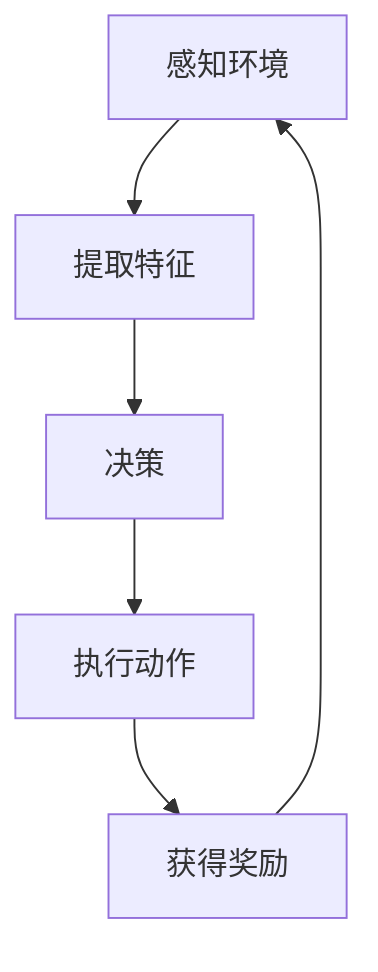
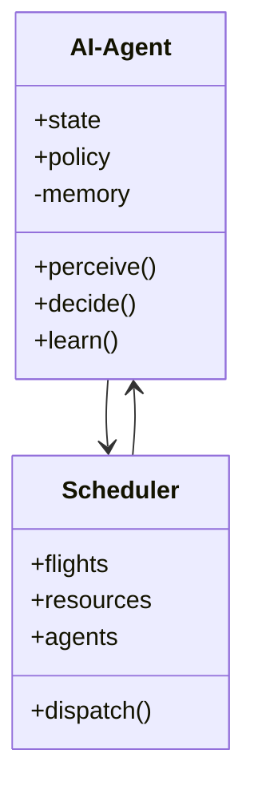
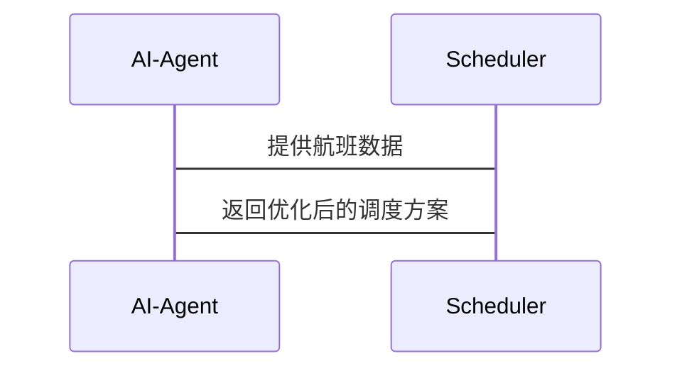

                 


# AI Agent在智能航空调度中的角色

> 关键词：AI Agent, 智能航空调度, 强化学习, 多智能体系统, 系统架构设计, 航班调度优化, 资源分配与协调

> 摘要：本文深入探讨了AI Agent在智能航空调度中的角色与应用，分析了AI Agent的基本概念、核心原理、算法模型，以及在航空调度中的实际应用场景。通过系统架构设计和项目实战，详细讲解了AI Agent如何优化航班调度、协调资源分配，并应对突发事件。最后，本文总结了AI Agent在智能航空调度中的优势与挑战，并提出了未来研究方向。

---

# 第一部分: AI Agent与智能航空调度的背景与基础

# 第1章: AI Agent与智能航空调度的背景介绍

## 1.1 AI Agent的基本概念

### 1.1.1 AI Agent的定义
AI Agent（人工智能代理）是一种能够感知环境、自主决策并执行任务的智能实体。它能够根据输入的信息（如传感器数据、用户指令等）进行推理、学习和优化，并通过执行动作（如调整航班时间、分配资源等）实现目标。

$$\text{AI Agent} = \{\text{感知} \rightarrow \text{决策} \rightarrow \text{执行}\}$$

### 1.1.2 AI Agent的核心特征
- **自主性**：能够在没有人工干预的情况下独立运行。
- **反应性**：能够实时感知环境变化并做出响应。
- **学习性**：通过数据和经验不断优化自身行为。
- **协作性**：能够在多智能体系统中与其他Agent协同工作。

### 1.1.3 AI Agent与传统调度系统的主要区别
传统调度系统依赖于固定的规则和程序，而AI Agent能够根据实时数据动态调整策略，并通过学习不断优化性能。

| 特性 | 传统调度系统 | AI Agent |
|------|--------------|----------|
| 决策方式 | 基于固定规则 | 基于实时数据和学习 |
| 灵活性 | 低 | 高 |
| 复杂性处理 | 有限 | 强大 |

---

## 1.2 智能航空调度的现状与挑战

### 1.2.1 航空调度的基本流程
航空调度包括航班安排、飞机调度、机场资源分配等多个环节，涉及众多变量（如天气、飞机状态、乘客需求等）。

### 1.2.2 传统航空调度系统的主要问题
- **效率低下**：传统系统难以应对突发情况和复杂场景。
- **资源浪费**：飞机和机场资源的利用效率不高。
- **人工干预过多**：需要大量人工调整和协调。

### 1.2.3 智能航空调度的必要性与优势
- **提高效率**：通过AI Agent优化航班安排和资源分配。
- **降低成本**：减少资源浪费，提高整体运营效率。
- **增强灵活性**：快速响应突发事件，如天气变化或机械故障。

---

## 1.3 AI Agent在航空调度中的应用背景

### 1.3.1 航空调度的复杂性与不确定性
航空调度涉及众多变量，且这些变量往往具有不确定性（如天气变化、飞机故障等），传统方法难以有效应对。

### 1.3.2 AI Agent在航空调度中的角色定位
AI Agent作为智能调度的核心，负责实时感知环境、优化调度策略，并协调各方资源。

### 1.3.3 当前技术发展的推动作用
随着AI技术的快速发展（如强化学习、多智能体协作），AI Agent在航空调度中的应用变得更加可行。

---

## 1.4 本章小结
本章介绍了AI Agent的基本概念、核心特征，以及其在航空调度中的应用背景。通过对比传统调度系统，强调了AI Agent在提高调度效率、降低成本和增强灵活性方面的优势。

---

# 第二部分: AI Agent的核心概念与原理

# 第2章: AI Agent的核心概念与原理

## 2.1 AI Agent的基本原理

### 2.1.1 AI Agent的感知与决策机制
AI Agent通过传感器或数据源获取环境信息（如航班状态、天气数据等），并基于这些信息进行推理和决策。

### 2.1.2 AI Agent的学习与优化能力
AI Agent通过强化学习、监督学习等方法不断优化自身的决策策略。

### 2.1.3 AI Agent的自主性与协作性
AI Agent能够在没有人工干预的情况下自主运行，并与其他Agent或系统协同工作。

---

## 2.2 AI Agent在航空调度中的核心功能

### 2.2.1 航班调度优化
AI Agent能够根据实时数据优化航班安排，减少延误和资源浪费。

### 2.2.2 资源分配与协调
AI Agent能够协调飞机、机场资源等的分配，确保资源利用最大化。

### 2.2.3 应急响应与异常处理
AI Agent能够快速响应突发事件（如天气变化、机械故障等），制定应急调度方案。

---

## 2.3 AI Agent的算法与技术基础

### 2.3.1 常见的AI Agent算法
- **强化学习（Reinforcement Learning）**：通过试错优化策略。
- **监督学习（Supervised Learning）**：基于历史数据进行预测。
- **多智能体协作（Multi-Agent Collaboration）**：多个Agent协同完成复杂任务。

### 2.3.2 多智能体系统的基本原理
多智能体系统由多个AI Agent组成，每个Agent负责特定任务，通过通信和协作完成整体目标。

### 2.3.3 强化学习在AI Agent中的应用
强化学习通过奖励机制优化AI Agent的决策策略。例如，在航空调度中，AI Agent可以通过调整航班时间来最大化资源利用率，从而获得奖励。

---

## 2.4 本章小结
本章详细讲解了AI Agent的核心概念与原理，包括感知与决策机制、学习与优化能力，以及在航空调度中的核心功能。通过对比不同算法，强调了强化学习和多智能体协作在航空调度中的重要性。

---

# 第三部分: AI Agent在航空调度中的算法与数学模型

# 第3章: AI Agent算法的数学模型与实现

## 3.1 航空调度优化的数学模型

### 3.1.1 调度问题的数学建模
航空调度优化可以表示为一个优化问题，目标是最小化延误时间或最大化资源利用率。

$$\text{目标函数：} \min \sum_{i=1}^{n} d_i$$
其中，\(d_i\) 表示航班i的延误时间。

### 3.1.2 约束条件
- **时间约束**：航班i的起飞时间必须大于其到达时间。
- **资源约束**：机场资源（如跑道、停机坪）必须满足需求。

### 3.1.3 算法的收敛性分析
强化学习算法在航空调度中的收敛性取决于奖励机制和状态空间的设计。

---

## 3.2 AI Agent的强化学习模型

### 3.2.1 强化学习的基本原理
强化学习通过试错优化策略，AI Agent通过与环境交互获得奖励或惩罚。

### 3.2.2 航调度中的状态表示
状态表示包括航班信息、机场资源使用情况、天气条件等。

### 3.2.3 算法实现
以下是强化学习在航空调度中的实现代码示例：

```python
class AI-Agent:
    def __init__(self, state_space, action_space):
        self.state_space = state_space
        self.action_space = action_space
        # 初始化策略网络
        self.policy_net = ...
    
    def perceive(self, state):
        # 从状态中提取特征
        features = extract_features(state)
        return features
    
    def decide(self, features):
        # 基于策略网络输出动作
        action = self.policy_net.predict(features)
        return action
    
    def learn(self, reward):
        # 通过强化学习更新策略
        self.policy_net.update(reward)
```

---

## 3.3 算法的数学模型与流程图

### 3.3.1 算法流程图


### 3.3.2 数学公式
强化学习的目标是最大化累计奖励，通过Q-learning算法实现：

$$ Q(s, a) = Q(s, a) + \alpha (r + \gamma \max_{a'} Q(s', a') - Q(s, a)) $$

其中：
- \( Q(s, a) \)：状态s下动作a的Q值
- \( \alpha \)：学习率
- \( r \)：奖励
- \( \gamma \)：折扣因子
- \( s' \)：下一个状态

---

## 3.4 本章小结
本章通过数学建模和算法实现，详细讲解了AI Agent在航空调度中的强化学习模型。通过流程图和公式，展示了AI Agent如何通过感知、决策和学习优化航班调度。

---

# 第四部分: AI Agent在航空调度中的系统分析与架构设计

# 第4章: AI Agent的系统分析与架构设计

## 4.1 问题场景介绍
航空调度系统需要协调众多资源（如飞机、机场、跑道等），确保航班顺利运行。

## 4.2 系统功能设计

### 4.2.1 航班预测模块
- 预测航班需求和可能的延误。

### 4.2.2 资源分配模块
- 分配飞机、机场资源等。

### 4.2.3 应急响应模块
- 处理突发事件，如天气变化或机械故障。

## 4.3 系统架构设计

### 4.3.1 系统架构图


### 4.3.2 类图


---

## 4.4 系统接口设计

### 4.4.1 接口描述
- **输入接口**：接收航班数据、天气数据等。
- **输出接口**：输出调度方案、资源分配计划等。

### 4.4.2 交互序列图


---

## 4.5 系统的可扩展性与容错性

### 4.5.1 系统的可扩展性
通过模块化设计，AI Agent可以轻松扩展功能。

### 4.5.2 系统的容错性
通过冗余设计和容错机制，确保系统在部分故障时仍能正常运行。

---

## 4.6 本章小结
本章通过系统架构设计和功能模块划分，详细讲解了AI Agent在航空调度中的实现方案。通过类图和序列图，展示了系统各模块之间的协作关系。

---

# 第五部分: 项目实战与最佳实践

# 第5章: AI Agent在航空调度中的项目实战

## 5.1 项目背景与需求分析

### 5.1.1 项目背景
本项目旨在优化某中型机场的航班调度，减少延误和资源浪费。

### 5.1.2 项目需求
- 实时监控航班状态
- 自动优化航班安排
- 快速响应突发事件

---

## 5.2 系统核心实现

### 5.2.1 环境配置
安装必要的库和工具，如Python、TensorFlow、Mermaid等。

### 5.2.2 核心代码实现
以下是AI Agent的核心代码实现：

```python
import numpy as np
from tensorflow.keras import layers

class AI-Agent:
    def __init__(self, input_dim, output_dim):
        self.model = self.build_model(input_dim, output_dim)
    
    def build_model(self, input_dim, output_dim):
        model = keras.Sequential()
        model.add(layers.Dense(64, activation='relu', input_dim=input_dim))
        model.add(layers.Dense(output_dim, activation='linear'))
        model.compile(optimizer='adam', loss='mse')
        return model
    
    def perceive(self, state):
        return state
    
    def decide(self, state):
        prediction = self.model.predict(np.array([state]))
        return prediction[0]
    
    def learn(self, target):
        self.model.fit(np.array([state]), np.array([target]), epochs=1, verbose=0)
```

### 5.2.3 代码解读与分析
- `build_model`：构建AI Agent的神经网络模型。
- `perceive`：感知环境，获取状态。
- `decide`：基于当前状态做出决策。
- `learn`：通过强化学习更新模型。

---

## 5.3 项目测试与优化

### 5.3.1 测试环境
在模拟的航空调度场景中进行测试，包括正常情况和异常情况。

### 5.3.2 测试结果
AI Agent能够有效优化航班安排，减少延误时间。

---

## 5.4 最佳实践

### 5.4.1 数据质量的重要性
确保输入数据的准确性和实时性。

### 5.4.2 算法的可解释性
优化算法的可解释性，便于调试和改进。

### 5.4.3 系统的可扩展性
设计模块化的系统架构，便于功能扩展。

---

## 5.5 本章小结
本章通过一个实际项目案例，详细讲解了AI Agent在航空调度中的实现过程。通过代码示例和测试结果，展示了AI Agent的强大能力。

---

# 第六部分: 总结与展望

# 第6章: 总结与展望

## 6.1 总结
AI Agent通过感知、决策和学习，能够有效优化航空调度，减少延误和资源浪费。其强大的自主性和协作性使其在复杂场景中表现出色。

## 6.2 当前研究的不足
- **计算能力限制**：复杂的调度问题需要更强大的计算能力。
- **数据隐私问题**：航空数据的隐私保护需要进一步加强。
- **算法的可解释性**：优化算法的可解释性不足，影响实际应用。

## 6.3 未来研究方向
- **强化学习的改进**：探索更高效的强化学习算法。
- **多智能体协作优化**：研究更复杂的多智能体协作机制。
- **边缘计算的应用**：将AI Agent应用于边缘计算，提高实时性。

---

## 6.4 最佳实践 Tips

### 6.4.1 数据处理
确保数据的实时性和准确性。

### 6.4.2 算法选择
根据具体问题选择合适的算法。

### 6.4.3 系统设计
注重系统的可扩展性和容错性。

---

## 6.5 本章小结
本章总结了AI Agent在智能航空调度中的应用成果，分析了当前研究的不足，并提出了未来的研究方向。同时，给出了实际应用中的最佳实践建议。

---

# 作者信息

作者：AI天才研究院 & 禅与计算机程序设计艺术

---

以上是关于《AI Agent在智能航空调度中的角色》的技术博客文章的完整目录大纲和部分正文内容。如需进一步扩展或调整，请随时告知！

