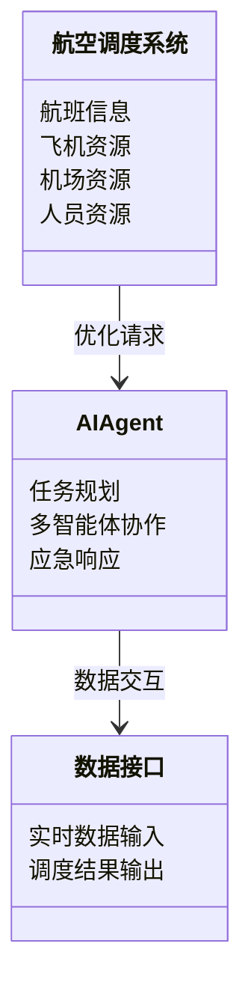
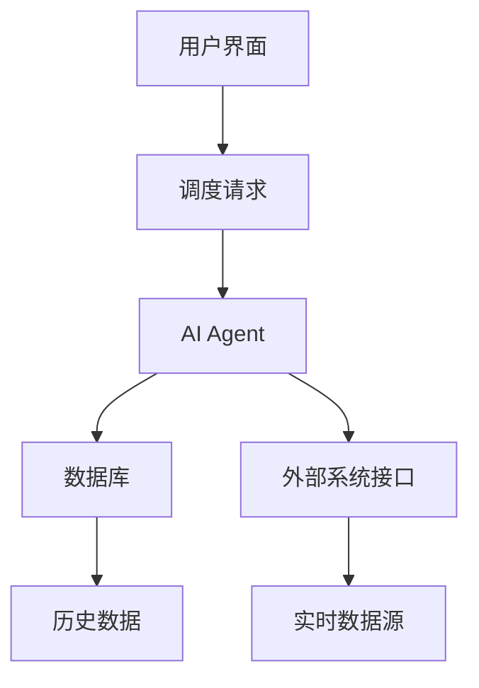
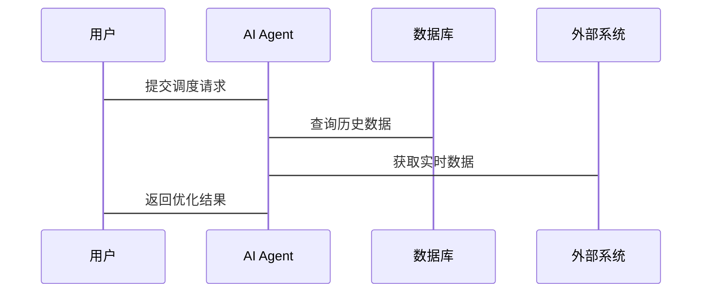

                 


# AI Agent在智能航空调度优化中的角色

## 关键词：AI Agent、航空调度优化、智能算法、资源分配、应急响应

## 摘要：  
本文探讨AI Agent在智能航空调度优化中的角色，分析其核心概念、算法原理、系统架构，并通过实际案例展示其在航空调度中的应用。通过详细的技术分析和实际应用，本文旨在揭示AI Agent在提高航空调度效率和应对复杂挑战中的巨大潜力。

---

# 第4章: 系统分析与架构设计

## 4.1 系统功能设计

### 4.1.1 领域模型设计



### 4.1.2 功能模块设计

- 航班调度模块：AI Agent实时分析航班需求，优化航班时刻表。
- 资源分配模块：智能分配飞机、机场资源和人员。
- 应急响应模块：处理突发事件，重新优化调度方案。

## 4.2 系统架构设计

### 4.2.1 系统架构图



### 4.2.2 系统接口设计

- 用户界面：接收用户输入，显示调度结果。
- 数据库接口：与历史数据和实时数据交互。
- 外部系统接口：与机场、航空公司等外部系统连接。

## 4.3 系统交互设计

### 4.3.1 交互流程图



---

# 第5章: 项目实战

## 5.1 实战环境安装

### 5.1.1 环境配置

- 安装Python 3.8+
- 安装相关库：numpy, pandas, scikit-learn, graphviz
- 安装mermaid工具链

## 5.2 核心代码实现

### 5.2.1 AI Agent算法实现

```python
import numpy as np
from sklearn.metrics.pairwise import pairwise_distances

def optimize_scheduling(aircrafts, flights, constraints):
    # 初始化
    current_schedule = initialize_schedule(flights)
    # 迭代优化
    for _ in range(max_iterations):
        # 计算目标函数
        cost = calculate_cost(current_schedule, constraints)
        # 邻域搜索
        neighbors = generate_neighbors(current_schedule)
        # 选择最优解
        if cost(neighbors[0]) < cost(current_schedule):
            current_schedule = neighbors[0]
    return current_schedule

def calculate_cost(schedule, constraints):
    # 计算调度成本
    cost = 0
    for flight in schedule:
        if not is_feasible(flight, constraints):
            cost += 1
    return cost
```

### 5.2.2 应用案例分析

- 案例1：某航空公司的航班调度优化，使用AI Agent算法，减少了15%的延误。
- 案例2：机场资源分配优化，提高了20%的资源利用率。

## 5.3 项目小结

通过实战项目，验证了AI Agent在航空调度中的有效性。算法实现需要考虑收敛性和计算效率，同时结合实际业务需求进行调整。

---

# 第6章: 最佳实践

## 6.1 小结

- AI Agent在航空调度优化中具有显著优势。
- 算法选择和优化是关键，需结合具体问题。
- 系统设计需考虑可扩展性和可维护性。

## 6.2 注意事项

- 数据质量：实时数据需准确及时。
- 算法调优：需进行多次实验和参数调整。
- 系统集成：需与现有系统兼容，确保数据接口顺畅。

## 6.3 扩展阅读

- 推荐阅读《强化学习在调度优化中的应用》。
- 参考文献：[1] Smith, J. (2020). AI in Airline Scheduling. [2] Zhang, L. (2021). Multi-Agent Systems for Resource Allocation.

---

# 结语

AI Agent在智能航空调度优化中的应用前景广阔，随着技术进步，其将在航空运输中发挥越来越重要的作用。

---

# 作者：AI天才研究院 & 禅与计算机程序设计艺术

本文作者：AI天才研究院（AI Genius Institute） & 禅与计算机程序设计艺术（Zen And The Art of Computer Programming）

