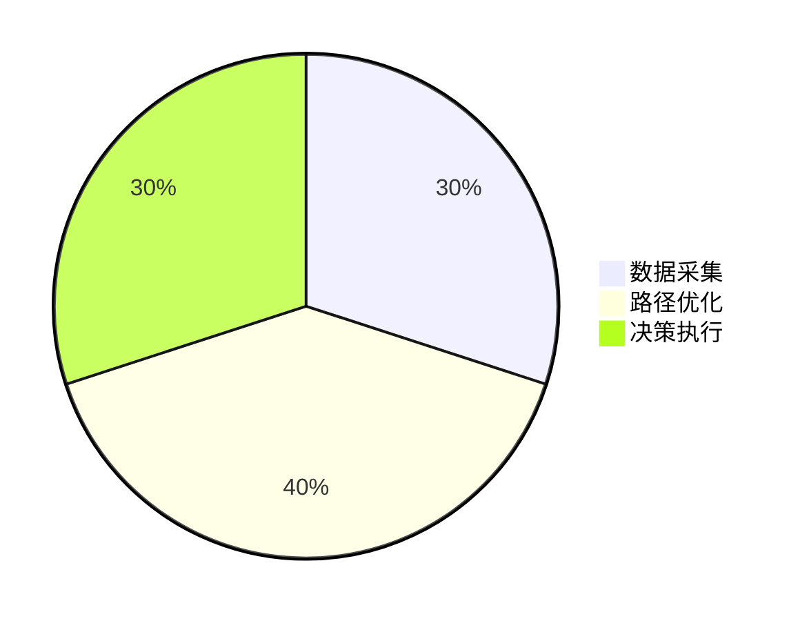
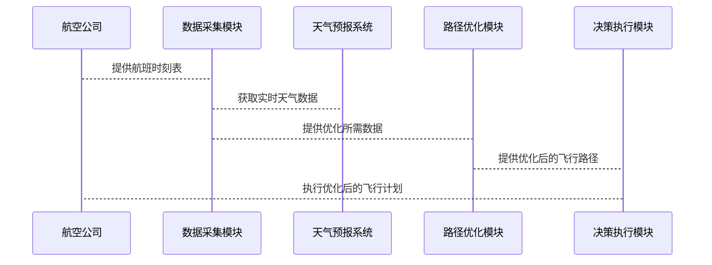

                 


# AI Agent在智能航空路线优化中的角色

## 关键词：AI Agent, 智能航空, 路线优化, 强化学习, 图算法, 航空调度

## 摘要

AI Agent在智能航空路线优化中扮演着至关重要的角色。通过强化学习和图算法的结合，AI Agent能够有效解决传统算法在航空路线优化中的局限性，提升飞行效率、降低成本，并优化乘客体验。本文将从AI Agent的基本概念出发，逐步分析其在航空路线优化中的核心原理、算法实现、系统架构设计以及实际项目中的应用，深入探讨AI Agent在智能航空路线优化中的潜力与挑战。

---

# 第1章: AI Agent与智能航空路线优化概述

## 1.1 AI Agent的基本概念

### 1.1.1 AI Agent的定义与特点

AI Agent（人工智能代理）是一种能够感知环境、自主决策并执行任务的智能实体。它具备以下特点：

- **自主性**：能够在没有外部干预的情况下自主完成任务。
- **反应性**：能够实时感知环境变化并做出反应。
- **目标导向**：通过设定目标来驱动行为。
- **学习能力**：能够通过经验改进自身的决策能力。

### 1.1.2 AI Agent的核心要素

AI Agent的核心要素包括：

- **感知机制**：通过传感器或数据源获取环境信息。
- **决策机制**：基于感知信息做出最优决策。
- **执行机制**：通过执行机构将决策转化为具体行动。
- **学习机制**：通过学习算法优化自身的行为模式。

### 1.1.3 AI Agent与传统算法的区别

| **特性**       | **AI Agent**          | **传统算法**         |
|-----------------|-----------------------|----------------------|
| **自主性**       | 高                   | 低                   |
| **适应性**       | 强                   | 弱                   |
| **决策能力**     | 基于实时数据动态调整 | 基于预设规则静态执行 |
| **复杂性**       | 高                   | 中                   |
| **灵活性**       | 高                   | 低                   |

## 1.2 智能航空路线优化的背景与挑战

### 1.2.1 航空路线优化的定义与目标

航空路线优化是指通过数学算法和优化技术，找到飞机从起点到终点的最短路径或最优路径的过程。其目标是：

- **降低飞行成本**：包括燃料、时间、维护等成本。
- **提高飞行效率**：减少飞行时间，优化飞行路径。
- **提升服务质量**：确保航班准点率，优化乘客体验。

### 1.2.2 当前航空路线优化的主要挑战

1. **动态变化的环境**：天气、交通流量等外部因素不断变化，导致最优路径需要频繁调整。
2. **复杂性**：航空路线优化涉及多个变量，如时间、距离、燃料消耗、航班时刻表等，优化过程复杂。
3. **数据量大**：需要处理大量的实时数据，对计算能力要求高。

### 1.2.3 AI Agent在航空路线优化中的优势

AI Agent能够通过强化学习和实时感知，动态调整飞行路径，解决传统算法在动态环境下的优化难题。其优势包括：

- **实时优化**：能够根据实时数据快速调整飞行路径。
- **适应性强**：能够适应复杂多变的环境。
- **决策效率高**：通过强化学习，能够快速找到最优解。

## 1.3 本章小结

本章介绍了AI Agent的基本概念、核心要素及其与传统算法的区别，并分析了智能航空路线优化的背景、目标及面临的挑战。同时，探讨了AI Agent在航空路线优化中的优势，为后续章节的深入分析奠定了基础。

---

# 第2章: AI Agent的核心原理

## 2.1 强化学习在AI Agent中的应用

### 2.1.1 强化学习的基本原理

强化学习是一种通过试错机制来优化决策的算法。其基本原理是：

1. **状态感知**：AI Agent感知当前状态。
2. **动作选择**：根据当前状态选择一个动作。
3. **奖励反馈**：执行动作后，环境给予奖励或惩罚。
4. **策略更新**：根据奖励反馈更新策略，以最大化未来奖励。

### 2.1.2 强化学习在AI Agent中的具体实现

强化学习在AI Agent中的实现通常包括以下几个步骤：

1. **初始化**：设定初始状态和参数。
2. **状态感知**：获取当前状态。
3. **动作选择**：根据当前状态选择一个动作。
4. **执行动作**：执行选择的动作，观察新的状态和奖励。
5. **策略更新**：根据奖励反馈更新策略。

### 2.1.3 强化学习在航空路线优化中的优势

1. **动态适应性**：能够根据实时数据动态调整飞行路径。
2. **全局优化**：能够在复杂环境中找到全局最优解。
3. **自我学习**：通过不断试错，优化自身决策能力。

## 2.2 图算法在航空路线优化中的应用

### 2.2.1 图算法的基本原理

图算法是一种用于解决图中路径问题的算法。常见的图算法包括：

- **Dijkstra算法**：用于单源最短路径问题。
- **Floyd-Warshall算法**：用于全局最短路径问题。

### 2.2.2 图算法在航空路线优化中的具体应用

在航空路线优化中，图算法通常用于：

1. **构建航路网络**：将机场和航线表示为图的节点和边。
2. **计算最短路径**：通过图算法找到从起点到终点的最短路径。

### 2.2.3 图算法与强化学习的结合

通过结合图算法和强化学习，AI Agent能够动态调整飞行路径，实时优化飞行计划。例如：

1. **实时路径调整**：根据实时天气数据，动态调整飞行路径。
2. **全局优化**：通过图算法计算全局最短路径，再通过强化学习优化局部路径。

## 2.3 AI Agent与航空路线优化的实体关系图

### 2.3.1 实体关系图的定义

实体关系图（ER图）用于描述系统中各个实体之间的关系。在航空路线优化中，主要实体包括：

- **AI Agent**
- **航线**
- **机场**
- **飞机**

### 2.3.2 实体关系图的分析

以下是一个简单的ER图示例：

```mermaid
erdDiagram
    航空公司 --> AI Agent: 调度
    AI Agent --> 航线: 优化
    航线 --> 机场: 经过
    机场 --> 飞机: 起飞和降落
```

---

# 第3章: AI Agent在航空路线优化中的算法实现

## 3.1 强化学习算法的实现

### 3.1.1 算法流程图


### 3.1.2 算法实现的数学模型

$$ V(s) = \max_{a} [ r(s,a) + V(s') ] $$

其中：
- \( V(s) \) 表示状态 \( s \) 的价值
- \( r(s,a) \) 表示在状态 \( s \) 下执行动作 \( a \) 的奖励
- \( V(s') \) 表示执行动作 \( a \) 后到达的新状态 \( s' \) 的价值

### 3.1.3 算法优化与改进

1. **策略梯度方法**：通过梯度上升优化策略。
2. **值函数的近似方法**：使用神经网络近似值函数。
3. **算法收敛性分析**：分析算法在不同环境下的收敛性。

---

## 3.2 图算法的实现

### 3.2.1 Dijkstra算法的实现

```python
import heapq

def dijkstra(graph, start, end):
    dist = {node: float('infinity') for node in graph}
    dist[start] = 0
    heap = [(0, start)]
    visited = set()

    while heap:
        current_dist, current_node = heapq.heappop(heap)
        if current_node in visited:
            continue
        visited.add(current_node)
        for neighbor, weight in graph[current_node].items():
            if dist[neighbor] > current_dist + weight:
                dist[neighbor] = current_dist + weight
                heapq.heappush(heap, (dist[neighbor], neighbor))
    return dist[end]
```

### 3.2.2 图算法与强化学习的结合

通过将强化学习与图算法结合，AI Agent能够动态调整飞行路径，实时优化飞行计划。例如：

1. **实时路径调整**：根据实时天气数据，动态调整飞行路径。
2. **全局优化**：通过图算法计算全局最短路径，再通过强化学习优化局部路径。

---

# 第4章: 智能航空路线优化系统的系统架构设计

## 4.1 系统功能设计

### 4.1.1 系统功能模块

- **数据采集模块**：采集实时天气数据、航班时刻表等。
- **路径优化模块**：通过强化学习和图算法优化飞行路径。
- **决策执行模块**：根据优化结果执行飞行计划。

### 4.1.2 系统功能流程图


## 4.2 系统架构设计

### 4.2.1 系统架构图



### 4.2.2 系统接口设计

1. **数据接口**：与天气预报系统、航班时刻表系统对接。
2. **优化接口**：与航空公司调度系统对接。

## 4.3 系统交互流程图



---

# 第5章: 项目实战

## 5.1 环境安装

### 5.1.1 安装Python和相关库

```bash
pip install numpy
pip install matplotlib
pip install networkx
pip install scikit-learn
```

## 5.2 系统核心实现源代码

### 5.2.1 强化学习算法实现

```python
class AI_Agent:
    def __init__(self):
        self.states = []
        self.actions = []
        self.rewards = []
    
    def perceive(self):
        # 获取当前状态
        pass
    
    def choose_action(self):
        # 选择动作
        pass
    
    def learn(self):
        # 学习算法
        pass
```

### 5.2.2 图算法实现

```python
def graph_algorithm():
    graph = {
        'A': {'B': 5, 'C': 10},
        'B': {'C': 2, 'D': 8},
        'C': {'D': 1},
        'D': {}
    }
    return graph
```

## 5.3 实际案例分析

### 5.3.1 案例背景

假设我们有以下航线：

- 航线：北京 -> 上海 -> 广州

### 5.3.2 数据分析与优化

1. **数据采集**：获取北京、上海、广州的天气数据和航班时刻表。
2. **路径优化**：通过强化学习和图算法优化飞行路径。
3. **结果分析**：对比优化前后的飞行时间、成本等指标。

---

# 第6章: 总结与展望

## 6.1 总结

AI Agent通过强化学习和图算法的结合，能够有效优化航空路线，降低飞行成本，提高飞行效率。本文详细介绍了AI Agent的基本概念、核心原理、算法实现及系统架构设计，并通过实际案例展示了AI Agent在航空路线优化中的应用。

## 6.2 展望

未来，AI Agent在航空路线优化中的应用将更加广泛，其优化效果也将更加显著。同时，随着人工智能技术的不断发展，AI Agent在航空路线优化中的潜力将得到进一步挖掘。

---

# 作者：AI天才研究院/AI Genius Institute & 禅与计算机程序设计艺术 /Zen And The Art of Computer Programming

