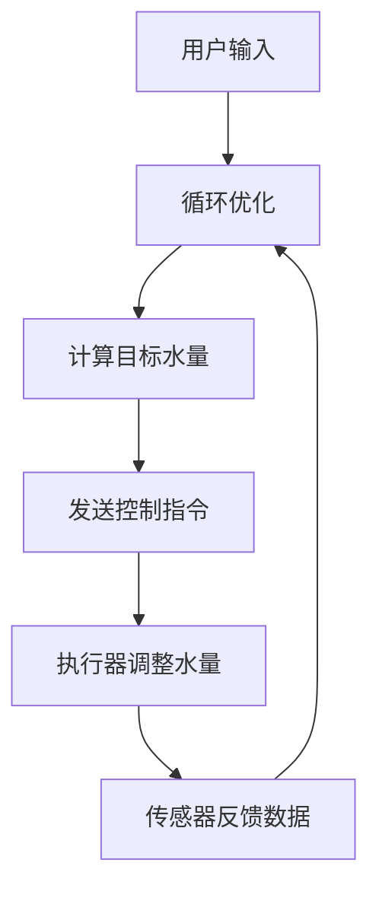
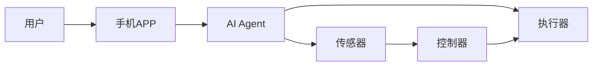
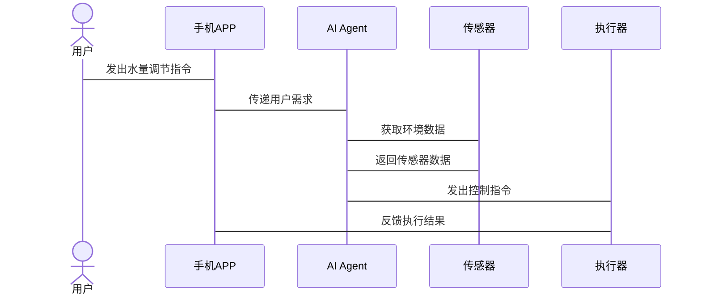

                 


# AI Agent在智能花洒中的水量控制

> 关键词：AI Agent, 智能花洒, 水量控制, PID控制, 自适应算法, 物联网

> 摘要：本文详细探讨了AI Agent在智能花洒水量控制中的应用，从背景介绍、核心概念、算法原理、系统架构到项目实战，全面解析了AI Agent如何实现智能、高效的水量控制。文章结合实际案例，通过数学模型和算法流程图，深入浅出地讲解了技术实现的细节，并提供了完整的代码示例。

---

# 第一部分: 背景介绍

## 第1章: 问题背景

### 1.1 智能花洒的发展现状

随着物联网技术的快速发展，智能花洒逐渐成为智能家居的重要组成部分。传统的花洒仅能通过手动调节水流大小，而智能花洒可以通过传感器和控制器实现自动化控制。然而，现有的智能花洒在水量控制方面仍存在诸多痛点，例如：

- 水流不稳定，容易受到水压波动的影响。
- 缺乏智能化的自适应调节能力。
- 用户需求多样化，难以实现个性化的水量调节。

### 1.2 问题描述

水量控制的核心问题是如何根据用户的实际需求和环境条件，实时调整水流大小，以达到节水、舒适和高效的目的。具体问题包括：

- 如何准确感知用户的用水需求？
- 如何实现智能化的水量调节？
- 如何在不同环境下保持稳定的水量输出？

### 1.3 解决方案

引入AI Agent技术，通过实时感知用户需求和环境数据，结合自适应控制算法，实现智能化的水量调节。AI Agent能够根据用户习惯、环境变化和传感器数据，动态调整水流大小，从而提高用户体验和节水效果。

### 1.4 系统边界与外延

智能花洒水量控制系统的核心边界包括：

- 用户输入：通过语音或手机APP输入水量需求。
- 系统输出：通过执行器调整水流大小。
- 环境数据：水压、温度、水流速度等传感器数据。

系统外延包括与智能家居平台的集成，例如与智能音箱、智能马桶等设备联动。

---

## 第2章: 核心概念与联系

### 2.1 AI Agent的基本原理

AI Agent是一种能够感知环境、做出决策并执行动作的智能体。在智能花洒中，AI Agent通过以下步骤实现水量控制：

1. **感知环境**：接收传感器数据（水压、温度、水流速度）。
2. **分析需求**：根据用户输入和历史数据，判断当前水量需求。
3. **决策控制**：通过算法计算出目标水量。
4. **执行动作**：向执行器发送控制指令。

### 2.2 智能花洒系统的构成

智能花洒系统由以下部分组成：

1. **传感器**：流量传感器、压力传感器、温度传感器。
2. **执行器**：水流调节阀、电磁阀。
3. **控制器**：AI Agent算法核心。
4. **用户界面**：手机APP、语音控制。

### 2.3 概念属性特征对比

| **属性**      | **AI Agent**         | **水量控制系统**         |
|----------------|----------------------|--------------------------|
| 输入           | 用户需求、传感器数据 | 水流传感器、用户输入     |
| 输出           | 执行器控制信号       | 水流大小调整             |
| 决策方式       | 基于AI算法           | 基于规则或PID控制算法    |
| 自适应能力     | 强                   | 弱                       |

### 2.4 ER实体关系图

```mermaid
er
actor: 用户
agent: AI水量控制代理
sensor: 流量传感器
actuator: 执行器
system: 智能花洒系统
```

---

# 第二部分: 算法原理讲解

## 第3章: 算法原理概述

### 3.1 PID控制算法

PID（比例-积分-微分）控制是一种常用的控制算法，适用于线性系统。其数学模型如下：

$$u(t) = K_p e(t) + K_i \int_{0}^{t} e(t')dt' + K_d \frac{de(t)}{dt}$$

其中：
- $e(t)$ 是误差（目标值与实际值的差）。
- $K_p$ 是比例系数。
- $K_i$ 是积分系数。
- $K_d$ 是微分系数。

### 3.2 基于AI的自适应控制算法

基于AI的自适应控制算法能够根据环境数据和用户需求动态调整控制参数。其数学模型如下：

$$y(t) = w_1 x_1 + w_2 x_2 + \dots + w_n x_n + b$$

其中：
- $x_i$ 是输入特征。
- $w_i$ 是权重系数。
- $b$ 是偏置项。

### 3.3 算法实现流程



---

## 第4章: 算法实现与优化

### 4.1 算法实现代码

```python
class PIDController:
    def __init__(self, Kp, Ki, Kd):
        self.Kp = Kp
        self.Ki = Ki
        self.Kd = Kd
        self.error_integral = 0
        self.error_derivative = 0

    def compute(self, target, current):
        error = target - current
        self.error_integral += error
        self.error_derivative = error
        return self.Kp * error + self.Ki * self.error_integral + self.Kd * self.error_derivative

# 示例使用
controller = PIDController(2, 0.5, 0.1)
target = 50  # 目标水量
current = 45  # 当前水量
output = controller.compute(target, current)
print(output)  # 输出控制信号
```

### 4.2 算法优化与改进

通过引入机器学习算法（如神经网络），可以进一步优化AI Agent的控制性能。例如，使用回归模型预测用户需求，并结合PID控制算法进行实时调整。

---

# 第三部分: 系统分析与架构设计

## 第5章: 系统分析

### 5.1 项目背景

智能花洒水量控制系统旨在通过AI Agent实现智能化的水量调节，提升用户体验，同时降低水资源浪费。

### 5.2 系统功能设计

系统功能模块包括：
1. 用户输入模块：接收用户需求。
2. 传感器数据采集模块：获取水压、温度等数据。
3. AI Agent控制模块：计算目标水量。
4. 执行器控制模块：调整水流大小。

### 5.3 系统架构设计



### 5.4 系统接口设计

- 用户接口：手机APP、语音控制。
- 系统接口：传感器接口、执行器接口。

### 5.5 系统交互流程



---

## 第6章: 项目实战

### 6.1 环境安装

1. 安装Python和相关库：
   ```bash
   pip install numpy scikit-learn
   ```

2. 安装硬件设备：
   - 流量传感器
   - 电磁阀
   - 微控制器（如Arduino）

### 6.2 系统核心实现

```python
import numpy as np
from sklearn.linear_model import LinearRegression

class AIAgent:
    def __init__(self):
        self.model = LinearRegression()
        self.history = []

    def train(self, X, y):
        self.model.fit(X, y)

    def predict(self, X):
        return self.model.predict(X)

# 示例使用
agent = AIAgent()
X = np.array([[25, 100]])  # 输入特征：水温、用户需求
y = np.array([80])         # 输出特征：目标水量
agent.train(X, y)
predicted = agent.predict(X)
print(predicted)  # 输出预测结果
```

### 6.3 案例分析

以用户需求为80毫升为例，系统通过传感器数据和历史数据，预测出目标水量，并通过执行器调整水流大小。

### 6.4 项目小结

通过AI Agent实现智能花洒的水量控制，能够显著提升用户体验，同时实现节水目标。AI Agent的核心作用体现在实时感知、动态调节和自适应优化三个方面。

---

## 第7章: 最佳实践

### 7.1 小结

AI Agent在智能花洒中的应用展示了AI技术在物联网领域的巨大潜力。通过结合传感器数据和用户需求，AI Agent能够实现智能化的水量控制，为用户提供更优质的服务。

### 7.2 注意事项

- 硬件设备的稳定性直接影响系统的可靠性。
- 数据安全和隐私保护是系统设计的重要考虑因素。
- 系统的可扩展性需要充分考虑未来的升级需求。

### 7.3 拓展阅读

- 《AI in IoT: Principles and Applications》
- 《Python机器学习实战》

---

# 结语

AI Agent在智能花洒中的水量控制不仅是一项技术创新，更是一种对未来生活方式的探索。通过本文的详细讲解，读者可以深入了解AI Agent在智能花洒中的应用原理，并为实际项目提供参考。

---

作者：AI天才研究院 & 禅与计算机程序设计艺术

