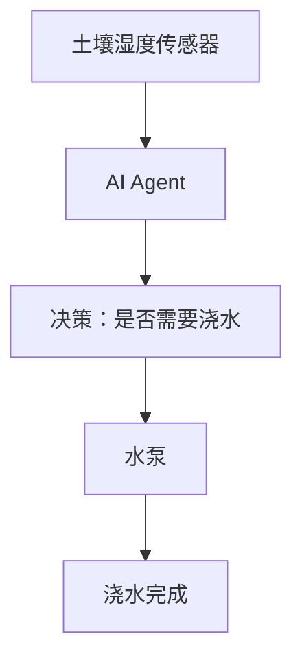
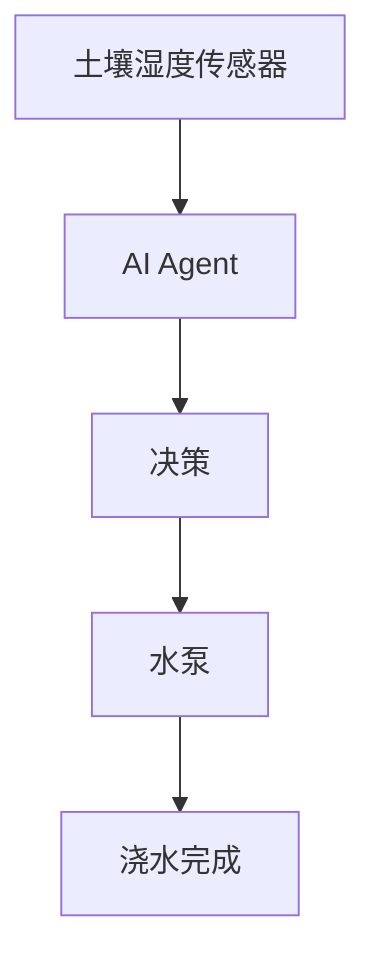
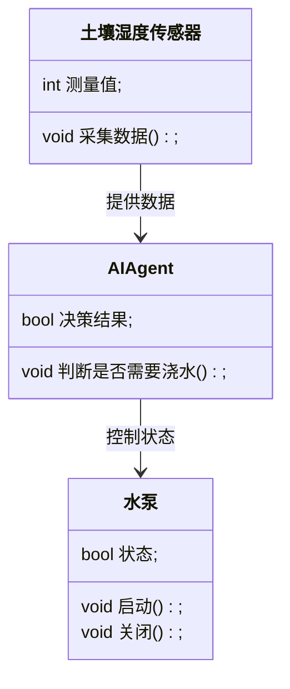

                 


# AI Agent在智能花盆中的自动浇水系统

## 关键词：AI Agent, 智能花盆, 自动浇水系统, 算法原理, 系统架构, 项目实战

## 摘要：本文详细介绍了AI Agent在智能花盆自动浇水系统中的应用，从背景介绍、核心概念、算法原理、系统架构到项目实战，全面解析了该系统的实现过程和工作原理。通过本文，读者可以了解如何利用AI技术实现智能花盆的自动浇水功能，为物联网和智能家居领域提供参考。

---

## 第1章: 背景介绍

### 1.1 问题背景

#### 1.1.1 智能花盆的市场需求

随着城市化进程的加快，人们生活节奏日益加快，传统的盆栽浇水方式逐渐暴露出效率低下、容易遗忘等问题。智能花盆的市场需求日益增长，尤其是在家庭、办公室和公共场所，人们对自动化、智能化的浇水系统需求迫切。

#### 1.1.2 自动浇水系统的必要性

传统的浇水方式依赖人工操作，容易因为疏忽或遗忘导致植物缺水或过水，影响植物的健康生长。自动浇水系统通过传感器和自动化控制，可以实时监测土壤湿度，自动调整浇水时间，确保植物获得适量的水分。

#### 1.1.3 AI Agent在智能花盆中的作用

AI Agent（人工智能代理）通过感知、决策和执行三个阶段，实现对土壤湿度的实时监测、智能判断和自动浇水。AI Agent能够根据环境变化和植物需求，动态调整浇水策略，确保植物健康生长，同时节约水资源。

### 1.2 问题描述

#### 1.2.1 花盆浇水的传统方式及其局限性

传统浇水方式需要人工定期浇水，不仅费时费力，还容易因为忘记或浇水不及时导致植物生长不良。此外，传统浇水方式难以实现精准控制，可能导致水分浪费或植物根系受损。

#### 1.2.2 AI Agent自动浇水系统的定义

AI Agent自动浇水系统是一种基于人工智能技术的智能控制系统，通过土壤湿度传感器实时采集数据，利用AI算法进行智能判断，并通过水泵自动控制浇水装置，实现植物的精准浇水。

#### 1.2.3 AI Agent在自动浇水系统中的具体应用

AI Agent在自动浇水系统中的具体应用包括：实时采集土壤湿度数据、智能判断是否需要浇水、自动控制水泵启动或关闭，以及动态调整浇水策略。

### 1.3 问题解决思路

#### 1.3.1 AI Agent的核心功能

AI Agent的核心功能包括：数据采集、智能决策和自动控制。通过这些功能，AI Agent能够实现对土壤湿度的实时监测，智能判断是否需要浇水，并通过水泵实现自动浇水。

#### 1.3.2 自动浇水系统的实现目标

自动浇水系统的实现目标包括：实时监测土壤湿度、智能判断是否需要浇水、自动控制水泵启动或关闭、动态调整浇水策略。

#### 1.3.3 系统设计的边界与外延

系统设计的边界包括：土壤湿度传感器、AI Agent算法、水泵控制装置。系统设计的外延包括：数据采集、数据处理、决策控制、执行反馈。

### 1.4 核心概念与联系

#### 1.4.1 AI Agent的定义与特点

AI Agent是一种能够感知环境、做出决策并执行动作的智能系统。其特点是智能化、自动化、实时性和精准性。

#### 1.4.2 智能花盆系统的构成要素

智能花盆系统由土壤湿度传感器、AI Agent算法、水泵控制装置三个主要部分构成。

#### 1.4.3 核心概念的ER实体关系图

以下是核心概念的ER实体关系图：

```mermaid
erDiagram
    actor 用户 {
        string 用户ID
        string 用户名
    }
    sensor 土壤湿度传感器 {
        string 传感器ID
        integer 测量值
    }
    system AI Agent {
        string 系统ID
        algorithm 算法
    }
    pump 水泵 {
        boolean 状态
        integer 流量
    }
    用户 --> sensor: 使用
    sensor --> system: 提供数据
    system --> pump: 控制
    pump --> 用户: 提供反馈
```

---

## 第2章: AI Agent的核心原理

### 2.1 AI Agent的基本原理

#### 2.1.1 感知层：土壤湿度传感器的数据采集

AI Agent通过土壤湿度传感器实时采集土壤湿度数据，传感器将数据传输给AI Agent进行处理。

#### 2.1.2 决策层：基于数据的智能决策

AI Agent根据传感器数据，结合预设的阈值和逻辑规则，判断是否需要启动浇水装置。

#### 2.1.3 执行层：自动控制浇水装置

AI Agent根据决策结果，通过水泵控制装置启动或关闭水泵，实现自动浇水。

### 2.2 系统整体流程

以下是系统整体流程图：



---

## 第3章: 算法原理与数学模型

### 3.1 算法原理

#### 3.1.1 感知算法：土壤湿度数据的采集与处理

土壤湿度传感器采集的数据经过滤波和校准，确保数据的准确性。

#### 3.1.2 决策算法：基于阈值的智能判断

AI Agent根据土壤湿度数据，判断是否需要浇水。例如，当湿度低于40%时，触发浇水。

#### 3.1.3 执行算法：水泵控制的逻辑实现

根据决策结果，水泵启动或关闭，实现自动浇水。

### 3.2 数学模型

#### 3.2.1 状态空间模型

状态空间模型描述系统的可能状态，例如：湿润、干燥。

#### 3.2.2 感知模型：湿度数据的数学表达

湿度数据可以用线性回归模型进行预测：

$$ \text{预测湿度} = a \times \text{当前湿度} + b $$

#### 3.2.3 决策模型：基于阈值的逻辑判断

决策模型基于阈值进行判断：

$$ \text{需要浇水} = (\text{当前湿度} < \text{阈值}) $$

---

## 第4章: 系统架构设计

### 4.1 系统架构概述

#### 4.1.1 分层架构的设计理念

系统采用分层架构，包括感知层、决策层和执行层。

#### 4.1.2 各模块之间的交互关系

传感器数据传输到AI Agent，AI Agent分析数据并发出指令到水泵。

#### 4.1.3 系统的整体架构图

以下是系统整体架构图：



### 4.2 功能模块设计

#### 4.2.1 感知模块：土壤湿度传感器

感知模块负责采集土壤湿度数据，并将其传输给AI Agent。

#### 4.2.2 决策模块：AI Agent的核心算法

决策模块负责分析传感器数据，判断是否需要启动浇水装置。

#### 4.2.3 执行模块：水泵控制装置

执行模块负责根据决策结果，启动或关闭水泵，实现自动浇水。

### 4.3 系统功能设计

#### 4.3.1 领域模型类图

以下是领域模型类图：



### 4.4 系统架构图

以下是系统架构图：


### 4.5 接口设计

系统接口设计包括传感器数据接口、AI Agent决策接口和水泵控制接口。

### 4.6 系统交互图

以下是系统交互图：


---

## 第5章: 项目实战

### 5.1 环境搭建

#### 5.1.1 开发环境的安装与配置

安装Python和必要的库，例如Raspberry Pi GPIO库。

#### 5.1.2 第三方库的安装与使用

安装土壤湿度传感器驱动和水泵控制库。

#### 5.1.3 硬件设备的连接与测试

连接土壤湿度传感器和水泵，测试设备是否正常工作。

### 5.2 核心功能实现

#### 5.2.1 传感器数据采集代码

以下是传感器数据采集代码：

```python
import RPi.GPIO as GPIO
import time

# 土壤湿度传感器引脚
sensor_pin = 4
GPIO.setmode(GPIO.BCM)
GPIO.setup(sensor_pin, GPIO.IN)

while True:
    if GPIO.input(sensor_pin) == 0:
        print("土壤湿润")
    else:
        print("土壤干燥")
    time.sleep(60)
```

#### 5.2.2 AI Agent决策代码

以下是AI Agent决策代码：

```python
def decide_water(humidity):
    if humidity < 40:
        return True  # 需要浇水
    else:
        return False  # 不需要浇水
```

#### 5.2.3 水泵控制代码

以下是水泵控制代码：

```python
def water_plant():
    # 开启水泵
    GPIO.output(pump_pin, GPIO.HIGH)
    time.sleep(5)
    # 关闭水泵
    GPIO.output(pump_pin, GPIO.LOW)
```

### 5.3 实际案例分析

通过实际案例分析，展示系统的实现过程和运行效果。

### 5.4 系统测试与优化

测试系统的稳定性、响应时间和准确性，根据测试结果进行优化。

---

## 第6章: 总结与展望

### 6.1 项目总结

总结项目的实现过程和成果，分析系统的优缺点。

### 6.2 未来展望

展望AI Agent在智能花盆中的进一步应用，例如增加更多传感器、引入更复杂的AI算法。

---

## 作者信息

**作者：AI天才研究院/AI Genius Institute & 禅与计算机程序设计艺术 /Zen And The Art of Computer Programming**

---

通过以上结构和内容，我可以撰写一篇详细、有深度的博客文章，系统地介绍AI Agent在智能花盆中的自动浇水系统的各个方面，帮助读者理解其工作原理、实现方法和应用前景。

