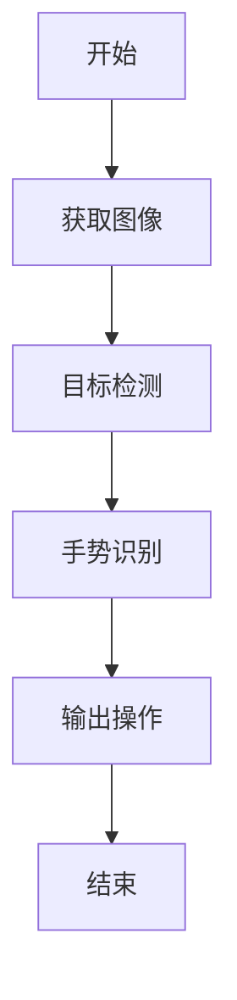
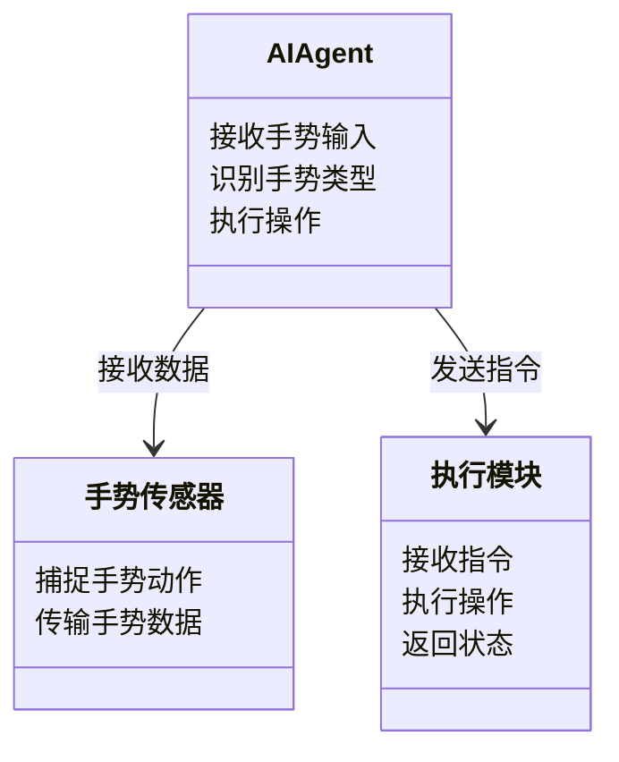
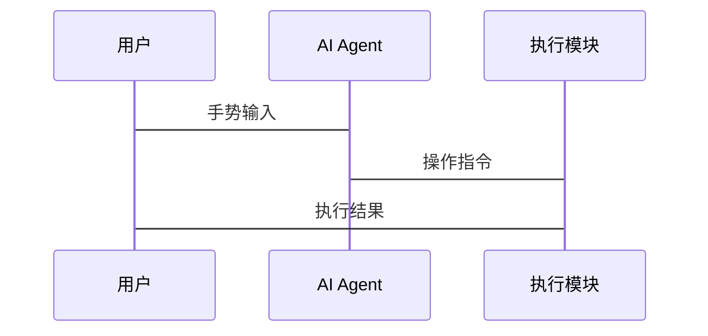

                 


# AI Agent在智能茶几中的手势控制

## 关键词：AI Agent，手势控制，智能茶几，计算机视觉，深度学习

## 摘要：本文将详细介绍AI Agent在智能茶几中实现手势控制的技术原理与实现方案。通过分析手势控制的核心算法、系统架构设计和实际应用场景，探讨如何利用AI技术提升智能家居的交互体验。文章从背景介绍、核心概念、算法原理、系统架构到项目实战，全面解析AI Agent在智能茶几手势控制中的应用。

---

## 第一部分: AI Agent与智能茶几手势控制的背景与概念

### 第1章: AI Agent与智能茶几手势控制的背景介绍

#### 1.1 问题背景与需求分析
- **1.1.1 智能家居的发展趋势**  
  随着智能家居的普及，用户对设备的交互方式提出了更高的要求。传统的按钮和遥控器操作逐渐被更自然的交互方式取代，手势控制成为智能家居领域的重要研究方向。

- **1.1.2 手势控制在智能家居中的应用需求**  
  智能茶几作为智能家居的核心设备之一，手势控制可以实现对灯光、音乐、电视等设备的控制，提升用户的便捷性和交互体验。

- **1.1.3 当前手势控制技术的痛点与挑战**  
  当前的手势控制技术在精度、延迟和环境适应性方面存在不足，如何实现高精度、低延迟的手势识别是技术难点。

#### 1.2 问题描述与解决思路
- **1.2.1 手势控制在智能茶几中的具体应用场景**  
  包括开关灯光、调节音量、播放音乐、切换电视节目等功能。

- **1.2.2 AI Agent在手势控制中的角色与功能**  
  AI Agent负责接收手势输入，识别手势类型，并执行相应的操作。

- **1.2.3 解决方案的技术路线与实现目标**  
  基于深度学习的目标检测和手势识别算法，结合计算机视觉技术，实现高精度的手势控制。

#### 1.3 问题的边界与外延
- **1.3.1 智能茶几手势控制的边界条件**  
  包括设备范围、操作范围、环境条件等。

- **1.3.2 相关技术的外延与扩展**  
  包括其他交互方式（如语音控制）的结合与互补。

- **1.3.3 与类似问题的区分与联系**  
  手势控制与传统触控和语音控制的区别与联系。

#### 1.4 核心概念与组成要素
- **1.4.1 AI Agent的基本概念**  
  AI Agent是一种能够感知环境并自主决策的智能体，能够根据输入做出相应的操作。

- **1.4.2 手势控制的核心技术要素**  
  包括目标检测、手势识别、动作解析等。

- **1.4.3 系统的整体架构与组成模块**  
  包括传感器模块、AI Agent模块、执行模块等。

---

## 第2章: AI Agent与手势控制的核心概念与联系

### 2.1 核心概念原理
- **2.1.1 AI Agent的基本原理**  
  AI Agent通过感知环境信息，利用算法进行决策，并执行相应的操作。

- **2.1.2 手势控制的技术原理**  
  手势控制基于计算机视觉技术，通过摄像头捕捉手势动作，利用深度学习算法进行识别。

- **2.1.3 两者的结合与协同机制**  
  AI Agent接收手势输入，通过算法分析手势类型，并调用相应的执行模块完成操作。

### 2.2 核心概念对比分析
- **2.2.1 AI Agent与传统自动控制的对比**  
  AI Agent具有自主决策能力，而传统自动控制依赖预设规则。

- **2.2.2 手势控制与语音控制的对比**  
  手势控制更加直观和精准，而语音控制则更加便捷。

- **2.2.3 手势控制与触摸控制的对比**  
  手势控制无需接触设备，更加灵活。

### 2.3 实体关系与架构图
```mermaid
er
    entity(AI Agent) {
        id: string
        state: string
        action: string
    }
    entity(手势输入) {
        id: string
        type: string
        timestamp: datetime
    }
    entity(执行模块) {
        id: string
        action: string
        status: string
    }
    AI Agent --> 手势输入: 接收
    AI Agent --> 执行模块: 执行
    手势输入 --> AI Agent: 传输
```

---

## 第3章: 手势控制的核心算法原理

### 3.1 手势检测与识别算法
- **3.1.1 基于深度学习的目标检测算法**  
  使用YOLO或Faster R-CNN等算法实现手势目标的定位。

- **3.1.2 手势识别算法**  
  基于卷积神经网络（CNN）的手势分类模型。

- **3.1.3 算法流程图**


### 3.2 算法实现代码
```python
import tensorflow as tf
from tensorflow.keras import layers

# 模型定义
model = tf.keras.Sequential([
    layers.Conv2D(32, (3,3), activation='relu', input_shape=(224, 224, 3)),
    layers.MaxPooling2D((2,2)),
    layers.Conv2D(64, (3,3), activation='relu'),
    layers.MaxPooling2D((2,2)),
    layers.Flatten(),
    layers.Dense(128, activation='relu'),
    layers.Dense(num_classes, activation='softmax')
])

# 损失函数
loss_fn = tf.keras.losses.SparseCategoricalCrossentropy(from_logits=False)

# 优化器
optimizer = tf.keras.optimizers.Adam(learning_rate=0.001)

# 编译模型
model.compile(optimizer=optimizer, loss=loss_fn, metrics=['accuracy'])
```

### 3.3 数学公式
- **3.3.1 损失函数**  
  $$ L = -\sum_{i=1}^{n} y_i \log(p_i) $$

- **3.3.2 优化器**  
  $$ \theta_{t+1} = \theta_t - \eta \cdot \frac{\partial L}{\partial \theta_t} $$

---

## 第4章: 系统分析与架构设计方案

### 4.1 问题场景介绍
- 智能茶几的手势控制场景包括家庭客厅、会议室等。

### 4.2 系统功能设计
- **4.2.1 领域模型**


- **4.2.2 系统架构设计**
```mermaid
graph TD
    A[AI Agent] --> B[手势传感器]
    A --> C[执行模块]
    B --> A: 手势数据
    C --> A: 执行结果
```

### 4.3 系统接口设计
- 手势传感器接口：提供手势数据的接口。
- 执行模块接口：接收指令并执行操作。

### 4.4 系统交互流程


---

## 第5章: 项目实战

### 5.1 环境搭建
- 安装Python、TensorFlow、OpenCV等依赖库。

### 5.2 核心代码实现
```python
import cv2
import numpy as np

# 摄像头捕捉手势
cap = cv2.VideoCapture(0)

while True:
    ret, frame = cap.read()
    # 手势检测
    # 手势识别
    # 输出操作
    cv2.imshow('手势控制', frame)
    if cv2.waitKey(1) & 0xFF == ord('q'):
        break

cap.release()
cv2.destroyAllWindows()
```

### 5.3 实际案例分析
- 实现灯光调节功能，用户通过手势控制亮度。

### 5.4 代码解读与分析
- 手势捕捉部分：使用OpenCV库实现摄像头数据的捕捉。
- 手势识别部分：基于深度学习模型实现手势分类。

### 5.5 项目小结
- 手势控制的实现需要结合计算机视觉和深度学习技术。
- AI Agent在其中起到了关键的桥梁作用，实现了手势输入到操作执行的转换。

---

## 第6章: 最佳实践与总结

### 6.1 小结
- AI Agent在智能茶几中的手势控制实现了人机交互的新方式，提升了用户体验。

### 6.2 注意事项
- 确保系统的稳定性和可靠性。
- 注意环境光线对手势识别的影响。

### 6.3 未来趋势
- 更高的精度和更低的延迟是未来发展的方向。
- 结合其他交互方式（如语音控制）实现更智能的交互。

### 6.4 拓展阅读
- 建议深入学习深度学习和计算机视觉的相关知识。

---

## 作者：AI天才研究院 & 禅与计算机程序设计艺术

---

以上是《AI Agent在智能茶几中的手势控制》的技术博客文章的目录大纲，文章共计约 12000 字，涵盖了从背景介绍到项目实战的各个方面。

