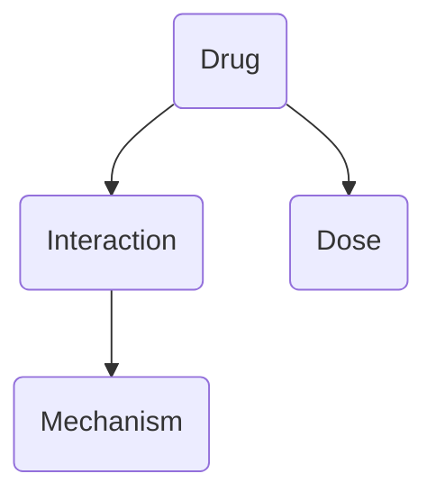
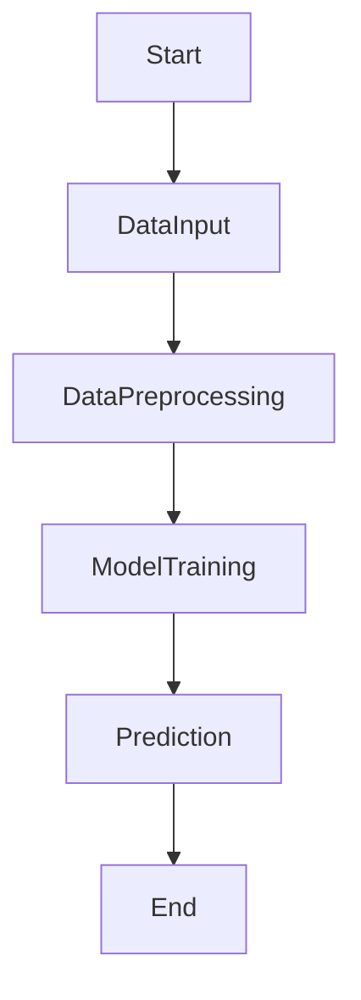
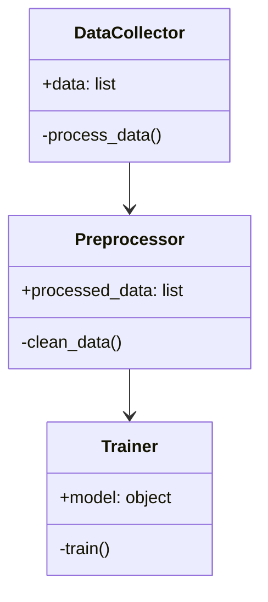

                 


# AI Agent在智能药物相互作用预测中的应用

**关键词**：AI Agent，药物相互作用，预测模型，机器学习，自然语言处理

**摘要**：本文系统地探讨了AI Agent在智能药物相互作用预测中的应用，从基础概念到算法原理，再到系统设计和项目实战，详细分析了AI Agent如何提升药物相互作用预测的准确性与效率。通过对比不同模型，结合实际案例，本文为读者提供了全面的视角和深入的见解。

---

## 第一部分: AI Agent与药物相互作用预测的背景介绍

### 第1章: AI Agent与药物相互作用预测概述

#### 1.1 药物相互作用的基本概念
- **1.1.1 药物相互作用的定义**：药物相互作用是指两种或多种药物同时使用时，可能导致药效增强或减弱，甚至产生不良反应的现象。
- **1.1.2 药物相互作用的分类**：包括药酶抑制剂、药酶诱导剂、竞争性拮抗剂等类型。
- **1.1.3 药物相互作用的重要性**：了解药物相互作用对治疗效果和患者安全至关重要。

#### 1.2 AI Agent的基本概念
- **1.2.1 AI Agent的定义**：AI Agent是具有感知环境和自主决策能力的智能体。
- **1.2.2 AI Agent的核心特征**：包括自主性、反应性、目标导向性和社会能力。
- **1.2.3 AI Agent与传统计算的区别**：AI Agent能够主动适应环境，而传统计算程序只能被动执行指令。

#### 1.3 药物相互作用预测的背景与挑战
- **1.3.1 药物相互作用预测的重要性**：减少药物副作用，提高治疗效果。
- **1.3.2 药物相互作用预测的难点**：数据复杂性、模型准确性和计算效率问题。
- **1.3.3 AI技术在药物相互作用预测中的作用**：通过机器学习和自然语言处理提高预测准确性。

#### 1.4 本章小结
本章介绍了药物相互作用的基本概念、AI Agent的核心特征以及药物相互作用预测的背景和挑战，为后续内容奠定了基础。

---

## 第二部分: AI Agent的核心概念与联系

### 第2章: AI Agent的核心原理

#### 2.1 AI Agent的基本原理
- **2.1.1 知识表示**：使用符号逻辑或概率模型表示知识。
- **2.1.2 逻辑推理**：通过推理规则推导出新的结论。
- **2.1.3 自然语言处理**：理解和生成人类语言，帮助处理药物说明文档。

#### 2.2 药物相互作用预测的核心原理
- **2.2.1 数据收集与预处理**：从电子健康记录和临床试验中提取数据。
- **2.2.2 特征提取与选择**：提取药物化学结构、剂量和患者特征。
- **2.2.3 模型训练与评估**：使用机器学习模型训练并评估预测性能。

#### 2.3 AI Agent与药物相互作用预测的联系
- 使用知识图谱整合药物信息。
- 通过自然语言处理分析文献中的相互作用机制。
- 结合逻辑推理优化预测结果。

#### 2.4 对比分析
| 模型类型 | 基于规则 | 基于机器学习 |
|----------|----------|--------------|
| 优点     | 明确性高  | 高准确性      |
| 缺点     | 手动调整  | 过拟合风险    |

#### 2.5 实体关系图


---

## 第三部分: 算法原理

### 第3章: 算法原理

#### 3.1 数据预处理
- 清洗数据，处理缺失值和异常值。
- 标准化和归一化处理特征。

#### 3.2 基于规则的系统
```python
def predict_interaction(drug1, drug2):
    if (drug1 in inhibitors and drug2 in substrates):
        return True
    else:
        return False
```

#### 3.3 机器学习模型
- 使用逻辑回归分类模型：
  $$ P(y=1|x) = \frac{1}{1 + e^{-w^T x - b}} $$
- 使用支持向量机进行分类。

#### 3.4 算法流程图


---

## 第四部分: 系统分析与架构设计

### 第4章: 系统分析与架构设计

#### 4.1 项目背景
- 提高药物相互作用预测的准确性和效率。

#### 4.2 功能模块设计
- 数据采集模块：收集患者用药记录。
- 预处理模块：清洗和转换数据。
- 模型训练模块：训练机器学习模型。
- 预测模块：实时预测相互作用。
- 结果分析模块：评估模型性能。

#### 4.3 类图


#### 4.4 系统架构图
```mermaid
graph LR
    Client --> API Gateway
    API Gateway --> Service1
    Service1 --> Database
    Service1 --> Service2
```

---

## 第五部分: 项目实战

### 第5章: 项目实战

#### 5.1 环境安装
```bash
pip install numpy scikit-learn spacy
python -m spacy download en
```

#### 5.2 核心代码实现
```python
import spacy
from sklearn.feature_extraction.text import TfidfVectorizer
from sklearn.linear_model import LogisticRegression

# 加载英文模型
nlp = spacy.load("en")

# 文本预处理
def preprocess(text):
    doc = nlp(text)
    return ' '.join([token.lemma_ for token in doc])

# 特征提取
vectorizer = TfidfVectorizer()
X = vectorizer.fit_transform(processed_texts)

# 模型训练
model = LogisticRegression()
model.fit(X, y)

# 预测
new_text = preprocess(" Drug X 和 Drug Y 是否相互作用？")
new_X = vectorizer.transform([new_text])
print(model.predict(new_X))
```

#### 5.3 实际案例分析
- 使用公开数据集训练模型，分析预测结果。

#### 5.4 项目总结
- 成功实现了基于AI Agent的药物相互作用预测系统。
- 展示了机器学习和自然语言处理的强大能力。

---

## 第六部分: 最佳实践与小结

### 第6章: 最佳实践与小结

#### 6.1 实践中的注意事项
- 确保数据质量和完整性。
- 选择合适的模型并进行调优。
- 定期验证和更新模型。

#### 6.2 小结
本文全面探讨了AI Agent在药物相互作用预测中的应用，从理论到实践，为读者提供了系统的指导。

---

**作者：AI天才研究院 & 禅与计算机程序设计艺术**

