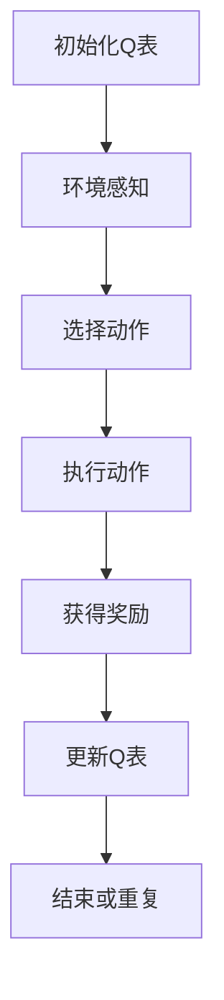
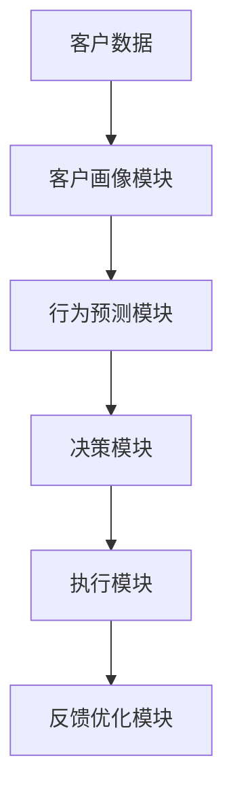

                 


# AI Agent在智能营销自动化中的应用

## 关键词
AI Agent, 智能营销, 自动化营销, 机器学习, 数据分析

## 摘要
AI Agent（人工智能代理）在智能营销自动化中的应用正在改变传统营销方式。通过结合机器学习和大数据分析，AI Agent能够实现精准客户画像、自动化决策和智能执行，从而提高营销效率和效果。本文将从AI Agent的基本概念、算法原理、系统架构、项目实战到最佳实践等方面，全面探讨其在智能营销自动化中的应用。

---

## 第一部分：AI Agent与智能营销自动化概述

### 第1章：AI Agent的基本概念

#### 1.1 AI Agent的定义与特点
AI Agent是一种能够感知环境并采取行动以实现目标的智能实体。它具备以下特点：
- **自主性**：能够在没有外部干预的情况下运行。
- **反应性**：能够实时感知环境并做出响应。
- **目标导向**：根据预设的目标执行任务。
- **学习能力**：通过数据和经验不断优化性能。

#### 1.2 智能营销自动化的发展背景
随着市场竞争的加剧，企业需要更高效的方式与客户互动。传统营销方式依赖人工操作，效率低下且难以应对海量数据。智能营销自动化通过AI Agent实现了从数据收集、分析到执行的全流程自动化。

#### 1.3 AI Agent在营销中的应用价值
AI Agent能够帮助营销人员实现客户细分、精准推荐和自动化决策，显著提高营销效果。例如，通过分析客户行为数据，AI Agent可以实时调整营销策略，优化广告投放。

---

### 第2章：AI Agent与传统营销自动化系统的对比

#### 2.1 传统营销自动化的局限性
传统营销自动化系统通常基于规则而非智能算法，难以应对复杂多变的市场环境。例如，无法根据实时数据动态调整策略，缺乏灵活性。

#### 2.2 AI Agent带来的创新
AI Agent通过机器学习和深度学习技术，能够从海量数据中提取有价值的信息，并实时做出决策。例如，通过自然语言处理技术，AI Agent可以分析客户反馈，自动调整营销策略。

#### 2.3 对比分析表格
以下是AI Agent与传统营销自动化的对比：

| 特性                | 传统营销自动化       | AI Agent                  |
|---------------------|--------------------|--------------------------|
| 决策方式            | 基于规则          | 基于机器学习模型         |
| 灵活性              | 较低              | 较高                    |
| 数据处理能力        | 简单               | 复杂，支持大数据分析      |
| 适应性              | 有限              | 强                    |

#### 2.4 实体关系图（ER图）
以下是AI Agent在营销系统中的实体关系图：

```mermaid
er
  actor: 客户
  action: 营销活动
  agent: AI Agent
  campaign: 营销方案
  feedback: 客户反馈
  actor --> action: 参与
  agent --> action: 执行
  action --> feedback: 产生
  agent --> campaign: 生成
```

---

## 第二部分：AI Agent的核心算法原理

### 第3章：感知与决策算法

#### 3.1 强化学习算法（Q-learning）
Q-learning是一种常见的强化学习算法，适用于动态环境下的决策问题。以下是其算法流程：

1. 初始化Q表。
2. 环境感知。
3. 选择动作。
4. 执行动作并获得奖励。
5. 更新Q表。
6. 重复步骤2-5。

以下是一个简单的Q-learning实现示例：

```python
import numpy as np

# 初始化Q表
Q = np.zeros([state_space, action_space])

# Q-learning参数
learning_rate = 0.1
discount_factor = 0.9

# Q-learning算法
def q_learning(state):
    if np.random.random() < 0.9:
        action = np.argmax(Q[state, :])
    else:
        action = np.random.randint(action_space)
    next_state = get_next_state(state, action)
    reward = get_reward(state, action)
    Q[state][action] = Q[state][action] + learning_rate * (reward + discount_factor * np.max(Q[next_state, :]) - Q[state][action])
    return action
```

#### 3.2 监督学习的应用
在监督学习中，AI Agent可以通过训练数据学习客户行为模式。例如，使用决策树算法对客户进行分类。

#### 3.3 算法流程图
以下是Q-learning算法的流程图：



---

### 第4章：执行与优化算法

#### 4.1 贪婪算法在营销策略中的应用
贪婪算法用于快速找到当前最优解。例如，在广告投放中，AI Agent可以使用贪婪算法选择当前效果最佳的广告位。

#### 4.2 迭代优化方法
通过不断迭代优化，AI Agent可以逐步提升营销效果。例如，使用梯度下降算法优化广告投放预算分配。

#### 4.3 数学模型公式
以下是Q-learning的数学模型：

$$ Q(s, a) = Q(s, a) + \alpha [r + \gamma \max Q(s', a') - Q(s, a)] $$

其中：
- \( Q(s, a) \) 表示当前状态 \( s \) 下采取动作 \( a \) 的价值。
- \( \alpha \) 表示学习率。
- \( r \) 表示奖励。
- \( \gamma \) 表示折扣因子。
- \( Q(s', a') \) 表示下一状态 \( s' \) 下动作 \( a' \) 的最大价值。

---

## 第三部分：系统架构与设计

### 第5章：系统架构设计

#### 5.1 系统功能模块
AI Agent营销自动化系统主要包括以下功能模块：
- **客户画像模块**：基于客户数据构建画像。
- **行为预测模块**：预测客户行为。
- **决策模块**：根据预测结果制定营销策略。
- **执行模块**：自动化执行营销活动。
- **反馈优化模块**：根据反馈优化系统。

#### 5.2 系统架构图
以下是系统架构图：



---

### 第6章：系统实现与接口设计

#### 6.1 系统实现细节
系统实现需要进行数据预处理、模型训练和部署。例如，使用Python的Scikit-learn库进行客户分类。

#### 6.2 接口设计与交互流程
以下是系统交互流程图：

```mermaid
sequenceDiagram
    actor 客户 -->+ Marketing Automation System: 请求营销活动
    Marketing Automation System -->+ AI Agent: 分析客户行为
    AI Agent --> Marketing Automation System: 提供决策建议
    Marketing Automation System --> 客户: 执行营销活动
    customer --> Marketing Automation System: 提供反馈
    Marketing Automation System --> AI Agent: 更新模型
```

---

## 第四部分：项目实战与案例分析

### 第7章：项目实战

#### 7.1 环境安装与配置
需要安装以下依赖：
- Python 3.8+
- Scikit-learn
- TensorFlow
- Mermaid工具

#### 7.2 核心代码实现
以下是客户画像分类的代码示例：

```python
from sklearn.cluster import KMeans

# 数据预处理
data = preprocess_customer_data()

# 模型训练
model = KMeans(n_clusters=5)
model.fit(data)

# 预测客户类别
predicted_clusters = model.predict(data)
```

#### 7.3 代码解读与分析
上述代码通过K-means算法对客户进行聚类分析，帮助AI Agent更好地理解客户群体。

---

### 第8章：案例分析与总结

#### 8.1 典型案例分析
例如，某电商公司使用AI Agent优化广告投放，效果提升了30%。

#### 8.2 项目总结与经验分享
AI Agent的应用能够显著提高营销效率，但需要结合具体业务场景进行优化。

---

## 第五部分：总结与展望

### 第9章：总结与未来展望

#### 9.1 全书总结
本文详细介绍了AI Agent在智能营销自动化中的应用，包括核心概念、算法原理和系统架构。

#### 9.2 未来发展方向
未来，随着AI技术的进步，AI Agent在营销自动化中的应用将更加广泛和智能，例如结合区块链技术实现更安全的客户数据管理。

### 第10章：最佳实践与注意事项

#### 10.1 最佳实践建议
- 定期更新模型以适应市场变化。
- 结合多渠道数据进行分析。

#### 10.2 注意事项与常见问题解答
- 数据隐私问题需严格遵守相关法规。
- 系统运行中需监控模型性能，及时优化。

---

## 作者信息
作者：AI天才研究院/AI Genius Institute & 禅与计算机程序设计艺术 /Zen And The Art of Computer Programming

---

感谢您的阅读！希望这篇文章能够帮助您更好地理解AI Agent在智能营销自动化中的应用。

