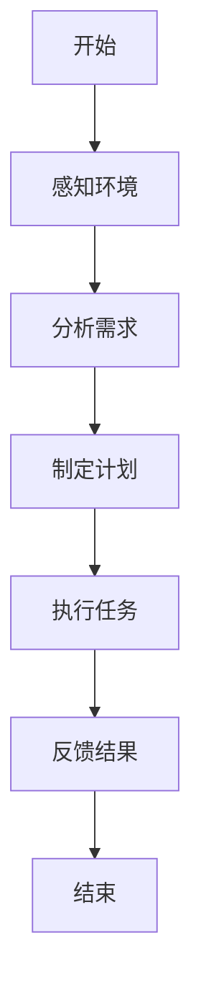
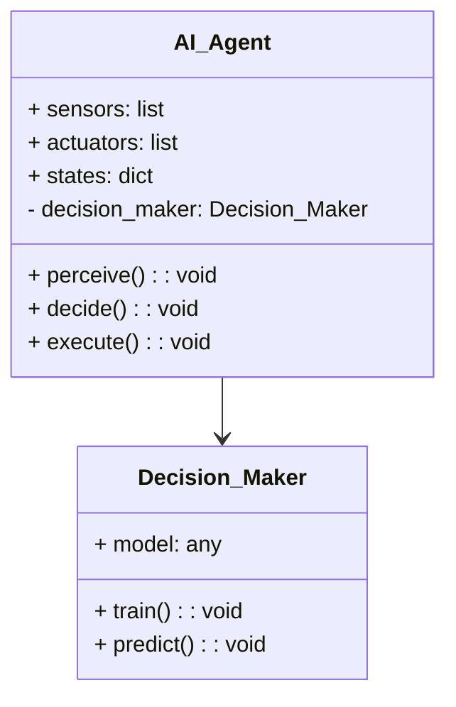
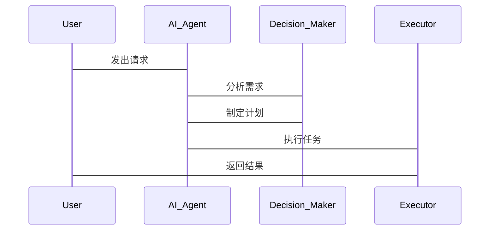

                 


# AI Agent在智能虚拟助理中的角色

**关键词：** AI Agent, 智能虚拟助理, 人工智能, 代理技术, 算法原理, 数学模型, 系统架构

**摘要：** 本文深入探讨了AI Agent在智能虚拟助理中的角色，从基本概念、技术原理到算法实现、系统架构，再到实际应用，全面解析了AI Agent如何赋能智能虚拟助理。通过详细的技术分析和实例演示，本文为读者提供了从理论到实践的全面指导，帮助读者理解AI Agent的核心价值和应用场景。

---

## 第一部分: AI Agent 的基本概念与背景

### 第1章: AI Agent 的概念与背景

#### 1.1 AI Agent 的定义与核心概念

##### 1.1.1 AI Agent 的定义
AI Agent（人工智能代理）是指能够感知环境、自主决策并执行任务的智能实体。它通过传感器获取信息，利用推理和学习能力做出决策，并通过执行器与环境交互。AI Agent 的核心在于其自主性和智能性，能够根据任务需求动态调整行为。

##### 1.1.2 AI Agent 的核心属性
- **自主性**：AI Agent 能够自主决策，无需外部干预。
- **反应性**：能够实时感知环境并做出反应。
- **主动性**：主动执行任务，而非被动响应。
- **学习能力**：通过数据和经验不断优化决策能力。

##### 1.1.3 AI Agent 与传统程序的区别
| 特性         | AI Agent                     | 传统程序                   |
|--------------|------------------------------|----------------------------|
| 决策能力     | 可以自主决策                 | 需要明确的规则或指令         |
| 学习能力     | 具备学习能力                 | 无法学习                   |
| 环境适应性   | 能够适应动态环境             | 适应性较差                 |
| 交互方式     | 支持自然语言交互             | 通常基于固定输入方式       |

##### 1.1.4 AI Agent 的分类与应用场景
AI Agent 可以分为以下几类：
1. **简单反射型 Agent**：基于当前感知做出反应，适用于简单的任务。
2. **基于模型的反射型 Agent**：利用内部模型进行决策，适用于复杂任务。
3. **目标驱动型 Agent**：基于明确目标采取行动。
4. **效用驱动型 Agent**：通过最大化效用函数实现目标。

应用场景包括智能虚拟助理、自动驾驶、智能客服、机器人助手等。

#### 1.2 AI Agent 的技术背景与发展

##### 1.2.1 人工智能技术的发展历程
人工智能技术经历了从规则驱动到数据驱动的演变。早期的AI Agent主要依赖专家系统和规则引擎，随着深度学习和强化学习的兴起，AI Agent 的智能性得到了显著提升。

##### 1.2.2 代理技术在人工智能中的地位
AI Agent 是人工智能的核心技术之一，它连接感知与行动，是实现智能化系统的关键桥梁。

##### 1.2.3 当前 AI Agent 的技术趋势
- **强化学习**：通过与环境交互不断优化决策策略。
- **多智能体协作**：多个 AI Agent 协作完成复杂任务。
- **边缘计算**：AI Agent 在边缘设备上的应用越来越广泛。

##### 1.2.4 AI Agent 在智能虚拟助理中的应用前景
AI Agent 将在智能虚拟助理中发挥越来越重要的作用，特别是在自然语言处理、多轮对话和个性化服务方面。

#### 1.3 智能虚拟助理的定义与现状

##### 1.3.1 智能虚拟助理的定义
智能虚拟助理是一种基于AI技术的交互系统，能够通过自然语言处理技术理解用户意图，并通过多种方式（如语音、文本）与用户交互，提供智能化服务。

##### 1.3.2 当前主流的智能虚拟助理产品
- **Siri**：苹果公司的智能语音助手。
- **Alexa**：亚马逊的智能音箱助手。
- **Google Assistant**：谷歌的智能助手。
- **小爱同学**：小米的智能助手。

##### 1.3.3 智能虚拟助理的核心功能模块
1. **自然语言理解（NLU）**：理解用户的输入。
2. **对话管理**：控制对话流程。
3. **任务执行**：调用后端服务完成任务。
4. **学习与优化**：通过用户反馈优化服务。

##### 1.3.4 智能虚拟助理与传统虚拟助理的区别
| 特性         | 智能虚拟助理                 | 传统虚拟助理               |
|--------------|------------------------------|----------------------------|
| 智能性       | 具备AI能力，能自主决策       | 依赖固定规则或脚本         |
| 交互方式     | 支持自然语言交互             | 通常基于关键词匹配         |
| 学习能力     | 能通过数据优化服务           | 无法学习                   |

#### 1.4 本章小结
本章介绍了AI Agent的基本概念、分类、技术背景以及智能虚拟助理的定义与发展现状，为后续章节奠定了基础。

---

## 第二部分: AI Agent 的核心概念与原理

### 第2章: AI Agent 的核心概念与联系

#### 2.1 AI Agent 的核心概念

##### 2.1.1 问题背景与问题描述
AI Agent 的核心问题在于如何在动态复杂的环境中做出最优决策。这需要综合考虑感知、推理、学习和执行等多个方面。

##### 2.1.2 问题解决的思路与方法
- **感知环境**：通过传感器获取环境信息。
- **理解意图**：通过NLU技术理解用户需求。
- **决策推理**：基于当前状态和目标，制定行动方案。
- **执行行动**：通过执行器完成任务。

##### 2.1.3 AI Agent 的边界与外延
AI Agent 的边界在于其感知和执行能力的范围。外延则包括与其他系统或智能体的协作。

##### 2.1.4 核心概念的结构与组成要素
AI Agent 的结构可以分为感知层、决策层和执行层：
1. **感知层**：负责获取环境信息。
2. **决策层**：负责制定决策。
3. **执行层**：负责执行决策。

#### 2.2 AI Agent 的核心原理

##### 2.2.1 AI Agent 的基本原理
AI Agent 的基本原理包括：
- **感知与行动的闭环**：通过感知环境信息，做出决策并执行。
- **状态表示**：用状态表示当前环境和任务进展。
- **决策机制**：基于状态和目标，选择最优行动。

##### 2.2.2 AI Agent 的感知与行动机制
感知机制包括：
- **传感器**：获取环境数据。
- **数据处理**：对数据进行预处理和特征提取。

行动机制包括：
- **执行器**：执行具体动作。
- **反馈机制**：收集执行结果并调整决策。

##### 2.2.3 AI Agent 的决策过程
AI Agent 的决策过程通常包括：
1. **目标设定**：明确任务目标。
2. **状态评估**：评估当前状态与目标的差距。
3. **决策制定**：基于状态和目标，制定行动方案。
4. **行动执行**：执行决策并观察结果。

##### 2.2.4 AI Agent 的学习与优化
- **监督学习**：通过标记数据训练模型。
- **强化学习**：通过与环境交互优化策略。
- **迁移学习**：将知识迁移到新任务。

#### 2.3 AI Agent 的核心概念对比

##### 2.3.1 AI Agent 与其他智能体的对比
| 特性         | AI Agent                     | 其他智能体                 |
|--------------|------------------------------|----------------------------|
| 智能性       | 高度智能，能自主决策         | 智能性较低，依赖规则       |
| 适应性       | 能够适应动态环境             | 适应性较差               |
| 交互方式     | 支持多种交互方式             | 通常基于固定方式           |

##### 2.3.2 AI Agent 与传统算法的对比
| 特性         | AI Agent                     | 传统算法                 |
|--------------|------------------------------|----------------------------|
| 自主性       | 高度自主                   | 无自主性                 |
| 学习能力     | 具备学习能力                 | 无法学习                   |
| 适应性       | 能够适应变化                 | 适应性较差               |

#### 2.4 AI Agent 的 ER 实体关系图

##### 2.4.1 实体关系图的定义
ER图（实体关系图）用于描述系统中各实体之间的关系。AI Agent 的 ER图展示了系统中各核心实体及其交互关系。

##### 2.4.2 AI Agent 的实体关系图
```mermaid
er
actor(AI Agent)
  --> role(感知层)
  --> role(决策层)
  --> role(执行层)
```

##### 2.4.3 实体关系图的分析与解释
AI Agent 通过感知层获取环境信息，经过决策层处理后，通过执行层完成任务。各层之间相互协作，共同完成目标。

#### 2.5 本章小结
本章深入探讨了AI Agent的核心概念、决策机制及其与其他技术的对比，帮助读者更好地理解AI Agent的内在逻辑。

---

## 第三部分: AI Agent 的算法原理与数学模型

### 第3章: AI Agent 的算法原理

#### 3.1 AI Agent 的基本算法

##### 3.1.1 任务分解算法
任务分解算法将复杂任务分解为多个子任务，逐个解决。例如，智能虚拟助理需要分解出自然语言理解、任务执行和反馈优化等多个子任务。

##### 3.1.2 状态表示与状态转移
状态表示通常采用向量形式，状态转移通过马尔可夫决策过程（MDP）实现。

##### 3.1.3 决策树与概率推理
决策树是一种直观的决策工具，概率推理则用于处理不确定性。

##### 3.1.4 强化学习在 AI Agent 中的应用
强化学习通过与环境交互，不断优化决策策略。常用的算法包括Q-Learning和Deep Q-Network（DQN）。

#### 3.2 AI Agent 的算法流程图

##### 3.2.1 算法流程图


##### 3.2.2 算法实现
```python
class AI_Agent:
    def __init__(self):
        self.sensors = []
        self.actuators = []
        self.states = {}

    def perceive(self):
        # 获取环境信息
        return self.sensors

    def decide(self, state):
        # 根据状态制定决策
        return action

    def execute(self, action):
        # 执行动作
        pass
```

#### 3.3 AI Agent 的数学模型

##### 3.3.1 马尔可夫决策过程（MDP）
马尔可夫决策过程定义了一个智能体在不确定性环境中的决策框架，主要包括状态、动作、转移概率和奖励函数。

##### 3.3.2 强化学习模型
强化学习模型通过最大化累积奖励来优化决策策略。常用的数学模型包括：
- **Q-Learning**：$$ Q(s, a) = r + \gamma \max Q(s', a') $$
- **Deep Q-Networks (DQN)**：使用深度神经网络近似Q值函数。

##### 3.3.3 概率推理模型
概率推理模型通过贝叶斯网络进行概率计算，帮助智能体在不确定性环境中做出决策。

#### 3.4 本章小结
本章详细介绍了AI Agent的核心算法及其数学模型，为后续章节的系统实现奠定了理论基础。

---

## 第四部分: 系统分析与架构设计

### 第4章: 系统分析与架构设计

#### 4.1 系统分析

##### 4.1.1 问题场景介绍
智能虚拟助理需要处理用户的多种请求，包括信息查询、任务执行和个性化服务。

##### 4.1.2 项目介绍
本项目旨在设计一个基于AI Agent的智能虚拟助理系统，实现自然语言交互和任务执行功能。

#### 4.2 系统功能设计

##### 4.2.1 领域模型 mermaid 类图


##### 4.2.2 系统架构设计 mermaid 架构图


##### 4.2.3 系统接口设计
系统接口包括：
- **用户输入接口**：接收用户的自然语言输入。
- **服务调用接口**：调用后端服务完成任务。
- **反馈接口**：收集用户反馈优化服务。

##### 4.2.4 系统交互 mermaid 序列图


#### 4.3 本章小结
本章详细分析了智能虚拟助理系统的功能需求和架构设计，为后续的实现提供了指导。

---

## 第五部分: 项目实战

### 第5章: 项目实战

#### 5.1 环境安装

##### 5.1.1 安装 Python 和相关库
```bash
pip install numpy
pip install tensorflow
pip install scikit-learn
```

#### 5.2 系统核心实现

##### 5.2.1 AI Agent 核心代码
```python
class AI_Agent:
    def __init__(self):
        self.sensors = []
        self.actuators = []
        self.states = {}

    def perceive(self):
        # 获取环境信息
        return self.sensors

    def decide(self, state):
        # 根据状态制定决策
        return action

    def execute(self, action):
        # 执行动作
        pass
```

##### 5.2.2 算法实现
```python
class QLearning:
    def __init__(self, state_space, action_space):
        self.state_space = state_space
        self.action_space = action_space
        self.q_table = {}

    def perceive(self, state):
        # 获取当前状态
        return state

    def decide(self, state):
        # 选择动作
        if state not in self.q_table:
            self.q_table[state] = {}
        # 探索与利用
        if random.random() < 0.1:
            return random.choice(self.action_space)
        else:
            max_action = max(self.q_table[state].items(), key=lambda x: x[1])[0]
            return max_action

    def learn(self, state, action, reward, next_state):
        # 更新Q值
        if state not in self.q_table:
            self.q_table[state] = {}
        if action not in self.q_table[state]:
            self.q_table[state][action] = 0
        self.q_table[state][action] = reward + 0.9 * max(self.q_table[next_state].values() if next_state else 0)
```

#### 5.3 代码应用解读与分析
- **AI_Agent 类**：实现了AI Agent的核心功能，包括感知、决策和执行。
- **QLearning 类**：实现了强化学习算法，用于优化决策策略。

#### 5.4 案例分析与详细讲解剖析
以智能虚拟助理处理用户查询为例：
1. **用户输入**：用户发出查询请求。
2. **感知环境**：AI Agent 获取用户输入。
3. **决策推理**：通过强化学习算法选择最优响应。
4. **执行任务**：调用后端服务返回结果。
5. **反馈优化**：根据用户反馈优化响应策略。

#### 5.5 本章小结
本章通过实际案例展示了AI Agent在智能虚拟助理中的应用，详细解读了核心代码和实现过程。

---

## 第六部分: 最佳实践与总结

### 第6章: 最佳实践

#### 6.1 最佳实践 tips
1. **数据质量**：确保训练数据的多样性和代表性。
2. **模型优化**：通过不断试验优化算法参数。
3. **用户反馈**：及时收集用户反馈优化服务。

#### 6.2 小结
通过本文的讲解，读者可以全面理解AI Agent在智能虚拟助理中的角色，并掌握其实现方法和应用技巧。

#### 6.3 注意事项
- **隐私保护**：注意用户数据的隐私保护。
- **性能优化**：确保系统的响应速度和稳定性。
- **用户体验**：注重交互设计，提升用户体验。

#### 6.4 拓展阅读
推荐阅读以下内容：
- 《强化学习（第2版）》
- 《机器学习实战》
- 《自然语言处理入门》

---

## 作者：AI天才研究院/AI Genius Institute & 禅与计算机程序设计艺术 /Zen And The Art of Computer Programming

---

**感谢您的耐心阅读！希望本文能为您提供有价值的技术见解和实践指导。**

