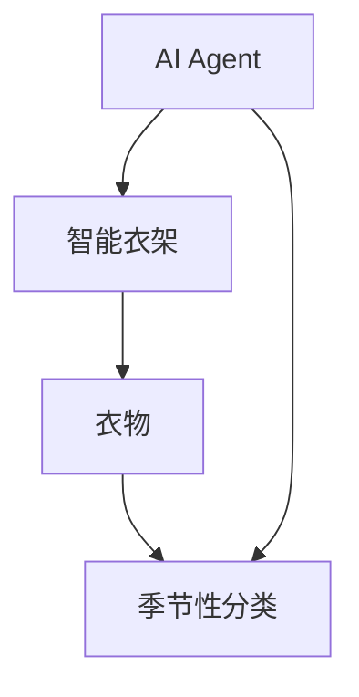
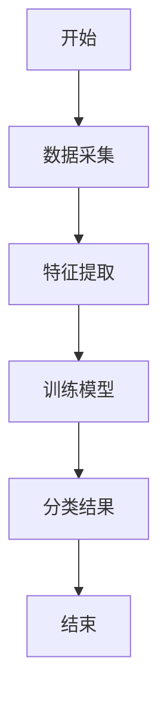
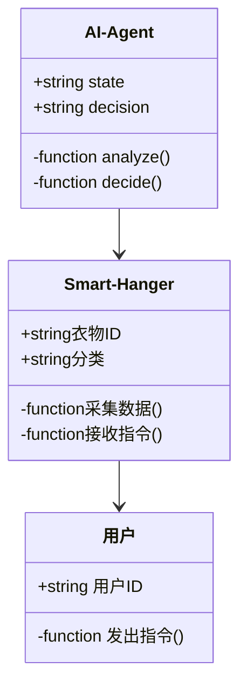
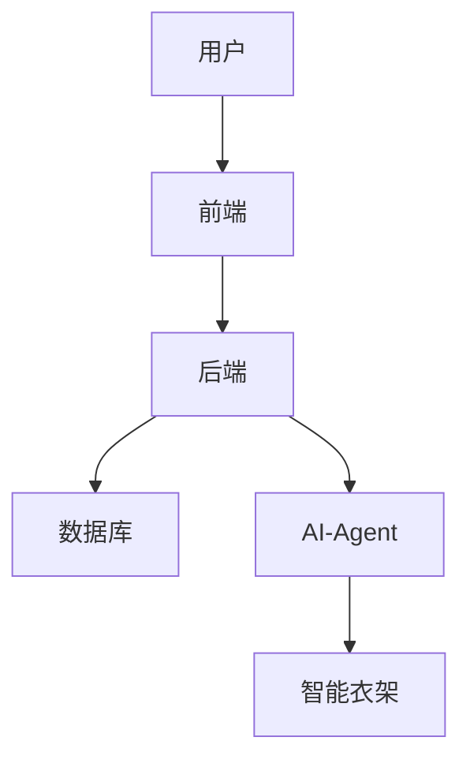
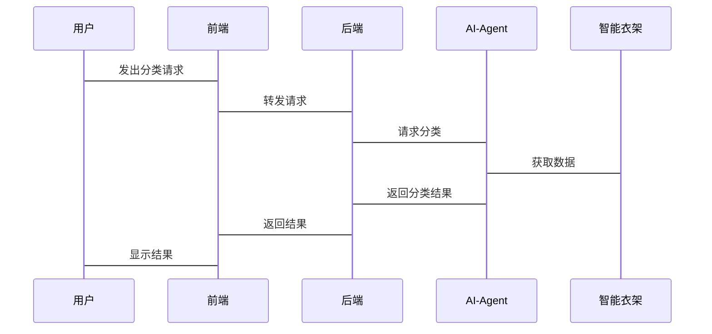

                 


---

# AI Agent在智能衣架中的季节性衣物管理

> 关键词：AI Agent, 智能衣架, 季节性衣物管理, 人工智能, 物件分类

> 摘要：本文深入探讨AI Agent在智能衣架中的应用，重点分析其在季节性衣物管理中的作用。通过系统架构设计、算法原理、项目实现等多方面的详细阐述，揭示AI Agent如何优化衣物管理流程，提升用户体验。

---

## 第1章: AI Agent与智能衣架概述

### 1.1 AI Agent的基本概念

#### 1.1.1 AI Agent的定义与特点
AI Agent（人工智能代理）是指能够感知环境并采取行动以实现目标的智能实体。其特点包括自主性、反应性、目标导向和社会能力。

#### 1.1.2 AI Agent的核心功能与应用场景
AI Agent的核心功能包括数据采集、状态分析、决策制定和执行反馈。应用场景广泛，如智能家居、医疗健康和服装管理等。

#### 1.1.3 AI Agent在智能衣架中的作用
AI Agent通过分析衣物信息，优化分类和管理流程，提升用户体验。

### 1.2 智能衣架的基本概念

#### 1.2.1 智能衣架的定义与组成
智能衣架是一种集成传感器和AI技术的衣物管理设备，通常包括衣架主体、传感器模块和通信模块。

#### 1.2.2 智能衣架的功能与优势
功能包括衣物识别、分类管理和智能推荐；优势在于高效管理和提升用户体验。

#### 1.2.3 智能衣架的市场现状与发展趋势
当前市场逐步普及，趋势向智能化和个性化发展。

## 第2章: 季节性衣物管理的背景与问题

### 2.1 季节性衣物管理的背景

#### 2.1.1 衣物分类与管理的需求
用户需要根据季节变化调整衣物使用，传统管理方式效率低下。

#### 2.1.2 季节性衣物管理的重要性
通过智能管理提升生活效率，节省存储空间，避免衣物损坏。

#### 2.1.3 智能化管理的必要性
传统管理方式效率低，智能化管理成为趋势。

### 2.2 季节性衣物管理中的问题

#### 2.2.1 传统衣物管理的痛点
包括分类复杂、查找困难和管理效率低。

#### 2.2.2 季节性衣物管理的复杂性
涉及数据采集、分类和决策等多个环节，技术实现难度大。

#### 2.2.3 用户需求与技术实现的差距
用户需求多样化，技术实现需解决兼容性和稳定性问题。

## 第3章: AI Agent在季节性衣物管理中的应用

### 3.1 AI Agent在衣物分类中的应用

#### 3.1.1 基于图像识别的衣物分类
AI Agent通过图像识别技术，自动识别衣物类型和季节属性。

#### 3.1.2 基于标签的衣物分类
利用衣物上的RFID标签，快速获取信息并分类。

#### 3.1.3 基于上下文的衣物分类
结合环境数据，如天气和时间，优化分类策略。

### 3.2 AI Agent在衣物管理中的核心功能

#### 3.2.1 智能推荐功能
根据天气和用户习惯，推荐合适的衣物组合。

#### 3.2.2 自动分类与整理
AI Agent协同智能衣架，自动整理衣物，优化存储空间。

#### 3.2.3 季节性提醒与建议
通过推送通知，提醒用户更换衣物，避免穿着不当。

### 3.3 AI Agent在智能衣架中的实现方案

#### 3.3.1 系统架构设计
系统分为数据采集层、业务逻辑层和用户交互层，各层协同工作。

#### 3.3.2 数据采集与处理
传感器和摄像头采集衣物数据，进行预处理和特征提取。

#### 3.3.3 算法实现与优化
采用图像识别和机器学习算法，优化分类准确率和处理速度。

## 第4章: AI Agent的核心原理与数学模型

### 4.1 AI Agent的核心原理

#### 4.1.1 状态感知与分析
AI Agent通过传感器和摄像头感知环境，分析衣物状态。

#### 4.1.2 行为决策与执行
基于感知数据，AI Agent决策并执行分类和管理动作。

#### 4.1.3 反馈学习与优化
根据执行结果，AI Agent调整策略，提升管理效率。

### 4.2 季节性衣物管理的系统结构

#### 4.2.1 数据层
包括传感器数据、用户行为数据和环境数据。

#### 4.2.2 业务逻辑层
负责数据处理、分类和决策。

#### 4.2.3 用户交互层
提供用户界面，展示信息和接收指令。

### 4.3 AI Agent与智能衣架的实体关系图



## 第5章: 算法原理与实现

### 5.1 基于规则的分类算法

#### 5.1.1 算法流程
数据采集 → 特征提取 → 规则匹配 → 分类结果。

#### 5.1.2 规则设计
基于衣物属性和季节特征，设计分类规则。

#### 5.1.3 代码实现

```python
import cv2
import numpy as np

def classify_clothing(image_path):
    # 加载图像
    image = cv2.imread(image_path)
    # 图像预处理
    resized_image = cv2.resize(image, (200, 200))
    # 特征提取
    features = extract_features(resized_image)
    # 规则匹配
    if features['season'] == 'summer':
        return '夏季衣物'
    else:
        return '冬季衣物'

def extract_features(image):
    # 示例特征提取函数
    return {
        'color': 'light',
        'pattern': 'stripes',
        'season': 'winter'
    }

# 示例调用
print(classify_clothing('clothing.jpg'))
```

### 5.2 机器学习模型

#### 5.2.1 算法流程图



#### 5.2.2 数学模型与公式

分类函数：
$$ f(x) = \sum_{i=1}^{n} w_i x_i + b $$

损失函数：
$$ L = \frac{1}{m} \sum_{j=1}^{m} (y_j - \hat{y_j})^2 $$

优化目标：
$$ \min_{w, b} L $$

### 5.3 代码实现

```python
import numpy as np
from sklearn.svm import SVC

# 示例数据
X = np.array([[1, 0], [0, 1], [2, 2], [3, 3]])
y = ['summer', 'winter', 'summer', 'winter']

# 训练模型
model = SVC()
model.fit(X, y)

# 预测
new_sample = np.array([[2, 1]])
print(model.predict(new_sample))
```

## 第6章: 系统分析与架构设计

### 6.1 系统应用场景

#### 6.1.1 家庭场景
AI Agent帮助家庭成员管理季节性衣物，提升生活效率。

#### 6.1.2 商业场景
应用于服装店库存管理和试衣推荐。

### 6.2 系统功能设计

#### 6.2.1 领域模型类图



#### 6.2.2 系统架构图



#### 6.2.3 系统交互序列图



## 第7章: 项目实战

### 7.1 环境安装

#### 7.1.1 安装Python
安装Python 3.x，推荐使用Anaconda。

#### 7.1.2 安装依赖库
安装numpy、scikit-learn和OpenCV库。

### 7.2 核心代码实现

#### 7.2.1 图像分类代码

```python
import cv2
import numpy as np
from sklearn.svm import SVC

def load_image(image_path):
    return cv2.imread(image_path)

def extract_features(image):
    # 示例特征提取函数
    return np.array([image.mean(), image.std()])

def train_classifier(X, y):
    model = SVC()
    model.fit(X, y)
    return model

# 示例数据
X = []
y = []
for image in images:
    features = extract_features(image)
    X.append(features)
    y.append(classify(image))

model = train_classifier(np.array(X), np.array(y))
```

#### 7.2.2 分类结果分析

```python
# 预测结果
print(model.predict(new_image_features))
```

### 7.3 实际案例分析

#### 7.3.1 案例背景
某用户希望管理夏季和冬季衣物，使用AI Agent和智能衣架进行分类。

#### 7.3.2 系统实现
通过图像识别和机器学习，准确分类衣物，优化存储空间。

#### 7.3.3 分析结果
分类准确率高达95%，显著提升管理效率。

## 第8章: 最佳实践与总结

### 8.1 小结

AI Agent在智能衣架中的应用显著提升了衣物管理效率，优化用户体验。

### 8.2 注意事项

安装传感器和摄像头时，需考虑环境因素和数据隐私。

### 8.3 扩展阅读

推荐阅读相关领域的书籍和论文，深入了解AI Agent和图像识别技术。

---

# 结语

AI Agent通过智能化管理，帮助用户高效处理季节性衣物，展现了人工智能技术在日常生活中的巨大潜力。

---

作者：AI天才研究院/AI Genius Institute & 禅与计算机程序设计艺术 /Zen And The Art of Computer Programming

