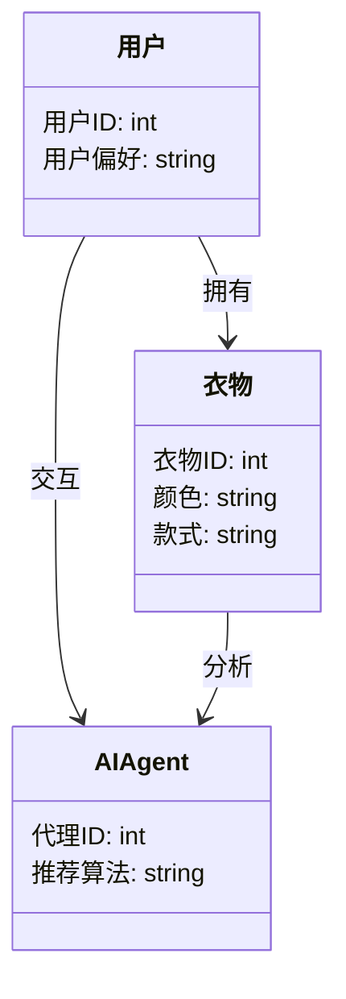

                 


# AI Agent在智能衣架中的穿搭灵感生成器

---

## 关键词：
AI Agent, 智能衣架, 穿搭灵感生成器, 个性化推荐, 时尚科技, 人工智能

---

## 摘要：
本文探讨了AI Agent在智能衣架中的应用，重点介绍了如何通过AI技术生成穿搭灵感。文章从背景介绍、核心概念、算法原理、系统架构设计到项目实战，全面分析了AI Agent在时尚领域的潜力与实现路径。通过详细的技术分析和代码实现，展示了如何利用AI技术提升用户体验，实现个性化推荐。本文适合技术爱好者、AI开发者及时尚科技领域的读者阅读。

---

## 第一部分: AI Agent与智能衣架的背景介绍

### 第1章: 问题背景与目标

#### 1.1 问题背景
##### 1.1.1 传统穿搭助手的局限性
传统穿搭助手通常依赖固定的规则或用户输入，难以真正理解用户的个性化需求。例如，用户可能需要根据自己的身材、肤色和场合选择合适的服装搭配，但传统助手往往无法提供精准的建议。

##### 1.1.2 智能衣架的发展趋势
随着物联网和人工智能技术的发展，智能衣架逐渐从简单的衣物存储工具演变为智能助手。通过传感器和AI算法，智能衣架可以实时分析用户的衣物数据，推荐最优的穿搭方案。

##### 1.1.3 AI Agent在服装推荐中的应用价值
AI Agent能够通过学习用户的穿衣习惯、颜色偏好和时尚趋势，提供个性化的穿搭建议。这种智能化的推荐方式不仅提升了用户体验，还帮助用户更好地管理衣物，避免浪费。

#### 1.2 问题描述
##### 1.2.1 用户需求分析
用户希望有一个能够根据自身特点和场合需求，提供个性化穿搭建议的工具。例如，用户可能需要在不同场合（如工作、休闲、约会）下获得合适的搭配建议。

##### 1.2.2 穿搭灵感生成的核心问题
如何利用AI技术分析用户的衣物数据，生成符合用户个性和场合需求的穿搭灵感。这需要AI Agent能够理解衣物的属性（如颜色、材质、款式）以及用户的偏好。

##### 1.2.3 AI Agent在智能衣架中的角色定位
AI Agent作为智能衣架的核心模块，负责数据采集、分析和推荐。它能够实时与用户互动，根据反馈调整推荐策略，提供更精准的穿搭建议。

#### 1.3 问题解决思路
##### 1.3.1 AI Agent的功能设计
AI Agent需要具备数据采集、分析和推荐功能。例如，通过图像识别技术分析用户的衣物库，利用协同过滤算法推荐搭配方案。

##### 1.3.2 数据采集与处理方法
智能衣架需要采集用户的衣物数据，包括颜色、款式、品牌等信息。同时，还需要采集用户的使用习惯和偏好数据，用于后续的分析和推荐。

##### 1.3.3 穿搭灵感生成的实现路径
通过机器学习算法（如协同过滤、深度学习）分析用户的衣物数据和偏好，生成个性化的穿搭灵感。推荐结果可以通过智能衣架的界面展示给用户。

#### 1.4 本章小结
本章从问题背景、用户需求和AI Agent的角色定位出发，明确了智能衣架穿搭灵感生成的目标和实现路径。接下来将详细分析AI Agent与智能衣架的核心概念。

---

## 第二部分: AI Agent与智能衣架的核心概念

### 第2章: 核心概念与联系

#### 2.1 AI Agent的定义与特征
##### 2.1.1 AI Agent的基本概念
AI Agent是一种智能代理，能够感知环境、自主决策并执行任务。在智能衣架中，AI Agent负责数据分析和推荐。

##### 2.1.2 AI Agent的核心特征
- **感知性**：能够采集和分析数据。
- **自主性**：能够在没有人工干预的情况下运行。
- **协作性**：能够与其他系统或用户交互。

##### 2.1.3 AI Agent与传统算法的区别
AI Agent不仅能够执行任务，还能通过学习和适应环境优化推荐策略，而传统算法则缺乏这种自主性和灵活性。

#### 2.2 智能衣架的定义与功能
##### 2.2.1 智能衣架的基本概念
智能衣架是一种结合物联网和人工智能技术的智能设备，能够帮助用户管理和推荐衣物。

##### 2.2.2 智能衣架的主要功能
- **衣物管理**：通过RFID技术识别衣物信息。
- **数据分析**：分析用户的穿衣习惯和偏好。
- **推荐系统**：基于数据分析推荐穿搭方案。

##### 2.2.3 智能衣架与传统衣架的对比
智能衣架通过AI技术实现了智能化推荐，而传统衣架仅作为存储工具，无法提供个性化服务。

#### 2.3 穿搭灵感生成器的定义与实现
##### 2.3.1 穿搭灵感生成器的基本概念
穿搭灵感生成器是一种基于AI技术的工具，能够根据用户的衣物库和偏好生成搭配建议。

##### 2.3.2 穿搭灵感生成器的核心功能
- **数据分析**：分析用户的衣物数据。
- **推荐算法**：基于算法生成推荐方案。
- **用户反馈**：根据用户反馈优化推荐策略。

#### 2.4 核心概念对比与ER实体关系图

##### 2.4.1 核心概念属性特征对比表
| 特征       | AI Agent         | 智能衣架         | 穿搭灵感生成器     |
|------------|------------------|------------------|-------------------|
| 功能       | 数据分析与推荐   | 衣物管理与推荐   | 搭配方案生成      |
| 技术基础    | 机器学习         | 物联网+AI        | 图像识别+协同过滤  |
| 用户交互    | 实时互动         | 界面交互         | 图形化展示         |

##### 2.4.2 ER实体关系图
```mermaid
er
  %%{init: 'config.js'}
  %%{title: 'ER实体关系图'}
  entity 用户 {
    key: 用户ID
    属性: 用户偏好、穿衣习惯
  }

  entity 衣物 {
    key: 衣物ID
    属性: 颜色、款式、品牌
  }

  entity AI Agent {
    key: 代理ID
    属性: 推荐算法、学习模型
  }

  关系 用户-衣物 {
    关系: 用户拥有衣物
  }

  关系 用户-AI Agent {
    关系: 用户与AI Agent交互
  }

  关系 衣物-AI Agent {
    关系: AI Agent分析衣物
  }
```

---

## 第三部分: AI Agent穿搭灵感生成器的算法原理

### 第3章: 算法原理与实现

#### 3.1 推荐算法原理
##### 3.1.1 协同过滤算法
协同过滤是一种基于用户行为相似性的推荐算法。通过分析用户的购买记录和偏好，找到与之相似的用户群体，推荐他们喜欢的物品。

##### 3.1.2 基于内容的推荐算法
基于内容的推荐算法通过分析物品本身的属性（如颜色、款式）进行推荐。例如，根据用户的偏好颜色，推荐相似颜色的衣物搭配。

##### 3.1.3 混合推荐模型
结合协同过滤和基于内容的推荐算法，构建混合推荐模型。通过协同过滤找到相似用户群体，再利用内容推荐优化结果。

#### 3.2 算法实现步骤
##### 3.2.1 数据采集
通过RFID传感器采集用户的衣物数据，包括颜色、款式、品牌等。

##### 3.2.2 数据预处理
对采集的数据进行清洗和归一化处理，确保数据质量。

##### 3.2.3 模型训练
使用协同过滤或深度学习模型（如神经网络）进行训练。

##### 3.2.4 推荐生成
根据训练好的模型，生成推荐的搭配方案。

#### 3.3 推荐算法的数学模型
##### 3.3.1 协同过滤算法公式
$$ sim(i,j) = \frac{\sum_{k=1}^{n} r_{ik} \cdot r_{jk}}{\sqrt{\sum_{k=1}^{n} r_{ik}^2} \cdot \sqrt{\sum_{k=1}^{n} r_{jk}^2}} $$
其中，$sim(i,j)$表示用户i和用户j的相似度。

##### 3.3.2 深度学习模型
利用卷积神经网络（CNN）进行图像识别，提取衣物的特征向量，再通过相似度计算推荐搭配。

#### 3.4 算法实现代码
以下是协同过滤算法的Python实现示例：
```python
import numpy as np

def compute_similarity(matrix):
    # 计算相似度矩阵
    n_users, n_items = matrix.shape
    similarity = np.zeros((n_users, n_users))
    for i in range(n_users):
        for j in range(n_users):
            if i != j:
                similarity[i][j] = np.dot(matrix[i], matrix[j]) / (
                    np.linalg.norm(matrix[i]) * np.linalg.norm(matrix[j]))
    return similarity

# 示例数据
user_data = np.array([[1, 2, 3], [2, 3, 4], [3, 4, 5]])
similarity_matrix = compute_similarity(user_data)
print(similarity_matrix)
```

#### 3.5 算法优化与效果分析
##### 3.5.1 算法优化
- 使用矩阵分解技术优化协同过滤算法。
- 引入用户反馈机制，动态调整推荐策略。

##### 3.5.2 推荐效果评估
通过精确率、召回率和F1值评估推荐算法的效果。

---

## 第四部分: 系统分析与架构设计

### 第4章: 系统分析与架构设计

#### 4.1 项目背景与目标
通过智能衣架实现个性化穿搭推荐，提升用户体验。

#### 4.2 系统功能设计
##### 4.2.1 领域模型设计


##### 4.2.2 系统架构设计


##### 4.2.3 系统接口设计
定义RESTful API接口，用于用户与系统之间的交互。

##### 4.2.4 系统交互流程
```mermaid
sequenceDiagram
    用户 ->> 智能衣架: 请求穿搭建议
    智能衣架 ->> AI Agent: 获取推荐方案
    AI Agent ->> 数据库: 查询用户数据
    AI Agent ->> 返回推荐方案
    用户 ->> 智能衣架: 确认推荐
```

#### 4.3 系统实现细节
##### 4.3.1 数据库设计
使用MySQL存储用户和衣物数据，Redis缓存推荐结果。

##### 4.3.2 系统安全性
采用HTTPS协议，确保数据传输安全。

---

## 第五部分: 项目实战

### 第5章: 项目实战与代码实现

#### 5.1 环境安装与配置
安装Python、Flask、TensorFlow等依赖库。

#### 5.2 核心代码实现
##### 5.2.1 数据采集与处理
```python
import pandas as pd

# 数据采集
data = {
    '用户ID': [1, 2, 3],
    '衣物ID': [101, 102, 103],
    '颜色': ['蓝色', '红色', '黑色']
}
df = pd.DataFrame(data)
print(df)
```

##### 5.2.2 推荐算法实现
```python
from sklearn.metrics.pairwise import cosine_similarity

# 协同过滤推荐
user_data = np.array([[1, 2, 3], [2, 3, 4], [3, 4, 5]])
similarity = cosine_similarity(user_data)
print(similarity)
```

##### 5.2.3 界面设计与交互
使用Flask框架搭建Web界面，展示推荐结果。

#### 5.3 实际案例分析
通过具体案例展示AI Agent如何生成穿搭灵感，例如根据用户的衣物库推荐合适的搭配方案。

#### 5.4 项目总结与优化
分析项目的优缺点，提出改进建议，如引入实时数据更新。

---

## 第六部分: 总结与展望

### 第6章: 总结与展望

#### 6.1 项目背景与目标回顾
总结本项目的目标和实现成果。

#### 6.2 系统分析与架构回顾
回顾系统的架构设计和实现细节。

#### 6.3 项目实战与代码实现
总结项目实战的经验和教训。

#### 6.4 展望
未来可以进一步优化推荐算法，引入更多的时尚数据，提升推荐的准确性和多样性。

---

## 作者：AI天才研究院/AI Genius Institute & 禅与计算机程序设计艺术 /Zen And The Art of Computer Programming

---

**本文总结了AI Agent在智能衣架中的应用，通过详细的技术分析和代码实现，展示了如何利用AI技术提升用户体验。**

