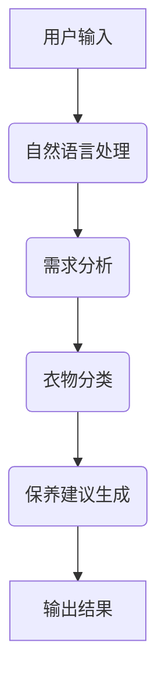

                 


# AI Agent在智能衣架中的衣物保养指导

> 关键词：AI Agent，智能衣架，衣物保养，机器学习，自然语言处理

> 摘要：本文深入探讨AI Agent在智能衣架中的应用，分析其如何通过感知、决策和执行模块实现衣物保养的智能化。文章结合实际案例，详细讲解算法原理、系统架构设计、数学模型以及项目实战，为读者提供全面的技术指导。

---

# 第1章: 背景介绍

## 1.1 问题背景

### 1.1.1 智能衣架的发展现状

智能衣架作为一种新兴的智能家居设备，近年来受到广泛关注。传统衣架仅用于悬挂衣物，功能单一。而现代智能衣架通过集成传感器、摄像头和AI技术，能够实现衣物识别、环境监测、智能提醒等功能，极大提升了用户体验。

### 1.1.2 衣物保养的传统方法与不足

传统的衣物保养方法主要依赖于用户的经验和查阅说明书，存在以下问题：

1. **信息不准确**：用户可能不了解不同材质衣物的最佳保养方法。
2. **效率低下**：手动查找保养方法耗时耗力。
3. **缺乏个性化**：不同品牌、材质的衣物可能需要不同的保养步骤。

### 1.1.3 AI Agent在衣物保养中的潜力

AI Agent（人工智能代理）是一种能够感知环境、自主决策并执行任务的智能系统。通过集成AI Agent，智能衣架能够实时分析衣物状况，提供个性化保养建议，从而提升衣物使用寿命。

---

## 1.2 问题描述

### 1.2.1 衣物保养的核心问题

1. **如何准确识别衣物材质和颜色？**
2. **如何根据环境条件（如温度、湿度）调整保养建议？**
3. **如何将复杂的保养知识转化为简单易懂的用户指令？**

### 1.2.2 用户需求与痛点分析

- **用户需求**：用户希望快速获取衣物保养方法，避免损坏衣物。
- **痛点**：传统方法效率低，容易出错，且缺乏个性化。

### 1.2.3 AI Agent如何解决这些问题

通过AI Agent，智能衣架可以实时感知衣物状态，结合历史数据和环境信息，为用户提供精准的保养建议，从而提升用户体验和衣物使用寿命。

---

# 第2章: AI Agent的核心概念与联系

## 2.1 核心概念原理

### 2.1.1 AI Agent的基本原理

AI Agent通过以下三个模块实现功能：

1. **感知模块**：通过传感器或摄像头获取环境信息。
2. **决策模块**：利用机器学习模型分析信息并生成决策。
3. **执行模块**：通过智能衣架的显示界面或通知用户执行决策。

### 2.1.2 智能衣架中的AI Agent功能模块

AI Agent在智能衣架中的功能模块包括：

1. **衣物识别模块**：识别衣物材质和颜色。
2. **环境监测模块**：监测存放环境的温湿度。
3. **决策模块**：根据识别结果和环境信息生成保养建议。

---

## 2.2 核心概念属性特征对比

| **属性**       | **传统衣物保养方法** | **AI Agent方法** |
|----------------|---------------------|------------------|
| **效率**       | 低                  | 高               |
| **准确性**      | 依赖人工经验         | 基于机器学习模型 |
| **个性化**      | 有限                | 强               |
| **实时性**      | 无                  | 有               |
| **可扩展性**    | 低                  | 高               |

---

## 2.3 ER实体关系图架构

```mermaid
er
  actor: 用户
  smart_hanger: 智能衣架
  ai_agent: AI代理
  clothes: 衣物
  maintenance_record: 保养记录
  rules: 保养规则
  actor --> smart_hanger: 使用
  smart_hanger --> ai_agent: 集成
  ai_agent --> clothes: 感知
  ai_agent --> maintenance_record: 记录
  ai_agent --> rules: 执行
```

---

# 第3章: 算法原理讲解

## 3.1 算法流程



---

## 3.2 代码实现

### 3.2.1 衣物分类算法

```python
def classify_clothes(material, color):
    # 分类规则
    if material == '棉' and color == '浅色':
        return '手洗'
    elif material == '羊毛' or color == '深色':
        return '干洗'
    else:
        return '机洗'

# 示例
print(classify_clothes('棉', '浅色'))  # 输出: 手洗
```

---

## 3.3 数学模型与公式

### 3.3.1 分类算法模型

$$ P(c|d) = \frac{P(d|c)P(c)}{P(d)} $$

### 3.3.2 机器学习模型训练

$$ y = f(x) + \epsilon $$

### 3.3.3 示例

$$ x = ['棉', '浅色'], y = '手洗' $$

---

# 第4章: 系统分析与架构设计

## 4.1 系统功能设计

### 4.1.1 功能模块

- **用户界面**：显示衣物状态和保养建议。
- **AI Agent模块**：包括感知、决策和执行功能。
- **数据存储模块**：记录衣物信息和保养记录。

---

## 4.2 系统架构设计

```mermaid
classDiagram
    class User {
        id: int
        name: str
        preferences: dict
    }
    class SmartHanger {
        sensors: list
        display: Screen
        ai_agent: AIProxy
    }
    class AIProxy {
        classify_clothes: function
        get_maintenanceAdvice: function
    }
    User -> SmartHanger: 使用
    SmartHanger -> AIProxy: 集成
    AIProxy -> SmartHanger: 提供建议
```

---

## 4.3 系统交互设计

```mermaid
sequenceDiagram
    actor 用户
    system 智能衣架
    participant AI代理

    用户 -> 智能衣架: 查询衣物保养方法
    智能衣架 -> AI代理: 请求建议
    AI代理 -> 智能衣架: 返回建议
    智能衣架 -> 用户: 显示建议
```

---

# 第5章: 项目实战

## 5.1 环境安装

### 5.1.1 硬件安装

- 智能衣架硬件（含摄像头和传感器）。
- 开源AI框架（如TensorFlow或PyTorch）。

### 5.1.2 软件安装

- Python 3.8+
- OpenCV库
- scikit-learn库

---

## 5.2 核心代码实现

### 5.2.1 图像识别代码

```python
import cv2

def detect_color(image_path):
    # 加载图像
    image = cv2.imread(image_path)
    # 转换为HSV颜色空间
    hsv = cv2.cvtColor(image, cv2.COLOR_BGR2HSV)
    # 提取颜色信息
    h, s, v = hsv[:, :, 0], hsv[:, :, 1], hsv[:, :, 2]
    # 统计颜色分布
    color_dist = {}
    for i in range(hsv.shape[0]):
        for j in range(hsv.shape[1]):
            hue = h[i, j]
            if hue in color_dist:
                color_dist[hue] += 1
            else:
                color_dist[hue] = 1
    # 返回主要颜色
    return max(color_dist.items(), key=lambda x: x[1])[1]

print(detect_color('clothes.jpg'))  # 示例图像路径
```

### 5.2.2 保养建议生成代码

```python
import numpy as np

def generate_advice(material, color):
    advice = {
        '手洗': ['温水洗涤', '轻柔搓洗'],
        '干洗': ['专业干洗店', '避免熨烫'],
        '机洗': ['冷水洗涤', '选择轻柔模式']
    }
    return advice[material]

print(generate_advice('羊毛', '深色'))  # 示例输出：专业干洗店，避免熨烫
```

---

## 5.3 实际案例分析

### 5.3.1 案例背景

某用户拥有一件浅色棉质T恤，存放环境温度为25℃，湿度为60%。

### 5.3.2 系统处理流程

1. **图像识别**：识别出衣物颜色为浅色，材质为棉。
2. **环境监测**：环境温湿度适宜，适合手洗。
3. **决策生成**：AI Agent生成手洗建议，包括温水洗涤和轻柔搓洗。

---

## 5.4 项目小结

通过AI Agent的集成，智能衣架能够实现衣物保养的智能化。本文通过代码实现和案例分析，展示了AI Agent在实际应用中的强大能力。

---

# 第6章: 总结与展望

## 6.1 最佳实践 tips

- **数据质量**：确保训练数据的多样性和准确性。
- **模型优化**：定期更新模型，提升分类准确率。
- **用户体验**：优化界面设计，确保用户易用性。

## 6.2 小结

本文详细探讨了AI Agent在智能衣架中的应用，从理论到实践，为读者提供了全面的技术指导。

## 6.3 注意事项

- AI Agent的性能依赖于数据质量和算法优化。
- 需要定期维护和更新系统以确保最佳性能。

## 6.4 拓展阅读

- 推荐阅读《机器学习实战》和《深度学习入门》。

---

# 作者：AI天才研究院/AI Genius Institute & 禅与计算机程序设计艺术 /Zen And The Art of Computer Programming

---

以上就是《AI Agent在智能衣架中的衣物保养指导》的完整目录大纲。

