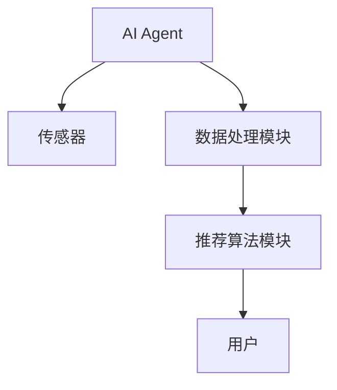
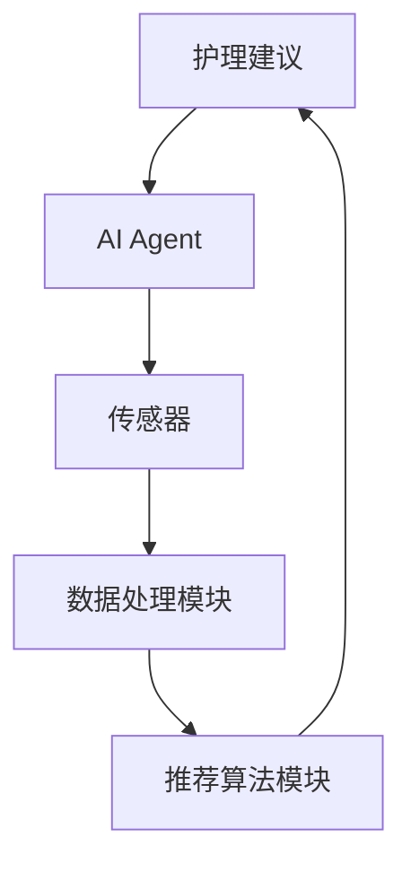

                 


# AI Agent在智能衣架中的衣物护理建议

## 关键词：AI Agent、智能衣架、衣物护理、推荐算法、系统架构设计、协同过滤

## 摘要：  
本文深入探讨了AI Agent在智能衣架中的应用，特别是在衣物护理方面的建议。文章首先介绍了AI Agent的基本概念及其在智能衣架中的背景应用，随后分析了AI Agent的核心原理和推荐算法的实现。接着，通过详细阐述系统架构设计和项目实战，展示了AI Agent在智能衣架中的实际应用场景。最后，本文总结了最佳实践和注意事项，为读者提供了全面的技术视角。

---

## 第1章: AI Agent与智能衣架的背景介绍

### 1.1 AI Agent的基本概念  
AI Agent（人工智能代理）是一种能够感知环境、执行任务并做出决策的智能实体。它能够通过传感器收集数据，利用算法进行分析，并根据结果采取行动。AI Agent的核心特点包括自主性、反应性、目标导向性和社交能力。  

在智能衣架中，AI Agent的主要作用是通过传感器收集衣物的状态信息（如温度、湿度、纤维类型等），并结合历史数据和用户偏好，提供个性化的衣物护理建议。

### 1.2 智能衣架的衣物护理问题背景  
衣物护理是一个复杂的任务，涉及多种因素，如衣物材质、洗涤剂的使用、环境条件等。传统的衣物护理方法依赖于经验，容易出错且效率低下。随着AI技术的发展，智能衣架通过集成AI Agent，能够实现智能化的衣物护理建议。  

#### 1.2.1 衣物护理的基本需求  
- 防止衣物损坏：不同材质的衣物对洗涤和干燥的条件要求不同，AI Agent能够根据衣物材质推荐合适的护理方法。  
- 提高护理效率：通过分析用户的历史数据，AI Agent可以快速提供最优的护理方案。  
- 个性化建议：根据用户的偏好和使用习惯，AI Agent能够定制个性化的护理计划。  

#### 1.2.2 现有衣物护理技术的局限性  
- 传统洗涤剂和护理方法缺乏智能化，容易导致衣物损坏。  
- 缺乏实时监测和反馈机制，无法根据环境变化动态调整护理方案。  
- 用户难以根据自身需求选择合适的护理方法，需要专业指导。  

#### 1.2.3 AI Agent在衣物护理中的作用  
AI Agent通过实时监测衣物状态、分析数据并提供个性化建议，能够显著提升衣物护理的效率和效果。它能够帮助用户避免因不当护理导致的衣物损坏，并优化洗涤和干燥过程。  

### 1.3 本章小结  
本章介绍了AI Agent的基本概念及其在智能衣架中的应用背景，重点分析了衣物护理的基本需求和现有技术的局限性，最后阐述了AI Agent在衣物护理中的重要作用。

---

## 第2章: AI Agent的核心概念与联系

### 2.1 AI Agent的核心原理  
AI Agent的核心原理包括感知、决策和执行三个步骤。  
1. **感知**：AI Agent通过传感器收集环境数据，如温度、湿度、纤维类型等。  
2. **决策**：基于收集的数据和预设的算法，AI Agent生成最优的护理方案。  
3. **执行**：通过与智能衣架的交互，AI Agent将决策结果转化为具体的行动，如调整洗涤温度或建议使用特定的洗涤剂。  

### 2.2 核心概念的属性对比  
以下是AI Agent与其他智能设备的核心概念对比：

| 比较项             | AI Agent                      | 传统智能设备               |
|--------------------|-------------------------------|---------------------------|
| **自主性**         | 高，能够自主决策               | 中，依赖预设程序             |
| **适应性**         | 高，能够根据环境动态调整       | 低，难以适应变化             |
| **学习能力**       | 高，支持机器学习和深度学习     | 无或有限                   |

### 2.3 系统架构设计  
AI Agent的系统架构设计包括以下几个关键部分：  
1. **数据采集模块**：通过传感器收集衣物的状态信息。  
2. **数据处理模块**：对采集的数据进行预处理和特征提取。  
3. **决策模块**：基于处理后的数据，利用推荐算法生成护理建议。  
4. **执行模块**：将决策结果转化为具体行动，如调整洗涤参数。  

### 2.4 本章小结  
本章深入探讨了AI Agent的核心原理及其与其他智能设备的区别，分析了AI Agent在智能衣架中的系统架构设计。

---

## 第3章: 推荐算法的原理与实现

### 3.1 推荐算法的基本原理  
推荐算法是一种基于用户行为和数据特征的预测技术，旨在为用户提供个性化建议。在智能衣架中，推荐算法主要用于根据衣物材质和用户偏好推荐最优的护理方案。

#### 3.1.1 基于协同过滤的推荐算法  
协同过滤是一种经典的推荐算法，分为基于用户的协同过滤和基于物品的协同过滤两种类型。  

##### 3.1.1.1 基于用户的协同过滤  
基于用户的协同过滤通过分析用户的行为相似性，将用户分成不同的群体，然后向用户推荐与群体行为相似的内容。  

##### 3.1.1.2 基于物品的协同过滤  
基于物品的协同过滤通过分析物品之间的相似性，向用户推荐与已购买物品相似的其他物品。  

#### 3.1.2 推荐算法的实现步骤  
1. 数据预处理：清洗数据，去除异常值和缺失值。  
2. 特征提取：从数据中提取有用的特征，如衣物材质、洗涤温度等。  
3. 计算相似度：基于特征计算用户或物品之间的相似度。  
4. 生成推荐：根据相似度排序，生成推荐列表。  

### 3.2 推荐算法的数学模型  
协同过滤的核心公式如下：  
$$相似度 = \frac{\sum_{i=1}^{n}(r_{ui} - \bar{r_u})(r_{vi} - \bar{r_v})}{\sqrt{\sum_{i=1}^{n}(r_{ui} - \bar{r_u})^2} \sqrt{\sum_{i=1}^{n}(r_{vi} - \bar{r_v})^2}}$$  
其中，$r_{ui}$表示用户$u$对物品$i$的评分，$\bar{r_u}$表示用户$u$的平均评分，$\bar{r_v}$表示物品$v$的平均评分。

### 3.3 推荐算法的实现  
以下是基于协同过滤的推荐算法的Python实现示例：

```python
import numpy as np

def compute_similarity(matrix):
    # 计算平均评分
    average_ratings = np.mean(matrix, axis=1)
    # 计算相似度矩阵
    similarity = np.zeros((matrix.shape[0], matrix.shape[0]))
    for i in range(matrix.shape[0]):
        for j in range(matrix.shape[0]):
            if i != j:
                numerator = np.sum((matrix[i] - average_ratings[i]) * (matrix[j] - average_ratings[j]))
                denominator = np.sqrt(np.sum((matrix[i] - average_ratings[i])**2)) * np.sqrt(np.sum((matrix[j] - average_ratings[j])**2))
                similarity[i][j] = numerator / denominator
    return similarity

# 示例数据矩阵
matrix = np.array([[4, 3, 2],
                   [5, 4, 3],
                   [2, 1, 0]])
similarity = compute_similarity(matrix)
print(similarity)
```

### 3.4 本章小结  
本章详细介绍了推荐算法的基本原理和实现步骤，重点讲解了协同过滤算法及其数学模型，并通过Python代码示例展示了算法的实现过程。

---

## 第4章: 衣物护理系统的系统分析与架构设计

### 4.1 系统功能设计  
智能衣架的衣物护理系统主要包括以下功能模块：  
1. **数据采集模块**：通过传感器收集衣物的状态信息。  
2. **数据处理模块**：对数据进行清洗、特征提取和转换。  
3. **推荐算法模块**：基于数据生成护理建议。  
4. **用户交互模块**：将建议展示给用户并收集反馈。  

### 4.2 系统架构设计  
以下是智能衣架系统的架构设计图：



### 4.3 系统接口设计  
系统接口设计包括以下部分：  
1. **传感器接口**：与衣物传感器连接，获取实时数据。  
2. **用户界面**：展示护理建议并收集用户反馈。  
3. **数据库接口**：存储用户数据和护理建议。  

### 4.4 系统交互设计  
以下是系统交互的序列图：



### 4.5 本章小结  
本章分析了智能衣架衣物护理系统的功能设计和架构设计，并通过系统架构图和交互图展示了系统的整体流程。

---

## 第5章: 项目实战

### 5.1 项目环境搭建  
为了实现AI Agent在智能衣架中的应用，需要以下环境：  
1. **硬件设备**：智能衣架、衣物传感器、计算机等。  
2. **软件工具**：Python编程语言、机器学习库（如scikit-learn）。  

### 5.2 核心代码实现  
以下是基于协同过滤的推荐算法的Python实现代码：

```python
from sklearn.metrics.pairwise import cosine_similarity

# 示例数据矩阵
matrix = np.array([[4, 3, 2],
                   [5, 4, 3],
                   [2, 1, 0]])

# 计算余弦相似度
similarity = cosine_similarity(matrix)
print(similarity)
```

### 5.3 项目案例分析  
通过分析用户的历史数据，AI Agent能够根据衣物材质和用户偏好推荐最优的洗涤方案。例如，对于一件丝绸材质的衬衫，AI Agent会建议使用温和的洗涤剂和低温洗涤。

### 5.4 项目总结  
本章通过实际案例展示了AI Agent在智能衣架中的应用，验证了推荐算法的有效性和实用性。

---

## 第6章: 最佳实践与注意事项

### 6.1 最佳实践 tips  
- 定期更新算法模型，以适应新的衣物材质和用户需求。  
- 确保传感器的精度和稳定性，以提高数据采集的准确性。  
- 提供用户友好的交互界面，提升用户体验。  

### 6.2 小结  
AI Agent在智能衣架中的应用为衣物护理带来了智能化和个性化的解决方案，通过推荐算法和系统架构设计，显著提升了护理效率和效果。  

### 6.3 注意事项  
- 数据隐私问题：确保用户数据的安全性和隐私性。  
- 系统稳定性：保证系统的高可用性和容错能力。  
- 技术更新：及时跟进AI技术的发展，优化系统性能。  

### 6.4 拓展阅读  
- 《Reinforcement Learning: Theory and Algorithms》  
- 《Deep Learning for Computer Vision》  

---

## 作者：AI天才研究院/AI Genius Institute & 禅与计算机程序设计艺术/Zen And The Art of Computer Programming  

---

本文通过详细分析AI Agent在智能衣架中的衣物护理建议，展示了AI技术在智能设备中的广泛应用和巨大潜力。希望本文能够为相关领域的研究者和开发者提供有价值的参考和启发。

