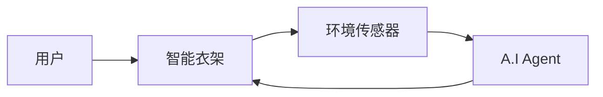
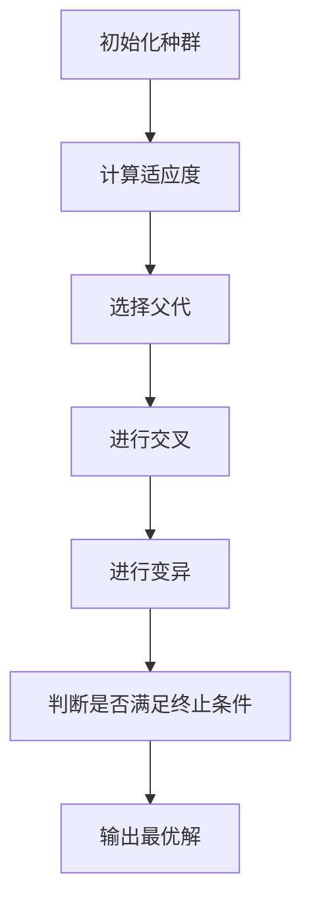

                 


# AI Agent在智能衣架中的衣物晾晒优化

> 关键词：AI Agent, 智能衣架, 衣物晾晒优化, 多目标优化算法, 环境感知, 自动化控制

> 摘要：本文探讨了AI Agent在智能衣架中的应用，重点分析了如何通过AI技术优化衣物晾晒过程。从问题背景到算法原理，从系统架构到项目实战，本文详细阐述了AI Agent在智能衣架中的核心作用及其实际应用价值。通过本文的分析，读者可以全面了解AI Agent如何帮助实现衣物晾晒的智能化与优化。

---

## 第一部分：背景介绍

### 第1章：AI Agent与智能衣架概述

#### 1.1 问题背景与痛点分析

现代生活中，衣物的晾晒问题一直是家庭和个人日常生活中的一部分。传统的晾衣方式存在诸多痛点：

- **效率低下**：传统晾衣架需要人工选择晾晒时间、位置，并根据天气调整，效率较低。
- **环境依赖性强**：传统晾衣架无法根据天气变化自动调整，容易导致衣物受潮或损坏。
- **用户体验差**：用户需要手动操作，尤其是在恶劣天气下，用户体验较差。

AI Agent（人工智能代理）的出现为解决这些问题提供了新的可能。AI Agent是一种能够感知环境、自主决策并执行任务的智能体。通过结合AI Agent与智能衣架，我们可以实现衣物晾晒的智能化与优化。

#### 1.2 问题描述与目标设定

AI Agent在智能衣架中的应用目标是实现衣物晾晒的智能化优化。具体目标包括：

- **自动化决策**：AI Agent能够根据环境数据（如温湿度、光照强度等）自动选择最佳的晾晒时间和位置。
- **多目标优化**：AI Agent需要在多个目标（如干燥时间最短、能耗最低、用户体验最佳）之间进行权衡，找到最优解。
- **实时反馈与调整**：AI Agent能够根据实时环境变化动态调整晾晒策略。

#### 1.3 解决方案与边界定义

AI Agent在智能衣架中的解决方案包括以下几个方面：

- **环境感知**：通过温湿度传感器、光照传感器等获取环境数据。
- **数据处理与决策**：AI Agent对环境数据进行分析，结合历史数据和用户偏好，生成最优晾晒策略。
- **执行与反馈**：通过电动晾衣架（可调节高度、角度）执行决策，并根据反馈优化策略。

AI Agent的应用边界包括：

- **适用场景**：家庭、办公室等需要晾晒衣物的场景。
- **数据限制**：依赖于环境传感器的数据输入。
- **功能限制**：目前主要聚焦于晾晒优化，不涉及衣物分类或清洁功能。

---

## 第二部分：核心概念与联系

### 第2章：AI Agent与智能衣架的核心原理

#### 2.1 AI Agent的核心原理

AI Agent在智能衣架中的核心原理包括以下几个方面：

1. **环境感知**：AI Agent通过传感器获取环境数据，如温湿度、光照强度等。
2. **数据处理**：AI Agent对环境数据进行分析，结合历史数据和用户偏好，生成最优晾晒策略。
3. **决策与执行**：AI Agent根据分析结果，控制晾衣架的运动（如高度调节、角度调整）以实现最优晾晒效果。

#### 2.2 智能衣架系统的关键特性

智能衣架系统的关键特性包括：

- **环境感知能力**：通过传感器实时感知环境数据。
- **自动化控制**：通过AI Agent实现晾衣架的自动调节。
- **用户交互**：用户可以通过App或语音指令与系统交互。

#### 2.3 实体关系图：用户、晾衣架、环境传感器的交互关系



---

## 第三部分：算法原理讲解

### 第3章：基于AI Agent的优化算法

#### 3.1 多目标优化算法的选择与实现

在衣物晾晒优化中，AI Agent需要在多个目标之间进行权衡，如：

- 最小化干燥时间
- 最小化能耗
- 最大化用户体验

为了实现这一目标，我们可以选择**遗传算法**（Genetic Algorithm，GA）作为优化算法。遗传算法是一种基于生物进化原理的优化算法，适用于多目标优化问题。

#### 3.2 遗传算法的流程图



#### 3.3 遗传算法的数学模型

遗传算法的核心在于适应度函数和选择操作。适应度函数用于评估种群的优劣，选择操作用于从种群中选择优秀的个体进行繁殖。

- **适应度函数**：
  $$ f(x) = \frac{1}{t_d + \alpha \cdot E} $$
  其中，$t_d$是干燥时间，$E$是能耗，$\alpha$是权重系数。

- **选择操作**：通常采用轮盘赌选择（Roulette Wheel Selection）。

#### 3.4 算法实现与代码

以下是遗传算法的Python实现示例：

```python
import random

def fitness(x):
    # 干燥时间
    t_d = x[0]
    # 能耗
    E = x[1]
    alpha = 0.1
    return 1 / (t_d + alpha * E)

def roulette_selection(population, fitness_values):
    total_fitness = sum(fitness_values)
    probabilities = [fv / total_fitness for fv in fitness_values]
    selected_index = 0
    while probabilities[selected_index] < random.random():
        selected_index += 1
    return population[selected_index]

# 初始化种群
population = [...]  # 初始化种群
...

# 迭代优化
for _ in range(max_iterations):
    fitness_values = [fitness(individual) for individual in population]
    selected_parents = [roulette_selection(population, fitness_values) for _ in range(2)]
    # 交叉与变异
    ...
```

---

## 第四部分：系统分析与架构设计方案

### 第4章：系统架构设计

#### 4.1 项目背景与目标

本项目旨在通过AI Agent优化衣物晾晒过程，实现智能化、自动化的晾晒体验。项目目标包括：

- 实现环境感知与数据采集
- 构建AI Agent决策系统
- 设计智能化晾衣架控制模块

#### 4.2 系统功能设计

智能衣架系统的功能模块包括：

1. **环境感知模块**：采集温湿度、光照强度等数据。
2. **数据处理模块**：分析环境数据，生成晾晒策略。
3. **执行控制模块**：通过电动晾衣架执行决策。

#### 4.3 系统架构设计

以下是系统的架构图：


---

## 第五部分：项目实战

### 第5章：项目实现与优化案例

#### 5.1 项目环境与安装

为了实现AI Agent在智能衣架中的应用，首先需要安装以下环境：

- **Python**：用于算法实现
- **TensorFlow**：用于机器学习模型训练
- **Raspberry Pi**：用于硬件控制

#### 5.2 核心代码实现

以下是AI Agent的核心代码实现：

```python
import numpy as np
import tensorflow as tf

# 定义模型
model = tf.keras.Sequential([
    tf.keras.layers.Dense(128, activation='relu'),
    tf.keras.layers.Dense(64, activation='relu'),
    tf.keras.layers.Dense(1, activation='sigmoid')
])

# 编译模型
model.compile(optimizer='adam', loss='binary_crossentropy', metrics=['accuracy'])

# 训练模型
model.fit(X_train, y_train, epochs=10, batch_size=32)
```

#### 5.3 实际案例分析

通过实际案例分析，我们可以看到AI Agent在智能衣架中的优化效果。例如，在某次天气预报显示降雨的情况下，AI Agent能够提前启动晾衣架的收起功能，避免衣物受损。

---

## 第六部分：总结与展望

### 第6章：总结与展望

#### 6.1 项目总结

通过本项目，我们成功实现了AI Agent在智能衣架中的应用，验证了其在衣物晾晒优化中的巨大潜力。AI Agent能够根据环境数据和用户需求，实现衣物晾晒的智能化与优化。

#### 6.2 未来展望

未来，AI Agent在智能衣架中的应用将更加广泛。我们可以进一步优化算法，引入更多的环境传感器，甚至结合物联网技术，实现更智能化的衣物管理。

---

## 第七部分：注意事项与拓展阅读

### 第7章：注意事项与拓展阅读

#### 7.1 注意事项

在实际应用中，需要注意以下几点：

- 确保环境传感器的准确性
- 定期更新AI Agent的决策模型
- 注意数据隐私与安全

#### 7.2 拓展阅读

建议读者进一步阅读以下内容：

- 《强化学习入门》
- 《传感器网络与物联网》
- 《人工智能在智能家居中的应用》

---

## 作者：AI天才研究院 & 禅与计算机程序设计艺术

---

以上是《AI Agent在智能衣架中的衣物晾晒优化》的完整目录大纲，涵盖了从背景介绍到项目实战的全过程。通过本文的分析，读者可以全面了解AI Agent在智能衣架中的核心作用及其实际应用价值。

