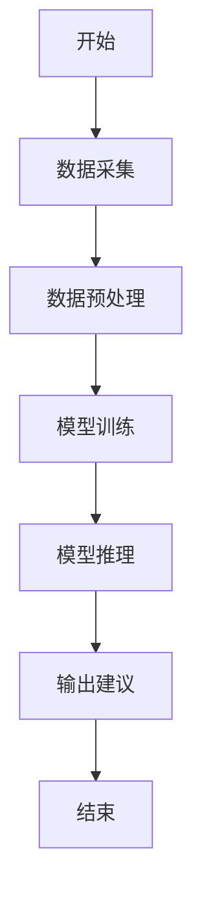
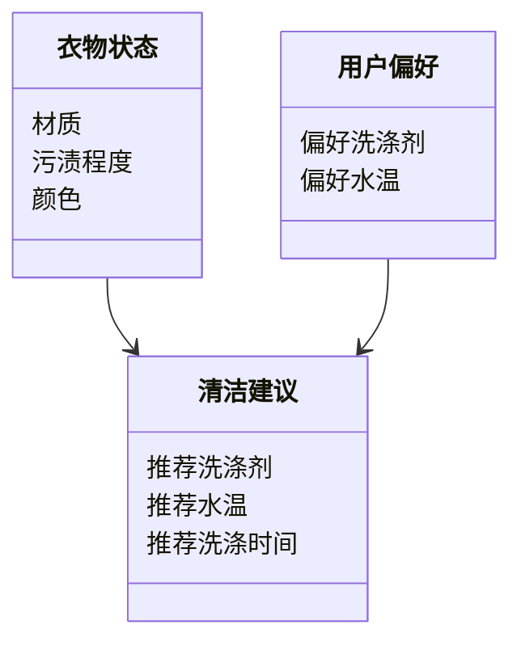

                 


# AI Agent在智能衣架中的衣物清洁建议

## 关键词：
- AI Agent
- 智能衣架
- 衣物清洁
- 推荐算法
- 系统架构
- 项目实战

## 摘要：
本文探讨了AI Agent在智能衣架中的应用，重点分析了如何通过AI技术提供衣物清洁建议。文章从背景介绍、核心概念、算法原理、系统架构到项目实战，详细阐述了AI Agent在智能衣架中的工作原理和实现方法。通过具体的案例分析和代码实现，本文展示了AI Agent如何帮助用户优化衣物清洁流程，提升用户体验。

---

## 第一部分: AI Agent在智能衣架中的背景介绍

### 第1章: AI Agent与智能衣架的基本概念

#### 1.1 AI Agent的核心概念
##### 1.1.1 AI Agent的定义与特点
AI Agent（人工智能代理）是一种能够感知环境并采取行动以实现目标的智能实体。它具备以下特点：
- **自主性**：能够在没有外部干预的情况下运行。
- **反应性**：能够实时感知环境并做出反应。
- **目标导向**：通过实现目标来提供服务。
- **学习能力**：能够通过数据学习和优化自身行为。

##### 1.1.2 智能衣架的定义与应用场景
智能衣架是一种结合了物联网和人工智能技术的衣物管理设备。它能够通过传感器感知衣物的状态（如脏污程度、材质等），并通过AI Agent提供清洁建议。应用场景包括：
- **家庭衣物管理**：帮助用户更好地管理衣物清洁。
- **酒店服务**：用于酒店客房的衣物清洁管理。
- **智能衣柜**：集成到智能衣柜中，提供个性化的清洁建议。

##### 1.1.3 AI Agent在智能衣架中的作用
AI Agent在智能衣架中的作用主要体现在以下几个方面：
- **数据采集**：通过传感器采集衣物的状态数据。
- **数据分析**：基于历史数据和用户行为，分析衣物的清洁需求。
- **决策与推荐**：根据分析结果，提供清洁建议。

#### 1.2 衣物清洁建议的问题背景
##### 1.2.1 衣物清洁的基本问题
衣物清洁是一个复杂的过程，涉及多个因素，如衣物材质、污渍类型、洗涤剂选择等。传统清洁方式通常依赖用户的经验和试错，效率较低。

##### 1.2.2 AI Agent如何解决衣物清洁问题
AI Agent可以通过以下方式优化衣物清洁过程：
- **智能推荐**：基于衣物状态和用户偏好，推荐最佳清洁方案。
- **数据驱动**：利用大数据分析，优化清洁流程。
- **实时反馈**：实时监控清洁过程，提供动态调整建议。

##### 1.2.3 智能衣架的边界与外延
智能衣架的边界在于其核心功能——提供清洁建议，而外延则包括与清洁设备（如洗衣机、干衣机）的联动。

---

### 第2章: AI Agent与智能衣架的核心概念

#### 2.1 AI Agent的核心原理
##### 2.1.1 AI Agent的基本原理
AI Agent的核心原理包括感知、推理和行动三个步骤：
1. **感知**：通过传感器或数据接口获取环境信息。
2. **推理**：基于感知到的信息，利用算法进行分析和决策。
3. **行动**：根据推理结果，采取相应的行动。

##### 2.1.2 智能衣架的AI Agent架构
智能衣架的AI Agent架构通常包括以下几个部分：
- **数据采集模块**：采集衣物的状态数据。
- **数据处理模块**：对数据进行清洗和预处理。
- **算法推理模块**：基于数据进行分析和决策。
- **用户交互模块**：与用户进行交互，提供清洁建议。

#### 2.2 核心概念的属性对比
##### 2.2.1 AI Agent与传统算法的对比
| 对比维度 | AI Agent | 传统算法 |
|----------|-----------|-----------|
| 学习能力 | 具备学习能力，能够优化自身行为 | 通常不具备学习能力，依赖预设规则 |
| 反应性   | 具备实时反应能力 | 反应能力较弱，通常需要人工干预 |
| 适应性   | 能够适应环境变化 | 难以适应环境变化 |

##### 2.2.2 智能衣架与普通衣架的对比
| 对比维度 | 智能衣架 | 普通衣架 |
|----------|----------|-----------|
| 功能     | 提供清洁建议，管理衣物状态 | 仅用于悬挂衣物 |
| 智能性   | 集成AI技术，具备自主决策能力 | 无智能功能 |
| 应用场景 | 家庭、酒店、智能衣柜 | 家庭、酒店 |

##### 2.2.3 AI Agent在智能衣架中的属性特征
AI Agent在智能衣架中的属性特征包括：
- **数据驱动**：依赖数据进行决策。
- **实时性**：能够实时感知和反应。
- **目标导向**：以优化衣物清洁为目标。

#### 2.3 ER实体关系图
```mermaid
erd
    title 实体关系图：智能衣架中的AI Agent

    衣物状态
    衣物属性
    清洁建议
    用户偏好
    算法模型

    衣物状态 --> 算法模型: 输入数据
    算法模型 --> 清洁建议: 输出结果
    用户偏好 --> 算法模型: 调整参数
    衣物属性 --> 算法模型: 影响决策
```

---

## 第二部分: AI Agent的算法原理与数学模型

### 第3章: AI Agent的算法原理

#### 3.1 算法原理概述
##### 3.1.1 AI Agent的基本算法
AI Agent的核心算法包括：
- **监督学习算法**：如随机森林、支持向量机（SVM）。
- **无监督学习算法**：如聚类算法、主题模型。
- **强化学习算法**：如Q-Learning、Deep Q-Networks（DQN）。

##### 3.1.2 智能衣架中的推荐算法
智能衣架中的推荐算法通常采用协同过滤（Collaborative Filtering）或基于内容的推荐（Content-Based Filtering）。

##### 3.1.3 算法的优缺点分析
| 算法类型 | 优点 | 缺点 |
|----------|------|------|
| 协同过滤 | 数据利用率高 | 数据稀疏性问题 |
| 基于内容的推荐 | 推荐结果精准 | 计算复杂度高 |

#### 3.2 算法流程图


#### 3.3 算法实现
##### 3.3.1 算法的数学模型
推荐算法的数学模型可以用矩阵分解来表示：
$$ X = U \cdot V^T $$
其中：
- $X$ 是用户-物品矩阵。
- $U$ 是用户特征矩阵。
- $V$ 是物品特征矩阵。

##### 3.3.2 推荐结果的计算公式
推荐结果可以通过以下公式计算：
$$ R(u, i) = \sum_{k=1}^K u_k v_{i,k} $$
其中：
- $R(u, i)$ 是用户 $u$ 对物品 $i$ 的评分预测。
- $K$ 是特征维度。

---

## 第三部分: 系统分析与架构设计方案

### 第4章: 系统分析与架构设计

#### 4.1 系统功能设计
##### 4.1.1 领域模型


#### 4.2 系统架构设计
##### 4.2.1 系统架构图


---

## 第四部分: 项目实战

### 第5章: 项目实战

#### 5.1 环境安装
- **Python环境**：安装Python 3.8及以上版本。
- **依赖库**：安装numpy、pandas、scikit-learn等。

#### 5.2 核心代码实现
##### 5.2.1 数据预处理代码
```python
import numpy as np
import pandas as pd

# 加载数据
data = pd.read_csv('clothing_clean.csv')

# 数据清洗
data = data.dropna()
data = data.drop_duplicates()
```

##### 5.2.2 算法实现代码
```python
from sklearn.neighbors import NearestNeighbors

# 初始化模型
model = NearestNeighbors(n_neighbors=5, algorithm='ball_tree')

# 训练模型
model.fit(data)

# 查询相似项
distances, indices = model.kneighbors(data.iloc[0].values.reshape(1, -1))
```

#### 5.3 案例分析
##### 5.3.1 实际案例
假设用户有一件白色棉质T恤，污渍较轻，偏好冷水洗涤。AI Agent会根据历史数据推荐使用温和洗涤剂，并建议洗涤时间为30分钟。

##### 5.3.2 代码应用解读
通过上述代码，AI Agent能够根据衣物状态和用户偏好，推荐最佳的清洁方案。

---

## 第五部分: 最佳实践

### 第6章: 最佳实践

#### 6.1 小结
本文详细探讨了AI Agent在智能衣架中的应用，从背景介绍到算法实现，再到系统架构设计，为读者提供了全面的视角。

#### 6.2 注意事项
- 数据隐私保护：确保用户数据的安全性。
- 算法优化：不断优化算法模型，提升推荐准确率。

#### 6.3 拓展阅读
- 推荐阅读《机器学习实战》和《深度学习》等书籍，深入理解AI算法的实现原理。

---

## 作者信息

作者：AI天才研究院/AI Genius Institute & 禅与计算机程序设计艺术 /Zen And The Art of Computer Programming

