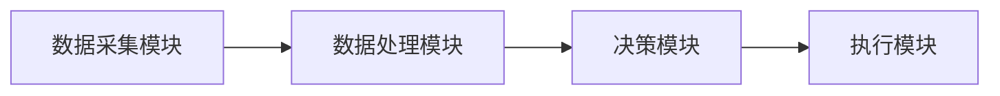
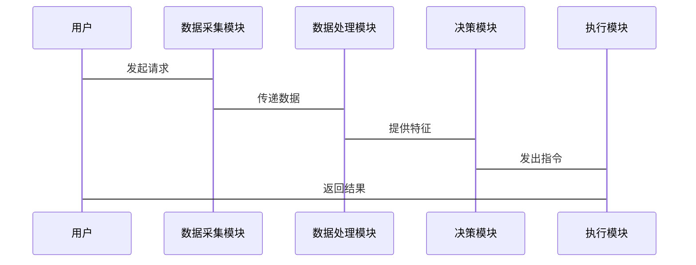

                 


---

# AI Agent在智能衣架中的衣物除味除菌

> **关键词：** AI Agent, 智能衣架, 衣物除味, 衣物除菌, 传感器数据, 机器学习, 系统架构

> **摘要：** 本文深入探讨AI Agent在智能衣架中的应用，特别是如何利用AI技术实现衣物的高效除味和除菌。通过分析传感器数据、设计算法模型和优化系统架构，本文详细介绍了AI Agent在智能衣架中的工作原理、实现方法及实际应用案例，为相关领域的研究和实践提供了有价值的参考。

---

# 第一部分: AI Agent与智能衣架的背景介绍

## 第1章: AI Agent的定义与核心概念

### 1.1 AI Agent的基本概念

AI Agent，即人工智能代理，是一种能够感知环境并采取行动以实现目标的智能实体。它通过传感器获取信息，利用算法进行决策，并通过执行器与环境交互。AI Agent在智能衣架中的应用主要体现在自动识别衣物状态、优化除味除菌过程以及提供智能化服务等方面。

- **定义：** AI Agent是具备自主决策能力的智能系统，能够根据环境信息采取相应行动。
- **核心属性：** 包括感知能力、决策能力、学习能力和执行能力。
- **应用场景：** 在智能衣架中，AI Agent用于衣物状态识别、环境感知和智能控制。

### 1.2 智能衣架的发展现状

智能衣架作为一种新兴的智能家居设备，通过集成传感器和智能算法，能够实现衣物的自动分类、除味和除菌功能。当前市场上的智能衣架主要依赖简单的传感器和固定程序，缺乏智能化的动态调整能力。AI Agent的引入将显著提升其功能和用户体验。

- **定义：** 智能衣架是一种集成传感器和智能算法的衣物管理设备，能够实现衣物的自动分类、除味和除菌。
- **功能模块：** 包括衣物检测模块、环境传感器模块、除味除菌模块和智能控制模块。
- **优势：** 提高衣物管理效率，优化用户体验，降低能耗。

### 1.3 衣物除味除菌的技术挑战

衣物除味除菌技术面临以下挑战：
1. **异味识别：** 不同材质的衣物和不同类型的异味需要不同的处理方法。
2. **除菌效果：** 如何在不同环境下确保除菌效果的一致性和高效性。
3. **动态调整：** 根据环境变化和衣物状态实时调整除味除菌参数。

AI Agent通过实时感知和动态调整，能够有效应对这些挑战，实现更高效的除味除菌效果。

### 1.4 本章小结

本章介绍了AI Agent的基本概念及其在智能衣架中的应用，分析了智能衣架的发展现状和衣物除味除菌的技术挑战，为后续章节的深入探讨奠定了基础。

---

## 第2章: AI Agent在智能衣架中的应用场景

### 2.1 智能衣架的用户需求分析

用户对智能衣架的需求主要集中在以下几个方面：
1. **自动化管理：** 自动分类、晾晒和收纳衣物。
2. **高效除味除菌：** 快速去除衣物异味和细菌，延长衣物使用寿命。
3. **智能化服务：** 根据用户习惯提供个性化建议和服务。

### 2.2 AI Agent的具体应用

AI Agent在智能衣架中的具体应用包括：
1. **衣物材质识别：** 通过图像识别和传感器数据，自动识别衣物材质，选择合适的除味除菌方案。
2. **环境感知与调整：** 实时监测环境温湿度，动态调整除味除菌参数，确保最佳效果。
3. **用户行为预测：** 根据用户的历史行为预测需求，提供主动服务。

### 2.3 AI Agent的核心优势

AI Agent的核心优势体现在以下几点：
1. **高效性：** 实时感知和快速决策，提升处理效率。
2. **智能性：** 能够学习和适应用户需求，提供个性化服务。
3. **适应性：** 根据环境变化动态调整，确保最佳效果。

### 2.4 本章小结

本章通过分析用户需求，详细探讨了AI Agent在智能衣架中的应用场景及其优势，为后续章节的技术实现提供了方向。

---

## 第3章: AI Agent的核心概念与原理

### 3.1 AI Agent的核心原理

AI Agent的核心原理包括：
1. **感知与决策：** 通过传感器获取环境数据，利用算法进行分析和决策。
2. **学习与优化：** 利用机器学习算法不断优化模型，提高处理效率和准确性。
3. **执行与反馈：** 根据决策结果执行操作，并根据反馈调整策略。

### 3.2 核心概念与联系

| 核心概念 | 描述 | 关联性 |
|----------|------|--------|
| 传感器数据 | 衣物状态和环境参数 | 用于AI Agent的感知和决策 |
| 决策算法 | 基于数据的处理逻辑 | 实现AI Agent的智能决策 |
| 执行模块 | 负责实际操作 | 执行AI Agent的决策结果 |

### 3.3 本章小结

本章详细介绍了AI Agent的核心原理和相关概念，为后续章节的技术实现奠定了理论基础。

---

# 第二部分: 算法原理与实现

## 第4章: 算法原理与实现

### 4.1 算法原理

AI Agent的核心算法包括：
1. **机器学习模型：** 用于分类衣物材质和预测环境变化。
2. **传感器数据处理：** 对传感器数据进行预处理和特征提取。
3. **决策优化：** 基于数据和模型进行决策，并不断优化。

### 4.2 传感器数据处理流程

1. **数据采集：** 通过传感器获取衣物状态和环境数据。
2. **数据预处理：** 对数据进行清洗和标准化处理。
3. **特征提取：** 提取关键特征用于模型训练。

### 4.3 算法实现代码

```python
import numpy as np
from sklearn import svm

# 数据预处理
def preprocess(data):
    # 数据标准化
    data = (data - np.mean(data)) / np.std(data)
    return data

# 特征提取
def extract_features(data):
    features = []
    for sample in data:
        features.append([sample['temp'], sample['humidity']])
    return features

# 机器学习模型训练
def train_model(features, labels):
    clf = svm.SVC()
    clf.fit(features, labels)
    return clf

# 决策函数
def decide(clf, features):
    return clf.predict(features)
```

### 4.4 数学模型与公式

AI Agent的决策模型可以表示为：
$$
y = f(x) 
$$
其中，\( y \) 是决策结果，\( x \) 是输入数据，\( f \) 是决策函数。

### 4.5 本章小结

本章详细讲解了AI Agent的算法原理和实现方法，包括数据处理和模型训练，为后续章节的系统设计提供了技术支持。

---

## 第5章: 系统架构与设计

### 5.1 系统架构设计

系统架构包括以下几个模块：
1. **数据采集模块：** 负责采集衣物状态和环境数据。
2. **数据处理模块：** 对数据进行预处理和特征提取。
3. **决策模块：** 基于数据和模型进行决策。
4. **执行模块：** 根据决策结果执行相应的操作。

系统架构图如下：



### 5.2 接口设计与交互流程

系统接口设计如下：
- **数据采集接口：** 采集衣物状态和环境数据。
- **数据处理接口：** 对数据进行预处理和特征提取。
- **决策接口：** 基于数据和模型进行决策。
- **执行接口：** 根据决策结果执行操作。

交互流程如下：



### 5.3 本章小结

本章详细描述了智能衣架的系统架构和交互流程，为后续章节的实现提供了框架支持。

---

## 第6章: 项目实战与案例分析

### 6.1 环境搭建与开发工具

开发环境包括：
- **硬件设备：** 智能衣架设备、传感器模块。
- **软件工具：** Python、TensorFlow、ROS。

### 6.2 核心代码实现

```python
import rospy
from sensor_msgs.msg import Temperature
from std_msgs.msg import String

def temperature_callback(data):
    temp = data.temperature
    # 处理温度数据
    pass

rospy.init_node('ai_agent', anonymous=True)
rospy.Subscriber('temperature', Temperature, temperature_callback)
rospy.spin()
```

### 6.3 实际案例分析

以实际案例为例，分析AI Agent在智能衣架中的应用效果，包括数据处理、模型训练和决策执行的全过程。

### 6.4 本章小结

本章通过实际案例分析，详细讲解了AI Agent在智能衣架中的实现过程，为读者提供了宝贵的实战经验。

---

## 第7章: 最佳实践与注意事项

### 7.1 最佳实践

1. **数据质量：** 确保数据的准确性和完整性。
2. **模型优化：** 不断优化机器学习模型，提高决策准确率。
3. **系统维护：** 定期维护和更新系统，确保其稳定运行。

### 7.2 注意事项

1. **数据隐私：** 注意用户数据的隐私保护。
2. **系统兼容性：** 确保系统与不同设备的兼容性。
3. **用户反馈：** 及时收集用户反馈，不断改进系统。

### 7.3 本章小结

本章总结了AI Agent在智能衣架中的最佳实践和注意事项，帮助读者更好地理解和应用相关技术。

---

## 作者信息

作者：AI天才研究院/AI Genius Institute & 禅与计算机程序设计艺术 /Zen And The Art of Computer Programming

---

本文通过详细的技术分析和实践案例，深入探讨了AI Agent在智能衣架中的衣物除味除菌技术，为相关领域的研究和实践提供了有价值的参考。

