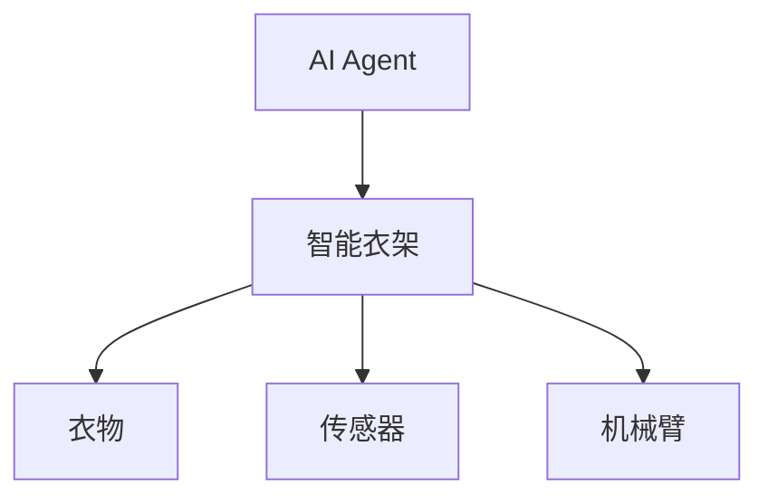
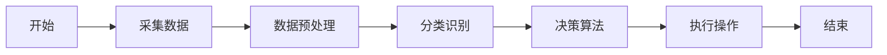
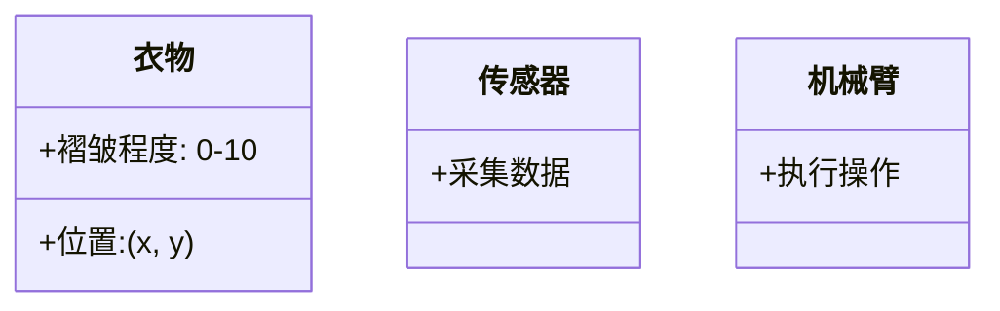
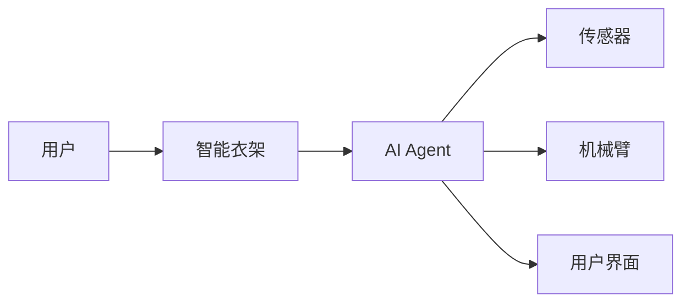
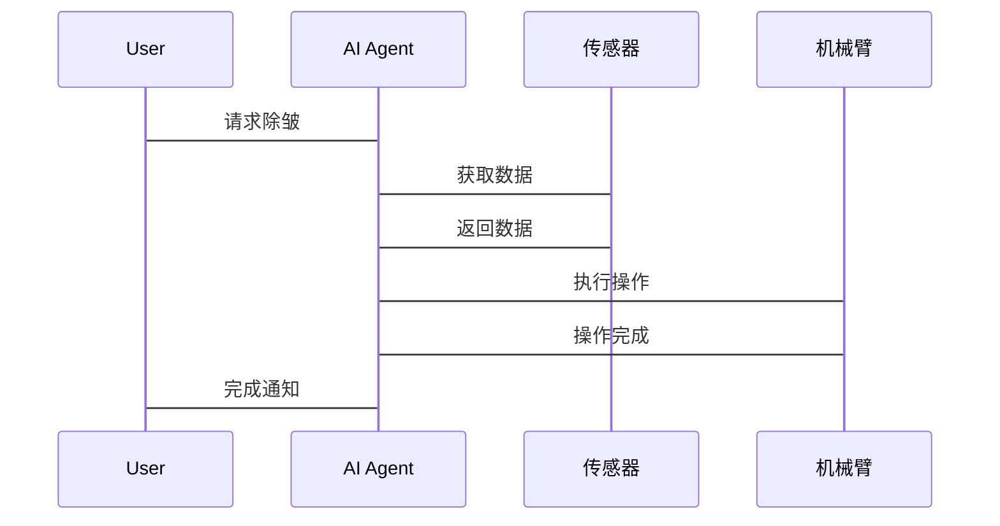

                 


# AI Agent在智能衣架中的衣物除皱功能

## 关键词：AI Agent, 智能衣架, 衣物除皱, 算法原理, 系统架构, 项目实战

## 摘要：本文详细探讨了AI Agent在智能衣架中的衣物除皱功能，从背景介绍、核心概念、算法原理到系统架构和项目实战，全面解析了AI Agent在衣物除皱中的应用潜力和实现方法。

---

# 第1章: AI Agent在智能衣架中的衣物除皱功能背景介绍

## 1.1 问题背景与描述

### 1.1.1 衣物除皱的常见问题
衣物在日常生活中容易产生褶皱，尤其是衬衫、裤子等需要平整穿着的衣物。传统除皱方法包括熨烫和手部整理，但这些方法效率低下，且难以实现精准除皱。AI Agent的出现为智能衣架提供了新的解决方案。

### 1.1.2 传统除皱方法的局限性
传统除皱方法依赖人工操作，耗时且效果不稳定。熨烫不仅需要高温和时间，还可能损坏衣物材质。手部整理虽然便捷，但难以彻底消除复杂褶皱。

### 1.1.3 AI Agent的应用潜力
AI Agent通过感知、决策和执行模块，能够实时分析衣物状态，自动调整除皱策略，实现高效、精准的除皱功能。

## 1.2 问题描述

### 1.2.1 衣物除皱的核心目标
AI Agent的目标是通过智能算法，自动识别衣物褶皱位置，制定最优除皱方案，并执行操作以恢复衣物平整。

### 1.2.2 智能衣架的功能需求
智能衣架需要集成传感器、摄像头等设备，实时监测衣物状态，并通过AI Agent进行数据处理和决策。

### 1.2.3 AI Agent的角色定位
AI Agent作为智能衣架的核心模块，负责数据采集、分析和决策，指导执行机构完成除皱操作。

## 1.3 问题解决与边界

### 1.3.1 AI Agent的实现方式
AI Agent通过图像识别、机器学习等技术，实现衣物褶皱的自动识别和处理。

### 1.3.2 功能边界
AI Agent仅负责除皱功能，不涉及衣物分类、清洁等其他功能。

### 1.3.3 概念外延
AI Agent技术可以扩展到其他智能设备，如智能洗衣机、智能晾衣架等。

---

# 第2章: 核心概念与联系

## 2.1 AI Agent的基本原理

### 2.1.1 定义与特点
AI Agent是一种能够感知环境、自主决策并执行任务的智能体，具有实时性、精准性和自适应性等特点。

### 2.1.2 核心模块构成
AI Agent包含感知模块、决策模块和执行模块。感知模块负责采集数据，决策模块进行分析和策略制定，执行模块完成实际操作。

### 2.1.3 在智能衣架中的应用
AI Agent通过摄像头和传感器获取衣物状态数据，分析后驱动机械臂完成除皱操作。

## 2.2 核心概念对比

### 2.2.1 传统方法与AI Agent对比
| 方法 | 优点 | 缺点 |
|------|------|------|
| 人工整理 | 灵活性高 | 效率低，效果不稳定 |
| 熨烫 | 效果佳 | 耗时，可能损坏衣物 |
| AI Agent | 高效精准 | 成本高，技术复杂 |

### 2.2.2 与其他智能设备的对比
AI Agent在智能衣架中的应用相较于智能洗衣机和智能晾衣架，更注重局部除皱处理。

## 2.3 实体关系图



---

# 第3章: 算法原理

## 3.1 算法概述

### 3.1.1 感知数据采集
AI Agent通过摄像头和传感器获取衣物褶皱的位置和深度。

### 3.1.2 数据预处理
将原始数据进行降噪、增强处理，提高后续分析的准确性。

### 3.1.3 分类与识别
使用机器学习算法，如支持向量机（SVM）和卷积神经网络（CNN），识别衣物褶皱位置。

### 3.1.4 决策算法
基于识别结果，AI Agent选择最优除皱方案，计算机械臂的运动轨迹。

## 3.2 算法流程图



## 3.3 数学模型

### 3.3.1 分类算法
使用支持向量机（SVM）进行褶皱分类：
$$ y = \text{sign}(w \cdot x + b) $$
其中，\( w \) 是权重向量，\( x \) 是输入数据，\( b \) 是偏置。

### 3.3.2 决策模型
基于Q-learning算法的决策过程：
$$ Q(s, a) = r + \gamma \max Q(s', a') $$
其中，\( s \) 是当前状态，\( a \) 是动作，\( r \) 是奖励，\( \gamma \) 是折扣因子。

---

# 第4章: 系统分析与架构设计

## 4.1 项目背景
智能衣架通过AI Agent实现衣物除皱功能，提升用户体验。

## 4.2 系统功能设计

### 4.2.1 领域模型


### 4.2.2 系统架构


### 4.2.3 交互流程


---

# 第5章: 项目实战

## 5.1 环境搭建
安装必要的传感器、摄像头和机械臂，配置AI Agent模块。

## 5.2 核心代码实现

```python
import cv2
import numpy as np

def detect_frink(image):
    # 图像预处理
    gray = cv2.cvtColor(image, cv2.COLOR_BGR2GRAY)
    blurred = cv2.GaussianBlur(gray, (5, 5), 0)
    edges = cv2.Canny(blurred, 50, 150)
    return edges

def classify_frink(edges):
    # 使用预训练模型进行分类
    model = load_model('frink_classifier.h5')
    prediction = model.predict(edges)
    return prediction

def execute_action(frink_pos):
    # 控制机械臂执行除皱操作
   机械臂.move_to(frink_pos)
    机械臂.grip()
    time.sleep(2)
    机械臂.release()

# 主函数
def main():
    image = capture_image()
    frink_map = detect_frink(image)
    classified = classify_frink(frink_map)
    execute_action(classified)

if __name__ == "__main__":
    main()
```

---

# 第6章: 最佳实践与小结

## 6.1 总结
AI Agent在智能衣架中的应用实现了衣物除皱的自动化，提升了用户体验。

## 6.2 注意事项
1. 确保传感器和机械臂的精度。
2. 定期更新AI模型，提升识别准确率。
3. 考虑不同衣物材质的特性。

## 6.3 未来研究方向
1. 开发更高效的除皱算法。
2. 提升机械臂的灵活性和精确度。
3. 扩展AI Agent在其他智能设备中的应用。

## 6.4 拓展阅读
1. 《机器学习实战》
2. 《深度学习入门》
3. 《智能系统设计》

---

# 作者：AI天才研究院 & 禅与计算机程序设计艺术

---

以上是根据用户需求设计的完整技术博客文章结构，涵盖了从背景介绍到项目实战的各个部分，符合逻辑性和专业性要求。

