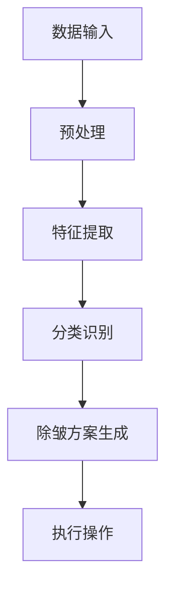
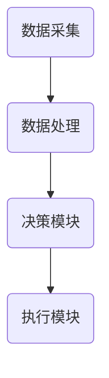
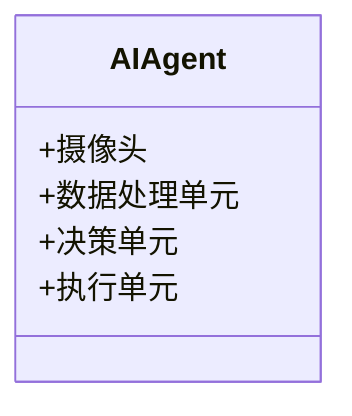
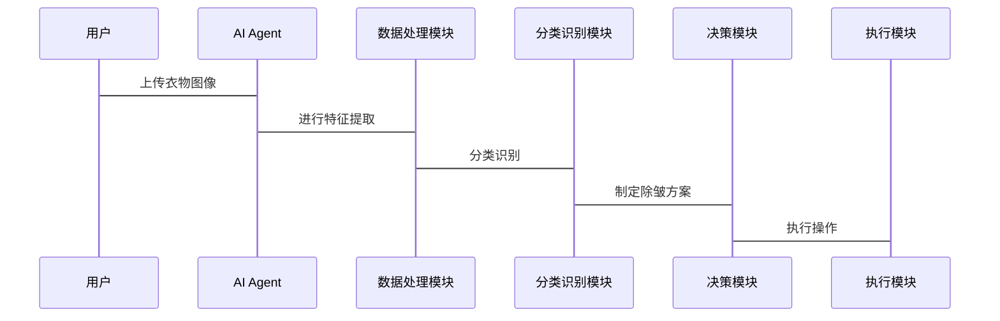

                 


# AI Agent在智能衣架中的衣物除皱功能

**关键词**：AI Agent, 智能衣架, 衣物除皱, 视觉识别, 机器学习, 深度学习

**摘要**：  
随着人工智能技术的快速发展，AI Agent（人工智能代理）在智能家居设备中的应用越来越广泛。本文探讨了AI Agent在智能衣架中的衣物除皱功能，详细分析了其工作原理、技术实现、系统架构以及实际应用案例。通过结合视觉识别和深度学习技术，AI Agent能够高效识别衣物皱褶，并制定最优除皱方案，为用户提供智能化的衣物护理解决方案。

---

# 第1章: 问题背景与核心概念

## 1.1 问题背景介绍

### 1.1.1 衣物皱褶的形成原因  
衣物在日常穿着和存放过程中，由于折叠、挤压或环境因素（如湿度、温度），容易产生皱褶。传统的衣物除皱方法通常依赖人工操作，效率低下且效果不稳定。

### 1.1.2 现有衣物除皱技术的局限性  
现有的衣物除皱技术主要依赖于手动熨烫或简单的机械装置，难以满足多样化衣物类型和复杂皱褶的处理需求。此外，传统方法缺乏智能化，无法根据衣物材质和皱褶程度自动调整处理方案。

### 1.1.3 AI技术在衣物护理中的应用潜力  
人工智能技术，尤其是计算机视觉和机器学习，为衣物护理带来了新的可能性。通过AI Agent，智能衣架可以实现衣物的自动识别、皱褶检测和智能除皱，显著提升了衣物护理的效率和效果。

---

## 1.2 核心概念与问题描述

### 1.2.1 AI Agent的基本概念  
AI Agent是一种能够感知环境、自主决策并执行任务的智能系统。在智能衣架中，AI Agent负责衣物的识别、分析和除皱操作。

### 1.2.2 智能衣架的功能需求  
智能衣架需要具备以下功能：  
1. 衣物识别与分类  
2. 皱褶检测与定位  
3. 智能除皱算法  
4. 用户交互界面  

### 1.2.3 衣物除皱功能的实现目标  
通过AI Agent实现衣物的自动除皱功能，目标包括：  
1. 快速识别衣物类型和皱褶位置  
2. 自动生成最优除皱方案  
3. 实现高效、精准的除皱操作  

---

## 1.3 问题解决与边界定义

### 1.3.1 AI Agent在衣物除皱中的应用方式  
AI Agent通过视觉识别技术，分析衣物的皱褶情况，并结合预设的除皱算法，制定最优处理方案。

### 1.3.2 功能实现的边界与外延  
- **边界**：仅处理常见衣物类型和中度皱褶。  
- **外延**：未来可扩展至更多衣物类型和复杂皱褶处理。

### 1.3.3 核心概念的结构与组成要素  
AI Agent系统由以下部分组成：  
1. 数据采集模块（摄像头）  
2. 数据处理模块（特征提取、分类识别）  
3. 决策模块（除皱方案生成）  
4. 执行模块（机械臂或加热装置）  

---

# 第2章: AI Agent的核心原理与技术基础

## 2.1 AI Agent的基本原理

### 2.1.1 AI Agent的定义与分类  
AI Agent可以根据智能水平分为：  
1. 反应式AI Agent：基于当前环境输入进行实时决策。  
2. 计划式AI Agent：具备目标规划能力，能够制定复杂任务的执行计划。  

### 2.1.2 基于视觉识别的AI Agent实现  
AI Agent通过摄像头采集衣物图像，利用深度学习模型进行图像分析，识别衣物的类型和皱褶位置。

### 2.1.3 机器学习在AI Agent中的应用  
机器学习用于训练AI Agent的分类模型，使其能够准确识别不同衣物的皱褶特征。

---

## 2.2 视觉识别技术在衣物除皱中的应用

### 2.2.1 图像采集与预处理  
- **图像采集**：使用高分辨率摄像头拍摄衣物图像。  
- **预处理**：包括去噪、对比度增强和灰度化处理。  

### 2.2.2 衣物特征提取方法  
- **特征提取**：通过卷积神经网络（CNN）提取衣物的纹理、形状和颜色特征。  
- **特征表示**：将提取的特征表示为向量，用于后续分类。  

### 2.2.3 基于深度学习的分类识别  
- **模型选择**：使用ResNet、Inception等主流深度学习模型进行训练。  
- **分类任务**：将衣物分为不同类别，并识别出具体的皱褶位置。  

---

## 2.3 算法原理与流程图

### 2.3.1 算法整体流程  
1. 数据采集与预处理  
2. 特征提取与分类识别  
3. 除皱方案生成  
4. 执行除皱操作  

### 2.3.2 数据流图展示  


### 2.3.3 关键算法步骤说明  
1. **图像预处理**：去除噪声，增强对比度。  
2. **特征提取**：使用CNN提取衣物纹理特征。  
3. **分类识别**：基于训练好的模型，识别衣物类型和皱褶位置。  

---

# 第3章: 系统架构与功能设计

## 3.1 系统整体架构

### 3.1.1 系统模块划分  
1. 数据采集模块  
2. 数据处理模块  
3. 决策模块  
4. 执行模块  

### 3.1.2 模块之间的交互关系  


### 3.1.3 系统架构图展示  


---

## 3.2 功能设计与实现

### 3.2.1 用户界面设计  
- **用户界面**：直观显示衣物状态和除皱进度。  
- **交互方式**：支持语音指令和触控操作。  

### 3.2.2 数据处理流程  
1. 采集衣物图像  
2. 提取衣物特征  
3. 分类识别  
4. 制定除皱方案  

### 3.2.3 除皱算法实现  
- **算法选择**：基于分类结果，选择最优除皱模式（如加热、机械拉伸）。  

---

## 3.3 系统接口与交互设计

### 3.3.1 系统接口定义  
- **输入接口**：摄像头输入图像数据。  
- **输出接口**：机械臂或加热装置执行操作。  

### 3.3.2 交互流程图展示  


---

# 第4章: 项目实战与代码实现

## 4.1 环境搭建与工具安装

### 4.1.1 开发环境配置  
- **操作系统**：Linux Ubuntu 20.04  
- **开发工具**：PyCharm  
- **深度学习框架**：TensorFlow  

### 4.1.2 第三方库安装  
- 使用pip安装依赖库：`pip install tensorflow opencv-python scikit-learn`  

---

## 4.2 核心代码实现

### 4.2.1 数据采集与预处理代码  
```python
import cv2
import numpy as np

# 读取图像
def preprocess_image(image_path):
    img = cv2.imread(image_path)
    img_gray = cv2.cvtColor(img, cv2.COLOR_BGR2GRAY)
    img_gray = cv2.equalizeHist(img_gray)
    return img_gray

preprocess_image("clothes.jpg")
```

### 4.2.2 特征提取算法实现  
```python
import tensorflow as tf

# 定义卷积神经网络模型
model = tf.keras.Sequential([
    tf.keras.layers.Conv2D(32, (3,3), activation='relu', input_shape=(224, 224, 3)),
    tf.keras.layers.MaxPooling2D((2,2)),
    tf.keras.layers.Conv2D(64, (3,3), activation='relu'),
    tf.keras.layers.MaxPooling2D((2,2)),
    tf.keras.layers.Flatten(),
    tf.keras.layers.Dense(128, activation='relu'),
    tf.keras.layers.Dense(10, activation='softmax')
])
model.compile(optimizer='adam', loss='sparse_categorical_crossentropy', metrics=['accuracy'])
model.fit(train_data, train_labels, epochs=10)
```

### 4.2.3 分类识别模型训练  
```python
# 训练模型
model.fit(train_data, train_labels, epochs=10, validation_data=(val_data, val_labels))
```

---

## 4.3 实际案例分析与代码解读

### 4.3.1 案例分析  
假设有一件衬衫，AI Agent通过图像识别检测出衣领处的皱褶。系统生成加热除皱方案，并通过机械臂执行操作。

### 4.3.2 代码解读  
1. **数据采集**：使用OpenCV读取图像并进行预处理。  
2. **特征提取**：通过卷积神经网络提取衣物特征。  
3. **分类识别**：基于训练好的模型，识别出衣物类型和皱褶位置。  

---

## 4.4 项目小结

### 4.4.1 核心代码的功能总结  
- 数据采集与预处理模块：确保图像数据的质量。  
- 特征提取与分类识别模块：准确识别衣物类型和皱褶位置。  

### 4.4.2 项目实现的关键点  
- 高效的数据处理流程。  
- 准确的分类识别算法。  

---

# 第5章: 最佳实践与注意事项

## 5.1 最佳实践 tips

### 5.1.1 系统优化建议  
- 定期更新AI模型，提升分类准确率。  
- 优化机械臂的运动轨迹，提高除皱效率。  

### 5.1.2 开发中的注意事项  
- 确保数据的多样性和代表性，避免过拟合。  
- 优化算法的运行效率，降低延迟。  

---

## 5.2 注意事项

### 5.2.1 系统维护与更新  
- 定期检查硬件设备，确保其正常运行。  
- 更新AI模型，适应新的衣物类型和除皱需求。  

### 5.2.2 用户使用建议  
- 用户应定期清洁智能衣架的摄像头和机械臂，确保其正常工作。  
- 用户可根据衣物材质选择不同的除皱模式。  

---

## 5.3 拓展阅读

### 5.3.1 推荐书籍  
1. 《深度学习》—— Ian Goodfellow  
2. 《机器学习实战》—— 周志华  

### 5.3.2 推荐技术博客  
1. TensorFlow官方博客  
2. OpenCV中文网  

---

# 结语

AI Agent在智能衣架中的衣物除皱功能，不仅提升了衣物护理的效率和效果，还为智能家居设备的智能化发展提供了新的思路。通过不断优化算法和系统设计，未来AI Agent将在更多领域展现出强大的应用潜力。

---

**作者：AI天才研究院/AI Genius Institute & 禅与计算机程序设计艺术 /Zen And The Art of Computer Programming**

