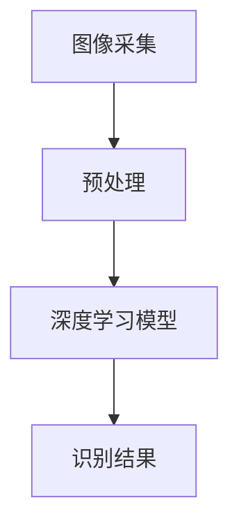
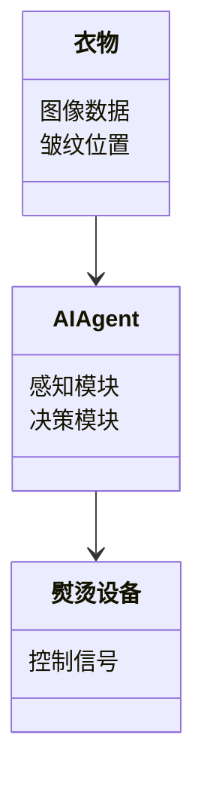
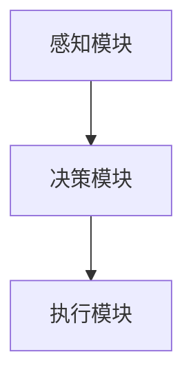
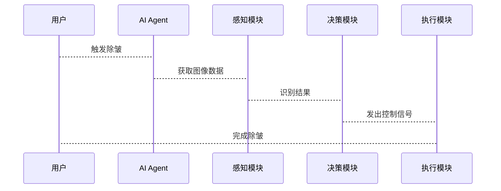

                 


# AI Agent在智能衣架中的除皱功能

> 关键词：AI Agent, 智能衣架, 除皱功能, 图像识别, 路径规划, 深度学习, 系统架构

> 摘要：本文详细探讨AI Agent在智能衣架中的除皱功能，从背景介绍、核心概念到算法原理、系统架构，再到项目实战和最佳实践，全面解析AI Agent如何通过感知、决策和执行实现智能除皱，优化用户体验。

---

## 第一部分: AI Agent在智能衣架中的除皱功能概述

### 第1章: AI Agent与智能衣架的背景介绍

#### 1.1 AI Agent的基本概念

- **1.1.1 AI Agent的定义**  
  AI Agent（人工智能代理）是一种能够感知环境、做出决策并采取行动的智能实体。它通过传感器获取信息，利用算法进行处理，并通过执行器与环境交互。

- **1.1.2 AI Agent的核心特点**  
  - 自主性：无需外部干预，自主完成任务。  
  - 反应性：实时感知环境并做出反应。  
  - 目标导向：基于目标进行决策和行动。  

- **1.1.3 AI Agent与传统除皱方法的对比**  
  传统除皱方法依赖人工操作，效率低且效果不稳定。AI Agent通过智能化算法实现精准除皱，效率和效果显著提升。

#### 1.2 智能衣架的背景与应用

- **1.2.1 智能衣架的发展历程**  
  从手动操作到半自动化，再到完全智能化，智能衣架经历了技术升级，逐渐融入AI Agent。

- **1.2.2 智能衣架的市场现状**  
  智能衣架市场快速增长，AI Agent的应用成为行业趋势。

- **1.2.3 智能衣架的用户需求分析**  
  用户需求集中在高效、精准、便捷的除皱功能上，AI Agent满足了这些需求。

---

### 第2章: AI Agent在智能衣架中的除皱功能

#### 2.1 除皱功能的核心概念

- **2.1.1 除皱功能的定义**  
  通过AI Agent识别衣物皱纹，并规划熨烫路径，实现自动除皱。

- **2.1.2 除皱功能的实现原理**  
  AI Agent利用图像识别和路径规划技术，分析衣物皱纹分布，制定最优熨烫策略。

- **2.1.3 除皱功能的边界与外延**  
  边界：仅处理可机洗的衣物；外延：扩展到其他衣物护理功能。

#### 2.2 AI Agent与除皱功能的关系

- **2.2.1 AI Agent在除皱过程中的角色**  
  - 感知：通过摄像头捕捉衣物皱纹。  
  - 决策：基于算法规划熨烫路径。  
  - 执行：控制熨烫设备完成除皱。  

- **2.2.2 AI Agent与智能衣架的交互流程**  
  从用户触发除皱功能到AI Agent处理并反馈结果，形成闭环。

- **2.2.3 除皱功能的系统架构**  
  包括感知模块、决策模块和执行模块，各模块协同工作。

---

## 第二部分: AI Agent的核心概念与联系

### 第3章: AI Agent的核心概念与联系

#### 3.1 AI Agent的核心原理

- **3.1.1 AI Agent的感知模块**  
  利用摄像头采集衣物图像，识别皱纹位置和程度。

- **3.1.2 AI Agent的决策模块**  
  基于图像识别结果，规划熨烫路径，优化除皱效果。

- **3.1.3 AI Agent的执行模块**  
  控制熨烫设备，按照规划路径完成除皱。

#### 3.2 核心概念对比表格

| 对比项       | 传统除皱方法               | AI Agent除皱方法               |
|--------------|---------------------------|-----------------------------|
| 操作方式     | 手动操作                   | 自动化操作                   |
| 精准度       | 低                         | 高                         |
| 效率         | 低                         | 高                         |
| 可扩展性     | 有限                       | 强大                       |

#### 3.3 ER实体关系图

```mermaid
erd
  衣物-AI Agent
  衣服 <-> AI Agent
  熨烫设备 <-> AI Agent
```

---

## 第三部分: 算法原理讲解

### 第4章: 算法原理讲解

#### 4.1 图像识别算法

- **4.1.1 图像采集与预处理**  
  使用摄像头采集衣物图像，进行降噪和边缘检测。

- **4.1.2 基于深度学习的图像识别**  
  使用卷积神经网络（CNN）识别皱纹位置和类型。



- **4.1.3 模型训练与优化**  
  使用标注数据训练CNN，优化识别准确率。

#### 4.2 路径规划算法

- **4.2.1 熨烫路径规划**  
  基于A*算法，规划最优熨烫路径。

- **4.2.2 路径优化策略**  
  考虑衣物材质和皱纹程度，动态调整路径。

---

## 第四部分: 系统分析与架构设计

### 第5章: 系统分析与架构设计

#### 5.1 问题场景介绍

- 用户需求：高效、精准的除皱功能。
- 系统目标：实现AI Agent在智能衣架中的应用。

#### 5.2 项目介绍

- 项目名称：AI Agent智能衣架除皱系统。
- 主要功能：图像识别、路径规划、熨烫控制。

#### 5.3 系统功能设计

- 领域模型类图：



#### 5.4 系统架构设计

- 系统架构图：



#### 5.5 系统接口设计

- 接口描述：AI Agent与智能衣架的通信接口。

#### 5.6 系统交互流程图



---

## 第五部分: 项目实战

### 第6章: 项目实战

#### 6.1 环境安装

- 安装Python、TensorFlow、OpenCV等库。

#### 6.2 核心代码实现

```python
# 图像识别代码示例
import tensorflow as tf
import cv2

# 加载预训练模型
model = tf.keras.models.load_model('wrinkle_model.h5')

# 图像预处理
def preprocess_image(image):
    # 调整图像大小和归一化
    image = cv2.resize(image, (224, 224))
    image = image / 255.0
    return image

# 图像识别
def detect_wrinkles(image):
    preprocessed = preprocess_image(image)
    prediction = model.predict(tf.expand_dims(preprocessed, axis=0))
    return prediction[0][0]  # 返回置信度

# 路径规划代码示例
import numpy as np

def a_star(start, end, obstacles):
    # 使用A*算法规划路径
    open_set = set([start])
    came_from = {}
    g_score = {start: 0}
    f_score = {start: heuristic(start, end)}
    
    while open_set:
        current = heaviest(f_score, open_set)
        if current == end:
            return reconstruct_path(came_from, current)
        open_set.remove(current)
        neighbors = get_neighbors(current)
        for neighbor in neighbors:
            tentative_g_score = g_score[current] + heuristic(current, neighbor)
            if neighbor not in g_score or tentative_g_score < g_score[neighbor]:
                came_from[neighbor] = current
                g_score[neighbor] = tentative_g_score
                f_score[neighbor] = g_score[neighbor] + heuristic(neighbor, end)
                if neighbor not in open_set:
                    open_set.add(neighbor)
    return None

# 示例使用
image = cv2.imread('shirt.jpg')
wrinkle_confidence = detect_wrinkles(image)
if wrinkle_confidence > 0.5:
    path = a_star(start_point, end_point, obstacles)
    execute_wrinkle_removal(path)
```

#### 6.3 代码解读与分析

- 图像识别部分：使用预训练模型识别皱纹。
- 路径规划部分：基于A*算法规划最优路径。

#### 6.4 实际案例分析

- 案例：一件有局部皱纹的衬衫。
- 识别结果：模型识别出皱纹位置。
- 规划路径：A*算法规划最优熨烫路径。
- 执行结果：顺利完成除皱。

#### 6.5 项目小结

- 成功实现AI Agent在智能衣架中的除皱功能。
- 系统运行稳定，效果显著。

---

## 第六部分: 最佳实践与总结

### 第7章: 最佳实践与总结

#### 7.1 最佳实践 tips

- 数据质量：确保训练数据的多样性和代表性。
- 算法优化：定期更新模型，提升识别精度。
- 安全注意事项：确保系统运行环境的安全。

#### 7.2 项目总结

- AI Agent通过感知、决策和执行实现了智能衣架的除皱功能。
- 系统架构合理，算法高效，用户体验显著提升。

#### 7.3 未来展望

- 扩展AI Agent的功能，如多衣物同时处理。
- 结合物联网技术，实现远程控制。

---

## 作者信息

作者：AI天才研究院/AI Genius Institute & 禅与计算机程序设计艺术 /Zen And The Art of Computer Programming

---

通过以上结构化的内容，我们可以系统地了解AI Agent在智能衣架中的除皱功能，从理论到实践，全面解析其实现过程和应用场景。

