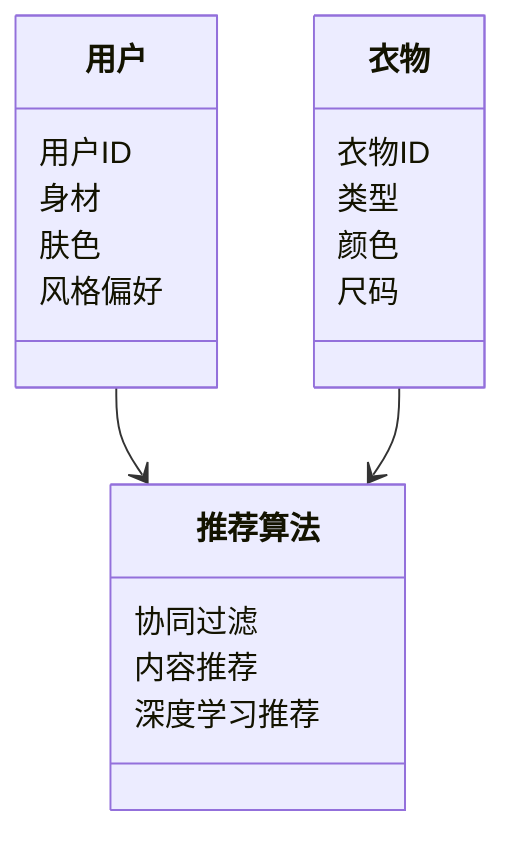
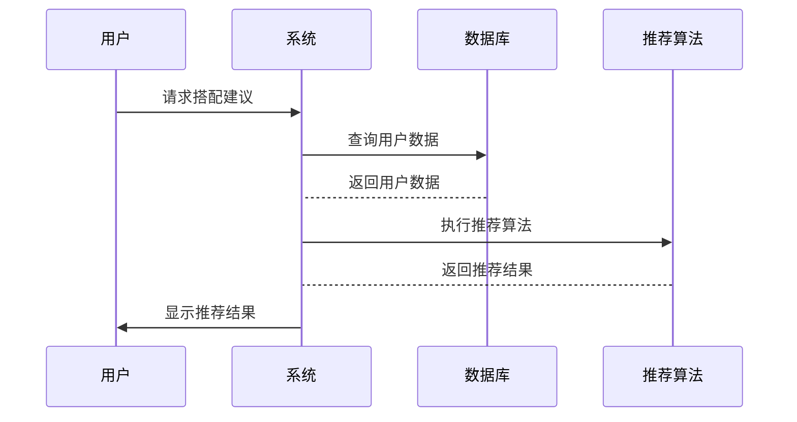

                 

# AI Agent在智能衣柜中的个人形象设计师

> **关键词**: AI Agent, 智能衣柜, 个人形象设计, 时尚推荐算法, 系统架构, 项目实战

> **摘要**: 本文详细探讨了AI Agent在智能衣柜中的应用，特别是作为个人形象设计师的功能。通过分析背景、核心概念、算法原理、系统架构、项目实战等，展示了如何利用AI技术提升个人形象设计的效率和准确性。本文还提供了实际案例和最佳实践，帮助读者更好地理解和应用相关技术。

---

## 第1章: 引言

### 1.1 问题背景

#### 1.1.1 传统衣柜管理的痛点
传统的衣柜管理方式存在诸多痛点，例如衣物数量庞大、搭配困难、风格不统一等。用户常常面临选择困难，难以快速找到合适的搭配。

#### 1.1.2 AI技术在时尚领域的应用潜力
随着AI技术的快速发展，AI在时尚领域的应用潜力巨大。通过AI技术，可以实现个性化的服装推荐和搭配建议，帮助用户提升形象设计的效率和质量。

#### 1.1.3 个人形象设计的重要性
个人形象设计不仅关乎美观，还影响用户的自信心和社交形象。通过AI Agent，用户可以更轻松地实现个性化形象设计，提升生活品质。

### 1.2 问题描述

#### 1.2.1 智能衣柜的核心目标
智能衣柜的核心目标是通过AI技术，为用户提供个性化的衣物管理和搭配建议，帮助用户优化形象设计。

#### 1.2.2 AI Agent在智能衣柜中的角色
AI Agent在智能衣柜中扮演着关键角色，负责数据处理、推荐算法、搭配建议生成等任务，为用户提供智能化的服务。

#### 1.2.3 用户需求与系统功能的结合
用户需求与系统功能的结合是智能衣柜设计的核心，通过AI技术实现用户需求的精准匹配，提升用户体验。

### 1.3 问题解决

#### 1.3.1 AI Agent如何优化个人形象设计
AI Agent通过分析用户的身材、肤色、风格偏好等信息，提供个性化的搭配建议，帮助用户优化形象设计。

#### 1.3.2 智能衣柜的实现路径
智能衣柜的实现路径包括数据采集、算法设计、系统集成等步骤，通过AI技术实现智能化管理。

#### 1.3.3 用户体验的提升策略
通过优化用户界面、增加互动功能、提升推荐算法的准确性，可以有效提升用户体验。

### 1.4 问题的边界与外延

#### 1.4.1 智能衣柜的功能边界
智能衣柜的功能边界包括衣物管理、搭配建议、推荐服务等，不涉及衣物的物理存储和维护。

#### 1.4.2 个人形象设计的适用范围
个人形象设计的适用范围广泛，适用于商务场合、社交活动、日常生活等不同场景。

#### 1.4.3 AI Agent的局限性与未来发展方向
AI Agent在智能衣柜中的应用仍存在一定的局限性，例如数据隐私问题、算法准确性等。未来发展方向包括提升算法精度、增强数据安全等。

### 1.5 概念结构与核心要素

#### 1.5.1 AI Agent的核心要素
AI Agent的核心要素包括数据采集、算法设计、用户交互等。

#### 1.5.2 智能衣柜的功能模块
智能衣柜的功能模块包括衣物管理、搭配建议、推荐服务等。

#### 1.5.3 个人形象设计的流程
个人形象设计的流程包括数据采集、风格识别、搭配建议生成等步骤。

---

## 第2章: AI Agent的核心概念与原理

### 2.1 AI Agent的基本原理

#### 2.1.1 AI Agent的定义与分类
AI Agent是指能够感知环境并采取行动以实现目标的智能体。根据功能和应用场景的不同，AI Agent可以分为多种类型。

#### 2.1.2 AI Agent的核心算法
AI Agent的核心算法包括监督学习、无监督学习、强化学习等。

#### 2.1.3 AI Agent的决策机制
AI Agent的决策机制通过分析环境信息和用户需求，生成相应的行动方案。

### 2.2 智能衣柜中的AI Agent

#### 2.2.1 AI Agent在智能衣柜中的应用场景
AI Agent在智能衣柜中的应用场景包括衣物推荐、搭配建议、风格识别等。

#### 2.2.2 AI Agent与用户交互的方式
AI Agent与用户交互的方式包括语音交互、视觉交互、文本交互等。

#### 2.2.3 AI Agent的数据处理流程
AI Agent的数据处理流程包括数据采集、数据清洗、特征提取、模型训练等步骤。

### 2.3 个人形象设计的AI算法

#### 2.3.1 基于AI的服装推荐算法
基于AI的服装推荐算法包括协同过滤、内容推荐、深度学习推荐等。

#### 2.3.2 基于AI的搭配建议生成算法
基于AI的搭配建议生成算法包括基于规则的搭配生成、基于图结构的搭配生成、基于强化学习的搭配生成等。

#### 2.3.3 基于AI的风格识别算法
基于AI的风格识别算法包括卷积神经网络、迁移学习等。

---

## 第3章: AI Agent在智能衣柜中的核心算法

### 3.1 推荐算法

#### 3.1.1 基于协同过滤的推荐算法
协同过滤是一种基于用户行为数据的推荐算法，通过分析用户的相似性，推荐相似用户的偏好物品。

#### 3.1.2 基于内容的推荐算法
基于内容的推荐算法通过分析物品的特征，推荐与当前物品相似的其他物品。

#### 3.1.3 基于深度学习的推荐算法
基于深度学习的推荐算法通过构建神经网络模型，学习用户和物品的深层特征，进行推荐。

### 3.2 搭配建议生成算法

#### 3.2.1 基于规则的搭配生成算法
基于规则的搭配生成算法通过预设的规则和约束，生成合理的搭配建议。

#### 3.2.2 基于图结构的搭配生成算法
基于图结构的搭配生成算法通过构建图结构，分析物品之间的关系，生成搭配建议。

#### 3.2.3 基于强化学习的搭配生成算法
基于强化学习的搭配生成算法通过学习奖励函数，优化搭配建议的生成过程。

### 3.3 风格识别算法

#### 3.3.1 基于卷积神经网络的风格识别
卷积神经网络（CNN）是一种常用的深度学习模型，可以用于图像分类和风格识别。

#### 3.3.2 基于迁移学习的风格识别
迁移学习是一种通过利用预训练模型的特征，进行目标任务的模型微调的技术。

---

## 第4章: 系统分析与架构设计

### 4.1 问题场景介绍

#### 4.1.1 项目背景
智能衣柜项目的背景是通过AI技术提升衣物管理和搭配建议的效率。

#### 4.1.2 项目目标
项目的总体目标是通过AI Agent实现智能化的衣物管理和搭配建议服务。

### 4.2 项目介绍

#### 4.2.1 项目核心功能
项目的核心功能包括衣物管理、搭配建议、推荐服务等。

#### 4.2.2 项目特点
项目的特点包括智能化、个性化、高效性等。

### 4.3 系统功能设计

#### 4.3.1 领域模型类图

#### 4.3.2 系统架构图

#### 4.3.3 系统接口设计
系统接口设计包括用户输入接口、数据接口、推荐算法接口等。

#### 4.3.4 系统交互序列图

---

## 第5章: 项目实战

### 5.1 环境安装

#### 5.1.1 系统要求
系统要求包括操作系统、硬件配置、软件依赖等。

#### 5.1.2 安装步骤
安装步骤包括安装Python、安装依赖库、配置开发环境等。

### 5.2 系统核心实现

#### 5.2.1 核心代码实现
核心代码实现包括推荐算法的实现、系统交互的实现、数据库的实现等。

#### 5.2.2 代码解读与分析
代码解读与分析包括对关键代码的解释和功能分析。

### 5.3 实际案例分析

#### 5.3.1 案例背景
案例背景包括用户的基本信息、需求描述等。

#### 5.3.2 案例分析
案例分析包括数据采集、算法执行、结果展示等步骤。

#### 5.3.3 案例结果
案例结果包括推荐结果、搭配建议、用户反馈等。

---

## 第6章: 最佳实践

### 6.1 小结

#### 6.1.1 核心知识点回顾
核心知识点包括AI Agent的基本原理、推荐算法、系统架构等。

#### 6.1.2 项目实现的关键点总结
项目实现的关键点包括数据处理、算法选择、系统设计等。

### 6.2 注意事项

#### 6.2.1 数据隐私问题
数据隐私问题是智能衣柜系统设计中的重要考虑因素。

#### 6.2.2 算法的可解释性
算法的可解释性是用户信任的重要因素。

#### 6.2.3 系统的可扩展性
系统的可扩展性是应对未来需求变化的重要保障。

### 6.3 拓展阅读

#### 6.3.1 相关领域的最新研究
相关领域的最新研究包括AI在时尚行业的应用、个性化推荐算法的进展等。

#### 6.3.2 未来发展方向
未来发展方向包括提升算法精度、增强数据安全、优化用户体验等。

---

## 作者：AI天才研究院/AI Genius Institute & 禅与计算机程序设计艺术 /Zen And The Art of Computer Programming

