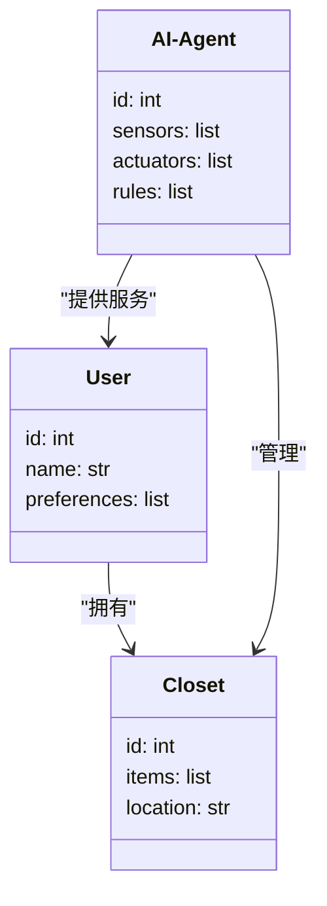
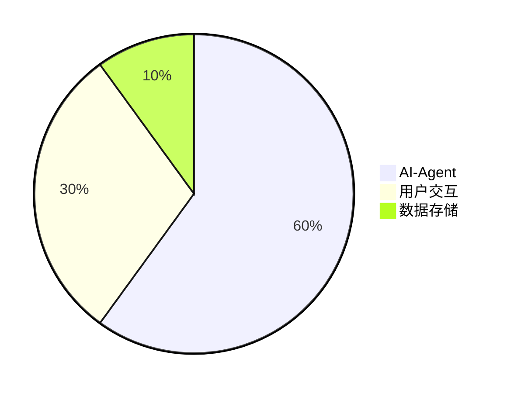
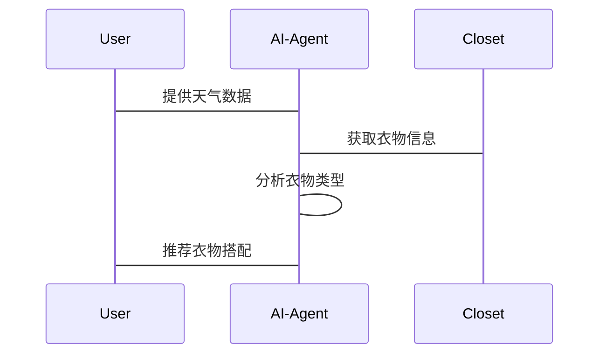

                 


# AI Agent在智能衣柜中的季节性整理建议

## 关键词：AI Agent, 智能衣柜, 季节性整理, 算法原理, 系统架构, 项目实战, 最佳实践

## 摘要：  
随着人工智能技术的快速发展，AI Agent（人工智能代理）在智能家居领域的应用越来越广泛。本文将探讨AI Agent如何在智能衣柜中实现季节性衣物的整理与管理。通过分析AI Agent的核心原理、算法实现、系统架构设计以及实际项目案例，本文旨在为读者提供一种全新的智能衣柜管理解决方案。文章从背景介绍、核心概念、算法原理、系统架构、项目实战到最佳实践，全面阐述AI Agent在智能衣柜中的应用价值和技术实现。

---

# 第一部分：AI Agent在智能衣柜中的背景与概念

## 第1章：AI Agent与智能衣柜的背景介绍

### 1.1 AI Agent的核心概念  
#### 1.1.1 AI Agent的定义  
AI Agent（人工智能代理）是一种能够感知环境、自主决策并执行任务的智能体。它通过与环境交互，主动完成特定目标，具有学习、推理和自适应能力。  

#### 1.1.2 AI Agent的特点  
- **自主性**：能够在没有外部干预的情况下自主运行。  
- **反应性**：能够实时感知环境并做出反应。  
- **目标导向性**：所有行为都围绕特定目标展开。  
- **社交能力**：能够与其他系统或用户进行交互。  

#### 1.1.3 AI Agent与传统AI的区别  
| 特性 | 传统AI | AI Agent |  
|------|--------|----------|  
| 行为驱动 | 基于规则或数据驱动 | 基于目标驱动 |  
| 交互能力 | 单向输出 | 双向交互 |  
| 自适应性 | 有限 | 强大 |  

---

### 1.2 智能衣柜的定义与应用  

#### 1.2.1 智能衣柜的定义  
智能衣柜是一种结合物联网技术和人工智能的智能家居设备，能够通过传感器、摄像头等设备感知衣物信息，并通过AI算法实现衣物分类、推荐和管理。  

#### 1.2.2 智能衣柜的功能与优势  
- **衣物分类**：基于颜色、材质、季节等因素自动分类衣物。  
- **智能推荐**：根据天气、用户习惯推荐衣物搭配。  
- **空间优化**：通过算法优化衣物存储空间，减少冗余。  
- **远程控制**：用户可通过手机APP远程管理衣柜。  

#### 1.2.3 智能衣柜的应用场景  
- **家庭使用**：帮助用户高效管理个人衣物。  
- **酒店业**：用于智能客房的衣物管理。  
- **零售业**：用于智能试衣间或衣物展示。  

---

### 1.3 季节性整理的背景与需求  

#### 1.3.1 季节性整理的定义  
季节性整理是指根据天气变化或用户需求，对衣物进行分类、存储和推荐的过程。其核心目标是提高衣物利用率，减少冗余存储。  

#### 1.3.2 季节性整理的需求分析  
- **用户需求**：快速找到适合当前季节的衣物，避免重复购买。  
- **空间优化**：最大化利用衣柜空间，减少浪费。  
- **节能环保**：通过减少衣物运输和存储能耗，降低环境影响。  

#### 1.3.3 季节性整理的挑战  
- **数据采集**：如何准确获取衣物信息和用户需求。  
- **算法优化**：如何提高分类和推荐的准确率。  
- **用户体验**：如何设计直观易用的交互界面。  

---

## 第2章：AI Agent在智能衣柜中的应用价值  

### 2.1 AI Agent在智能衣柜中的作用  

#### 2.1.1 AI Agent如何优化衣柜管理  
- **自动分类**：通过图像识别技术，自动识别衣物类型和品牌。  
- **智能推荐**：根据天气数据和用户习惯，推荐适合穿着的衣物。  
- **空间优化**：通过算法计算最优存储位置，减少空间浪费。  

#### 2.1.2 AI Agent如何提升用户体验  
- **个性化推荐**：基于用户喜好和习惯，提供个性化衣物搭配建议。  
- **便捷交互**：通过语音助手或APP实现远程控制和信息查询。  
- **实时反馈**：快速响应用户的操作指令，提供即时反馈。  

#### 2.1.3 AI Agent如何提高整理效率  
- **自动化操作**：AI Agent可以自动完成衣物分类和存储任务。  
- **数据驱动决策**：通过分析历史数据，优化整理策略。  
- **实时监控**：实时监控衣柜状态，及时提醒用户补充或调整衣物。  

---

### 2.2 AI Agent在季节性整理中的优势  

#### 2.2.1 AI Agent如何预测天气变化  
- **数据采集**：通过天气API获取实时天气数据。  
- **预测模型**：基于历史天气数据，建立预测模型，预测未来天气变化。  

#### 2.2.2 AI Agent如何推荐衣物搭配  
- **用户画像**：通过用户行为数据，建立用户画像，分析用户的穿衣习惯。  
- **搭配推荐**：基于天气和用户画像，推荐适合当前季节的衣物搭配。  

#### 2.2.3 AI Agent如何优化存储空间  
- **空间分析**：通过图像识别技术，分析衣柜中现有衣物的数量和类型。  
- **优化策略**：根据空间利用率，动态调整衣物存储位置。  

---

### 2.3 AI Agent在智能衣柜中的未来展望  

#### 2.3.1 技术进步对AI Agent的影响  
- **算法优化**：随着深度学习和强化学习的发展，AI Agent的决策能力将显著提升。  
- **硬件升级**：更先进的传感器和处理器将提高AI Agent的感知和执行能力。  

#### 2.3.2 用户需求的变化趋势  
- **个性化需求**：用户对个性化推荐和定制化服务的需求将不断增加。  
- **节能环保**：随着环保意识的增强，用户对节能环保型智能衣柜的需求将上升。  

#### 2.3.3 AI Agent在智能衣柜中的潜在创新  
- **多设备协同**：与智能家居其他设备（如空调、灯光）协同工作，提供更智能的家居体验。  
- **健康监测**：通过分析用户的健康数据，推荐适合当前身体状况的衣物。  

---

# 第二部分：AI Agent的核心原理与技术实现  

## 第3章：AI Agent的核心原理  

### 3.1 AI Agent的感知机制  

#### 3.1.1 数据采集与处理  
- **传感器数据**：通过温度、湿度传感器获取环境数据。  
- **图像识别**：通过摄像头识别衣物的颜色、材质和品牌。  
- **语音交互**：通过语音助手获取用户的指令和反馈。  

#### 3.1.2 感知算法的选择  
- **图像识别算法**：如YOLO、Faster R-CNN等，用于识别衣物类型。  
- **语音识别算法**：如Kaldi、Google Speech API，用于处理用户的语音指令。  

#### 3.1.3 感知模型的训练  
- **训练数据**：收集大量衣物图像和语音指令，建立训练数据集。  
- **模型训练**：使用深度学习框架（如TensorFlow、PyTorch）训练感知模型。  
- **模型优化**：通过数据增强和超参数调优，提升模型准确率。  

---

### 3.2 AI Agent的决策机制  

#### 3.2.1 决策算法的选择  
- **基于规则的决策**：根据预设规则（如“当温度低于0度时，推荐羽绒服”）进行决策。  
- **机器学习决策**：基于历史数据，训练分类模型（如随机森林、SVM）进行分类决策。  

#### 3.2.2 决策模型的实现  
- **数据预处理**：对历史天气数据和用户行为数据进行清洗和特征提取。  
- **模型训练**：使用训练数据训练分类模型，评估模型性能。  
- **模型部署**：将训练好的模型部署到智能衣柜系统中，实时处理决策任务。  

---

### 3.3 AI Agent的执行机制  

#### 3.3.1 执行机构的选择  
- **机械臂**：用于自动分类和存储衣物。  
- **智能标签**：用于标记衣物的位置和状态。  

#### 3.3.2 执行流程的优化  
- **任务分解**：将复杂任务分解为多个子任务，逐一执行。  
- **实时反馈**：在执行过程中实时反馈进度和结果，确保任务顺利完成。  

---

## 第4章：AI Agent的算法实现  

### 4.1 基于规则的分类算法  

#### 4.1.1 算法原理  
基于规则的分类算法通过预设规则对衣物进行分类。例如，根据衣物的颜色将衣物分为春夏装和秋冬装。  

#### 4.1.2 算法实现  
```python
def classify_clothing(color, season):
    if color in ['summer_colors'] and season == 'summer':
        return 'summer_clothes'
    elif color in ['winter_colors'] and season == 'winter':
        return 'winter_clothes'
    else:
        return 'neutral_clothes'
```

---

### 4.2 基于机器学习的分类算法  

#### 4.2.1 算法原理  
基于机器学习的分类算法通过训练模型对衣物进行分类。常用的算法包括随机森林、SVM和神经网络。  

#### 4.2.2 算法实现  
```python
from sklearn.ensemble import RandomForestClassifier

# 训练数据
X = [...]  # 特征向量
y = [...]  # 标签（如0代表夏季，1代表冬季）

# 模型训练
model = RandomForestClassifier()
model.fit(X, y)

# 预测
new_clothing = [...]  # 新衣物的特征向量
predicted_class = model.predict(new_clothing)
```

---

## 第5章：AI Agent的系统架构设计  

### 5.1 系统功能设计  

#### 5.1.1 领域模型设计  


---

### 5.2 系统架构设计  

#### 5.2.1 架构设计  


#### 5.2.2 接口设计  
- **用户接口**：提供图形界面或语音交互。  
- **数据接口**：与天气API和衣物数据库对接。  
- **设备接口**：与机械臂和传感器连接。  

---

### 5.3 系统交互设计  

#### 5.3.1 交互流程图  


---

## 第6章：AI Agent的项目实战  

### 6.1 环境安装  

#### 6.1.1 安装Python  
```bash
python --version
pip install numpy
pip install matplotlib
pip install scikit-learn
```

#### 6.1.2 安装深度学习框架  
```bash
pip install tensorflow
pip install pytorch
```

---

### 6.2 系统核心实现  

#### 6.2.1 核心代码实现  
```python
import numpy as np
from sklearn.ensemble import RandomForestClassifier

# 数据预处理
X = [...]  # 特征向量
y = [...]  # 标签

# 模型训练
model = RandomForestClassifier()
model.fit(X, y)

# 预测
new_clothing = [...]  # 新衣物的特征向量
predicted_class = model.predict(new_clothing)
```

#### 6.2.2 代码解读与分析  
- **数据预处理**：对衣物数据进行清洗和特征提取。  
- **模型训练**：使用随机森林算法训练分类模型。  
- **模型预测**：对新衣物进行分类，返回预测结果。  

---

### 6.3 实际案例分析  

#### 6.3.1 案例背景  
假设某用户在冬季需要整理衣柜，AI Agent通过图像识别和天气预测，推荐适合冬季穿着的衣物。  

#### 6.3.2 实施步骤  
1. 数据采集：获取用户衣柜中的衣物信息。  
2. 数据分析：分析衣物类型和用户习惯。  
3. 模型预测：预测天气变化，推荐适合冬季穿着的衣物。  
4. 执行任务：自动将不适合冬季的衣物分类到其他季节的区域。  

---

## 第7章：AI Agent的最佳实践  

### 7.1 最佳实践 tips  

#### 7.1.1 数据采集的注意事项  
- 确保数据的准确性和完整性。  
- 避免数据泄露和隐私问题。  

#### 7.1.2 算法优化的技巧  
- 使用数据增强技术提高模型泛化能力。  
- 定期更新模型，适应用户需求的变化。  

#### 7.1.3 系统维护的建议  
- 定期检查传感器和执行机构，确保设备正常运行。  
- 及时更新系统软件，修复潜在漏洞。  

---

### 7.2 小结  

通过本文的分析与实践，我们可以看到AI Agent在智能衣柜中的应用前景广阔。它不仅能够提高衣柜管理的效率，还能为用户提供个性化的服务和体验。未来，随着技术的不断发展，AI Agent在智能衣柜中的应用将更加智能化和人性化。  

---

## 作者：AI天才研究院/AI Genius Institute & 禅与计算机程序设计艺术 /Zen And The Art of Computer Programming

