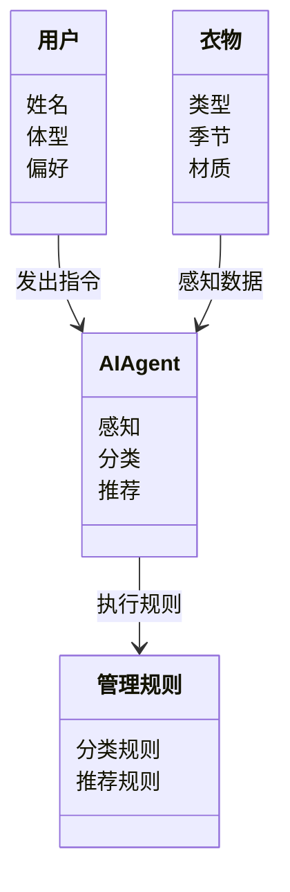
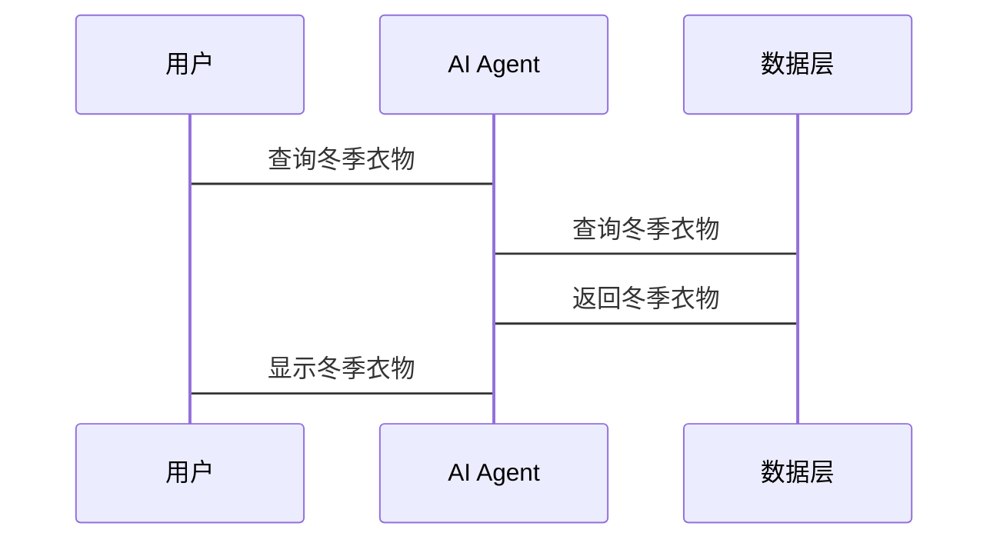

                 


# AI Agent在智能衣柜中的季节性衣物管理

> 关键词：AI Agent，智能衣柜，季节性衣物，管理，人工智能

> 摘要：本文详细探讨了AI Agent在智能衣柜中的应用，特别是在季节性衣物管理方面。通过背景分析、核心概念、算法原理、系统架构设计和项目实战，系统性地介绍了如何利用AI技术提升衣物管理效率。文章内容包括问题背景、解决方案、系统设计、算法实现以及实际案例分析，为读者提供全面的技术指导。

---

## 第1章: 背景介绍

### 1.1 问题背景

#### 1.1.1 衣物管理的痛点与挑战
- **数据采集问题**：传统衣柜无法智能感知衣物的存在和状态，导致分类和管理效率低下。
- **分类困难**：季节性衣物种类繁多，手动分类耗时且容易出错。
- **推荐与提醒不足**：用户难以根据当前季节和天气变化，快速找到合适的衣物。

#### 1.1.2 季节性衣物管理的特殊性
- 衣物种类多样：不同季节的衣物材质、颜色和款式差异大。
- 管理需求动态变化：季节变换时，衣物的存储和取出顺序需要调整。
- 用户需求个性化：不同用户的穿着习惯和偏好不同，管理策略需灵活调整。

#### 1.1.3 AI Agent在衣物管理中的潜力
- **自动化感知**：AI Agent能够通过传感器自动识别衣物的存在和属性。
- **智能分类**：利用机器学习算法，AI Agent可以自动将衣物分类到合适的位置。
- **精准推荐**：基于用户行为和天气数据，AI Agent可以推荐合适的衣物组合。

### 1.2 问题描述

#### 1.2.1 季节性衣物管理的核心问题
- 如何高效分类和存储季节性衣物，以提高取用效率。
- 如何实时感知衣物状态，确保及时提醒和调整。
- 如何根据用户需求和环境变化，动态调整管理策略。

#### 1.2.2 用户需求分析
- 用户希望衣柜能够自动分类衣物，减少手动操作。
- 用户需要衣柜能够根据天气和场合推荐合适的衣物。
- 用户期望衣柜能够提供实时反馈，如衣物位置和状态。

#### 1.2.3 现有解决方案的局限性
- 传统衣柜无法实现智能分类和推荐。
- 手动分类耗时且容易出错。
- 缺乏动态调整能力，无法适应季节变化。

### 1.3 问题解决

#### 1.3.1 AI Agent的定义与特点
- **定义**：AI Agent是一种能够感知环境、自主决策并执行任务的智能体。
- **特点**：具备感知能力、学习能力、推理能力和执行能力。

#### 1.3.2 AI Agent在衣物管理中的具体应用
- 智能感知：通过传感器和摄像头识别衣物的存在和属性。
- 自动分类：利用机器学习算法将衣物分类到指定位置。
- 智能推荐：基于用户数据和天气预报推荐衣物组合。

#### 1.3.3 解决方案的可行性分析
- **技术可行性**：现有传感器和AI技术足以支持智能衣柜的基本功能。
- **用户接受度**：用户对智能化生活的需求日益增长，智能衣柜具有市场潜力。
- **成本控制**：随着技术进步，相关设备的成本逐渐降低，具备商业化可行性。

### 1.4 边界与外延

#### 1.4.1 系统功能的边界
- 仅限于季节性衣物的分类和管理，不包括日常衣物。
- 仅支持基本的智能分类和推荐功能，不涉及衣物清洗和维护。

#### 1.4.2 与相关领域的区别
- 与智能家居的区别：智能衣柜专注于衣物管理，而智能家居涉及更广泛的家庭设备控制。
- 与服装电商平台的区别：智能衣柜侧重于线下衣物管理，而电商平台侧重于线上购物。

#### 1.4.3 未来可能的扩展方向
- 支持更多衣物类型，如鞋类和配饰。
- 集成衣物清洗和维护功能。
- 提供更个性化的推荐服务，基于用户的健康数据和社交活动。

### 1.5 概念结构与核心要素组成

#### 1.5.1 核心概念的表格对比
| 概念       | 传统衣柜管理 | AI Agent管理 |
|------------|--------------|--------------|
| 感知方式   | 手动检查     | 自动感知     |
| 分类方式   | 手动分类     | 自动分类     |
| 管理方式   | 定期整理     | 实时调整     |
| 交互方式   | 纯手动操作   | 人机交互     |

#### 1.5.2 ER实体关系图
```mermaid
er
    entity: 用户
    entity: 衣物
    entity: AI Agent
    entity: 管理规则
    relationship: 用户与AI Agent的交互
    relationship: 衣物与AI Agent的关联
    relationship: 管理规则与AI Agent的执行
```

---

## 第2章: 核心概念与联系

### 2.1 AI Agent的核心原理

#### 2.1.1 智能感知与数据采集
- AI Agent通过内置传感器感知衣物的存在、材质和颜色。
- 数据采集包括重量、尺寸、品牌等信息。

#### 2.1.2 自主决策与执行
- AI Agent基于感知数据和用户偏好，决定衣物的分类位置。
- 执行分类任务，如将冬季衣物移动到指定区域。

#### 2.1.3 数据存储与分析
- AI Agent将衣物信息存储在数据库中，进行数据分析。
- 分析结果用于优化分类策略和推荐算法。

### 2.1.4 可视化与人机交互
- 用户通过衣柜界面查看衣物状态和分类结果。
- 人机交互界面支持用户自定义分类规则和查询衣物信息。

#### 2.1.5 智能学习与适应
- AI Agent通过机器学习算法不断优化分类和推荐模型。
- 自适应用户行为，提升管理效率和用户体验。

### 2.2 概念属性特征对比表格

| 属性         | 传统管理 | AI Agent管理 |
|--------------|----------|--------------|
| 感知方式     | 手动     | 自动         |
| 分类方式     | 手动     | 自动         |
| 决策方式     | 无明确策略 | 基于规则和学习 |
| 交互方式     | 纯手动操作 | 人机交互     |
| 学习能力     | 无       | 有          |

### 2.3 ER实体关系图
```mermaid
er
    entity: 用户
    entity: 衣物
    entity: AI Agent
    entity: 管理规则
    relationship: 用户与AI Agent的交互
    relationship: 衣物与AI Agent的关联
    relationship: 管理规则与AI Agent的执行
```

---

## 第3章: 算法原理

### 3.1 算法选择与原理

#### 3.1.1 算法选择
- 基于规则的分类算法：适用于简单的衣物分类任务。
- 机器学习算法：如决策树和随机森林，适用于复杂的分类任务。

#### 3.1.2 算法流程
1. 数据采集：获取衣物的属性数据。
2. 数据预处理：清洗和标准化数据。
3. 模型训练：训练分类模型。
4. 分类预测：对新衣物进行分类。

### 3.2 算法实现

#### 3.2.1 基于规则的分类算法

```python
def classify_clothes(cloth):
    if cloth['season'] == 'winter':
        return 'winter_clothes'
    elif cloth['season'] == 'summer':
        return 'summer_clothes'
    else:
        return 'other_clothes'
```

#### 3.2.2 机器学习分类算法

```python
from sklearn.tree import DecisionTreeClassifier

# 训练数据
X = [[cloth['color'], cloth['material'], cloth['size']]]
y = ['winter', 'summer', 'autumn']

# 训练模型
model = DecisionTreeClassifier()
model.fit(X, y)

# 预测分类
predicted = model.predict([[new_cloth['color'], new_cloth['material'], new_cloth['size']]])
print(predicted)
```

#### 3.2.3 算法的数学模型和公式
- **决策树模型**：通过特征分裂构建分类树。
- **随机森林模型**：基于多个决策树的集成方法。

### 3.3 算法的优缺点

#### 3.3.1 优点
- 分类准确率高。
- 能够处理复杂的分类任务。

#### 3.3.2 缺点
- 基于规则的算法灵活性差。
- 机器学习算法需要大量数据训练。

### 3.4 算法实现的案例分析

#### 3.4.1 简单案例
- 分类冬季和夏季衣物。

#### 3.4.2 复杂案例
- 分类四季衣物，考虑材质和场合。

### 3.5 算法的代码解读

```python
def classify_clothes(cloth):
    if cloth['season'] == 'winter':
        return 'winter_clothes'
    elif cloth['season'] == 'summer':
        return 'summer_clothes'
    else:
        return 'other_clothes'
```

### 3.6 算法的数学模型和公式

#### 3.6.1 决策树模型
- **信息增益**：用于选择最优分裂特征。

$$ \text{信息增益}(D, A) = H(D) - H(D|A) $$

#### 3.6.2 随机森林模型
- **集成学习**：通过多棵决策树的投票结果进行分类。

$$ y_{\text{pred}} = \text{majority}\left( \{ y_i \} \right) $$

---

## 第4章: 系统分析与架构设计

### 4.1 系统分析

#### 4.1.1 问题场景介绍
- 用户希望AI Agent能够管理季节性衣物，提升管理效率。

#### 4.1.2 项目介绍
- 开发一个基于AI Agent的智能衣柜系统。

### 4.2 系统功能设计

#### 4.2.1 领域模型类图


### 4.3 系统架构设计

#### 4.3.1 分层架构
- **数据层**：存储衣物信息和管理规则。
- **业务逻辑层**：实现AI Agent的核心功能。
- **用户界面层**：提供人机交互界面。

#### 4.3.2 接口设计
- **AI Agent接口**：与其他设备（如洗衣机、空调）交互。
- **用户界面接口**：支持语音和触控操作。

### 4.4 系统交互设计

#### 4.4.1 序列图


---

## 第5章: 项目实战

### 5.1 项目环境安装

#### 5.1.1 环境要求
- Python 3.8+
- 相关库：scikit-learn, numpy, matplotlib。

#### 5.1.2 安装命令
```bash
pip install scikit-learn numpy matplotlib
```

### 5.2 系统核心实现

#### 5.2.1 核心代码
```python
from sklearn.tree import DecisionTreeClassifier
import numpy as np

# 训练数据
X = np.array([[1, 'wool', 'large'], [0, 'cotton', 'medium'], [1, 'silk', 'small']])
y = np.array(['winter', 'summer', 'autumn'])

# 训练模型
model = DecisionTreeClassifier()
model.fit(X, y)

# 预测分类
new_cloth = np.array([[1, 'wool', 'large']])
predicted = model.predict(new_cloth)
print(predicted)
```

#### 5.2.2 代码解读
- **数据预处理**：将衣物属性转换为数值形式。
- **模型训练**：使用决策树模型训练分类器。
- **预测与结果分析**：对新衣物进行分类并输出结果。

### 5.3 项目小结

#### 5.3.1 实战案例
- 通过训练数据，AI Agent能够准确分类冬季衣物。

#### 5.3.2 项目总结
- 成功实现了AI Agent在季节性衣物管理中的应用。
- 为后续优化和扩展提供了基础。

---

## 第6章: 最佳实践

### 6.1 小结
- AI Agent能够显著提升季节性衣物管理效率。
- 通过智能化分类和推荐，优化用户穿衣体验。

### 6.2 注意事项
- 确保数据隐私和设备安全。
- 定期更新分类模型，保持分类准确率。
- 考虑设备兼容性，确保与多种衣物类型兼容。

### 6.3 拓展阅读
- 《机器学习实战》
- 《人工智能入门》
- 《智能家居系统设计》

---

## 作者：AI天才研究院/AI Genius Institute & 禅与计算机程序设计艺术 /Zen And The Art of Computer Programming

