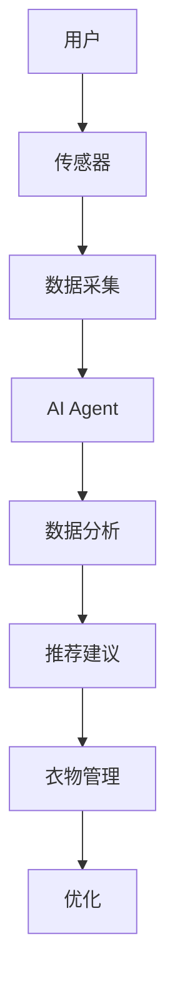
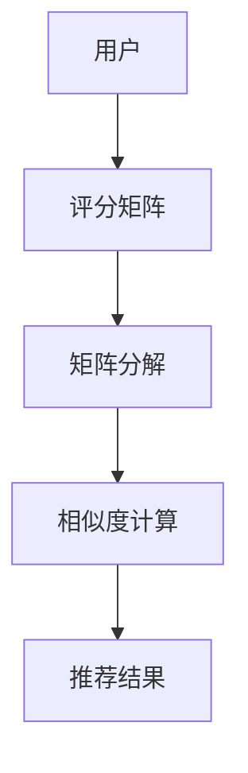
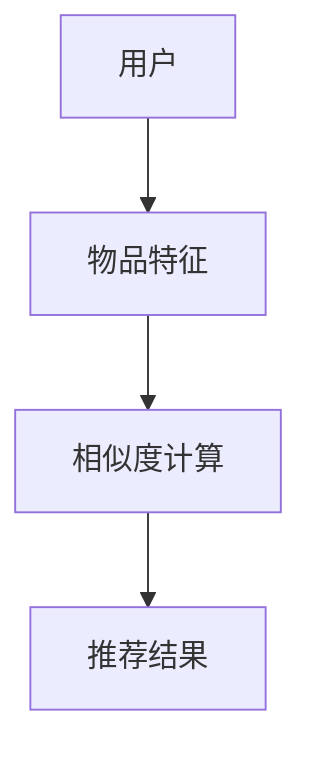
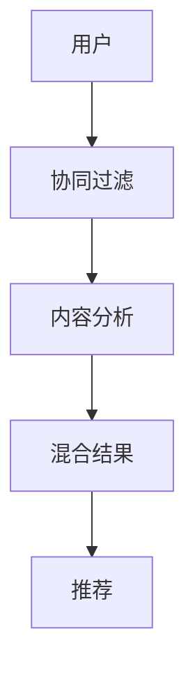
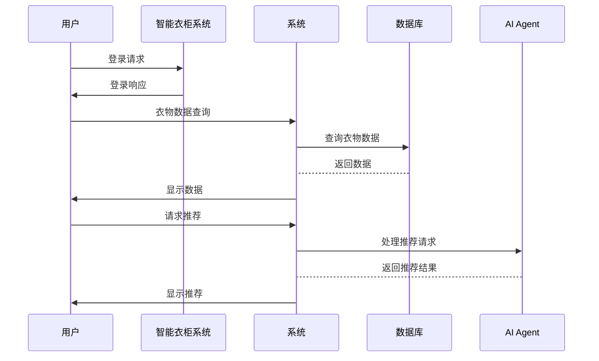

                 


# AI Agent在智能衣柜中的衣物循环使用建议

**关键词**：AI Agent, 智能衣柜, 衣物循环使用, 推荐算法, 系统架构设计

**摘要**：本文探讨AI Agent在智能衣柜中的应用，重点分析衣物循环使用的技术实现。通过背景介绍、核心概念、算法原理、数学模型、系统架构设计和项目实战，详细阐述AI Agent如何优化衣物管理，提升资源利用率，减少浪费。文章结合理论与实践，为智能衣柜的设计提供深度见解。

---

# 第1章: 背景介绍

## 1.1 问题背景

### 1.1.1 衣物资源浪费的现状
全球每年产生的纺织垃圾高达数百万吨，大量衣物因使用率低而被丢弃，造成资源浪费和环境污染。

### 1.1.2 衣物循环使用的重要性
通过循环使用衣物，可以减少新衣购买，降低环境负担，促进可持续发展。

### 1.1.3 AI技术在衣物管理中的应用潜力
AI技术能够分析用户行为和衣物数据，优化衣物使用效率，提升用户体验。

## 1.2 问题描述

### 1.2.1 衣物管理中的常见问题
用户常面临衣柜空间不足、衣物选择困难等问题，导致衣物使用效率低下。

### 1.2.2 用户需求与痛点分析
用户希望衣柜能够智能推荐搭配，减少决策疲劳，同时优化衣物存储和使用。

### 1.2.3 衣物循环使用中的效率瓶颈
如何高效匹配用户需求和可用衣物，减少衣物闲置，是当前衣物管理的核心问题。

## 1.3 问题解决

### 1.3.1 AI Agent的核心作用
AI Agent通过数据分析和预测，优化衣物使用，推荐合适的搭配，提升效率。

### 1.3.2 衣物循环使用的技术实现路径
通过传感器和AI算法，实时监测衣物使用情况，优化推荐策略。

### 1.3.3 AI Agent如何优化衣物使用效率
通过智能推荐和提醒功能，减少衣物闲置，提升使用率。

## 1.4 边界与外延

### 1.4.1 系统的边界定义
智能衣柜仅限于内部衣物管理，不涉及外部衣物共享。

### 1.4.2 衣物循环使用的外延范围
涵盖衣物的购买、存储、使用和回收等环节。

### 1.4.3 AI Agent的功能限制与扩展性
AI Agent不处理洗涤和存储，但可提供相关建议，功能可扩展至更多场景。

## 1.5 概念结构与核心要素

### 1.5.1 AI Agent的基本构成
AI Agent由感知、决策、执行三个阶段组成，感知环境数据，决策优化策略，执行操作。

### 1.5.2 衣物循环使用的系统模型
系统模型包括用户管理、衣物管理、AI建议模块，通过数据流实现高效互动。

---

# 第2章: 核心概念与联系

## 2.1 核心概念原理

### 2.1.1 AI Agent的核心原理
AI Agent通过感知、决策、执行三个阶段，实现对衣物的智能管理。

### 2.1.2 衣物循环使用的系统模型
系统模型包括用户、衣物、AI Agent和建议模块，各模块协同工作，优化衣物使用。

## 2.2 概念属性特征对比

| 概念      | 特性                   | 描述                                                                 |
|-----------|-----------------------|----------------------------------------------------------------------|
| AI Agent  | 感知能力              | 通过传感器和数据采集，获取衣物使用情况。                                       |
|           | 决策能力              | 基于数据和算法，生成衣物使用建议。                                             |
|           | 执行能力              | 执行建议，如推荐衣物搭配或提醒用户清洗衣物。                                     |
| 衣物循环使用 | 资源利用率            | 通过AI Agent优化衣物使用，减少浪费。                                         |
|           | 用户体验              | 提供智能化建议，提升用户穿衣体验。                                             |

## 2.3 ER实体关系图

```mermaid
er
actor: 用户
 Clothes: 衣物
AI Agent: 人工智能代理
Suggestion: 建议
stakeholder: 利益相关者

actor --> Clothes: 管理
actor --> AI Agent: 与代理交互
AI Agent --> Suggestion: 生成
Suggestion --> Clothes: 应用
```

## 2.4 AI Agent的工作流程



---

# 第3章: 算法原理讲解

## 3.1 推荐算法

### 3.1.1 协同过滤算法



### 3.1.2 基于内容的推荐算法



### 3.1.3 混合推荐模型



### 3.1.4 算法实现

```python
def collaborative_filtering(user_data):
    # 数据预处理
    ratings = user_data.pivot('user_id', 'item_id', 'rating').fillna(0)
    # 矩阵分解
    P, Q = matrix_factorization(ratings.values)
    # 推荐计算
    recommendations = np.dot(P, Q)
    return recommendations.argsort()[-5:][::-1]
```

## 3.2 算法数学模型

推荐系统矩阵分解模型：

$$ R = P \times Q + \epsilon $$

其中，$R$ 是评分矩阵，$P$ 和 $Q$ 是分解后的矩阵，$\epsilon$ 是误差项。

---

# 第4章: 数学模型

## 4.1 推荐系统模型

### 4.1.1 矩阵分解模型

$$ R_{u,i} = \sum_{k=1}^K P_{u,k} Q_{i,k} + b_u + b_i + \epsilon_{u,i} $$

其中，$P$ 和 $Q$ 是分解矩阵，$b_u$ 和 $b_i$ 是用户和物品的偏差。

---

# 第5章: 系统分析与架构设计

## 5.1 问题场景

### 5.1.1 用户登录
用户通过智能衣柜系统登录，获取个人衣物数据。

### 5.1.2 衣物管理
用户录入和管理衣物信息，系统实时更新。

### 5.1.3 AI Agent建议
AI Agent分析数据，生成衣物搭配建议。

### 5.1.4 循环使用管理
系统优化衣物使用，减少浪费。

## 5.2 系统功能设计

### 5.2.1 用户管理模块
管理用户信息，确保数据安全。

### 5.2.2 衣物管理模块
录入、查询和删除衣物信息，支持分类管理。

### 5.2.3 AI建议模块
基于算法生成衣物搭配建议，提升用户体验。

### 5.2.4 循环使用管理模块
优化衣物使用，推荐重复使用和回收。

## 5.3 系统架构设计

### 5.3.1 模块交互
用户与系统交互，衣物信息存储于数据库，AI Agent处理数据并生成建议。

### 5.3.2 接口设计
RESTful API实现用户登录、衣物数据查询和建议生成。

### 5.3.3 交互流程图



---

# 第6章: 项目实战

## 6.1 环境安装

```bash
pip install numpy pandas scikit-learn Flask
```

## 6.2 核心代码实现

### 6.2.1 AI Agent实现

```python
class AI-Agent:
    def __init__(self, data):
        self.data = data

    def analyze(self):
        # 数据分析逻辑
        pass

    def generate_suggestion(self):
        # 生成建议
        pass
```

### 6.2.2 推荐系统实现

```python
def recommendation_system(user_id):
    user_data = data[data['user_id'] == user_id]
    # 计算推荐
    return recommendations
```

## 6.3 代码解读与应用

### 6.3.1 AI Agent的初始化
AI Agent接收衣物数据，初始化分析模块。

### 6.3.2 数据分析
通过协同过滤算法分析用户行为，生成推荐列表。

## 6.4 实际案例分析

### 6.4.1 案例背景
用户购买多件衣物，但使用率低，AI Agent通过分析数据优化使用。

### 6.4.2 推荐结果
AI Agent推荐合适的搭配，提升用户满意度。

## 6.5 项目小结

AI Agent通过优化算法和系统设计，显著提升衣物使用效率，减少浪费。

---

# 总结

AI Agent在智能衣柜中的应用，通过优化衣物管理，提升资源利用率，减少浪费。本文详细分析了AI Agent的核心概念、算法原理、系统架构和项目实现，为智能衣柜的设计提供了深度见解。未来，随着技术进步，AI Agent将在衣物管理中发挥更大作用，推动可持续发展。

---

**作者**：AI天才研究院/AI Genius Institute & 禅与计算机程序设计艺术 /Zen And The Art of Computer Programming

