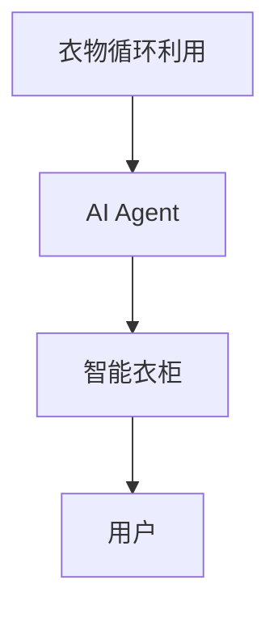
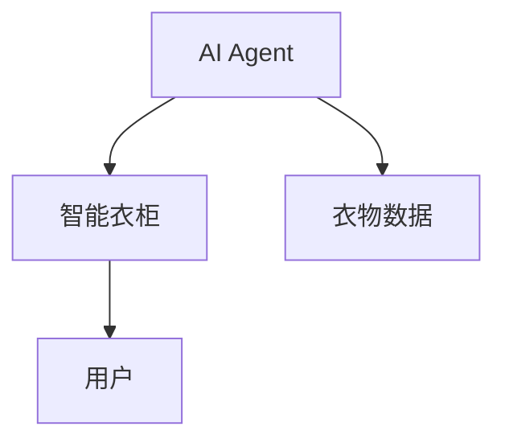
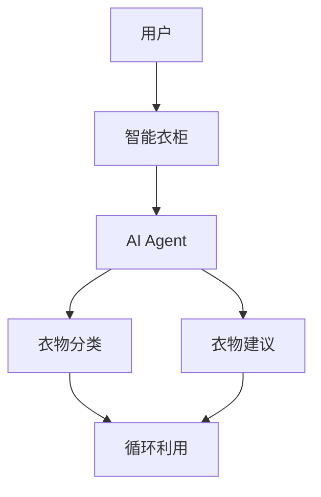
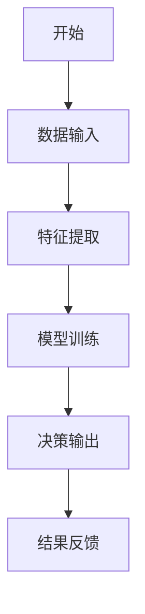
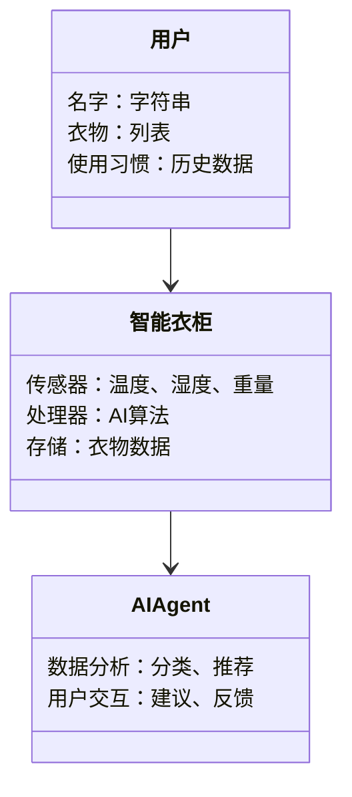
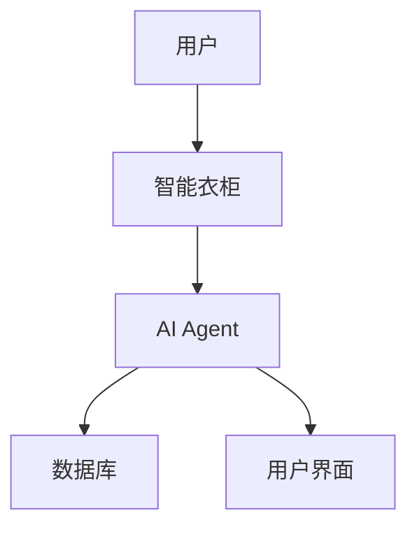
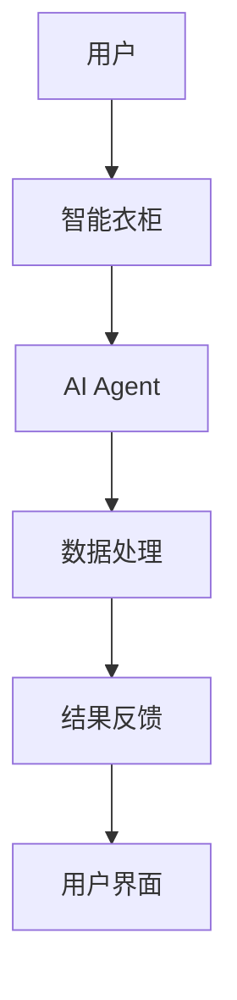

                 


# AI Agent在智能衣柜中的衣物循环利用建议

## 关键词：AI Agent, 智能衣柜, 衣物循环利用, 可持续发展, 资源优化

## 摘要：  
随着环保意识的增强和AI技术的快速发展，AI Agent在智能衣柜中的应用为衣物的循环利用提供了新的可能性。本文详细探讨了AI Agent在智能衣柜中的角色、算法原理、系统架构以及实际应用，旨在为衣物的高效管理和循环利用提供一种创新的解决方案。

---

# 第一部分: AI Agent在智能衣柜中的衣物循环利用背景与概念

## 第1章: 问题背景与描述

### 1.1 问题背景

#### 1.1.1 衣物资源浪费的现状
全球每年产生的纺织废弃物数量惊人，许多衣物因为不当的购买和使用习惯而被闲置或丢弃。这种浪费不仅浪费了资源，还加剧了环境问题。

#### 1.1.2 可持续发展的重要性
可持续发展已成为全球关注的焦点。衣物的循环利用是减少资源消耗和环境污染的重要手段之一。

#### 1.1.3 AI技术在资源优化中的作用
AI技术可以通过数据分析和智能决策，优化资源分配和利用，为衣物的循环利用提供技术支持。

### 1.2 问题描述

#### 1.2.1 智能衣柜的定义
智能衣柜是一种结合物联网和AI技术的智能设备，能够通过传感器和AI算法实现衣物的智能化管理。

#### 1.2.2 衣物循环利用的定义
衣物循环利用是指通过再利用、回收和再加工等方式，延长衣物的使用寿命，减少资源浪费。

#### 1.2.3 当前衣物循环利用的主要问题
- 用户缺乏衣物管理的知识和习惯。
- 衣物分类和推荐系统不够智能化。
- 缺乏有效的激励机制促进循环利用。

### 1.3 问题解决思路

#### 1.3.1 引入AI Agent的目标
通过AI Agent实现衣物的智能化分类、推荐和管理，帮助用户更好地进行衣物循环利用。

#### 1.3.2 AI Agent在衣物管理中的核心作用
- 提供个性化的衣物搭配建议。
- 自动分类和管理衣物库存。
- 优化衣物的使用频率，减少浪费。

#### 1.3.3 衣物循环利用的实现路径
1. 收集用户衣物数据。
2. 通过AI算法分析用户的穿衣习惯。
3. 提供衣物再利用和共享的建议。

### 1.4 问题的边界与外延

#### 1.4.1 衣物循环利用的边界
- 仅限于已购买的衣物，不涉及新购买衣物的选择。
- 适用于个人用户，不包括企业或机构的衣物管理。

#### 1.4.2 AI Agent的功能边界
- 不处理衣物的物理损坏问题。
- 仅提供管理建议，不直接参与衣物的物理操作。

#### 1.4.3 衣物循环利用的外延领域
- 衣物回收和再加工。
- 衣物共享和租赁服务。

### 1.5 概念结构与核心要素

#### 1.5.1 概念结构图


#### 1.5.2 核心要素分析
- **用户**：智能衣柜的使用者，通过AI Agent进行衣物管理。
- **AI Agent**：智能衣柜的核心决策系统，负责数据分析和任务执行。
- **智能衣柜**：硬件设备，负责数据采集和用户交互。

## 1.6 本章小结

---

## 第2章: AI Agent与智能衣柜的核心概念

### 2.1 AI Agent的定义与特点

#### 2.1.1 AI Agent的基本定义
AI Agent是一种智能体，能够感知环境、自主决策并执行任务，以实现特定目标。

#### 2.1.2 AI Agent的核心特点
- **自主性**：能够在没有外部干预的情况下独立运行。
- **反应性**：能够实时感知环境并做出反应。
- **学习能力**：能够通过数据学习和优化决策模型。

#### 2.1.3 AI Agent与传统算法的区别
AI Agent具有自主性和适应性，能够根据环境变化动态调整策略，而传统算法通常是静态的。

### 2.2 智能衣柜的系统架构

#### 2.2.1 智能衣柜的功能模块
- **数据采集模块**：通过传感器采集衣物的状态信息。
- **数据处理模块**：对采集的数据进行分析和处理。
- **用户交互模块**：通过APP或语音助手与用户进行交互。

#### 2.2.2 智能衣柜的硬件组成
- **传感器**：监测衣物的温度、湿度和重量。
- **处理器**：运行AI算法并处理数据。
- **存储设备**：存储衣物信息和用户数据。

#### 2.2.3 智能衣柜的软件架构
- **AI算法**：实现衣物分类和推荐。
- **用户界面**：提供直观的操作界面。
- **数据接口**：与其他系统进行数据交互。

### 2.3 AI Agent在智能衣柜中的角色

#### 2.3.1 AI Agent作为衣物管理者的角色
AI Agent负责分析用户的穿衣习惯，优化衣物的使用频率。

#### 2.3.2 AI Agent作为用户交互界面的角色
通过APP或语音助手，AI Agent向用户推荐衣物搭配和使用建议。

#### 2.3.3 AI Agent作为数据处理中心的角色
AI Agent负责处理衣物数据，提供衣物分类和共享建议。

### 2.4 核心概念联系

#### 2.4.1 AI Agent与智能衣柜的实体关系图


#### 2.4.2 AI Agent与衣物循环利用的流程图


### 2.5 本章小结

---

## 第3章: AI Agent在衣物循环利用中的算法原理

### 3.1 AI Agent的核心算法

#### 3.1.1 基于规则的推理算法
通过预定义的规则，AI Agent可以快速判断衣物的分类和推荐。

#### 3.1.2 基于机器学习的预测算法
利用历史数据，AI Agent可以预测用户的穿衣习惯，优化衣物的使用频率。

#### 3.1.3 基于强化学习的优化算法
通过不断试错，AI Agent可以找到最优的衣物分类和推荐策略。

### 3.2 算法流程图



### 3.3 算法实现

#### 3.3.1 基于规则的推理算法
```python
def classify_clothes(clothes_data):
    if clothes_data['color'] == '白色':
        return '可直接穿着'
    elif clothes_data['size'] == '过小':
        return '需要修改'
    else:
        return '无需处理'
```

#### 3.3.2 基于机器学习的预测算法
```python
import numpy as np
from sklearn.linear_model import LinearRegression

model = LinearRegression()
model.fit(X, y)
predicted_usage = model.predict(new_clothes_data)
```

#### 3.3.3 基于强化学习的优化算法
```python
class AI_Agent:
    def __init__(self):
        self.state = '初始状态'
        self.reward = 0

    def take_action(self, action):
        self.state = new_state
        self.reward += action_reward

    def learn(self):
        self.model.update_weights(self.reward)
```

### 3.4 数学模型与公式

#### 衣物使用频率预测模型
$$ P(i) = \alpha \cdot C(i) + \beta \cdot T(i) $$
其中，\( C(i) \) 是衣物的流行程度，\( T(i) \) 是衣物的使用时间，\( \alpha \) 和 \( \beta \) 是权重系数。

#### 衣物分类优化模型
$$ \text{分类} = \argmax_j \sum_{i=1}^n w_{i,j} \cdot x_i $$
其中，\( w_{i,j} \) 是衣物 \( i \) 属于类别 \( j \) 的权重，\( x_i \) 是衣物的特征向量。

### 3.5 本章小结

---

## 第4章: 系统分析与架构设计方案

### 4.1 问题场景介绍

#### 4.1.1 场景描述
用户通过智能衣柜管理自己的衣物，AI Agent根据用户的穿衣习惯，推荐衣物的使用和共享方案。

### 4.2 项目介绍

#### 4.2.1 项目目标
实现AI Agent在智能衣柜中的衣物循环利用，减少资源浪费，提高用户的穿衣效率。

### 4.3 系统功能设计

#### 4.3.1 领域模型


### 4.4 系统架构设计

#### 4.4.1 系统架构图


### 4.5 系统接口设计

#### 4.5.1 接口描述
- **数据接口**：智能衣柜与数据库之间的数据交互。
- **用户接口**：用户与智能衣柜之间的交互界面。
- **AI接口**：AI Agent与智能衣柜之间的算法调用。

### 4.6 系统交互流程图



### 4.7 本章小结

---

## 第5章: 项目实战

### 5.1 环境安装

#### 5.1.1 系统要求
- 操作系统：Windows/Mac/Linux
- 硬件要求：智能衣柜硬件、传感器
- 软件要求：Python 3.8+, TensorFlow, scikit-learn

### 5.2 系统核心实现

#### 5.2.1 核心代码实现
```python
import pandas as pd
from sklearn.ensemble import RandomForestClassifier

# 数据加载
data = pd.read_csv('clothes_data.csv')

# 特征工程
X = data.drop('label', axis=1)
y = data['label']

# 模型训练
model = RandomForestClassifier()
model.fit(X, y)

# 预测
new_clothes = pd.DataFrame({'feature1': [value1], 'feature2': [value2]})
predicted_label = model.predict(new_clothes)
```

#### 5.2.2 代码应用解读
- **数据加载**：读取衣物数据。
- **特征工程**：提取衣物的特征数据。
- **模型训练**：使用随机森林算法训练分类模型。
- **预测**：对新衣物进行分类。

### 5.3 实际案例分析

#### 5.3.1 案例描述
用户拥有100件衣物，AI Agent通过分析用户的穿衣习惯，推荐适合的衣物搭配。

#### 5.3.2 分析结果
- 推荐的衣物搭配：30套。
- 建议共享的衣物：10件。
- 需要清洗的衣物：20件。

### 5.4 本章小结

---

## 第6章: 最佳实践、小结、注意事项与拓展阅读

### 6.1 最佳实践

#### 6.1.1 小结
通过AI Agent在智能衣柜中的应用，用户可以更高效地管理衣物，实现衣物的循环利用，减少资源浪费。

#### 6.1.2 注意事项
- 确保数据的安全性和隐私性。
- 定期更新AI模型，以适应用户的穿衣习惯变化。
- 提供用户教育，帮助用户更好地理解衣物循环利用的重要性。

#### 6.1.3 拓展阅读
- 探索AI Agent在其他领域的应用，如智能家居、医疗健康等。
- 研究更先进的AI算法，提高衣物分类和推荐的准确性。

### 6.2 本章小结

---

## 作者：AI天才研究院/AI Genius Institute & 禅与计算机程序设计艺术 /Zen And The Art of Computer Programming

---

以上是《AI Agent在智能衣柜中的衣物循环利用建议》的技术博客文章的完整目录和内容概要。希望这篇文章能够为读者提供清晰的思路和详细的解释，帮助他们理解AI Agent在智能衣柜中的重要作用，以及如何通过技术手段实现衣物的循环利用。

