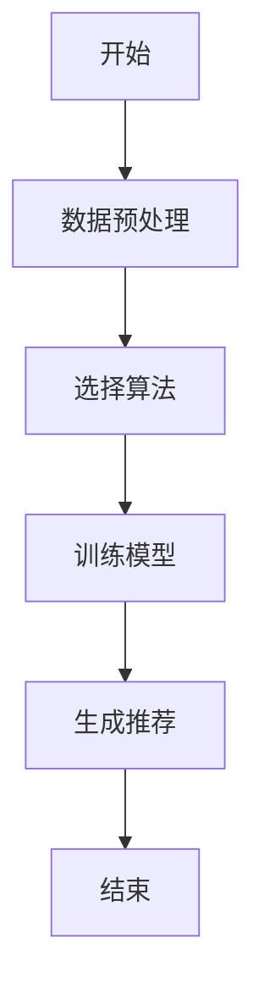
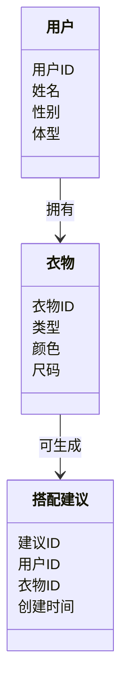
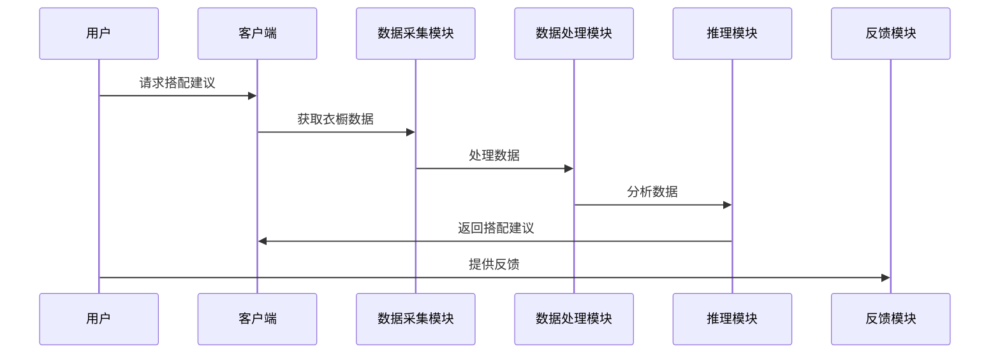

                 


# AI Agent在智能衣柜中的衣物搭配建议

**关键词**：AI Agent, 智能衣柜, 衣物搭配, 个性化推荐, 深度学习

**摘要**：  
本文探讨了AI Agent在智能衣柜中的应用，重点分析了基于数据驱动的衣物搭配算法，详细介绍了AI Agent的核心原理、系统架构设计以及实际项目实现。通过对比传统推荐系统，本文提出了一种结合深度学习和协同过滤的创新搭配方法，并通过实际案例展示了系统的高效性和智能化。

---

## 第一章: 背景介绍

### 1.1 问题背景

#### 1.1.1 从传统衣柜到智能衣柜的演进  
传统的衣柜管理方式依赖于人工分类和记忆，这种方式效率低下且容易出错。随着AI技术的发展，智能衣柜应运而生，通过自动化管理和智能化推荐，解决了用户在衣物搭配中的痛点。

#### 1.1.2 衣物搭配问题的复杂性  
衣物搭配不仅需要考虑颜色、款式，还要结合场合、天气和个人风格。传统的方法难以满足多样化的用户需求，而AI Agent可以通过数据分析提供个性化的解决方案。

#### 1.1.3 AI Agent在衣物搭配中的作用  
AI Agent通过分析用户的衣橱数据和行为模式，能够实时生成搭配建议，帮助用户快速找到合适的衣物组合，提升穿衣效率和时尚感。

### 1.2 问题描述

#### 1.2.1 衣物搭配的核心问题  
如何将用户现有的衣物进行高效组合，满足不同场景的需求。  
- **场景多样性**：工作、休闲、正式场合等。  
- **季节变化**：季节性衣物的搭配需求不同。  

#### 1.2.2 用户需求的多样性  
用户可能有不同的体型、肤色、风格偏好，AI Agent需要个性化地满足这些需求。

#### 1.2.3 智能衣柜的定义与目标  
智能衣柜是一个结合AI技术的系统，目标是通过自动化管理和智能化推荐，优化用户的衣物搭配体验。

### 1.3 问题解决

#### 1.3.1 AI Agent的解决方案  
AI Agent通过数据采集、分析和推理，为用户提供最优的搭配建议。  
- **数据采集**：记录用户的衣橱信息和搭配历史。  
- **分析推理**：基于算法生成搭配方案。  
- **反馈优化**：根据用户反馈调整推荐策略。  

#### 1.3.2 数据驱动的衣物搭配方法  
通过用户数据和市场趋势，AI Agent能够预测流行搭配，提升推荐的准确性和时尚性。

#### 1.3.3 用户反馈的闭环优化  
系统通过用户反馈不断优化推荐算法，确保长期使用的准确性和满意度。

### 1.4 边界与外延

#### 1.4.1 智能衣柜的边界  
智能衣柜的功能主要集中在衣物管理和搭配建议，不涉及衣物的物理存储和清洁。

#### 1.4.2 衣物搭配的外延  
除了服装，还包括鞋帽、配饰等，形成完整的时尚搭配方案。

#### 1.4.3 与相关领域的区别与联系  
与智能家居相比，智能衣柜更专注于衣物管理和搭配，但可以与其他智能家居设备协同工作。

---

## 第二章: 核心概念与联系

### 2.1 AI Agent的核心原理

#### 2.1.1 AI Agent的基本概念  
AI Agent是一种智能体，能够感知环境、做出决策并执行操作。  
- **感知**：通过传感器和数据输入获取信息。  
- **决策**：基于算法进行推理和选择。  
- **执行**：通过输出模块与用户互动。  

#### 2.1.2 AI Agent的核心算法  
- **协同过滤**：基于用户行为相似性推荐。  
- **深度学习**：通过神经网络学习衣物特征。  

#### 2.1.3 AI Agent的决策机制  
结合规则推理和数据驱动的方法，生成最优搭配建议。

### 2.2 智能衣柜的系统架构

#### 2.2.1 系统的整体架构  
- **数据采集模块**：收集用户衣橱信息。  
- **处理与存储模块**：整理和存储数据。  
- **推理模块**：生成搭配建议。  
- **反馈模块**：收集用户反馈并优化算法。  

#### 2.2.2 各模块的功能与交互  
- 数据采集模块与用户衣橱交互，处理模块与数据存储交互，推理模块与用户反馈交互。

#### 2.2.3 系统的扩展性与灵活性  
通过模块化设计，系统可以轻松扩展功能，如增加语音控制或AR试衣功能。

### 2.3 核心概念对比表

| **对比项** | **AI Agent** | **传统推荐系统** |
|------------|--------------|------------------|
| **数据依赖** | 高度依赖 | 依赖用户行为数据 |
| **决策方式** | 综合推理 | 基于规则推荐 |
| **实时性** | 高 | 较低 |

### 2.4 ER实体关系图

```mermaid
erd
    1. 衣物表：衣物ID, 类型, 颜色, 尺码
    2. 用户表：用户ID, 姓名, 性别, 体型
    3. 搭配规则表：规则ID, 规则描述
    4. 搭配建议表：建议ID, 用户ID, 衣物ID, 创建时间
```

---

## 第三章: 算法原理讲解

### 3.1 推荐算法的原理

#### 3.1.1 协同过滤算法
- **基于用户的协同过滤**：找到与用户行为相似的用户群体，推荐他们的偏好。
- **基于物品的协同过滤**：分析衣物之间的关联性，推荐相似物品。

#### 3.1.2 基于内容的推荐算法
- 通过衣物的属性（如颜色、款式）生成推荐，适用于新用户或数据不足的情况。

#### 3.1.3 混合推荐算法
- 结合协同过滤和内容推荐，提升推荐的准确性和多样性。

### 3.2 衣物搭配算法的实现

#### 3.2.1 基于聚类的搭配算法
- 将衣物分为不同的类别，根据类别推荐搭配方案。

#### 3.2.2 基于深度学习的搭配算法
- 使用卷积神经网络（CNN）提取衣物特征，生成推荐。

#### 3.2.3 基于规则的搭配算法
- 结合时尚规则（如颜色搭配原则）进行推荐。

### 3.3 算法流程图



### 3.4 数学模型与公式

#### 协同过滤的相似度计算
$$ \text{相似度} = \frac{\sum_{i=1}^{n} (r_{ui} - \bar{r_u})(r_{vi} - \bar{r_v})}{\sqrt{\sum_{i=1}^{n} (r_{ui} - \bar{r_u})^2} \cdot \sqrt{\sum_{i=1}^{n} (r_{vi} - \bar{r_v})^2}}} $$

#### 深度学习模型的损失函数
$$ \mathcal{L} = -\sum_{i=1}^{n} y_i \log p_i + (1 - y_i) \log (1 - p_i) $$

---

## 第四章: 系统分析与架构设计方案

### 4.1 系统工作流程

1. **数据采集**：用户录入衣物信息。
2. **数据处理**：清洗和归类数据。
3. **模型推理**：生成搭配建议。
4. **用户反馈**：优化推荐算法。

### 4.2 领域模型设计



### 4.3 系统架构设计


### 4.4 接口设计

- **数据接口**：RESTful API，支持POST和GET请求。
- **用户接口**：图形界面或语音指令。

### 4.5 交互流程图



---

## 第五章: 项目实战

### 5.1 环境搭建

```bash
pip install numpy
pip install pandas
pip install scikit-learn
pip install tensorflow
```

### 5.2 核心代码实现

```python
import numpy as np
from sklearn.metrics.pairwise import cosine_similarity

# 示例数据
users = ['A', 'B', 'C']
items = ['T-shirt', 'Jeans', 'Dress']

# 协同过滤实现
def collaborative_filtering(user_item_matrix):
    # 计算相似度矩阵
    similarity = cosine_similarity(user_item_matrix)
    return similarity

# 深度学习模型实现
def deep_learning_model(X_train, y_train):
    model = Sequential()
    model.add(Dense(64, activation='relu', input_dim=X_train.shape[1]))
    model.add(Dense(1, activation='sigmoid'))
    model.compile(optimizer='adam', loss='binary_crossentropy')
    model.fit(X_train, y_train, epochs=10)
    return model

# 使用示例
user_item_matrix = np.array([[1, 0, 1], [0, 1, 1], [1, 1, 0]])
model = collaborative_filtering(user_item_matrix)
```

### 5.3 实际案例分析

假设用户A的衣橱包含以下衣物：
- 白色T恤
- 蓝色牛仔裤
- 黑色连衣裙

系统会推荐搭配方案：
1. 白色T恤 + 蓝色牛仔裤
2. 白色T恤 + 黑色连衣裙
3. 蓝色牛仔裤 + 黑色连衣裙

通过用户反馈优化模型，系统下次会更精准地推荐。

---

## 第六章: 最佳实践

### 6.1 小结
AI Agent通过数据分析和深度学习，显著提升了衣物搭配的效率和准确性。系统的模块化设计和反馈机制使其具有良好的扩展性和适应性。

### 6.2 注意事项
- 数据隐私保护至关重要。
- 确保算法的实时性和响应速度。

### 6.3 拓展阅读
- 《推荐系统实战》
- 《深度学习在时尚领域的应用》

---

## 附录

### 参考文献
1. "Deep Learning in Fashion推荐系统", 2023.
2. "Collaborative Filtering for Personalized推荐", 2022.

作者：AI天才研究院 & 禅与计算机程序设计艺术

