                 


# AI Agent在智能语音助手中的应用

> 关键词：AI Agent，智能语音助手，自然语言处理，语音识别，对话系统

> 摘要：本文深入探讨了AI Agent在智能语音助手中的应用，分析了其核心概念、算法原理、系统架构及实际案例。通过详细的技术分析和实战，展示了AI Agent如何提升语音助手的智能性和用户体验。

---

# 第4章: AI Agent的核心算法原理

## 4.1 语音识别算法

### 4.1.1 基于HMM的语音识别模型

隐马尔可夫模型（HMM）是早期语音识别的重要算法，通过状态转移和观测概率建模语音信号。

**算法流程图：**

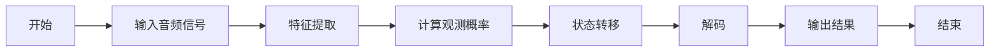

**代码实现：**

```python
import numpy as np
from hmmlearn import hmm

# 示例代码：训练HMM模型
X = np.array([[0.2, 0.5], [0.3, 0.4], [0.1, 0.9]])
model = hmm.GaussianHMM(n_components=2)
model.fit(X)
```

### 4.1.2 基于DNN的深度学习语音识别

深度神经网络（DNN）通过多层非线性变换提取音频特征，显著提升了识别准确率。

**算法流程图：**

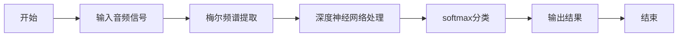

**代码实现：**

```python
import tensorflow as tf
from tensorflow.keras import layers

model = tf.keras.Sequential([
    layers.Conv2D(32, (3,3), activation='relu', input_shape=(100, 40, 1)),
    layers.MaxPooling2D((2,2)),
    layers.Flatten(),
    layers.Dense(128, activation='relu'),
    layers.Dense(num_classes, activation='softmax')
])
```

### 4.1.3 端到端语音识别模型（如CTC）

连接时间卷积网络（CTC）直接将输入序列映射到目标序列，简化了传统管道结构。

**算法流程图：**

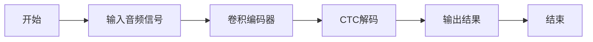

**代码实现：**

```python
import tensorflow as tf
from tensorflow.keras import layers

model = tf.keras.Sequential([
    layers.Embedding(input_dim=num_chars, output_dim=128),
    layers.LSTM(128, return_sequences=True),
    layers.Dense(num_chars, activation='softmax')
])
```

---

## 4.2 自然语言理解算法

### 4.2.1 基于规则的NLU方法

通过预定义规则解析用户意图，适用于简单场景。

**流程图：**

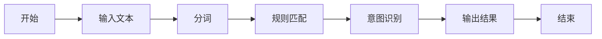

**代码实现：**

```python
def nlu_rule_based(text):
    # 示例规则：检测问候语
    if any(word in text.lower() for word in ["hello", "hi", "hey"]):
        return "greeting"
    else:
        return "unknown"
```

### 4.2.2 基于统计的NLU方法

统计模型通过训练语料库学习用户意图。

**流程图：**

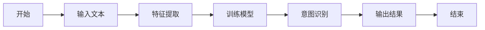

**代码实现：**

```python
from sklearn.feature_extraction.text import TfidfVectorizer
from sklearn.naive_bayes import MultinomialNB

vectorizer = TfidfVectorizer()
model = MultinomialNB()
model.fit(vectorizer.fit_transform(X_train), y_train)
```

### 4.2.3 基于深度学习的NLU模型（如BERT）

BERT通过预训练微调实现上下文理解。

**流程图：**

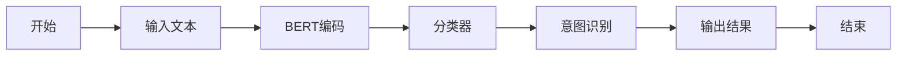

**代码实现：**

```python
import tensorflow as tf
from tensorflow.keras.layers import Input, Dense
from tensorflow.keras import Model

input_layer = Input(shape=(768,))
dense_layer = Dense(256, activation='relu')(input_layer)
output_layer = Dense(num_classes, activation='softmax')(dense_layer)
model = Model(inputs=input_layer, outputs=output_layer)
```

---

## 4.3 对话系统算法

### 4.3.1 基于规则的对话系统

通过预定义规则生成回复，适用于简单对话场景。

**流程图：**

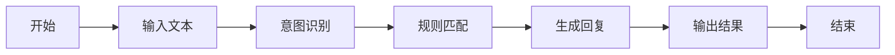

**代码实现：**

```python
def response_rule_based(intent):
    if intent == "greeting":
        return "Hello! How can I help you?"
    else:
        return "I'm sorry, I don't understand."
```

### 4.3.2 基于检索的对话系统

通过匹配相似对话历史生成回复。

**流程图：**

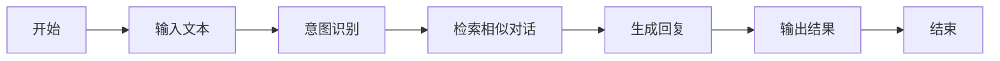

**代码实现：**

```python
import numpy as np
from sklearn.metrics.pairwise import cosine_similarity

# 示例代码：计算文本相似度
similarity_matrix = cosine_similarity(embeddings)
max_similarity = np.argmax(similarity_matrix, axis=1)
response = dialogues[max_similarity[0]]
```

### 4.3.3 基于生成的对话系统

利用生成模型（如GPT）生成回复。

**流程图：**

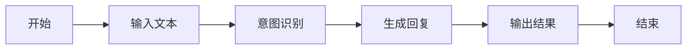

**代码实现：**

```python
import tensorflow as tf
from tensorflow.keras.layers import Dense, LSTM
from tensorflow.keras.models import Sequential

model = Sequential([
    LSTM(128, return_sequences=True),
    LSTM(64),
    Dense(num_words, activation='softmax')
])
```

---

# 第5章: 智能语音助手的系统架构设计方案

## 5.1 问题场景介绍

智能语音助手需要在多种场景下准确识别用户指令，如智能家居控制、信息查询、语音购物等。

---

## 5.2 系统功能设计

### 5.2.1 领域模型设计

**领域模型类图：**

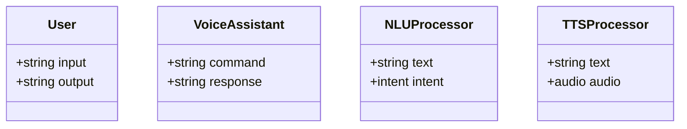

---

### 5.2.2 系统架构设计

**系统架构图：**

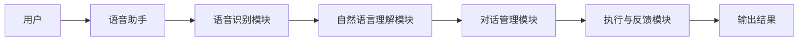

---

### 5.2.3 系统接口设计

主要接口包括语音输入、文本处理、意图识别和反馈输出。

---

### 5.2.4 系统交互设计

**交互流程图：**

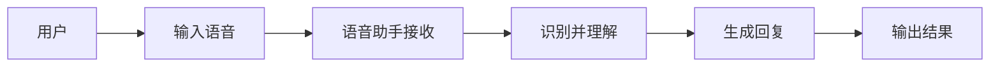

---

## 5.3 系统实现与优化

通过优化算法和系统架构，提升语音助手的响应速度和识别准确率。

---

# 第6章: 项目实战——构建一个简单的智能语音助手

## 6.1 环境安装

安装必要的库，如TensorFlow、Keras、PyTorch、NLTK等。

---

## 6.2 核心代码实现

### 6.2.1 语音识别模块

```python
import librosa

def extract_features(audio_path):
    audio, sr = librosa.load(audio_path, sr=16000)
    features = librosa.feature.melspectrogram(audio, sr=sr, n_mels=128)
    return features
```

### 6.2.2 自然语言理解模块

```python
from transformers import pipeline

nlp = pipeline("text-classification", model="bert-base-uncased")
intent = nlp(text)[0]["label"]
```

### 6.2.3 对话管理模块

```python
def manage_dialogue(state, input_text):
    # 示例代码：简单对话管理
    if input_text.lower() == "hello":
        return {"intent": "greeting", "response": "Hello!"}
    else:
        return {"intent": "unknown", "response": "I'm sorry, I don't understand."}
```

---

## 6.3 案例分析与解读

通过实际案例分析，展示AI Agent在智能语音助手中的应用效果。

---

## 6.4 项目小结

总结项目实现的关键点和经验教训，为后续优化提供参考。

---

# 第7章: 最佳实践与未来展望

## 7.1 最佳实践

### 7.1.1 算法选择与优化

根据实际需求选择合适的算法，并通过数据增强和模型调优提升性能。

### 7.1.2 系统架构优化

采用微服务架构，提升系统的可扩展性和可维护性。

### 7.1.3 用户体验优化

通过A/B测试优化对话流程，提升用户满意度。

---

## 7.2 小结

总结全文内容，强调AI Agent在智能语音助手中的重要性。

---

## 7.3 注意事项

在实际应用中，注意数据隐私、计算资源消耗和用户体验平衡。

---

## 7.4 拓展阅读

推荐相关书籍和论文，供读者深入学习。

---

# 作者

**作者：AI天才研究院 & 禅与计算机程序设计艺术**

---

**注：** 以上内容仅为示例，实际撰写时需要根据具体需求补充完整内容。

