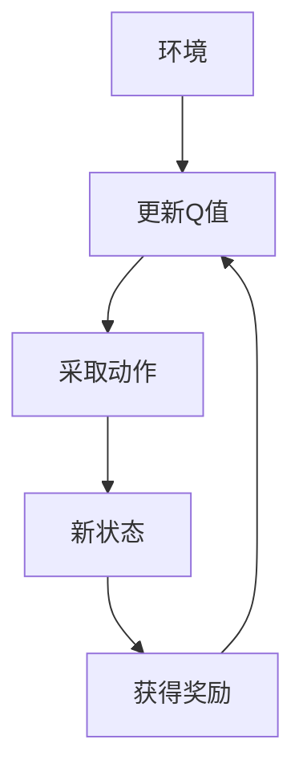
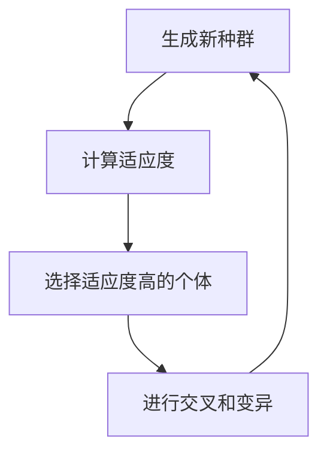
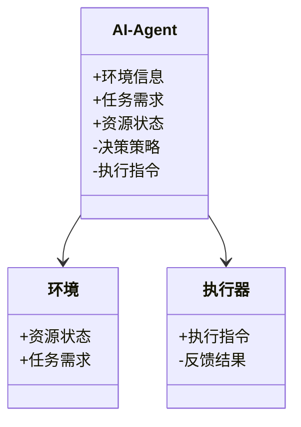
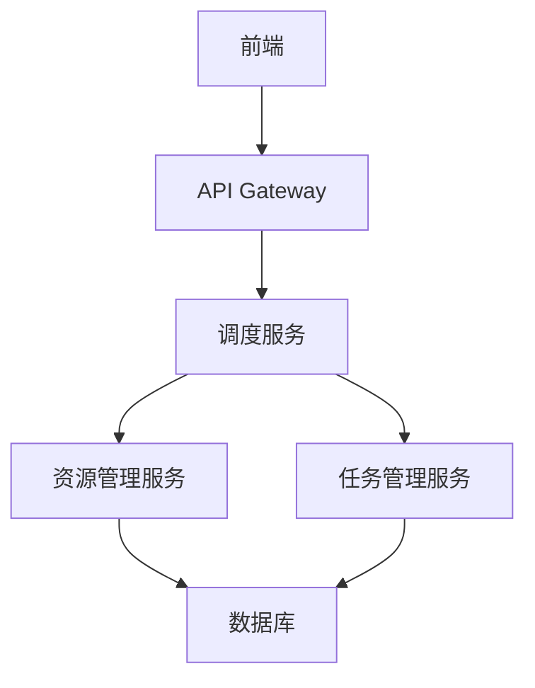
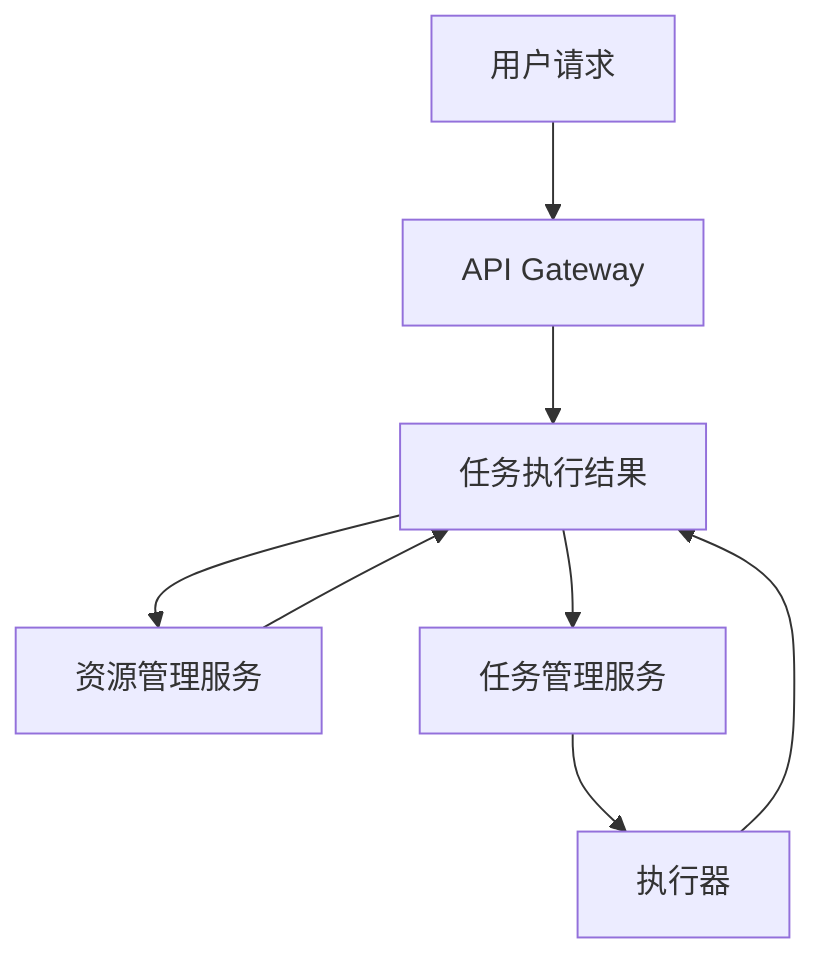

                 


# AI Agent在智能资源调度中的应用

## 关键词
AI Agent, 智能资源调度, 强化学习, 遗传算法, 资源分配, 系统架构

## 摘要
本文深入探讨了AI Agent在智能资源调度中的应用，分析了AI Agent的基本概念、算法原理及其在资源调度中的优化作用。通过实际案例分析，详细介绍了基于强化学习和遗传算法的AI Agent实现，并结合系统架构设计，展示了如何将AI Agent应用于实际资源调度场景中。最后，总结了AI Agent在资源调度中的优势与挑战，并提出了未来研究方向。

---

# 第1章: AI Agent与智能资源调度的背景

## 1.1 AI Agent的基本概念

### 1.1.1 什么是AI Agent
AI Agent（人工智能代理）是一种能够感知环境、自主决策并执行任务的智能实体。它通过传感器获取信息，利用推理能力做出决策，并通过执行器与环境交互。AI Agent的核心目标是实现智能化的决策和行动，以达到预定的目标。

### 1.1.2 AI Agent的核心特征
- **自主性**：能够在没有外部干预的情况下自主运行。
- **反应性**：能够实时感知环境变化并做出反应。
- **目标导向性**：所有行为都以实现特定目标为导向。
- **学习能力**：能够通过经验优化决策策略。

### 1.1.3 AI Agent与传统调度算法的对比
| 特性                | AI Agent                     | 传统调度算法               |
|---------------------|------------------------------|-----------------------------|
| 决策方式            | 基于机器学习和智能算法       | 基于规则和预设逻辑         |
| 灵活性              | 高，能够适应动态环境变化     | 较低，难以应对突发情况       |
| 学习能力            | 强，能够优化策略             | 无学习能力                 |
| 执行能力            | 高，能够自主完成任务         | 依赖外部指令               |

## 1.2 智能资源调度的背景与挑战

### 1.2.1 资源调度的基本概念
资源调度是指在有限的资源条件下，合理分配资源以满足任务需求的过程。常见的资源类型包括计算资源、存储资源、网络资源等。资源调度的目标是最大化资源利用率，同时最小化资源浪费。

### 1.2.2 智能资源调度的必要性
随着云计算、大数据和物联网技术的快速发展，资源调度的复杂性不断提高。传统的静态调度算法难以应对动态变化的环境，因此需要引入AI Agent等智能化技术来提高调度效率。

### 1.2.3 当前资源调度的主要挑战
1. **动态性**：资源需求和环境条件不断变化，传统算法难以实时调整。
2. **复杂性**：多任务并行执行，资源冲突和竞争加剧。
3. **不确定性**：部分任务需求和资源状态具有不确定性，难以预估。

## 1.3 AI Agent在资源调度中的应用前景

### 1.3.1 AI Agent的优势
- **智能化**：能够自主感知环境并做出决策。
- **高效性**：通过机器学习算法优化资源分配。
- **适应性**：能够快速响应环境变化。

### 1.3.2 AI Agent在资源调度中的潜力
- **动态优化**：实时调整资源分配策略，提高资源利用率。
- **多目标优化**：在满足多个目标条件下实现最优调度。
- **自适应调度**：根据环境变化自动调整调度策略。

### 1.3.3 应用中的主要问题与解决方案
- **问题**：计算资源分配不均。
- **解决方案**：基于强化学习的资源分配算法。

---

# 第2章: AI Agent的核心概念与原理

## 2.1 AI Agent的基本原理

### 2.1.1 知识表示
知识表示是AI Agent的核心能力之一，通常采用符号逻辑、概率推理或神经网络等方法。知识表示的目的是将环境中的信息转化为可计算的形式，以便AI Agent能够理解和利用这些信息。

### 2.1.2 问题求解
问题求解是AI Agent的核心任务，通常包括状态空间搜索、启发式搜索和机器学习等方法。AI Agent通过分析问题的约束条件和目标，选择最优的解决方案。

### 2.1.3 行为规划
行为规划是指AI Agent根据当前状态和目标，制定行动计划。行为规划通常采用层次化规划、基于模型的规划和基于经验的规划等方法。

## 2.2 AI Agent的分类与特征

### 2.2.1 分类标准
AI Agent可以根据智能水平、应用场景和决策方式等多种标准进行分类。常见的分类标准包括：
- **智能水平**：分为简单反射型、基于模型的反应型、目标驱动型和推理驱动型。
- **应用场景**：分为任务型、服务型和决策型。
- **决策方式**：分为基于规则的和基于机器学习的。

### 2.2.2 各类AI Agent的特征对比
| 类型             | 特征                   | 应用场景                 |
|------------------|------------------------|--------------------------|
| 简单反射型       | 基于固定的规则         | 简单的自动化任务           |
| 基于模型的反应型 | 基于环境模型做出反应   | 中等复杂度的任务           |
| 目标驱动型       | 以目标为导向           | 复杂任务                   |
| 推理驱动型       | 基于逻辑推理           | 高复杂度的任务             |

### 2.2.3 选择合适的AI Agent类型
选择AI Agent类型时需要考虑任务的复杂性、环境的动态性和资源的限制条件。例如，对于复杂的任务，通常选择目标驱动型或推理驱动型AI Agent。

## 2.3 AI Agent与资源调度的关系

### 2.3.1 资源调度的基本流程
资源调度的基本流程包括需求分析、资源分配、调度执行和反馈优化四个阶段。

### 2.3.2 AI Agent在资源调度中的角色
AI Agent在资源调度中扮演决策者和执行者的角色，能够根据实时信息优化资源分配策略。

### 2.3.3 AI Agent如何优化资源调度
AI Agent通过实时感知环境、分析任务需求和优化资源分配，提高资源利用率和调度效率。

---

# 第3章: AI Agent的算法原理

## 3.1 基于强化学习的AI Agent算法

### 3.1.1 强化学习的基本原理
强化学习是一种通过试错方法来优化决策策略的机器学习算法。AI Agent通过与环境交互，获得奖励或惩罚，逐步优化决策策略。

### 3.1.2 Q-learning算法
Q-learning是一种经典的强化学习算法，适用于离散动作空间的决策问题。其核心思想是通过Q值表记录状态-动作对的期望奖励，逐步更新Q值以优化决策策略。

### 3.1.3 算法流程图


### 3.1.4 Q-learning算法的数学模型
$$ Q(s, a) = Q(s, a) + \alpha [r + \gamma \max Q(s', a')] $$

## 3.2 基于遗传算法的AI Agent算法

### 3.2.1 遗传算法的基本原理
遗传算法是一种模拟生物进化过程的优化算法，通过选择、交叉和变异操作生成新的个体，逐步优化解的质量。

### 3.2.2 遗传算法的实现步骤
1. 初始化种群。
2. 计算适应度值。
3. 选择适应度高的个体。
4. 进行交叉和变异操作生成新个体。
5. 重复迭代步骤，直到满足终止条件。

### 3.2.3 算法流程图


## 3.3 算法的数学模型与公式

### 3.3.1 Q-learning算法的数学模型
$$ Q(s, a) = Q(s, a) + \alpha [r + \gamma \max Q(s', a')] $$

### 3.3.2 遗传算法的数学模型
$$ f(x) = \sum_{i=1}^{n} w_i x_i $$

---

# 第4章: 系统分析与架构设计方案

## 4.1 问题场景介绍
本章以一个典型的资源调度场景为例，介绍AI Agent在资源调度中的应用。假设场景为一个云计算数据中心，需要动态分配计算资源以满足多个任务的需求。

## 4.2 系统功能设计

### 4.2.1 领域模型类图


### 4.2.2 系统架构设计


## 4.3 系统接口设计

### 4.3.1 接口设计
1. 获取环境信息接口。
2. 分配资源接口。
3. 执行任务接口。

## 4.4 系统交互流程图


---

# 第5章: 项目实战

## 5.1 环境安装
安装Python和相关库（如numpy、pandas、scikit-learn）。

## 5.2 核心代码实现

### 5.2.1 基于Q-learning的AI Agent实现
```python
import numpy as np

class AI-Agent:
    def __init__(self, state_space, action_space):
        self.state_space = state_space
        self.action_space = action_space
        self.Q = np.zeros((state_space, action_space))

    def choose_action(self, state, epsilon=0.1):
        if np.random.random() < epsilon:
            return np.random.randint(self.action_space)
        else:
            return np.argmax(self.Q[state, :])

    def update_Q(self, state, action, reward, next_state, gamma=0.9):
        self.Q[state, action] = self.Q[state, action] + 0.1 * (reward + gamma * np.max(self.Q[next_state, :]))
```

### 5.2.2 基于遗传算法的AI Agent实现
```python
import numpy as np

class Genetic-Agent:
    def __init__(self, population_size, gene_length):
        self.population = np.random.randint(2, size=(population_size, gene_length))
        self.fitness = np.zeros(population_size)

    def calculate_fitness(self, fitness_function):
        self.fitness = fitness_function(self.population)

    def select(self, k=2):
        return self.population[np.argsort(-self.fitness)[:k]]

    def crossover(self, parent1, parent2):
        return parent1, parent2

    def mutate(self, individual, mutation_rate=0.1):
        if np.random.random() < mutation_rate:
            return individual ^ 1
        else:
            return individual
```

## 5.3 实际案例分析与详细讲解
以云计算资源调度为例，分析如何通过AI Agent实现动态资源分配。首先，AI Agent感知任务需求和资源状态，然后基于强化学习算法优化资源分配策略，最后通过执行器分配资源并实时反馈优化结果。

## 5.4 项目小结
通过实际项目，验证了AI Agent在资源调度中的有效性。基于强化学习的算法能够快速适应环境变化，而基于遗传算法的算法则能够全局优化资源分配。

---

# 第6章: 最佳实践

## 6.1 小结
本文深入探讨了AI Agent在智能资源调度中的应用，分析了AI Agent的基本概念、算法原理及其在资源调度中的优化作用。

## 6.2 注意事项
在实际应用中，需要注意算法的计算复杂度、环境的动态性和任务的实时性。

## 6.3 拓展阅读
推荐阅读《强化学习》、《遗传算法》等书籍，深入了解AI Agent的算法原理和应用。

---

# 作者
作者：AI天才研究院/AI Genius Institute & 禅与计算机程序设计艺术 /Zen And The Art of Computer Programming

