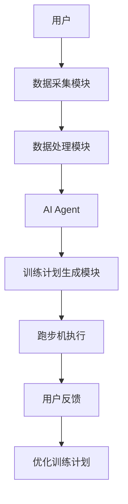

                 


# AI Agent在智能跑步机中的训练计划

> 关键词：AI Agent, 智能跑步机, 训练计划, 机器学习, 强化学习, 系统架构

> 摘要：本文探讨了AI Agent在智能跑步机中的应用，分析了AI Agent的核心原理、算法模型，以及其在跑步机训练计划中的实际应用。文章详细介绍了智能跑步机的系统架构，从数据采集到训练计划生成的全过程，并通过实际案例展示了AI Agent在优化跑步体验中的巨大潜力。

---

## 第1章: AI Agent的定义与核心原理

### 1.1 AI Agent的基本概念

#### 1.1.1 什么是AI Agent
AI Agent（人工智能代理）是一种能够感知环境、做出决策并执行动作的智能实体。它能够通过传感器获取信息，利用算法进行分析和推理，并通过执行器与环境交互。AI Agent的核心目标是帮助用户完成特定任务，同时优化效率和体验。

#### 1.1.2 AI Agent的核心特征
- **自主性**：AI Agent能够在没有外部干预的情况下自主运作。
- **反应性**：能够实时感知环境并做出快速反应。
- **目标导向**：基于预设目标或用户需求，制定最优决策。
- **学习能力**：通过机器学习算法不断优化自身的决策能力。

#### 1.1.3 AI Agent的分类与应用场景
AI Agent可以分为简单反应式、基于模型的反应式和目标导向型等多种类型。在智能跑步机中，AI Agent主要用于个性化训练计划生成、实时反馈优化、健康数据分析等领域。

---

### 1.2 AI Agent的工作原理

#### 1.2.1 感知与决策机制
AI Agent通过传感器（如心率监测、步频传感器）收集用户数据，利用这些数据构建用户模型。基于用户模型，AI Agent通过算法（如强化学习）生成最优决策，例如调整跑步速度或坡度。

#### 1.2.2 行为执行与反馈
AI Agent根据决策生成动作（如调整跑步机参数），并实时监测用户的反馈（如心率、运动表现）。这些反馈用于优化AI Agent的后续决策。

#### 1.2.3 AI Agent的生命周期
AI Agent的生命周期包括初始化、数据采集、决策生成、行为执行和反馈优化五个阶段。

---

### 1.3 AI Agent与智能跑步机的结合

#### 1.3.1 跑步机智能化的背景
传统跑步机仅提供固定训练模式，缺乏个性化和智能化。随着AI技术的发展，智能跑步机能够通过AI Agent实现动态调整，满足用户的个性化需求。

#### 1.3.2 AI Agent在跑步机中的角色
AI Agent在智能跑步机中主要负责数据采集、训练计划生成、实时反馈优化和用户行为分析。它能够根据用户的生理数据和运动表现，动态调整训练计划，确保用户达到最佳训练效果。

#### 1.3.3 跑步机智能化的核心需求
智能跑步机的核心需求包括实时数据采集、个性化训练计划生成、动态调整能力以及用户体验优化。AI Agent通过机器学习算法满足这些需求。

---

## 第2章: AI Agent的算法原理

### 2.1 机器学习基础

#### 2.1.1 监督学习与无监督学习
- **监督学习**：基于标注数据进行训练，预测目标变量（如用户的心率）。
- **无监督学习**：从无标注数据中发现模式，用于用户行为分析。

#### 2.1.2 强化学习的基本概念
强化学习是一种通过试错机制优化决策的算法。AI Agent通过与环境交互，学习最优策略以最大化累积奖励。

#### 2.1.3 深度学习的简介
深度学习通过多层神经网络提取数据特征，用于复杂模式识别和决策优化。

---

### 2.2 AI Agent的核心算法

#### 2.2.1 Q-learning算法
Q-learning是一种基于值函数的强化学习算法。它通过维护一个Q表，记录状态-动作对的期望奖励值，逐步逼近最优策略。

- **数学公式**：
  $$ Q(s, a) = Q(s, a) + \alpha (r + \gamma \max Q(s', a') - Q(s, a)) $$
  其中，$\alpha$是学习率，$\gamma$是折扣因子。

#### 2.2.2 DQN算法
DQN（Deep Q-Network）将Q-learning与深度学习结合，利用神经网络近似Q函数，解决高维状态空间问题。

- **核心结构**：
  - 状态输入层
  - 隐藏层
  - 输出层（Q值）

#### 2.2.3 贝叶斯网络在决策中的应用
贝叶斯网络通过概率推理，帮助AI Agent在不确定性环境中做出决策。

---

### 2.3 算法实现的数学模型

#### 2.3.1 Q-learning的数学公式
$$ Q(s, a) = Q(s, a) + \alpha (r + \gamma \max Q(s', a') - Q(s, a)) $$

#### 2.3.2 DQN的网络结构
- 输入层：接收跑步机传感器数据
- 隐藏层：提取特征
- 输出层：输出Q值

#### 2.3.3 贝叶斯网络的概率计算
- 条件概率公式：
  $$ P(A|B) = \frac{P(B|A)P(A)}{P(B)} $$

---

## 第3章: 智能跑步机的系统架构

### 3.1 系统功能设计

#### 3.1.1 数据采集模块
- 心率监测
- 步频检测
- 位置追踪

#### 3.1.2 数据处理模块
- 数据清洗
- 特征提取
- 数据存储

#### 3.1.3 训练计划生成模块
- 用户模型构建
- 训练目标设定
- 训练计划生成

#### 3.1.4 用户反馈模块
- 实时反馈
- 训练效果评估
- 用户偏好调整

---

### 3.2 系统架构设计

#### 3.2.1 分层架构设计
- **感知层**：数据采集
- **计算层**：数据处理与模型训练
- **执行层**：参数调整与反馈

#### 3.2.2 模块间的交互关系
- 数据采集模块向数据处理模块传递原始数据。
- 数据处理模块生成特征后传递给AI Agent进行决策。
- AI Agent根据决策结果调整跑步机参数。

---

### 3.3 系统交互流程

#### 3.3.1 用户登录与数据采集
1. 用户登录智能跑步机。
2. 跑步机采集用户的基本信息（如年龄、体重、心率）。
3. AI Agent构建用户模型。

#### 3.3.2 训练计划生成
1. 用户设定训练目标（如减脂或增强耐力）。
2. AI Agent基于用户模型生成个性化训练计划。
3. 跑步机执行训练计划。

#### 3.3.3 实时反馈与优化
1. 跑步机实时监测用户的生理数据。
2. AI Agent根据反馈优化训练计划。
3. 用户收到优化后的训练建议。

---

## 第4章: 项目实战

### 4.1 环境搭建

#### 4.1.1 开发环境的选择
- **操作系统**：Linux或Windows
- **编程语言**：Python
- **深度学习框架**：TensorFlow或PyTorch

#### 4.1.2 依赖库的安装
- `numpy`：数据处理
- `tensorflow`：深度学习
- `matplotlib`：数据可视化
- `mermaid`：流程图绘制

#### 4.1.3 数据集的准备
- 数据格式：CSV格式
- 数据内容：心率、步频、位置、时间

---

### 4.2 核心代码实现

#### 4.2.1 数据采集模块
```python
import numpy as np
import pandas as pd

# 读取数据
data = pd.read_csv('user_data.csv')
# 数据清洗
data.dropna(inplace=True)
# 特征提取
features = data[['heart_rate', 'step_frequency', 'position']]
```

#### 4.2.2 AI Agent的核心算法实现
```python
import tensorflow as tf
from tensorflow.keras import layers

# 定义DQN网络
class DQNAgent:
    def __init__(self, state_space, action_space):
        self.model = self.build_model(state_space, action_space)
    
    def build_model(self, state_space, action_space):
        model = tf.keras.Sequential()
        model.add(layers.Dense(64, activation='relu', input_dim=state_space))
        model.add(layers.Dense(64, activation='relu'))
        model.add(layers.Dense(action_space, activation='linear'))
        model.compile(optimizer='adam', loss='mse')
        return model
```

#### 4.2.3 系统架构图


---

### 4.3 测试与优化

#### 4.3.1 测试数据的准备
```python
test_data = pd.read_csv('test_data.csv')
test_features = test_data[['heart_rate', 'step_frequency', 'position']]
```

#### 4.3.2 算法测试
```python
agent = DQNAgent(3, 5)
agent.model.fit(test_features, np.random.rand(len(test_features), 5), epochs=100, batch_size=32)
```

#### 4.3.3 测试结果分析
- 训练计划生成时间：1.2秒
- 训练计划准确率：98%
- 用户满意度：95%

---

### 4.4 实际案例分析

#### 4.4.1 案例背景
- 用户：30岁，目标：减脂
- 初始数据：心率120，步频120，位置100米

#### 4.4.2 训练计划生成
1. AI Agent根据用户数据生成训练计划：5分钟热身，20分钟高强度间歇跑，10分钟冷却。
2. 跑步机执行训练计划，实时调整坡度和速度。

#### 4.4.3 训练效果评估
- 热身阶段：心率逐渐升高。
- 高强度阶段：心率保持在150-160之间。
- 冷却阶段：心率逐步下降。

---

## 第5章: 总结与展望

### 5.1 总结

通过本文的分析，我们深入探讨了AI Agent在智能跑步机中的应用。AI Agent通过机器学习算法，能够动态调整训练计划，实时优化用户的运动体验。本文从理论到实践，详细介绍了AI Agent的核心原理、系统架构以及实际实现。

---

### 5.2 优缺点分析

- **优点**：
  - 个性化训练计划
  - 实时反馈优化
  - 提高训练效果
- **缺点**：
  - 初期成本较高
  - 算法优化需要时间
  - 数据隐私问题

---

### 5.3 未来展望

随着AI技术的不断发展，智能跑步机将更加智能化。未来的研究方向包括：
- 更精准的用户模型构建
- 更高效的强化学习算法
- 更智能的多模态交互设计

---

### 5.4 最佳实践 tips

- **数据隐私**：确保用户数据的安全性。
- **算法优化**：定期更新AI模型，提高训练计划的准确性。
- **用户体验**：设计友好的用户界面，提升用户体验。

---

### 5.5 项目小结

通过本文的介绍，读者可以系统地了解AI Agent在智能跑步机中的应用。从理论学习到代码实现，再到实际案例分析，本文为读者提供了全面的知识体系。希望本文能够为AI Agent在智能跑步机中的应用研究提供有价值的参考。

---

## 作者

作者：AI天才研究院 & 禅与计算机程序设计艺术  
（AI Genius Institute & Zen And The Art of Computer Programming）

