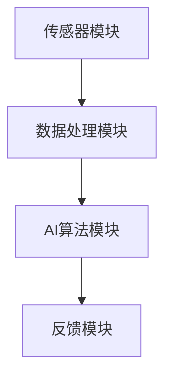

                 


# AI Agent在智能跑步鞋中的步态矫正指导

> 关键词：AI Agent，步态矫正，智能跑步鞋，传感器数据，机器学习，步态分析，运动健康

> 摘要：本文详细探讨了AI Agent在智能跑步鞋中的应用，重点分析了步态矫正的技术原理，包括传感器数据的采集与处理、机器学习算法的应用，以及系统架构设计。通过实际案例分析，展示了AI Agent如何有效指导用户改善跑步姿势，预防运动损伤，并展望了未来的发展方向。

---

## 第一部分：背景与概述

### 第1章：AI Agent与步态矫正概述

#### 1.1 问题背景

在现代运动健康领域，步态矫正已成为预防运动损伤和提升运动效率的重要手段。许多跑者由于姿势不当或技术错误，容易在跑步过程中受伤，影响健康和运动表现。传统的步态矫正方法依赖于专业教练的现场指导，但这种方法存在时间和空间的限制，难以满足广大跑者的需求。

AI Agent的出现为步态矫正带来了新的可能性。通过智能传感器和机器学习算法，AI Agent能够实时分析用户的跑步数据，提供个性化的矫正建议，从而帮助用户改善跑步姿势，预防受伤。

#### 1.2 AI Agent的基本概念

AI Agent（人工智能代理）是一种能够感知环境、执行任务并做出决策的智能系统。在智能跑步鞋中，AI Agent通过传感器收集数据，分析用户的跑步姿势，识别潜在的问题，并通过反馈系统提供矫正建议。

AI Agent的核心功能包括数据采集、分析、决策和反馈。它能够实时处理大量数据，快速识别异常情况，并通过语音或震动等方式向用户传递矫正指令。

#### 1.3 步态分析技术

步态分析是通过传感器数据来研究人体运动特征的过程。在智能跑步鞋中，常用的传感器包括加速度计、陀螺仪和压力传感器等。这些传感器能够捕捉跑步过程中的加速度、角度变化和地面接触压力等数据，为AI Agent提供分析依据。

通过步态分析，AI Agent能够识别用户的步频、步长、足部接触时间等关键参数，从而判断跑步姿势是否正确。

---

## 第二部分：AI Agent的基本原理

### 第2章：AI Agent的核心技术

#### 2.1 传感器数据采集

智能跑步鞋中的传感器负责采集跑步过程中的各项数据，包括：

- 加速度：用于分析跑步的加速度变化，帮助识别步伐的快慢。
- 陀螺仪：用于测量运动角度，帮助判断跑步时的身体姿态。
- 压力传感器：用于检测足部与地面的接触压力，分析跑步时的受力分布。

传感器数据的采集需要高精度和低延迟，以确保AI Agent能够实时处理数据。

#### 2.2 数据预处理

在AI Agent中，数据预处理是关键步骤。数据预处理包括以下几个步骤：

1. 数据清洗：去除噪声数据，确保数据的准确性。
2. 数据归一化：将不同传感器的数据标准化，便于后续分析。
3. 数据特征提取：从原始数据中提取有用的特征，如步频、步长、足部接触时间等。

#### 2.3 AI算法实现

AI Agent的核心是机器学习算法。常用的算法包括：

- **K-近邻算法（KNN）**：用于分类问题，识别用户的跑步姿势是否正确。
- **支持向量机（SVM）**：用于分类和回归问题，帮助识别异常步态。
- **随机森林（Random Forest）**：用于特征选择和分类，帮助识别影响步态的关键因素。

---

## 第三部分：步态分析技术

### 第3章：步态分析的实现

#### 3.1 数据采集与处理

在智能跑步鞋中，数据采集和处理的过程如下：

1. 传感器采集数据：加速度计、陀螺仪和压力传感器实时采集跑步数据。
2. 数据预处理：清洗、归一化和特征提取。
3. 数据存储：将处理后的数据存储在云端或本地数据库中。

#### 3.2 步态特征提取

步态特征提取是步态分析的核心步骤。常见的步态特征包括：

- **步频**：每分钟的步数，反映跑步速度。
- **步长**：每步的平均距离，反映跑步姿势。
- **足部接触时间**：每步中足部与地面的接触时间，反映跑步稳定性。

---

## 第四部分：算法原理

### 第4章：算法实现与优化

#### 4.1 运动捕捉

运动捕捉是通过传感器数据还原用户跑步姿势的过程。运动捕捉的关键在于数据的准确性和实时性。

在AI Agent中，运动捕捉通过传感器数据和算法分析，实现对用户跑步姿势的实时捕捉。

#### 4.2 数据预处理

数据预处理是确保算法准确性的重要步骤。以下是数据预处理的主要步骤：

1. 数据清洗：去除噪声数据，确保数据的准确性。
2. 数据归一化：将不同传感器的数据标准化，便于后续分析。
3. 数据特征提取：从原始数据中提取有用的特征，如步频、步长等。

#### 4.3 特征提取与分类

特征提取与分类是AI Agent的核心算法。以下是具体的实现步骤：

1. 特征提取：从传感器数据中提取有用的特征，如步频、步长等。
2. 分类算法：使用机器学习算法对提取的特征进行分类，识别用户的跑步姿势是否正确。

---

## 第五部分：数学模型

### 第5章：数学模型与公式

#### 5.1 运动学模型

运动学模型是分析跑步姿势的基础。以下是常见的运动学模型：

1. **加速度模型**：描述跑步过程中的加速度变化。
2. **角度模型**：描述跑步过程中的角度变化。

#### 5.2 步态特征分析模型

步态特征分析模型是基于机器学习的模型，用于分类用户的跑步姿势。以下是常见的步态特征分析模型：

1. **随机森林模型**：用于特征选择和分类。
2. **支持向量机模型**：用于分类和回归。

---

## 第六部分：系统分析与架构设计

### 第6章：系统架构设计

#### 6.1 系统组件

智能跑步鞋的步态矫正系统主要包括以下几个组件：

1. **传感器模块**：负责采集跑步数据。
2. **数据处理模块**：负责数据预处理和特征提取。
3. **AI算法模块**：负责分类和决策。
4. **反馈模块**：负责向用户传递矫正建议。

#### 6.2 系统架构图

以下是系统的架构图：



#### 6.3 系统交互流程

以下是系统的交互流程：

1. 传感器模块采集数据。
2. 数据处理模块进行预处理和特征提取。
3. AI算法模块进行分类和决策。
4. 反馈模块向用户传递矫正建议。

---

## 第七部分：项目实战

### 第7章：项目实战

#### 7.1 环境搭建

项目实战需要以下环境：

1. **硬件**：智能跑步鞋、传感器模块。
2. **软件**：Python编程语言、机器学习库（如scikit-learn）。

#### 7.2 核心代码实现

以下是核心代码实现：

```python
import numpy as np
from sklearn.neighbors import KNeighborsClassifier
from sklearn.model_selection import train_test_split

# 数据预处理
data = np.array([...])  # 传感器数据
labels = np.array([...])  # 步态标签

# 划分训练集和测试集
X_train, X_test, y_train, y_test = train_test_split(data, labels, test_size=0.2)

# 训练KNN模型
knn = KNeighborsClassifier(n_neighbors=3)
knn.fit(X_train, y_train)

# 预测步态
y_pred = knn.predict(X_test)
```

#### 7.3 案例分析

以下是实际案例分析：

1. **案例1**：用户A跑步时步频过快，AI Agent识别并建议减慢步伐。
2. **案例2**：用户B足部接触时间过长，AI Agent识别并建议调整跑步姿势。

---

## 第八部分：总结与展望

### 第8章：总结与展望

#### 8.1 总结

本文详细探讨了AI Agent在智能跑步鞋中的步态矫正指导技术，包括传感器数据采集、数据预处理、机器学习算法实现和系统架构设计。通过实际案例分析，展示了AI Agent在步态矫正中的实际应用效果。

#### 8.2 展望

未来，AI Agent在步态矫正中的应用将更加智能化和个性化。随着传感器技术的进步和算法的优化，AI Agent将能够更准确地识别用户的跑步姿势，并提供更精准的矫正建议。

---

作者：AI天才研究院/AI Genius Institute & 禅与计算机程序设计艺术 /Zen And The Art of Computer Programming

