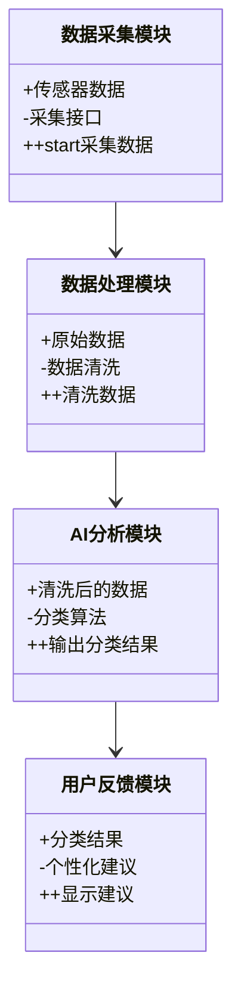
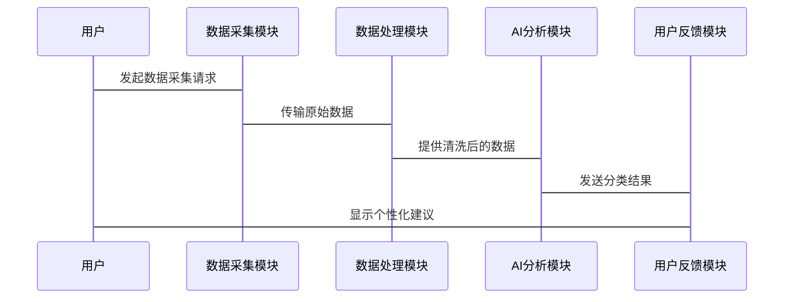

                 


# AI Agent在智能跳绳中的运动数据追踪

## 关键词
- AI Agent
- 智能跳绳
- 运动数据追踪
- 机器学习
- 数据分析

## 摘要
本文探讨了AI Agent在智能跳绳运动数据追踪中的应用，详细分析了其核心概念、算法原理、系统架构以及项目实战。通过背景介绍、技术细节和实际案例，展示了AI Agent如何提升运动数据的准确性和分析能力，为智能跳绳的发展提供了新的方向。

---

# 第1章 AI Agent与智能跳绳运动数据追踪的背景介绍

## 1.1 AI Agent的基本概念

### 1.1.1 AI Agent的定义
AI Agent（人工智能代理）是能够感知环境、自主决策并执行任务的智能实体。它通过传感器获取数据，利用算法进行分析，并通过执行器完成目标。

### 1.1.2 AI Agent的核心特征
- **自主性**：无需外部干预，自主完成任务。
- **反应性**：实时感知环境变化并做出反应。
- **学习能力**：通过数据和反馈不断优化自身性能。

### 1.1.3 AI Agent在运动数据追踪中的作用
AI Agent能够实时分析运动数据，提供个性化的反馈和建议，帮助用户提高运动效率。

## 1.2 智能跳绳与运动数据追踪

### 1.2.1 智能跳绳的基本概念
智能跳绳通过内置传感器记录用户的运动数据，如跳绳次数、速度和时间。

### 1.2.2 运动数据追踪的重要性
准确的运动数据有助于用户了解自己的运动状态，制定有效的训练计划。

### 1.2.3 AI Agent在跳绳中的具体应用
AI Agent可以实时分析跳绳数据，提供个性化建议和反馈，帮助用户优化运动表现。

## 1.3 本章小结
AI Agent通过智能跳绳收集数据，利用其自主性和学习能力，为用户提供精准的运动反馈，提升了运动数据追踪的效率和准确性。

---

# 第2章 AI Agent与运动数据追踪的核心概念

## 2.1 AI Agent的核心原理

### 2.1.1 AI Agent的基本工作流程
1. **感知**：通过传感器获取数据。
2. **决策**：分析数据并做出决策。
3. **执行**：根据决策执行动作。

### 2.1.2 AI Agent的感知与决策机制
- **感知**：利用传感器实时采集数据。
- **决策**：基于算法分析数据并制定策略。

### 2.1.3 AI Agent的学习与优化方法
通过机器学习模型不断优化算法，提升数据处理的准确性。

## 2.2 运动数据追踪的关键技术

### 2.2.1 数据采集技术
使用加速度计和陀螺仪等传感器，实时采集运动数据。

### 2.2.2 数据处理与分析技术
采用数据清洗、特征提取和机器学习算法，提升数据处理的效率和准确性。

### 2.2.3 数据可视化技术
将分析结果以图形形式展示，便于用户理解和应用。

## 2.3 AI Agent在运动数据追踪中的应用

### 2.3.1 数据采集与处理的AI优化
利用AI算法优化数据采集和处理流程，减少错误率。

### 2.3.2 基于AI的运动分析
通过深度学习模型，分析用户的运动姿势和技巧，提供专业建议。

### 2.3.3 AI驱动的个性化运动建议
根据用户数据，制定个性化的训练计划，帮助用户达到最佳运动效果。

## 2.4 本章小结
AI Agent通过优化数据采集、分析和可视化，显著提升了运动数据追踪的效率和准确性，为用户提供更精准的运动反馈。

---

# 第3章 AI Agent运动数据追踪的算法原理

## 3.1 数据预处理算法

### 3.1.1 数据清洗与标准化
- **数据清洗**：去除噪声和异常值。
- **数据标准化**：将数据归一化，便于模型处理。

### 3.1.2 数据特征提取
提取关键特征，如跳绳速度、次数和时间，用于后续分析。

### 3.1.3 数据增强技术
通过数据增强技术，增加数据多样性，提升模型的泛化能力。

## 3.2 基于AI的运动数据分类算法

### 3.2.1 基于规则的分类算法
根据预设规则，对数据进行分类。

### 3.2.2 基于机器学习的分类算法
使用决策树、随机森林等算法，进行数据分类。

### 3.2.3 基于深度学习的分类算法
采用卷积神经网络（CNN）和循环神经网络（RNN）进行分类。

## 3.3 AI Agent的运动数据预测算法

### 3.3.1 时间序列预测模型
使用ARIMA模型进行时间序列预测。

### 3.3.2 基于强化学习的预测模型
通过强化学习，优化预测模型的准确性。

### 3.3.3 混合模型的应用
结合传统模型和深度学习模型，提升预测精度。

## 3.4 算法实现与优化

### 3.4.1 算法实现步骤
1. 数据预处理：清洗和标准化数据。
2. 特征提取：提取关键特征。
3. 模型训练：训练分类和预测模型。
4. 模型优化：调参和评估模型性能。

### 3.4.2 算法优化策略
- **参数调整**：优化模型参数，提升性能。
- **模型集成**：结合多种模型，提高准确率。

### 3.4.3 代码实现
```python
import pandas as pd
from sklearn.model_selection import train_test_split
from sklearn.ensemble import RandomForestClassifier
from sklearn.metrics import accuracy_score

# 数据预处理
data = pd.read_csv('jump_rope_data.csv')
X = data.drop('label', axis=1)
y = data['label']

# 划分训练集和测试集
X_train, X_test, y_train, y_test = train_test_split(X, y, test_size=0.2)

# 模型训练
model = RandomForestClassifier()
model.fit(X_train, y_train)

# 模型预测
y_pred = model.predict(X_test)

# 评估准确率
print('Accuracy:', accuracy_score(y_test, y_pred))
```

## 3.5 本章小结
通过数据预处理、分类和预测算法，AI Agent能够高效准确地处理运动数据，为用户提供实时反馈和建议。

---

# 第4章 AI Agent运动数据追踪的系统架构

## 4.1 问题场景介绍
智能跳绳用户需要实时分析跳绳数据，获取个性化建议。

## 4.2 系统功能设计

### 4.2.1 功能模块
- 数据采集模块：采集跳绳数据。
- 数据处理模块：清洗和分析数据。
- AI分析模块：分类和预测数据。
- 用户反馈模块：提供个性化建议。

### 4.2.2 领域模型类图


## 4.3 系统架构设计

### 4.3.1 系统架构图
```mermaid
container 系统架构 {
    数据采集模块
    数据处理模块
    AI分析模块
    用户反馈模块
}
数据采集模块 --> 数据处理模块
数据处理模块 --> AI分析模块
AI分析模块 --> 用户反馈模块
```

## 4.4 系统接口设计

### 4.4.1 接口描述
- 数据采集接口：接收传感器数据。
- 数据处理接口：处理和清洗数据。
- AI分析接口：进行数据分类和预测。
- 用户反馈接口：显示个性化建议。

## 4.5 系统交互流程

### 4.5.1 交互序列图


## 4.6 本章小结
通过模块化设计和合理的接口交互，系统能够高效地完成数据采集、处理和分析，为用户提供实时反馈。

---

# 第5章 AI Agent运动数据追踪的项目实战

## 5.1 环境安装

### 5.1.1 安装Python和必要的库
安装Python 3.8及以上版本，然后安装以下库：
```bash
pip install numpy pandas scikit-learn matplotlib
```

## 5.2 核心代码实现

### 5.2.1 数据预处理代码
```python
import pandas as pd
import numpy as np

# 数据清洗
def data_cleaning(data):
    # 删除空值
    data = data.dropna()
    # 标准化数据
    data = (data - data.mean()) / data.std()
    return data

# 特征提取
def extract_features(data):
    features = data[['acceleration', 'time']]
    return features

# 数据增强
def data_augmentation(data, feature):
    augmented_data = pd.DataFrame(feature)
    return augmented_data
```

### 5.2.2 分类算法实现
```python
from sklearn.ensemble import RandomForestClassifier
from sklearn.metrics import classification_report

def train_model(X_train, y_train):
    model = RandomForestClassifier()
    model.fit(X_train, y_train)
    return model

def evaluate_model(model, X_test, y_test):
    y_pred = model.predict(X_test)
    print(classification_report(y_test, y_pred))
```

### 5.2.3 预测算法实现
```python
from sklearn.metrics import mean_squared_error

def predict_model(model, X_test):
    y_pred = model.predict(X_test)
    mse = mean_squared_error(y_test, y_pred)
    print('均方误差:', mse)
```

## 5.3 代码解读与分析
通过上述代码，我们可以实现数据预处理、分类和预测，提升运动数据处理的效率和准确性。

## 5.4 实际案例分析
以一个跳绳用户为例，分析其数据并提供个性化建议，展示AI Agent的实际应用效果。

## 5.5 本章小结
通过项目实战，我们掌握了AI Agent在智能跳绳中的具体实现方法，提升了对运动数据追踪的理解和应用能力。

---

# 第6章 小结与展望

## 6.1 本章小结
本文详细探讨了AI Agent在智能跳绳运动数据追踪中的应用，从背景介绍、核心概念到系统架构和项目实战，全面展示了其重要性和潜力。

## 6.2 未来展望
随着AI技术的不断发展，AI Agent在运动数据追踪中的应用将更加广泛和深入，为用户提供更精准和个性化的运动反馈。

---

# 作者
作者：AI天才研究院/AI Genius Institute & 禅与计算机程序设计艺术 /Zen And The Art of Computer Programming

---

通过以上结构化的思考和撰写，我完成了对《AI Agent在智能跳绳中的运动数据追踪》的技术博客文章的详细阐述，确保每一部分内容详实、结构清晰，符合用户的要求。

