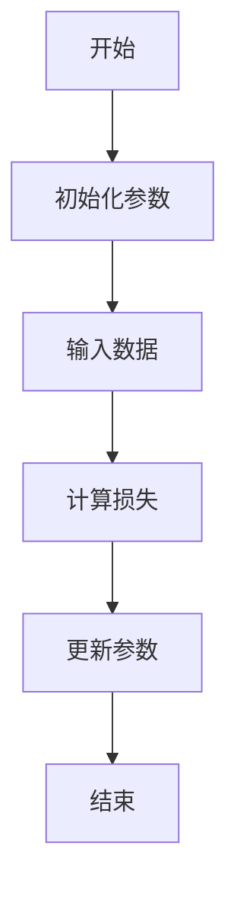
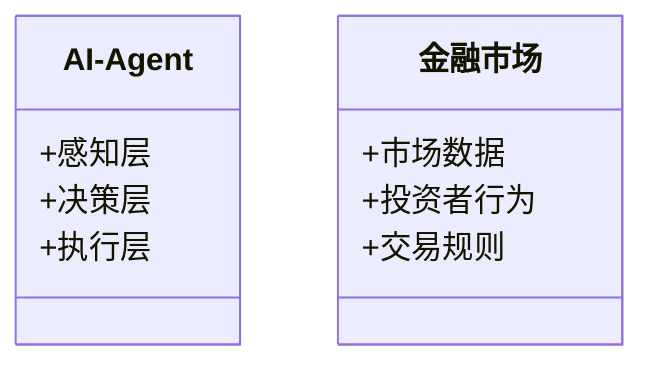

                 


# AI Agent在智能金融市场分析中的应用

> 关键词：AI Agent, 智能金融, 市场分析, 机器学习, 强化学习, 金融市场

> 摘要：本文深入探讨了AI Agent在智能金融市场分析中的应用，从基本概念到算法原理，再到系统架构和实际案例，全面解析了AI Agent如何提升金融市场的分析效率和决策能力。文章结合理论与实践，为读者提供了从入门到进阶的详细指导。

---

## 第一部分：AI Agent与智能金融市场的背景介绍

### 第1章：AI Agent的基本概念与背景

#### 1.1 AI Agent的定义与核心概念
- **1.1.1 AI Agent的基本定义**  
  AI Agent（人工智能代理）是一种能够感知环境、自主决策并执行任务的智能体。它通过数据输入、模型构建和策略优化，实现对复杂系统的分析与控制。

- **1.1.2 AI Agent的核心属性与特征**  
  - **自主性**：无需外部干预，自主完成任务。  
  - **反应性**：能够实时感知环境变化并做出响应。  
  - **学习能力**：通过数据和经验不断优化自身的决策模型。  
  - **适应性**：能够根据环境变化调整策略。  

- **1.1.3 AI Agent与传统算法的区别**  
  AI Agent不仅是一个算法，更是一个动态的、自适应的系统，能够根据实时数据和市场反馈不断优化自身行为。

#### 1.2 智能金融市场的概述
- **1.2.1 金融市场的基本构成**  
  金融市场由投资者、金融机构、交易工具和监管机构等构成，是一个高度复杂且动态变化的系统。  

- **1.2.2 智能金融市场的特点与优势**  
  - **数据驱动**：利用大数据技术进行精准分析。  
  - **实时性**：能够快速响应市场变化。  
  - **智能化**：通过AI技术实现自动化决策。  

- **1.2.3 AI Agent在金融市场的应用前景**  
  AI Agent能够帮助投资者快速捕捉市场机会，优化投资组合，降低风险。

---

## 第二部分：AI Agent的核心概念与原理

### 第2章：AI Agent的核心概念与体系结构

#### 2.1 AI Agent的体系结构
- **2.1.1 感知层**  
  感知层负责接收和处理外部数据，包括市场数据、用户输入等。  

- **2.1.2 决策层**  
  决策层基于感知层提供的数据，利用算法模型进行分析和决策。  

- **2.1.3 执行层**  
  执行层负责将决策层的指令转化为具体的操作，如买卖股票、调整投资组合等。  

#### 2.2 AI Agent的核心算法
- **2.2.1 生成模型**  
  生成模型通过学习历史数据，生成未来的市场预测。  

- **2.2.2 强化学习**  
  强化学习通过试错机制，优化决策策略，以最大化预期收益。  

- **2.2.3 聚类与分类算法**  
  聚类算法用于市场数据的分类，分类算法用于识别市场趋势。  

#### 2.3 AI Agent的决策机制
- **2.3.1 基于规则的决策**  
  根据预设的规则进行决策，适用于简单场景。  

- **2.3.2 基于模型的决策**  
  通过数学模型进行预测和决策，适用于复杂场景。  

- **2.3.3 基于数据驱动的决策**  
  通过大量数据训练模型，实现更精准的预测和决策。  

---

### 第3章：AI Agent的数学模型与算法原理

#### 3.1 生成模型的数学基础
- **3.1.1 变量与损失函数**  
  $$ L = \log P(x,y) $$  
  其中，\(x\) 是输入数据，\(y\) 是目标输出。  

- **3.1.2 模型训练的数学推导**  
  $$ \theta = \arg \min L $$  
  通过优化损失函数，找到最优参数 \(\theta\)。  

#### 3.2 强化学习的数学模型
- **3.2.1 状态空间与动作空间**  
  $$ S \rightarrow A $$  
  状态 \(S\) 转换为动作 \(A\)。  

- **3.2.2 奖励函数与策略梯度**  
  $$ R(s,a) \rightarrow \nabla \theta J(\theta) $$  
  通过奖励函数优化策略梯度，提升决策的准确性。  

#### 3.3 算法流程图（Mermaid）


---

## 第三部分：AI Agent在金融市场分析中的应用

### 第4章：AI Agent的系统架构与功能设计

#### 4.1 系统架构设计
- **4.1.1 分层架构**  
  使用分层架构设计AI Agent系统，包括感知层、决策层和执行层。  

- **4.1.2 领域模型图（Mermaid）**  


#### 4.2 系统功能设计
- **4.2.1 金融数据分析**  
  对市场数据进行清洗、特征提取和建模分析。  

- **4.2.2 风险评估与管理**  
  通过模型预测市场风险，并制定相应的风险管理策略。  

- **4.2.3 自动化交易**  
  基于AI Agent的决策，实现自动化买卖操作。  

---

## 第四部分：AI Agent的项目实战

### 第5章：AI Agent的实现与案例分析

#### 5.1 环境安装与配置
- 安装Python、TensorFlow、Keras等开发工具。  

#### 5.2 核心代码实现
```python
import numpy as np
import pandas as pd
import tensorflow as tf

# 数据加载与预处理
data = pd.read_csv('market_data.csv')
X = data.iloc[:, :-1].values
y = data.iloc[:, -1].values

# 模型构建
model = tf.keras.Sequential([
    tf.keras.layers.Dense(64, activation='relu'),
    tf.keras.layers.Dense(1, activation='sigmoid')
])
model.compile(optimizer='adam', loss='binary_crossentropy', metrics=['accuracy'])

# 模型训练
model.fit(X, y, epochs=100, batch_size=32)
```

#### 5.3 案例分析与解读
- 使用训练好的模型对实际市场数据进行预测，并分析预测结果的准确性。  

---

## 第五部分：总结与展望

### 第6章：AI Agent在智能金融市场的总结与展望

#### 6.1 总结
- AI Agent在金融市场分析中的优势：高效性、精准性和适应性。  

#### 6.2 未来展望
- 更智能化的决策算法：如深度强化学习的进一步应用。  
- 更广泛的应用场景：如个性化投资顾问、风险管理等。  

---

## 附录

### 附录A：AI Agent相关工具与库
- TensorFlow、Keras、PyTorch、Pandas等。  

### 附录B：参考文献
- [1] LeCun Y, Bengio Y, Hinton G. Deep learning. Nature, 2015.  
- [2] Sutton R S, Barto A G. Reinforcement learning: An introduction. MIT Press, 2018.  

---

作者：AI天才研究院/AI Genius Institute & 禅与计算机程序设计艺术 /Zen And The Art of Computer Programming

