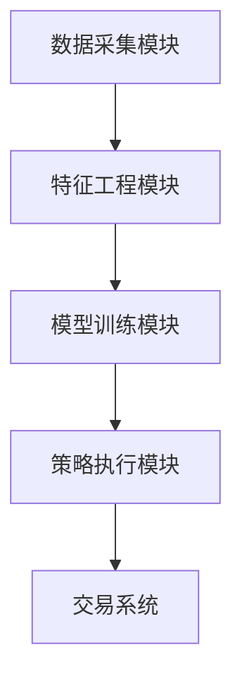
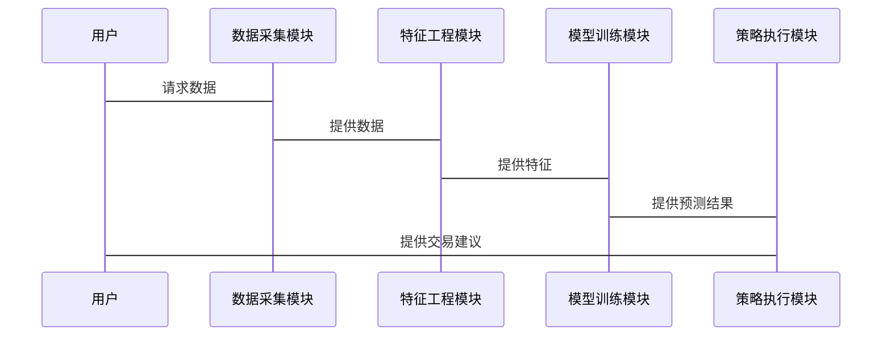

                 


# AI Agent在智能金融市场预测中的应用

## 关键词：AI Agent, 金融市场预测, 强化学习, 时间序列分析, 机器学习, 自然语言处理

## 摘要：AI Agent通过整合机器学习、自然语言处理和时间序列分析，利用强化学习算法在金融市场中实现高效预测。本文将详细分析AI Agent在金融预测中的核心原理、系统架构和实际应用，并探讨其在金融投资中的潜力与挑战。

## 第一章：AI Agent与金融市场的背景介绍

### 1.1 AI Agent的基本概念

#### 1.1.1 什么是AI Agent
AI Agent（人工智能代理）是能够感知环境、自主决策并执行任务的智能实体。它通过传感器获取信息，利用算法处理数据，做出决策并采取行动，以实现特定目标。

#### 1.1.2 AI Agent的核心特点
- **自主性**：无需外部干预，自主执行任务。
- **反应性**：能实时感知环境变化并做出反应。
- **目标导向**：所有行动均以实现特定目标为导向。
- **学习能力**：通过经验改进性能，具备自适应能力。

#### 1.1.3 AI Agent与传统金融工具的区别
AI Agent能够实时分析数据、动态调整策略，克服传统金融工具在应对市场波动时的滞后性和局限性。

### 1.2 AI Agent在金融市场的应用背景

#### 1.2.1 金融市场的复杂性与不确定性
金融市场受多种因素影响，如经济指标、政策变化和市场情绪，这些因素导致市场预测的复杂性和不确定性。

#### 1.2.2 传统金融预测的局限性
传统金融预测方法依赖历史数据分析，但难以应对实时市场波动和突发事件，预测精度有限。

#### 1.2.3 AI Agent的优势与潜力
AI Agent能够处理大量非结构化数据，实时分析市场动态，动态调整投资策略，显著提高预测精度和投资收益。

## 第二章：AI Agent的核心概念与原理

### 2.1 AI Agent的核心概念原理

#### 2.1.1 AI Agent的感知机制
AI Agent通过多种传感器和数据源收集金融市场数据，包括股票价格、交易量、新闻和社交媒体情绪等。

##### 数据采集与预处理
- **数据源**：收集股票价格、市场新闻、社交媒体数据等。
- **数据清洗**：处理缺失值、异常值，标准化数据。
- **特征提取**：从原始数据中提取有用特征，如均值、方差、趋势等。

#### 2.1.2 AI Agent的决策机制
AI Agent基于感知的信息，利用机器学习算法做出最优决策。

##### 强化学习算法
- **Q-learning算法**：通过状态-动作-奖励机制，学习最优策略。
- **深度强化学习**：利用深度神经网络处理复杂金融市场数据，做出更复杂的决策。

##### 时间序列预测模型
- **LSTM网络**：擅长处理时间序列数据，捕捉长期依赖关系，适合股票价格预测。
- **ARIMA模型**：广泛应用于时间序列预测，适合处理线性趋势和季节性变化。

#### 2.1.3 AI Agent的执行机制
AI Agent根据决策结果执行交易操作，如买入、卖出或持有。

### 2.2 AI Agent的技术基础

#### 2.2.1 机器学习算法
- **监督学习**：用于分类和回归任务，如股票价格预测。
- **无监督学习**：用于聚类分析，识别市场模式。
- **强化学习**：用于动态决策，如交易策略优化。

#### 2.2.2 自然语言处理技术
- **情感分析**：分析新闻和社交媒体情绪，预测市场走势。
- **文本挖掘**：从新闻和报告中提取关键词，辅助投资决策。

#### 2.2.3 时间序列分析
- **LSTM网络**：捕捉时间序列中的长期依赖关系，适合股票价格预测。
- **Prophet模型**：简单易用，适合预测未来趋势。

## 第三章：AI Agent在金融市场预测中的算法原理

### 3.1 强化学习算法在金融预测中的应用

#### 3.1.1 强化学习的基本原理
通过状态、动作和奖励机制，学习最优策略。

##### Q-learning算法
通过状态转移和奖励机制，更新Q值表，找到最优动作序列。

##### 深度强化学习
使用深度神经网络近似Q值函数，处理高维金融市场数据。

##### 算法流程
1. 状态观察：获取当前市场数据。
2. 动作选择：基于当前状态选择交易动作。
3. 执行动作：在市场中执行交易。
4. 获取奖励：根据交易结果获得奖励。
5. 更新模型：基于奖励更新Q值函数。

### 3.2 监督学习算法在金融预测中的应用

#### 3.2.1 监督学习的基本原理
通过训练数据，建立输入与输出之间的映射关系，预测未来市场走势。

##### 算法流程
1. 数据准备：收集和预处理金融数据。
2. 特征工程：提取有助于预测的特征。
3. 模型训练：训练监督学习模型，如线性回归、SVM、随机森林。
4. 模型评估：测试模型性能，调整参数。
5. 预测与优化：使用模型预测未来走势，持续优化模型。

### 3.3 时间序列分析在金融预测中的应用

#### 3.3.1 时间序列分析的基本原理
分析数据随时间的变化模式，建立数学模型，预测未来趋势。

##### LSTM网络
通过细胞状态和记忆单元，捕捉时间序列中的长期依赖关系。

##### ARIMA模型
通过自回归、差分和移动平均成分，预测未来趋势。

## 第四章：AI Agent的系统分析与架构设计

### 4.1 系统功能设计

#### 4.1.1 数据采集模块
- **功能**：实时采集金融市场数据。
- **数据源**：股票市场数据API、新闻网站、社交媒体等。

#### 4.1.2 特征工程模块
- **功能**：提取有助于预测的特征。
- **方法**：统计特征、技术指标、文本情感特征等。

#### 4.1.3 模型训练模块
- **功能**：训练AI Agent的预测模型。
- **算法**：强化学习、监督学习、时间序列分析。

#### 4.1.4 策略执行模块
- **功能**：根据模型预测结果执行交易策略。
- **机制**：根据预测结果生成买卖信号，执行交易。

### 4.2 系统架构设计

#### 4.2.1 系统架构图


#### 4.2.2 接口设计
- **数据接口**：与金融市场数据源API对接。
- **策略接口**：与交易系统对接，执行交易指令。
- **用户接口**：提供用户交互界面，显示预测结果和交易建议。

#### 4.2.3 交互流程图


## 第五章：AI Agent的项目实战

### 5.1 环境安装

```bash
pip install numpy pandas scikit-learn tensorflow keras matplotlib
```

### 5.2 核心代码实现

#### 5.2.1 数据预处理代码
```python
import numpy as np
import pandas as pd
from sklearn.preprocessing import MinMaxScaler

# 加载数据
data = pd.read_csv('stock_price.csv')

# 数据标准化
scaler = MinMaxScaler()
data_scaled = scaler.fit_transform(data)

# 划分训练集和测试集
train_size = int(len(data_scaled) * 0.8)
train_data = data_scaled[:train_size]
test_data = data_scaled[train_size:]
```

#### 5.2.2 模型训练代码
```python
from keras.models import Sequential
from keras.layers import LSTM, Dense

# 构建LSTM模型
model = Sequential()
model.add(LSTM(50, input_shape=(look_back, 1)))
model.add(Dense(1))
model.compile(loss='mean_squared_error', optimizer='adam')

# 训练模型
model.fit(train_data, epochs=100, verbose=1)
```

#### 5.2.3 预测与评估代码
```python
# 预测测试集
look_back = 10
test_pred = model.predict(test_data)

# 计算均方误差
from sklearn.metrics import mean_squared_error
mse = mean_squared_error(test_data, test_pred)
print(f'均方误差: {mse}')
```

### 5.3 实际案例分析

#### 5.3.1 案例背景
分析某股票的历史价格数据，预测其未来价格走势。

#### 5.3.2 数据分析与特征提取
使用技术指标（如移动平均线、相对强弱指数）和市场情绪指标（如社交媒体情感）作为特征。

#### 5.3.3 模型训练与预测
利用LSTM网络训练模型，预测未来10天的股票价格。

#### 5.3.4 交易策略实现
根据预测结果生成买卖信号，执行自动化交易。

## 第六章：总结与展望

### 6.1 最佳实践tips
- **数据质量**：确保数据的准确性和完整性。
- **模型选择**：根据具体问题选择合适的算法。
- **风险管理**：制定风险管理策略，控制交易风险。
- **持续优化**：定期更新模型，适应市场变化。

### 6.2 小结
AI Agent通过整合多种技术，如强化学习、时间序列分析和自然语言处理，能够有效提高金融市场的预测精度和投资收益。

### 6.3 注意事项
- **数据隐私**：确保数据的隐私和安全。
- **模型过拟合**：防止模型过拟合，保持泛化能力。
- **市场波动**：金融市场高度波动，模型需要持续优化。

### 6.4 拓展阅读
- 《Deep Learning for Time Series Forecasting》
- 《Reinforcement Learning: Theory and Algorithms》
- 《Natural Language Processing in Finance》

## 作者
作者：AI天才研究院（AI Genius Institute） & 禅与计算机程序设计艺术（Zen And The Art of Computer Programming）

---

通过本文的详细分析，我们可以看到AI Agent在金融市场预测中的巨大潜力和广泛应用。随着技术的不断进步，AI Agent将为金融行业带来更多的创新和突破。

