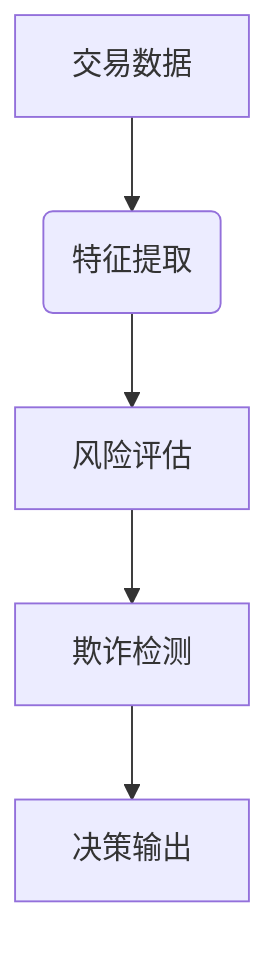
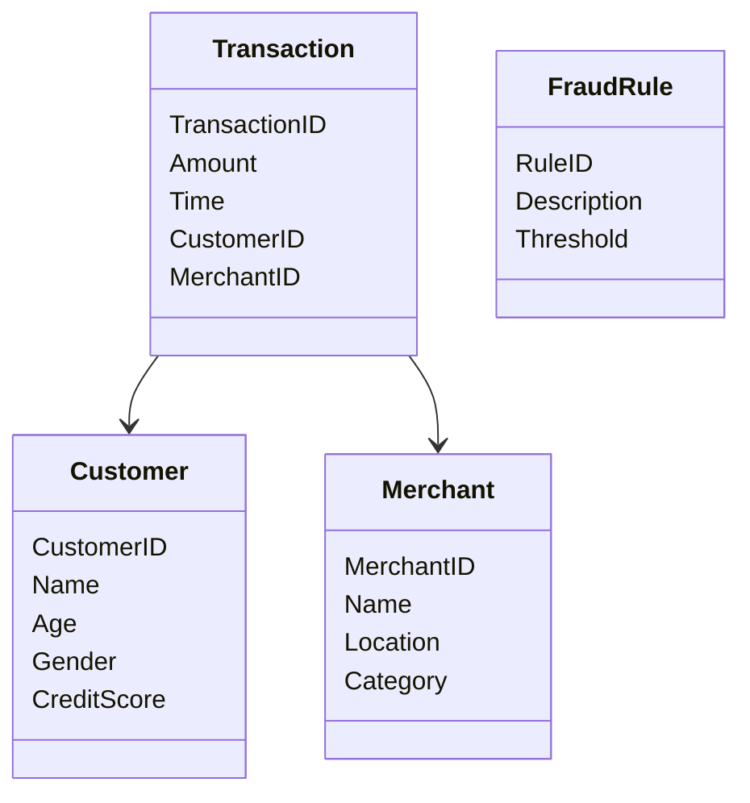

                 


# AI Agent在智能金融欺诈检测中的应用

## 关键词：
AI Agent, 金融欺诈检测, 强化学习, 图神经网络, 多智能体系统

## 摘要：
本文深入探讨了AI Agent在智能金融欺诈检测中的应用。通过分析AI Agent的核心概念、技术原理及其在金融欺诈检测中的优势，结合实际案例，展示了如何利用AI Agent提升金融欺诈检测的效率和准确性。文章还详细讲解了相关的算法原理、系统架构设计和项目实战，为读者提供全面的技术指导。

---

# 第一部分: AI Agent与智能金融欺诈检测的背景介绍

## 第1章: AI Agent与金融欺诈检测概述

### 1.1 AI Agent的基本概念

#### 1.1.1 AI Agent的定义
AI Agent（人工智能代理）是指能够感知环境、自主决策并采取行动的智能实体。与传统的算法不同，AI Agent具有更强的自主性和适应性，能够在复杂环境中动态调整策略。

#### 1.1.2 AI Agent的核心特点
- **自主性**：能够在没有外部干预的情况下运行。
- **反应性**：能够实时感知环境并做出反应。
- **学习能力**：通过与环境的交互不断优化自身行为。
- **协作性**：能够与其他AI Agent或系统协同工作。

#### 1.1.3 AI Agent与传统算法的区别
| 特性         | AI Agent                          | 传统算法                          |
|--------------|-----------------------------------|-----------------------------------|
| 自主性       | 高                                 | 低                                 |
| 学习能力     | 强                                 | 弱                                 |
| 适应性       | 高                                 | 中                                 |
| 决策能力     | 强                                 | 弱                                 |

### 1.2 金融欺诈检测的背景与挑战

#### 1.2.1 金融欺诈的现状分析
金融欺诈问题日益严重，欺诈手段不断升级，传统的基于规则的检测方法已难以应对复杂的欺诈行为。

#### 1.2.2 传统金融欺诈检测的局限性
- **规则复杂**：需要手动编写大量规则，难以覆盖所有可能的欺诈场景。
- **效率低下**：传统方法依赖人工审核，效率较低。
- **适应性差**：难以快速应对新型欺诈手段。

#### 1.2.3 AI Agent在金融欺诈检测中的优势
- **实时性**：能够实时监控交易数据，快速发现异常。
- **自主性**：无需人工干预，自动调整检测策略。
- **适应性**：能够学习新的欺诈模式，持续优化检测效果。

### 1.3 AI Agent在金融欺诈检测中的应用前景

#### 1.3.1 金融欺诈检测的主要场景
- **交易欺诈检测**：监测异常交易行为，识别信用卡欺诈、网络诈骗等。
- **身份验证**：通过行为分析识别仿冒用户。
- **异常检测**：实时监控系统日志，发现潜在攻击。

#### 1.3.2 AI Agent在金融欺诈检测中的潜在价值
- **提高检测效率**：通过自主学习和实时监控，显著提升检测速度。
- **降低误报率**：利用强化学习优化决策，减少误报。
- **适应性更强**：能够快速应对新型欺诈手段。

#### 1.3.3 未来发展趋势与研究方向
- **多智能体协作**：通过多AI Agent协作，提升整体检测能力。
- **跨领域应用**：将AI Agent技术扩展到更多金融领域，如风险管理、信用评估等。
- **隐私保护**：在保证检测效果的同时，保护用户隐私。

### 1.4 本章小结
本章介绍了AI Agent的基本概念、核心特点以及在金融欺诈检测中的优势，为后续内容奠定了基础。

---

# 第二部分: AI Agent的核心概念与技术原理

## 第2章: AI Agent的核心概念与技术原理

### 2.1 AI Agent的核心原理

#### 2.1.1 多智能体系统（Multi-Agent System）
多智能体系统是由多个AI Agent组成的协作系统，通过智能体之间的通信和协作完成复杂任务。

#### 2.1.2 强化学习（Reinforcement Learning）
强化学习是一种通过试错机制优化决策的方法，AI Agent通过与环境的交互获得奖励，从而优化自身行为。

#### 2.1.3 联合学习（Federated Learning）
联合学习是一种分布式学习方法，多个AI Agent在不共享数据的情况下，通过通信优化整体模型。

### 2.2 AI Agent在金融欺诈检测中的技术架构

#### 2.2.1 数据流图分析


#### 2.2.2 实体关系图分析
```mermaid
erd
    customer(CustomerID, Name, Age, Gender, CreditScore)
    transaction(TransactionID, Amount, Time, CustomerID, MerchantID)
    merchant(MerchantID, Name, Location, Category)
    fraud_rule(RuleID, Description, Threshold)
```

#### 2.2.3 系统架构图分析


### 2.3 AI Agent与传统算法的对比分析

#### 2.3.1 对比维度与特征表格
| 特性         | AI Agent                          | 传统算法                          |
|--------------|-----------------------------------|-----------------------------------|
| 自主性       | 高                                 | 低                                 |
| 学习能力     | 强                                 | 弱                                 |
| 适应性       | 高                                 | 中                                 |
| 决策能力     | 强                                 | 弱                                 |

#### 2.3.2 AI Agent的性能优势
- **学习能力强**：能够快速适应新的欺诈模式。
- **实时性高**：能够实时处理交易数据，快速做出决策。
- **协作能力强**：通过多智能体协作，提升整体检测能力。

#### 2.3.3 传统算法的局限性
- **规则复杂**：需要手动编写大量规则，难以覆盖所有可能的欺诈场景。
- **效率低下**：传统方法依赖人工审核，效率较低。
- **适应性差**：难以快速应对新型欺诈手段。

### 2.4 本章小结
本章详细介绍了AI Agent的核心原理及其在金融欺诈检测中的技术架构，分析了AI Agent与传统算法的优劣势。

---

# 第三部分: AI Agent的算法原理与数学模型

## 第3章: AI Agent的算法原理与数学模型

### 3.1 强化学习算法原理

#### 3.1.1 强化学习的基本概念
强化学习是一种通过试错机制优化决策的方法，AI Agent通过与环境的交互获得奖励，从而优化自身行为。

#### 3.1.2 Q-learning算法的数学模型
$$ Q(s, a) = r + \gamma \max_{a'} Q(s', a') $$
其中，\( Q(s, a) \) 表示在状态 \( s \) 下采取动作 \( a \) 的价值，\( r \) 是奖励，\( \gamma \) 是折扣因子，\( Q(s', a') \) 是下一状态的最大价值。

#### 3.1.3 Deep Q-Networks (DQN)的实现原理
DQN通过深度神经网络近似Q函数，能够处理高维状态空间。

### 3.2 图神经网络算法原理

#### 3.2.1 图神经网络的基本概念
图神经网络是一种处理图结构数据的深度学习方法，能够有效捕捉图中的结构信息。

#### 3.2.2 图注意力机制的数学模型
$$ \alpha_{ij} = \frac{e^{score(i,j)}}{\sum_{k} e^{score(i,k)}} $$
其中，\( \alpha_{ij} \) 是节点 \( i \) 和 \( j \) 之间的注意力权重，\( score(i,j) \) 是节点 \( i \) 和 \( j \) 的相似度评分。

#### 3.2.3 图神经网络在金融欺诈检测中的应用
通过图神经网络，可以有效识别欺诈交易中的异常行为模式。

### 3.3 AI Agent的数学模型

#### 3.3.1 多智能体协作的数学模型
$$ V(s) = \max_{a} \left[ r(s,a) + \gamma V(s') \right] $$
其中，\( V(s) \) 是状态 \( s \) 的价值，\( r(s,a) \) 是采取动作 \( a \) 的奖励，\( s' \) 是下一状态。

#### 3.3.2 联合学习的数学模型
$$ \theta_i = \arg\max_{\theta} \sum_{j} \mathcal{L}(\theta, \theta_j) $$
其中，\( \theta_i \) 是智能体 \( i \) 的参数，\( \mathcal{L} \) 是损失函数，\( \theta_j \) 是其他智能体的参数。

### 3.4 本章小结
本章详细介绍了强化学习和图神经网络在AI Agent中的应用，分析了AI Agent的数学模型。

---

# 第四部分: AI Agent的系统分析与架构设计

## 第4章: AI Agent的系统分析与架构设计

### 4.1 问题场景介绍

#### 4.1.1 金融欺诈检测的典型场景
- **交易欺诈检测**：监测异常交易行为，识别信用卡欺诈、网络诈骗等。
- **身份验证**：通过行为分析识别仿冒用户。
- **异常检测**：实时监控系统日志，发现潜在攻击。

### 4.2 项目介绍

#### 4.2.1 项目目标
开发一个基于AI Agent的金融欺诈检测系统，实现高效、准确的欺诈检测。

#### 4.2.2 项目范围
- 数据采集与预处理
- 模型训练与优化
- 系统部署与测试

### 4.3 系统功能设计

#### 4.3.1 领域模型


#### 4.3.2 系统架构设计
```mermaid
container 整体架构 {
    component 数据采集模块 {
        DataCollector
        DataPreprocessor
    }
    component 模型训练模块 {
        FeatureExtractor
        ModelTrainer
    }
    component 检测引擎模块 {
        FraudDetector
        DecisionMaker
    }
    component 系统接口模块 {
        API
        Database
    }
}
```

#### 4.3.3 系统接口设计
- **数据接口**：与交易系统、客户系统等对接，获取实时数据。
- **用户接口**：提供可视化界面，供用户查看检测结果。
- **API接口**：提供REST API，供其他系统调用检测结果。

### 4.4 本章小结
本章详细介绍了AI Agent金融欺诈检测系统的架构设计，包括系统功能、模块划分和接口设计。

---

# 第五部分: AI Agent的项目实战

## 第5章: AI Agent的项目实战

### 5.1 环境安装与配置

#### 5.1.1 安装Python环境
使用Anaconda或虚拟环境，安装Python 3.8以上版本。

#### 5.1.2 安装依赖库
安装以下依赖库：
```bash
pip install numpy pandas scikit-learn tensorflow keras matplotlib
```

### 5.2 系统核心实现

#### 5.2.1 数据采集与预处理
```python
import pandas as pd
import numpy as np

# 数据采集
def collect_data():
    # 从数据库中读取数据
    data = pd.read_sql(...)
    return data

# 数据预处理
def preprocess_data(data):
    # 数据清洗和特征提取
    data.dropna()
    data['is_fraud'] = data['is_fraud'].astype(int)
    return data
```

#### 5.2.2 模型训练与优化
```python
import tensorflow as tf
from tensorflow.keras import layers

# 构建模型
def build_model(input_shape):
    model = tf.keras.Sequential()
    model.add(layers.Dense(64, activation='relu', input_shape=input_shape))
    model.add(layers.Dense(32, activation='relu'))
    model.add(layers.Dense(1, activation='sigmoid'))
    model.compile(optimizer='adam', loss='binary_crossentropy', metrics=['accuracy'])
    return model

# 训练模型
def train_model(model, X_train, y_train, epochs=10):
    model.fit(X_train, y_train, epochs=epochs, batch_size=32)
    return model
```

#### 5.2.3 系统部署与测试
```python
import json

# 系统接口
class FraudDetectionSystem:
    def __init__(self, model):
        self.model = model

    def predict_fraud(self, transaction):
        # 转换交易数据为模型输入
        input_data = self.transform_transaction(transaction)
        prediction = self.model.predict(input_data)
        return prediction[0][0] > 0.5

    def transform_transaction(self, transaction):
        # 特征提取
        features = [transaction['amount'], transaction['time']]
        return np.array(features).reshape(1, -1)
```

### 5.3 项目小结

#### 5.3.1 项目实现的关键点
- 数据预处理：清洗和特征提取。
- 模型训练：构建和训练AI Agent模型。
- 系统部署：实现接口和可视化界面。

#### 5.3.2 项目成果
- 开发了一个高效的金融欺诈检测系统。
- 实现了AI Agent的实时检测和决策功能。

### 5.4 本章小结
本章通过实际案例展示了AI Agent在金融欺诈检测中的应用，详细讲解了项目的实现过程。

---

# 第六部分: AI Agent的最佳实践与总结

## 第6章: AI Agent的最佳实践与总结

### 6.1 最佳实践

#### 6.1.1 数据质量
- 确保数据的完整性和准确性。
- 处理缺失值和异常值。

#### 6.1.2 模型优化
- 使用交叉验证优化模型参数。
- 定期更新模型，适应新的欺诈模式。

#### 6.1.3 系统安全
- 保护用户隐私，避免数据泄露。
- 建立完善的日志系统，记录系统运行状态。

### 6.2 小结

#### 6.2.1 核心知识点回顾
- AI Agent的基本概念。
- 金融欺诈检测的背景与挑战。
- 强化学习和图神经网络的应用。
- 系统架构设计与项目实战。

#### 6.2.2 总结
AI Agent技术在金融欺诈检测中的应用前景广阔，通过不断优化算法和系统架构，能够显著提升检测效率和准确性。

### 6.3 注意事项

#### 6.3.1 数据隐私
在处理金融数据时，必须遵守相关法律法规，保护用户隐私。

#### 6.3.2 模型更新
定期更新模型，确保其能够应对新的欺诈手段。

### 6.4 拓展阅读

#### 6.4.1 推荐书籍
- 《深度学习》（Deep Learning）—— Ian Goodfellow
- 《强化学习》（Reinforcement Learning: Theory and Algorithms）—— Richard S. Sutton

#### 6.4.2 推荐论文
- “Attention Is All You Need” —— Vaswani et al.
- “Graph Neural Networks: A Review of Methods, Applications, and Open Challenges” —— Wu et al.

### 6.5 本章小结
本章总结了AI Agent在金融欺诈检测中的应用，提出了最佳实践建议，并推荐了进一步学习的资源。

---

# 作者：AI天才研究院/AI Genius Institute & 禅与计算机程序设计艺术 /Zen And The Art of Computer Programming

---

这篇文章系统地介绍了AI Agent在智能金融欺诈检测中的应用，从基本概念到算法原理，再到系统设计和项目实战，为读者提供了全面的技术指导。

