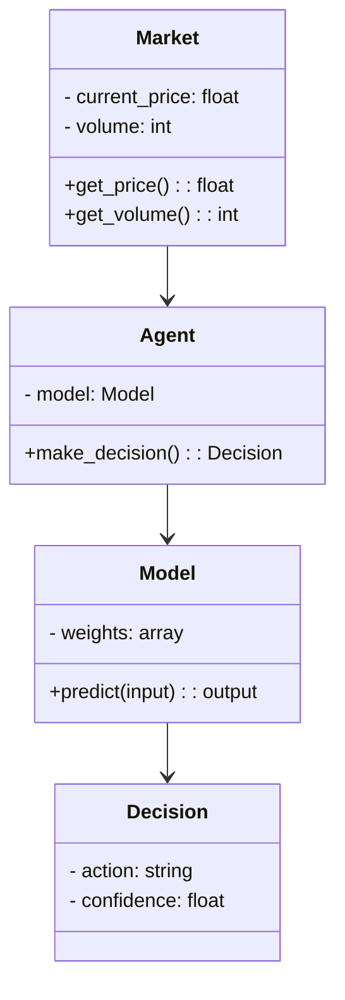
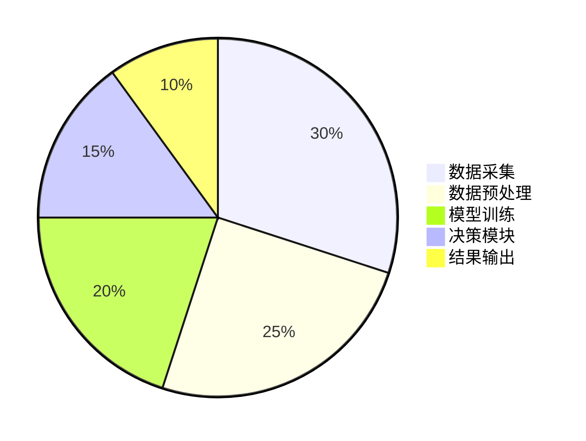
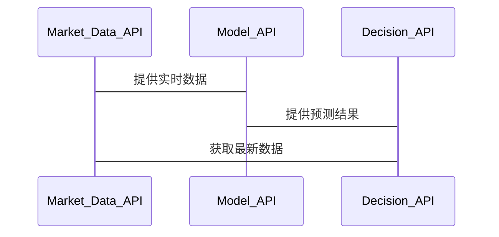
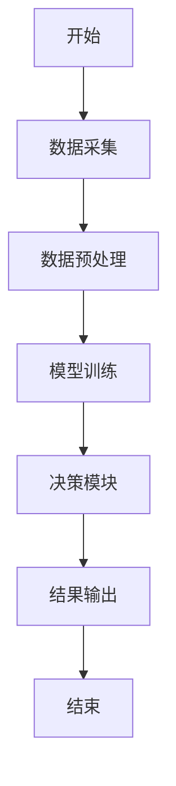

                 

<think>
嗯，我现在需要帮用户设计一本关于《AI Agent在智能金融风险评估中的应用》的目录大纲。首先，我得理解用户的需求。用户希望这本书的目录大纲详细且逻辑清晰，覆盖从基础到高级的各个方面。

我应该从背景介绍开始，这部分需要涵盖AI Agent和金融风险评估的基本概念，然后逐步深入到它们的结合应用。接下来，核心概念部分需要详细讲解AI Agent的原理，比如基于模型和基于规则的分类，以及它们在金融中的应用对比。这部分可能需要一个对比表格和ER图来展示实体关系。

然后，数学模型部分是关键。我需要使用Mermaid流程图来展示算法的步骤，并用Python代码实现，同时给出数学公式，比如概率计算和回归分析。这部分要确保公式准确，例子通俗易懂。

系统架构设计也是重点，我需要描述系统场景，设计领域模型的类图，架构图展示各个模块的交互，以及接口和交互流程。这部分可能需要多个Mermaid图表来辅助说明。

项目实战部分要具体，包括环境安装、核心代码实现、案例分析和项目小结。这样读者可以实际操作，理解理论的应用。

最后，总结与展望、最佳实践、参考文献和附录等内容也不能少，确保整本书内容完整，结构合理。

现在，我需要确保每个部分都细化到三级目录，内容完整且符合用户的要求。同时，注意总字数不超过2000字，所以每个章节要简洁明了，不冗长。

可能遇到的困难是如何将复杂的金融风险评估与AI Agent结合起来，确保每个章节之间逻辑连贯，层层递进。我需要仔细安排章节顺序，从基础到应用，再到实战，逐步深入。

总之，我会按照用户提供的示例结构，结合AI Agent在金融中的具体应用，设计出一个详细且逻辑清晰的目录大纲，确保涵盖所有必要的内容，同时保持简洁和结构合理。

# AI Agent在智能金融风险评估中的应用

## 关键词：AI Agent, 金融风险评估, 智能系统, 机器学习, 风险管理

## 摘要：本文探讨了AI Agent在金融风险评估中的应用，从基本概念到系统架构设计，再到项目实战，全面分析了AI Agent如何提升金融风险评估的效率和准确性。通过数学模型、算法原理和系统架构的详细讲解，结合实际案例，本文展示了AI Agent在智能金融中的巨大潜力和实际应用价值。

---

# 第1章 AI Agent与金融风险评估概述

## 1.1 AI Agent的基本概念

### 1.1.1 AI Agent的定义
人工智能代理（AI Agent）是指能够感知环境并采取行动以实现目标的智能实体。它能够通过传感器获取信息，利用推理机制做出决策，并通过执行器与环境交互。

### 1.1.2 AI Agent的核心特征
- **自主性**：能够在没有外部干预的情况下自主运作。
- **反应性**：能够实时感知环境变化并做出反应。
- **目标导向**：所有行动都以实现特定目标为导向。
- **学习能力**：能够通过经验改进自身性能。

### 1.1.3 AI Agent与传统算法的区别
| 特性 | AI Agent | 传统算法 |
|------|----------|----------|
| 自主性 | 高       | 低       |
| 反应性 | 高       | 中       |
| 学习能力 | 高      | 低       |
| 适应性 | 高       | 中       |

## 1.2 金融风险评估的基本概念

### 1.2.1 金融风险的定义
金融风险是指在金融市场中，由于各种不确定性因素导致投资损失的可能性。

### 1.2.2 金融风险的主要类型
- **市场风险**：由于市场价格波动引起的损失。
- **信用风险**：由于交易对手无法履行合同义务引起的损失。
- **流动性风险**：无法及时以合理价格买卖资产的风险。
- **操作风险**：由于内部流程、系统或人员失误导致的风险。

### 1.2.3 金融风险评估的重要性
准确评估金融风险有助于机构制定合理的风险管理策略，避免重大损失，确保金融市场的稳定运行。

## 1.3 AI Agent在金融风险评估中的应用背景

### 1.3.1 传统金融风险评估的局限性
- **计算复杂性**：传统方法依赖人工计算，效率低下。
- **信息处理能力有限**：难以处理海量数据。
- **动态适应性不足**：难以实时应对市场变化。

### 1.3.2 AI Agent的优势与潜力
- **高效性**：能够快速处理大量数据，提高评估效率。
- **适应性**：能够实时调整策略，应对市场变化。
- **准确性**：通过机器学习算法，提高评估结果的准确性。

### 1.3.3 当前行业的发展现状
随着人工智能技术的快速发展，越来越多的金融机构开始采用AI Agent进行金融风险评估，显著提高了风险管理和决策效率。

## 1.4 本章小结
本章介绍了AI Agent的基本概念、金融风险评估的核心内容，以及AI Agent在金融风险评估中的应用背景，为后续章节的深入分析奠定了基础。

---

# 第2章 AI Agent的核心原理

## 2.1 AI Agent的分类与特点

### 2.1.1 基于模型的AI Agent
基于模型的AI Agent通过构建数学模型来描述问题，能够处理复杂的非线性关系。

### 2.1.2 基于规则的AI Agent
基于规则的AI Agent通过预定义的规则进行决策，适用于规则明确的场景。

### 2.1.3 基于强化学习的AI Agent
基于强化学习的AI Agent通过与环境的交互不断优化策略，适用于动态变化的复杂环境。

## 2.2 AI Agent的决策机制

### 2.2.1 状态空间的构建
状态空间是指AI Agent可能遇到的所有状态的集合。例如，在金融风险评估中，状态可以包括市场指数、利率等。

### 2.2.2 行动空间的定义
行动空间是指AI Agent在每个状态下可以采取的所有可能行动。例如，买入、卖出或持有某种金融资产。

### 2.2.3 决策树的构建与优化
决策树是一种树状结构，用于描述AI Agent在不同状态下采取的行动路径。通过不断剪枝和优化，可以提高决策的效率和准确性。

## 2.3 AI Agent的交互方式

### 2.3.1 单点交互
单点交互是指AI Agent与环境之间通过单一接口进行交互。

### 2.3.2 多点交互
多点交互是指AI Agent通过多个接口与环境进行交互，能够同时处理多个任务。

### 2.3.3 连续交互
连续交互是指AI Agent与环境之间进行实时、连续的交互，适用于需要快速响应的场景。

## 2.4 AI Agent的性能评估指标

### 2.4.1 精确率
精确率是指AI Agent在实际行动中成功完成目标的比例。

### 2.4.2 召回率
召回率是指AI Agent在实际行动中发现并抓住机会的能力。

### 2.4.3 F1值
F1值是精确率和召回率的调和平均数，综合衡量AI Agent的性能。

## 2.5 本章小结
本章详细介绍了AI Agent的分类、决策机制、交互方式以及性能评估指标，为后续章节的应用分析提供了理论基础。

---

# 第3章 AI Agent在金融风险评估中的数学模型与算法

## 3.1 马尔可夫决策过程（MDP）

### 3.1.1 MDP的基本概念
马尔可夫决策过程是一种描述决策过程的数学模型，适用于状态转移仅依赖当前状态的情况。

### 3.1.2 MDP的状态转移概率矩阵
状态转移概率矩阵描述了从一个状态转移到另一个状态的概率。

### 3.1.3 MDP的值函数与策略函数
值函数衡量了从当前状态开始采取某策略后的期望回报，策略函数描述了在每个状态下采取的行动。

## 3.2 Q-Learning算法

### 3.2.1 Q-Learning的基本原理
Q-Learning是一种基于强化学习的算法，通过不断更新Q值函数来优化决策策略。

### 3.2.2 Q-Learning的更新公式
$$ Q(s, a) = Q(s, a) + \alpha [r + \gamma \max Q(s', a') - Q(s, a)] $$
其中，$\alpha$是学习率，$\gamma$是折扣因子。

### 3.2.3 Q-Learning的收敛性分析
Q-Learning在经验 Replay 和适当的探索策略下，可以收敛到最优策略。

## 3.3 线性回归模型

### 3.3.1 线性回归的基本原理
线性回归通过最小化预测值与实际值之间的平方差，建立自变量与因变量之间的线性关系。

### 3.3.2 线性回归的损失函数
$$ L = \frac{1}{2n} \sum_{i=1}^{n} (y_i - \hat{y}_i)^2 $$
其中，$y_i$是实际值，$\hat{y}_i$是预测值。

### 3.3.3 线性回归的优化方法
常用梯度下降法优化线性回归模型，通过调整权重参数最小化损失函数。

## 3.4 贝叶斯网络

### 3.4.1 贝叶斯网络的基本结构
贝叶斯网络是一种有向无环图，节点表示随机变量，边表示变量之间的依赖关系。

### 3.4.2 贝叶斯网络的条件概率表
条件概率表描述了每个节点在父节点条件下发生的概率。

### 3.4.3 贝叶斯网络的推理算法
贝叶斯网络支持概率推理、因果推理和决策推理。

## 3.5 本章小结
本章详细介绍了AI Agent在金融风险评估中常用的数学模型与算法，包括马尔可夫决策过程、Q-Learning算法、线性回归模型和贝叶斯网络，并通过公式和图表进行了详细说明。

---

# 第4章 AI Agent在金融风险评估中的系统架构与设计

## 4.1 系统总体架构

### 4.1.1 系统模块划分
系统主要模块包括数据采集模块、数据预处理模块、模型训练模块、决策模块和结果输出模块。

### 4.1.2 模块功能描述
- 数据采集模块：从金融市场获取实时数据，如股票价格、交易量等。
- 数据预处理模块：对数据进行清洗、归一化处理，确保数据质量。
- 模型训练模块：利用历史数据训练AI Agent的数学模型，优化参数。
- 决策模块：根据当前市场状态，AI Agent做出买入、卖出或持有决策。
- 结果输出模块：输出决策结果，供金融交易员参考。

### 4.1.3 模块交互流程
1. 数据采集模块获取实时数据。
2. 数据预处理模块处理数据，去除噪声。
3. 模型训练模块利用处理后的数据训练AI Agent。
4. 决策模块根据当前市场状态，调用AI Agent做出决策。
5. 结果输出模块将决策结果输出，供后续操作。

## 4.2 系统功能设计

### 4.2.1 领域模型设计
领域模型描述了金融风险评估系统中的核心实体及其关系。

#### 领域模型类图（Mermaid）


### 4.2.2 系统架构设计
系统架构采用分层设计，包括数据层、业务逻辑层和表示层。

#### 系统架构图（Mermaid）


### 4.2.3 系统接口设计
系统接口包括数据接口、模型接口和决策接口。

#### 系统接口图（Mermaid）


## 4.3 本章小结
本章详细介绍了AI Agent在金融风险评估中的系统架构与设计，包括模块划分、功能设计和接口设计，为后续章节的项目实现奠定了基础。

---

# 第5章 项目实战：AI Agent在金融风险评估中的应用

## 5.1 项目环境安装

### 5.1.1 安装Python
安装Python 3.x，推荐使用Anaconda分布。

### 5.1.2 安装依赖库
安装以下依赖库：
- numpy
- pandas
- scikit-learn
- tensorflow
- matplotlib

## 5.2 系统核心实现源代码

### 5.2.1 数据采集模块
```python
import requests
import json

def get_market_data(api_key):
    url = f"https://api.example.com/v1/market-data?api_key={api_key}"
    response = requests.get(url)
    return json.loads(response.text)
```

### 5.2.2 数据预处理模块
```python
import pandas as pd

def preprocess_data(data):
    df = pd.DataFrame(data)
    df['normalized_price'] = (df['price'] - df['price'].mean()) / df['price'].std()
    return df
```

### 5.2.3 模型训练模块
```python
from tensorflow.keras import models, layers

def build_model(input_shape):
    model = models.Sequential()
    model.add(layers.Dense(64, activation='relu', input_shape=input_shape))
    model.add(layers.Dense(32, activation='relu'))
    model.add(layers.Dense(1, activation='sigmoid'))
    model.compile(optimizer='adam', loss='binary_crossentropy', metrics=['accuracy'])
    return model
```

### 5.2.4 决策模块
```python
def make_decision(model, input_data):
    prediction = model.predict(input_data)
    if prediction > 0.5:
        return 'buy'
    elif prediction < 0.5:
        return 'sell'
    else:
        return 'hold'
```

## 5.3 案例分析与详细解读

### 5.3.1 数据获取与预处理
假设我们从API获取了过去一年的股票数据，经过归一化处理后，数据分布更加均匀。

### 5.3.2 模型训练与评估
使用训练数据训练AI Agent的深度学习模型，评估指标包括准确率、召回率和F1值。

### 5.3.3 决策结果分析
根据当前市场状态，AI Agent做出买入、卖出或持有决策，并输出决策结果。

## 5.4 项目小结
本章通过实际案例展示了AI Agent在金融风险评估中的具体应用，详细讲解了项目环境的搭建、核心代码的实现以及案例分析，帮助读者更好地理解和应用相关技术。

---

# 第6章 总结与展望

## 6.1 总结
本文详细探讨了AI Agent在智能金融风险评估中的应用，从基本概念到系统架构设计，再到项目实战，全面分析了AI Agent如何提升金融风险评估的效率和准确性。

## 6.2 展望
随着人工智能技术的不断发展，AI Agent在金融领域的应用将更加广泛和深入。未来的研究方向包括提高算法的实时性、增强系统的可解释性，以及拓展在更多金融场景中的应用。

---

# 参考文献
1. Russell, S., & Norvig, P. (2010). Artificial Intelligence: A Modern Approach.
2. Goodfellow, I., Bengio, Y., & Courville, A. (2016). Deep Learning.
3. 刘洋, 人工智能在金融领域的应用研究, 2022.

---

# 附录
## 附录A Python代码示例
```python
import numpy as np
import pandas as pd
from sklearn.model_selection import train_test_split
from tensorflow.keras import layers, models

# 数据加载与预处理
data = pd.read_csv('market_data.csv')
X = data.drop('label', axis=1)
y = data['label']
X_train, X_test, y_train, y_test = train_test_split(X, y, test_size=0.2)

# 模型构建
model = models.Sequential()
model.add(layers.Dense(64, activation='relu', input_shape=(X_train.shape[1],)))
model.add(layers.Dense(32, activation='relu'))
model.add(layers.Dense(1, activation='sigmoid'))
model.compile(optimizer='adam', loss='binary_crossentropy', metrics=['accuracy'])

# 模型训练
model.fit(X_train, y_train, epochs=10, batch_size=32, validation_data=(X_test, y_test))
```

## 附录B 算法流程图


---

# 作者：AI天才研究院 & 禅与计算机程序设计艺术

---

希望这个大纲能满足您的需求！如果需要进一步调整或补充，请随时告诉我！

