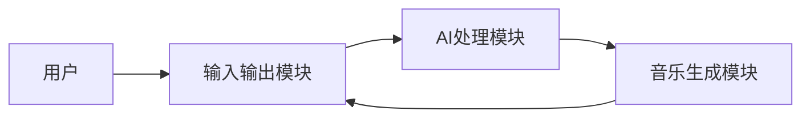

                 


# AI Agent在智能钢琴中的弹奏技巧分析

## 关键词：AI Agent, 智能钢琴, 弹奏技巧, 音乐生成, 人工智能, 强化学习

## 摘要：本文深入探讨了AI Agent在智能钢琴中的应用，分析了AI Agent如何通过强化学习、生成模型等技术提升钢琴弹奏技巧。文章从背景概念、技术基础、系统架构、算法实现到项目实战，全面解析了AI Agent在智能钢琴中的工作原理和实际应用，为音乐爱好者和AI技术开发者提供了深刻的见解。

---

# 第1章: AI Agent与智能钢琴的背景与概念

## 1.1 AI Agent的基本概念

### 1.1.1 AI Agent的定义与特点
AI Agent（人工智能代理）是一种能够感知环境、自主决策并执行任务的智能实体。它具备以下特点：
- **自主性**：能够独立执行任务，无需外部干预。
- **反应性**：能够实时感知环境并做出反应。
- **目标导向**：基于目标驱动行为。
- **学习能力**：通过数据和经验不断优化性能。

### 1.1.2 AI Agent的核心技术与实现原理
AI Agent的核心技术包括：
1. **机器学习**：通过数据训练模型，使其具备识别和预测能力。
2. **自然语言处理**：理解和生成人类语言，实现人机交互。
3. **强化学习**：通过奖励机制优化决策过程。

### 1.1.3 AI Agent在音乐领域的应用潜力
AI Agent在音乐领域的潜力体现在音乐生成、演奏辅助、教学等方面。通过AI Agent，钢琴演奏可以实现更高的精准度和创造力。

## 1.2 智能钢琴的基本概念

### 1.2.1 智能钢琴的定义与分类
智能钢琴是一种结合了计算机技术和传统钢琴的乐器，能够通过传感器和软件实现智能化演奏和教学。根据功能的不同，智能钢琴可以分为演奏型、教学型和创作型。

### 1.2.2 智能钢琴的功能与优势
智能钢琴的功能包括：
1. **实时反馈**：通过传感器和软件，实时分析演奏者的技巧并给予反馈。
2. **智能教学**：提供个性化的教学方案，帮助演奏者提高技巧。
3. **音乐生成**：通过AI算法生成音乐作品。

### 1.2.3 智能钢琴与传统钢琴的主要区别
智能钢琴与传统钢琴的主要区别在于智能化功能。智能钢琴可以通过AI技术实现更高的演奏精准度和创作能力。

## 1.3 AI Agent在智能钢琴中的应用背景

### 1.3.1 音乐技术的智能化发展趋势
随着人工智能技术的发展，音乐领域逐渐智能化。AI Agent在音乐生成、演奏和教学中的应用越来越广泛。

### 1.3.2 AI Agent在钢琴演奏中的问题背景
钢琴演奏需要高度的技巧和艺术性，传统的教学方法存在效率低、个性化不足的问题。AI Agent可以通过智能化手段解决这些问题。

### 1.3.3 AI Agent如何解决钢琴演奏中的技术难点
AI Agent可以通过实时反馈、个性化教学和音乐生成等技术，帮助演奏者克服技术难点，提高演奏水平。

## 1.4 本章小结
本章介绍了AI Agent和智能钢琴的基本概念，分析了AI Agent在智能钢琴中的应用背景和技术潜力。

---

# 第2章: AI Agent在智能钢琴中的技术基础

## 2.1 AI Agent的核心算法与技术

### 2.1.1 强化学习算法
强化学习是一种通过奖励机制优化决策过程的算法。在钢琴演奏中，AI Agent可以通过强化学习优化演奏技巧。

### 2.1.2 生成对抗网络（GAN）
生成对抗网络是一种通过对抗训练生成高质量数据的模型。在音乐生成中，GAN可以用于生成旋律和和弦。

### 2.1.3 变量自回归模型（VAE）
变量自回归模型是一种通过条件概率生成数据的模型。在音乐生成中，VAE可以用于生成基于特定风格的音乐。

### 2.1.4 算法原理与实现
AI Agent的算法实现需要结合音乐数据和演奏技巧，通过大量训练数据优化模型性能。

## 2.2 音乐信息处理技术

### 2.2.1 MIDI数据与音符表示
MIDI数据是音乐信息的数字化表示，AI Agent可以通过分析MIDI数据生成音乐作品。

### 2.2.2 音乐节奏与节拍分析
AI Agent可以通过分析音乐的节奏和节拍，优化演奏的节奏感和韵律感。

### 2.2.3 音乐情感与风格分析
AI Agent可以通过分析音乐的情感和风格，生成符合特定情感的音乐作品。

## 2.3 AI Agent在音乐生成中的应用

### 2.3.1 音乐生成模型的原理
音乐生成模型通过深度学习算法，生成符合特定风格和情感的音乐作品。

### 2.3.2 基于AI Agent的音乐创作流程
AI Agent可以通过输入创作需求，生成音乐作品并实时反馈创作建议。

### 2.3.3 音乐生成的评估与优化
AI Agent可以通过评估生成音乐的质量，优化音乐生成的算法和模型。

## 2.4 本章小结
本章介绍了AI Agent的核心算法和技术，分析了音乐信息处理技术在智能钢琴中的应用。

---

# 第3章: 智能钢琴AI Agent的系统架构设计

## 3.1 系统功能模块划分

### 3.1.1 输入输出模块
输入输出模块负责接收用户的输入和输出结果。在智能钢琴中，输入输出模块可以是 MIDI 传感器和扬声器。

### 3.1.2 AI处理模块
AI处理模块负责分析和生成音乐数据。AI Agent通过强化学习和生成模型优化演奏技巧。

### 3.1.3 用户交互模块
用户交互模块负责与用户的交互。在智能钢琴中，用户交互模块可以是触摸屏和语音助手。

## 3.2 系统架构设计

### 3.2.1 系统架构图


### 3.2.2 系统功能模块交互
AI处理模块与音乐生成模块协同工作，生成高质量的音乐作品。用户可以通过输入输出模块与系统进行交互，获得实时反馈和建议。

## 3.3 系统接口设计

### 3.3.1 MIDI接口
AI Agent通过MIDI接口与智能钢琴连接，接收和发送音乐数据。

### 3.3.2 用户接口
AI Agent通过触摸屏和语音助手与用户进行交互，提供个性化的演奏建议。

## 3.4 本章小结
本章详细分析了智能钢琴AI Agent的系统架构设计，介绍了各个功能模块的交互和接口设计。

---

# 第4章: AI Agent的算法实现

## 4.1 算法原理与数学模型

### 4.1.1 强化学习算法
强化学习通过奖励机制优化决策过程。数学模型如下：
$$ R = \sum_{t=1}^{T} r_t $$
其中，R是总奖励，r_t是第t步的奖励。

### 4.1.2 生成对抗网络（GAN）
GAN由生成器和判别器组成。生成器通过生成假数据欺骗判别器，判别器通过区分真实数据和生成数据优化生成器。

### 4.1.3 变量自回归模型（VAE）
VAE通过概率分布生成数据。数学模型如下：
$$ q(z|x) = \mathcal{N}(z; \mu_x, \sigma_x^2) $$

## 4.2 算法实现与代码示例

### 4.2.1 强化学习代码
```python
class Agent:
    def __init__(self, state_space, action_space):
        self.state_space = state_space
        self.action_space = action_space
        self.model = self.build_model()

    def build_model(self):
        # 构建强化学习模型
        pass

    def act(self, state):
        # 选择动作
        pass

    def learn(self, state, action, reward):
        # 更新模型
        pass
```

### 4.2.2 生成对抗网络代码
```python
import tensorflow as tf

class GAN:
    def __init__(self, input_dim):
        self.input_dim = input_dim
        self.g = self.build_generator()
        self.d = self.build_discriminator()

    def build_generator(self):
        # 构建生成器模型
        pass

    def build_discriminator(self):
        # 构建判别器模型
        pass

    def train(self, X_train, epochs):
        # 训练GAN模型
        pass
```

## 4.3 本章小结
本章详细讲解了AI Agent的算法实现，包括强化学习、生成对抗网络和变量子回归模型的原理和代码实现。

---

# 第5章: 项目实战

## 5.1 项目环境搭建

### 5.1.1 系统需求
需要安装Python、TensorFlow、MIDI库等。

### 5.1.2 安装依赖
使用pip安装所需库：
```bash
pip install tensorflow midi numpy
```

## 5.2 核心代码实现

### 5.2.1 AI Agent实现
```python
class AI_Piano_Agent:
    def __init__(self):
        self.model = self.build_model()

    def build_model(self):
        # 构建AI Agent模型
        pass

    def analyze(self, midi_data):
        # 分析MIDI数据
        pass

    def generate(self, style):
        # 生成音乐
        pass
```

### 5.2.2 音乐生成实现
```python
def generate_music(style):
    agent = AI_Piano_Agent()
    return agent.generate(style)
```

## 5.3 案例分析与详细解读

### 5.3.1 案例一：生成古典风格音乐
通过AI Agent生成一首古典风格的音乐作品，分析生成过程和结果。

### 5.3.2 案例二：优化演奏技巧
通过AI Agent分析用户的演奏数据，优化演奏技巧。

## 5.4 项目小结
本章通过实际案例展示了AI Agent在智能钢琴中的应用，详细解读了项目实现的每一步。

---

# 第6章: 总结与展望

## 6.1 本章总结
AI Agent在智能钢琴中的应用为音乐演奏和教学带来了新的可能性。通过强化学习和生成模型，AI Agent可以优化演奏技巧，生成高质量的音乐作品。

## 6.2 未来展望
未来，AI Agent在智能钢琴中的应用将更加广泛。随着技术的进步，AI Agent将具备更高的智能化和个性化，为音乐爱好者和演奏者提供更好的服务。

## 6.3 最佳实践 tips
- 在使用AI Agent时，结合实际需求选择合适的算法和模型。
- 定期更新模型，保持AI Agent的性能和准确性。

## 6.4 注意事项
- 注意保护用户的隐私数据，确保系统的安全性。
- 在实际应用中，充分考虑系统的稳定性和可靠性。

## 6.5 拓展阅读
- 推荐阅读《深度学习》和《强化学习入门》等书籍，深入了解AI Agent的技术细节。

---

# 作者：AI天才研究院/AI Genius Institute & 禅与计算机程序设计艺术 /Zen And The Art of Computer Programming

---

通过以上结构，文章详细讲解了AI Agent在智能钢琴中的应用，从背景概念到算法实现，再到项目实战，为读者提供了全面而深入的技术分析。

