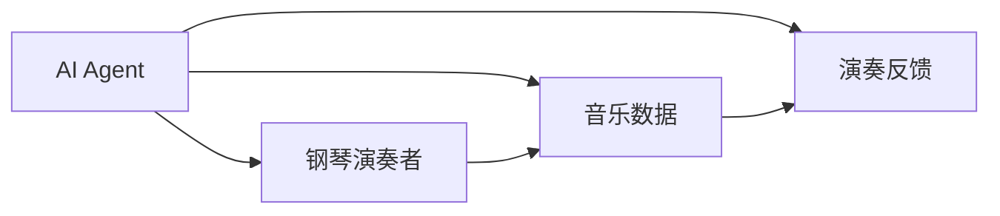
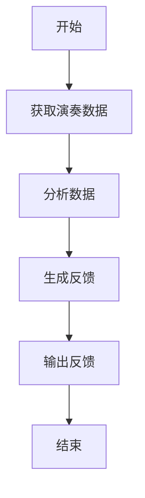
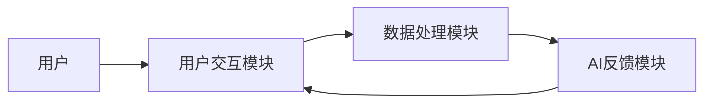

                 


# AI Agent在智能钢琴中的演奏技巧指导

## 关键词：
AI Agent, 智能钢琴, 演奏技巧, 实时反馈, 音乐教育, 技术实现

## 摘要：
本文深入探讨了AI Agent在智能钢琴演奏技巧指导中的应用，从AI Agent的基本概念到其在智能钢琴中的具体实现，再到实际应用案例，系统地分析了AI Agent如何通过实时反馈、个性化教学和智能分析帮助钢琴演奏者提高演奏技巧。本文结合技术实现与音乐教育的双重视角，详细阐述了AI Agent在智能钢琴中的核心算法、系统架构和最佳实践。

---

# 第一部分: AI Agent与智能钢琴的背景介绍

# 第1章: AI Agent与智能钢琴概述

## 1.1 AI Agent的基本概念
### 1.1.1 AI Agent的定义与特点
AI Agent（人工智能代理）是指能够感知环境、自主决策并执行任务的智能实体。它具备以下特点：
1. **自主性**：能够在没有外部干预的情况下独立运行。
2. **反应性**：能够实时感知环境并做出反应。
3. **目标导向**：具备明确的目标，并通过行为实现目标。
4. **学习能力**：能够通过数据和经验不断优化自身性能。

### 1.1.2 AI Agent的核心要素
AI Agent的核心要素包括：
1. **感知机制**：通过传感器或数据输入感知环境。
2. **推理能力**：通过逻辑推理或算法处理信息。
3. **决策机制**：基于推理结果做出决策。
4. **执行机构**：将决策转化为具体行动。

### 1.1.3 AI Agent与传统计算机程序的区别
AI Agent与传统计算机程序的主要区别在于：
- AI Agent具备自主性和目标导向性，而传统程序通常是响应式或固定流程的。
- AI Agent能够通过学习和适应不断优化性能，而传统程序通常不具备这种能力。

## 1.2 智能钢琴的定义与特点
### 1.2.1 智能钢琴的定义
智能钢琴是一种结合了计算机技术和音乐设备的钢琴，能够通过传感器、麦克风或其他输入设备采集演奏数据，并通过AI算法对演奏进行分析和反馈。

### 1.2.2 智能钢琴的核心技术
智能钢琴的核心技术包括：
1. **声音采集技术**：通过麦克风或内置传感器采集钢琴演奏的声音数据。
2. **数据处理技术**：对采集到的声音数据进行分析，提取音符、节奏、力度等信息。
3. **AI算法**：基于分析结果生成反馈或指导建议。

### 1.2.3 智能钢琴与传统钢琴的对比
智能钢琴与传统钢琴的主要区别在于：
- 智能钢琴能够提供实时反馈和个性化指导，而传统钢琴无法实现这一点。
- 智能钢琴可以通过AI技术不断优化演奏技巧，而传统钢琴的演奏技巧依赖于人工教学。

## 1.3 AI Agent在智能钢琴中的应用背景
### 1.3.1 音乐教育的数字化趋势
随着科技的发展，音乐教育逐渐从传统的面对面教学向数字化、智能化方向转变。AI Agent的出现为音乐教育提供了新的可能性。

### 1.3.2 AI技术在音乐领域的潜力
AI技术在音乐领域的潜力主要体现在以下几个方面：
1. **音乐生成**：通过深度学习模型生成音乐作品。
2. **音乐分析**：对音乐作品进行结构分析和情感识别。
3. **个性化教学**：根据学习者的水平和需求提供个性化的教学方案。

### 1.3.3 AI Agent在钢琴演奏中的具体应用场景
AI Agent在钢琴演奏中的具体应用场景包括：
1. **实时反馈**：通过分析演奏数据，实时反馈演奏中的问题。
2. **个性化教学**：根据学习者的水平和需求，提供个性化的教学方案。
3. **演奏优化**：通过分析演奏数据，提出优化建议。

## 1.4 本章小结
本章从AI Agent的基本概念出发，介绍了智能钢琴的定义和技术特点，并分析了AI Agent在智能钢琴中的应用背景和具体应用场景。

---

# 第二部分: AI Agent在钢琴演奏中的核心概念与联系

# 第2章: AI Agent与钢琴演奏的核心概念

## 2.1 AI Agent在音乐中的核心原理
### 2.1.1 自然语言处理在音乐中的应用
自然语言处理技术可以用于音乐评论的分析和情感识别，从而为钢琴演奏提供情感上的指导。

### 2.1.2 语音识别与音乐生成的结合
通过语音识别技术，AI Agent可以识别演奏者的声音指令，并结合音乐生成技术提供个性化的演奏建议。

### 2.1.3 基于AI的音乐反馈机制
AI Agent可以通过分析演奏数据，生成个性化的反馈，帮助演奏者发现并纠正演奏中的问题。

## 2.2 智能钢琴演奏中的关键属性对比
### 2.2.1 不同AI模型的性能对比
不同的AI模型在智能钢琴中的性能对比可以从以下几个方面进行分析：
1. **准确性**：AI模型对音符的识别准确性。
2. **实时性**：AI模型的反馈速度。
3. **个性化**：AI模型的个性化建议能力。

### 2.2.2 不同演奏技巧的特征分析
不同演奏技巧的特征分析可以通过以下步骤进行：
1. **数据采集**：采集不同演奏技巧的声音数据。
2. **数据分析**：分析数据中的特征，如音高、节奏、力度等。
3. **特征对比**：将不同演奏技巧的特征进行对比，找出差异。

### 2.2.3 不同用户需求的优先级排序
不同用户需求的优先级可以通过以下步骤进行排序：
1. **需求收集**：收集用户的需求。
2. **需求分析**：分析需求的重要性和可行性。
3. **优先级排序**：根据需求的重要性和可行性进行优先级排序。

## 2.3 AI Agent与钢琴演奏的实体关系图
以下是AI Agent与钢琴演奏的实体关系图：



## 2.4 本章小结
本章从AI Agent在音乐中的核心原理出发，分析了智能钢琴演奏中的关键属性对比，并通过实体关系图展示了AI Agent与钢琴演奏者之间的关系。

---

# 第三部分: AI Agent的算法原理与数学模型

# 第3章: AI Agent的算法原理

## 3.1 基于AI的钢琴演奏反馈算法
### 3.1.1 算法流程图
以下是基于AI的钢琴演奏反馈算法的流程图：



## 3.2 算法实现的Python代码
以下是基于AI的钢琴演奏反馈算法的Python代码示例：

```python
def ai_feedback(演奏数据):
    分析数据
    生成反馈
    返回反馈
```

## 3.3 算法的数学模型
### 3.3.1 基于概率的演奏评价模型
$$ P(正确性) = \frac{正确音符数}{总音符数} $$

### 3.3.2 基于深度学习的反馈生成模型
$$ F = G(x) $$
其中，$$x$$ 是输入的演奏数据，$$F$$ 是生成的反馈。

## 3.4 本章小结
本章从算法原理出发，详细讲解了基于AI的钢琴演奏反馈算法，并通过Python代码和数学公式展示了算法的实现过程。

---

# 第四部分: 智能钢琴演奏系统的分析与设计

# 第4章: 智能钢琴演奏系统的架构设计

## 4.1 系统功能模块设计
### 4.1.1 用户交互模块
用户交互模块负责接收用户的输入和输出反馈，包括演奏数据的采集和反馈信息的显示。

### 4.1.2 数据处理模块
数据处理模块负责对采集到的演奏数据进行分析和处理，提取音符、节奏、力度等信息。

### 4.1.3 AI反馈模块
AI反馈模块负责基于分析结果生成个性化的反馈信息，并将反馈信息传递给用户交互模块。

## 4.2 系统架构图
以下是智能钢琴演奏系统的架构图：



## 4.3 本章小结
本章从系统架构设计出发，详细讲解了智能钢琴演奏系统的功能模块和系统架构。

---

# 第五部分: 项目实战与案例分析

# 第5章: 项目实战

## 5.1 环境安装与配置
### 5.1.1 开发环境的安装
需要安装Python、深度学习框架（如TensorFlow或Keras）以及声音处理库（如 librosa）。

### 5.1.2 系统配置
配置硬件设备，如麦克风、钢琴传感器等。

## 5.2 系统核心实现
### 5.2.1 数据采集
通过麦克风或钢琴传感器采集演奏数据。

### 5.2.2 数据分析
对采集到的数据进行分析，提取音符、节奏、力度等信息。

### 5.2.3 反馈生成
基于分析结果生成个性化的反馈信息。

## 5.3 代码实现与解读
### 5.3.1 数据采集代码
```python
import librosa

def 采集数据():
    y, sr = librosa.load("演奏音频.mp3", sr=22050)
    return y, sr
```

### 5.3.2 数据分析代码
```python
def 分析数据(y, sr):
    chroma = librosa.feature.chroma(y=y, sr=sr)
    return chroma
```

### 5.3.3 反馈生成代码
```python
def 生成反馈(chroma):
    反馈信息 = "您的音高准确性为：{}%".format(chroma.mean())
    return 反馈信息
```

## 5.4 案例分析
### 5.4.1 案例背景
以一位初学钢琴的学生为例，分析其演奏数据并生成反馈信息。

### 5.4.2 数据分析结果
假设演奏数据的平均音高准确性为75%，则反馈信息为：“您的音高准确性为：75%”。

## 5.5 本章小结
本章通过项目实战，详细讲解了智能钢琴演奏系统的实现过程，并通过案例分析展示了系统的实际应用。

---

# 第六部分: 总结与展望

## 6.1 本章小结
本文从AI Agent的基本概念出发，详细探讨了其在智能钢琴演奏中的应用，包括算法原理、系统架构设计和项目实战。

## 6.2 未来展望
随着AI技术的不断发展，AI Agent在智能钢琴中的应用将更加广泛。未来的研究方向可以包括：
1. **更精准的反馈机制**：通过更复杂的算法提高反馈的准确性。
2. **更个性化的教学方案**：根据学习者的个性化需求提供更精准的教学建议。
3. **更智能化的演奏优化**：通过AI技术实现演奏的实时优化和提升。

---

# 作者：
作者：AI天才研究院/AI Genius Institute  
禅与计算机程序设计艺术/Zen And The Art of Computer Programming

