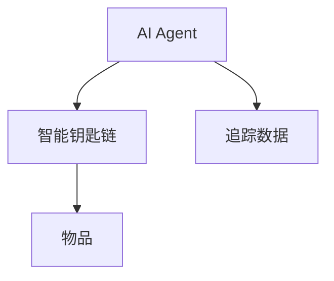

                 


# AI Agent在智能钥匙链中的物品追踪功能

## 关键词
AI Agent, 智能钥匙链, 物品追踪, 算法原理, 系统架构, 项目实战

## 摘要
本文深入探讨AI Agent在智能钥匙链中的物品追踪功能，分析其核心算法、系统架构和项目实现。通过理论与实践结合，帮助读者理解如何利用AI技术提升物品追踪的效率和准确性。

---

# 第一部分：AI Agent与智能钥匙链的背景介绍

## 第1章：AI Agent与智能钥匙链概述

### 1.1 AI Agent的基本概念
- **定义**：AI Agent是能够感知环境、自主决策并执行任务的智能体。
- **特点**：具备学习、推理、规划和自适应能力。
- **区别**：与传统软件相比，AI Agent能够主动适应环境变化。

### 1.2 智能钥匙链的工作原理
- **功能介绍**：通过传感器和AI算法，实时追踪物品位置。
- **技术基础**：结合蓝牙、Wi-Fi和加速度传感器。
- **应用场景**：丢失物品定位、智能提醒等。

### 1.3 物品追踪的背景与重要性
- **背景**：随着智能设备普及，物品追踪需求增加。
- **重要性**：提升生活便利性，减少丢失物品带来的不便。

---

# 第二部分：AI Agent在物品追踪中的核心概念与联系

## 第2章：AI Agent与智能钥匙链的核心概念

### 2.1 AI Agent的原理
- **感知与决策**：通过传感器数据进行分析，做出追踪决策。
- **学习与优化**：利用机器学习模型优化追踪准确性。
- **通信与协作**：与其他设备协同工作，提升追踪效果。

### 2.2 智能钥匙链的系统架构
- **硬件组成**：包括传感器模块、通信模块和处理器。
- **软件架构**：包含数据采集、处理和应用层。
- **传感器与数据采集**：通过多种传感器收集环境数据。

### 2.3 AI Agent与智能钥匙链的实体关系


## 第3章：AI Agent在物品追踪中的核心算法

### 3.1 基于AI的定位算法
- **信号强度定位**：通过RSSI值估算物品距离。
- **三边测量定位**：利用多个参考点进行三角定位。
- **机器学习定位**：使用神经网络预测位置。

### 3.2 数据融合算法
- **加权平均融合**：根据传感器可靠性加权融合数据。
- **卡尔曼滤波**：通过状态估计消除传感器噪声。

### 3.3 算法实现
- **信号强度定位代码**：
  ```python
  import numpy as np
  def calculate_distance(rssi, tx_power):
      return 10 ** ((-rssi + tx_power)/10)
  ```
- **卡尔曼滤波代码**：
  ```python
  class KalmanFilter:
      def __init__(self, R=0.01):
          self.R = R
          self.last Estimate = 0
      def update(self, measurement):
          # 这里省略详细实现
  ```

### 3.4 数学模型
- **概率模型**：
  $$ P(x|z) = \frac{P(z|x)P(x)}{P(z)} $$
- **融合公式**：
  $$ \hat{x}_k = \hat{x}_{k-1} + K(z_k - \hat{x}_{k-1}) $$

---

# 第三部分：系统分析与架构设计

## 第4章：系统分析与架构设计

### 4.1 项目背景
- **问题场景**：用户常因物品丢失而困扰。
- **项目介绍**：开发智能钥匙链追踪系统。

### 4.2 系统功能设计
- **领域模型**：
  ```mermaid
  classDiagram
      class Item {
          id: int
          location: tuple(float, float)
      }
      class SmartKeyChain {
          id: int
          sensors: list
          location: tuple(float, float)
      }
      class TrackingSystem {
          items: dict
          agents: list
      }
  ```

### 4.3 系统架构设计
- **架构图**：
  ```mermaid
  graph TD
      A[AI Agent] --> B[Tracking System]
      B --> C[Smart Key Chain]
      C --> D[Items]
  ```

### 4.4 接口与交互设计
- **接口**：API用于数据传输和控制。
- **交互**：
  ```mermaid
  sequenceDiagram
      User -> SmartKeyChain: 请求位置
      SmartKeyChain -> AI Agent: 查询位置数据
      AI Agent -> Tracking System: 返回位置信息
      Tracking System -> User: 显示位置
  ```

---

# 第四部分：项目实战

## 第5章：项目实战

### 5.1 环境安装
- **工具**：Python 3.8+, numpy, matplotlib
- **依赖安装**：pip install numpy scikit-learn

### 5.2 核心代码实现
- **信号强度定位**：
  ```python
  def calculate_distance(rssi, tx_power):
      return 10 ** ((-rssi + tx_power) / 10)
  ```
- **卡尔曼滤波实现**：
  ```python
  class KalmanFilter:
      def __init__(self, R=0.01):
          self.R = R
          self.last_estimate = 0
      def update(self, measurement):
          K = self.R / (self.R + 1)
          self.last_estimate = self.last_estimate + K * (measurement - self.last_estimate)
          return self.last_estimate
  ```

### 5.3 案例分析
- **实际案例**：智能钥匙链追踪用户钥匙。
- **分析步骤**：
  1. 传感器采集信号强度。
  2. AI Agent计算距离。
  3. 系统协同定位。

### 5.4 代码解读
- **定位算法**：通过RSSI计算距离。
- **数据融合**：结合多个传感器数据，提高准确性。

---

# 第五部分：最佳实践与总结

## 第6章：最佳实践与总结

### 6.1 最佳实践
- **传感器选择**：选择高精度传感器。
- **算法优化**：定期更新模型参数。
- **系统维护**：定期校准设备。

### 6.2 小结
本文详细探讨AI Agent在智能钥匙链中的应用，涵盖算法、架构和实现，帮助读者掌握物品追踪的核心技术。

### 6.3 注意事项
- 确保数据安全，避免隐私泄露。
- 系统需定期维护，确保准确性。

### 6.4 拓展阅读
推荐阅读《智能传感器网络》和《AI算法实战》。

---

# 作者：AI天才研究院 & 禅与计算机程序设计艺术

