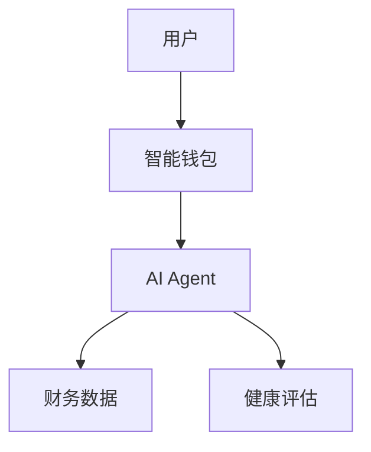
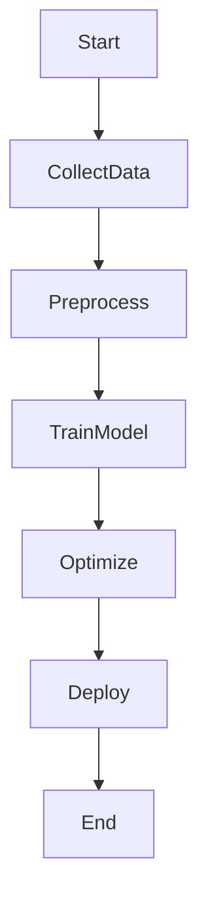
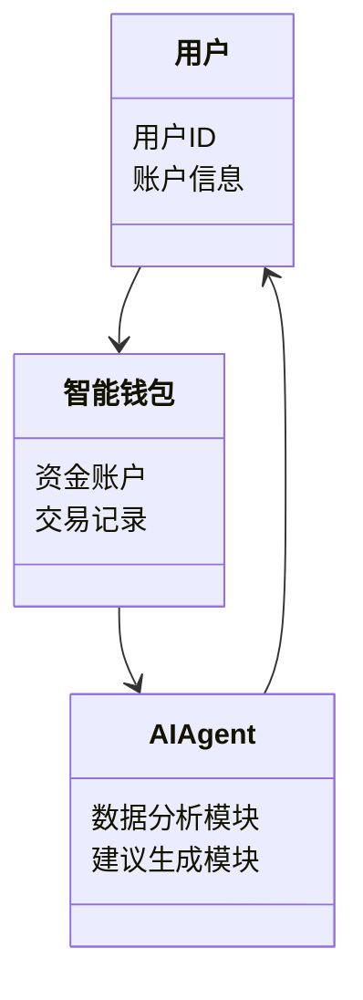
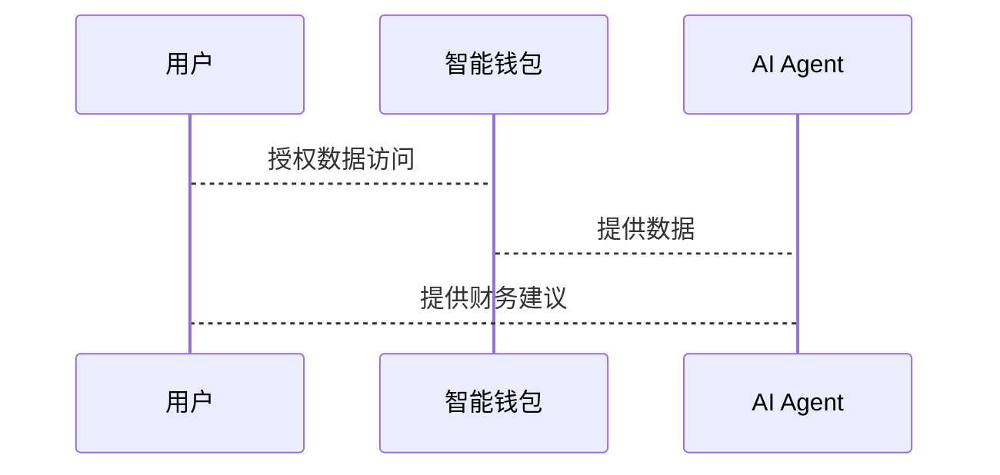

                 


# AI Agent在智能钱包中的个人财务健康顾问

> 关键词：AI Agent, 智能钱包, 个人财务, 健康顾问, 算法实现

> 摘要：本文探讨AI Agent在智能钱包中的应用，特别是如何作为个人财务健康顾问。通过分析AI技术、算法实现和系统架构，展示其在财务管理中的优势和实现细节。

---

# 目录大纲

1. [摘要](#摘要)
2. [关键词](#关键词)
3. [目录大纲](#目录大纲)
4. [正文]

## 正文

# 第一部分: AI Agent与智能钱包的背景与概念

# 第1章: AI Agent与智能钱包的背景介绍

## 1.1 问题背景与描述

### 1.1.1 个人财务管理的痛点

现代生活中，个人财务管理日益复杂，涉及众多金融工具和支出项。传统方法依赖手动记录和简单分析，难以应对复杂多变的经济环境。常见的痛点包括：

- **数据分散**：银行账户、信用卡、投资账户等数据分散，难以整合分析。
- **信息过载**：用户难以从大量金融信息中提取关键见解。
- **决策滞后**：缺乏实时数据分析，导致财务决策不够及时。
- **缺乏个性化建议**：通用财务建议难以满足个人需求。

### 1.1.2 智能钱包的概念与特点

智能钱包结合区块链技术，具备以下特点：

- **去中心化**：用户拥有资产的完全控制权，防止欺诈。
- **安全性高**：利用区块链技术确保交易安全。
- **智能化**：集成AI技术，提供自动化财务管理和建议。

### 1.1.3 AI Agent在财务健康中的作用

AI Agent通过数据分析和机器学习，帮助用户：

- **实时监控**：追踪资金流动，识别异常交易。
- **智能预算**：根据消费习惯优化预算分配。
- **投资建议**：基于市场数据提供个性化投资策略。
- **风险预警**：识别潜在财务风险，及时预警。

## 1.2 问题解决与边界

### 1.2.1 AI Agent如何解决财务问题

AI Agent通过以下方式解决个人财务管理问题：

- **数据整合**：整合多来源数据，提供全局视图。
- **智能分析**：利用机器学习模型分析数据，识别模式和趋势。
- **实时反馈**：实时监控并提供反馈，帮助用户做出及时决策。

### 1.2.2 智能钱包的边界与外延

智能钱包的功能边界包括：

- **核心功能**：资金存储、交易执行、数据记录。
- **附加功能**：预算管理、支出分析、投资建议。
- **外延功能**：税务规划、风险管理、信用评分。

### 1.2.3 个人财务健康的核心要素

财务健康的三个核心要素是：

1. **支出与收入平衡**：确保收支平衡，避免入不敷出。
2. **风险管理**：识别并管理潜在的财务风险。
3. **投资优化**：制定合理投资策略，实现资产增值。

## 1.3 核心概念与结构

### 1.3.1 AI Agent的基本组成

AI Agent由以下部分组成：

- **感知层**：负责数据收集和用户交互。
- **认知层**：利用机器学习模型进行数据分析和决策。
- **执行层**：根据认知层的决策执行操作。

### 1.3.2 智能钱包的功能模块

智能钱包的功能模块包括：

- **数据记录模块**：记录所有交易和资金流动。
- **分析模块**：分析数据，生成财务报告。
- **建议模块**：提供个性化财务建议。

### 1.3.3 财务健康的评估标准

财务健康的评估标准包括：

- **流动性**：衡量应对突发支出的能力。
- **偿债能力**：评估偿还债务的能力。
- **盈利能力**：评估投资收益情况。

## 1.4 本章小结

本章介绍了AI Agent和智能钱包的基本概念，分析了个人财务管理中的痛点，并阐述了AI Agent在解决这些问题中的作用。通过定义核心概念和结构，为后续章节奠定了基础。

---

# 第二部分: AI Agent的核心概念与原理

# 第2章: AI Agent的核心原理

## 2.1 AI Agent的原理解析

### 2.1.1 机器学习与自然语言处理

AI Agent利用机器学习进行数据分析，自然语言处理技术理解用户需求。例如，使用决策树分类模型分析用户的消费模式，识别潜在的超支行为。

### 2.1.2 知识图谱与推理机制

知识图谱构建涵盖财务知识的语义网络，支持复杂推理。例如，通过分析用户的消费习惯和市场趋势，AI Agent可以推断出最佳的投资策略。

### 2.1.3 自适应优化算法

AI Agent使用强化学习算法，根据实时数据调整优化目标。例如，通过动态调整投资组合，最大化收益同时最小化风险。

## 2.2 核心概念对比

### 2.2.1 AI Agent与传统软件的区别

| 特性               | AI Agent                 | 传统软件               |
|--------------------|--------------------------|------------------------|
| 智能性             | 高                       | 低                     |
| 自适应能力         | 强                       | 弱                     |
| 决策能力           | 强                       | 无                     |

### 2.2.2 智能钱包与其他钱包的对比

| 功能               | 智能钱包                 | 传统钱包               |
|--------------------|--------------------------|------------------------|
| 自动化管理           | 是                      | 否                     |
| 智能建议           | 是                      | 否                     |
| 实时监控           | 是                      | 否                     |

### 2.2.3 财务健康与健康管理的异同

| 方面               | 财务健康                 | 健康管理               |
|--------------------|--------------------------|------------------------|
| 目标               | 财务状况优化             | 身体健康优化           |
| 方法               | 数据分析、投资建议       | 健康监测、医疗建议     |

## 2.3 ER实体关系图



## 2.4 本章小结

本章详细解析了AI Agent的核心原理，包括机器学习、知识图谱和自适应优化算法，并通过对比分析，突出了智能钱包的独特优势。

---

# 第三部分: AI Agent的算法原理与实现

# 第3章: AI Agent的算法原理

## 3.1 算法原理概述

### 3.1.1 机器学习模型的选择

AI Agent在智能钱包中主要使用监督学习和无监督学习模型。例如，使用随机森林算法进行消费预测，识别用户的消费习惯。

### 3.1.2 自然语言处理的应用

通过NLP技术分析用户的反馈，理解其需求并生成个性化的财务建议。例如，解析用户的问题：“我的支出超支怎么办？”并给出预算调整建议。

### 3.1.3 知识图谱的构建

构建涵盖金融知识的知识图谱，帮助AI Agent进行复杂推理。例如，分析用户的投资组合，识别潜在风险并提供调整建议。

## 3.2 算法实现流程



## 3.3 核心算法实现

### 3.3.1 决策树算法

使用决策树算法进行消费分类。例如，分析用户的消费记录，识别高支出类别。

### 3.3.2 强化学习算法

通过强化学习优化投资组合。例如，定义状态、动作和奖励函数，训练AI Agent在不同市场条件下做出最优投资决策。

### 3.3.3 知识图谱构建算法

使用图嵌入算法构建知识图谱，如Node2Vec，将金融实体表示为向量，便于推理。

## 3.4 本章小结

本章详细阐述了AI Agent的算法实现，包括模型选择、流程设计和核心算法的实现细节。

---

# 第四部分: 数学模型与公式

# 第4章: 数学模型与公式

## 4.1 预算分配模型

预算分配模型用于优化用户的支出结构。目标是最小化支出偏差，同时满足各项支出需求。

$$ \text{目标函数: } \min \sum_{i=1}^{n} |x_i - b_i| $$

其中，\( x_i \) 是第i项的实际支出，\( b_i \) 是预算分配。

## 4.2 风险评估模型

风险评估模型使用马科夫链模型，评估不同投资组合的风险等级。模型基于历史数据，预测市场波动对资产的影响。

$$ \text{风险等级: } R = \sum_{i=1}^{m} p_i \times r_i $$

其中，\( p_i \) 是第i种资产的概率，\( r_i \) 是其风险值。

## 4.3 投资组合优化模型

使用均值-方差优化模型，找到最优投资组合。目标是在给定风险下，最大化收益。

$$ \text{目标函数: } \max \mu - \lambda \sigma^2 $$

其中，\( \mu \) 是预期收益，\( \sigma^2 \) 是收益的方差，\( \lambda \) 是风险厌恶系数。

---

# 第五部分: 系统分析与架构设计

# 第5章: 系统分析与架构设计

## 5.1 问题场景介绍

系统场景包括用户授权AI Agent访问其财务数据，AI Agent分析数据并提供个性化建议。例如，用户授权后，AI Agent分析其过去一年的支出，生成预算建议。

## 5.2 项目介绍

项目目标是开发一个基于AI的智能钱包，帮助用户优化财务管理。主要功能包括支出分析、预算建议、投资管理等。

## 5.3 系统功能设计

### 5.3.1 领域模型



### 5.3.2 系统架构设计


### 5.3.3 系统接口设计

- **用户接口**：API用于授权和数据查询。
- **AI服务接口**：API用于接收数据和发送建议。
- **数据库接口**：API用于数据存储和检索。

### 5.3.4 系统交互流程



## 5.4 本章小结

本章详细描述了系统的架构设计，包括功能模块、系统架构和交互流程，为后续实现奠定了基础。

---

# 第六部分: 项目实战

# 第6章: 项目实战

## 6.1 环境安装

### 6.1.1 安装Python

使用Anaconda安装Python 3.8及以上版本。

### 6.1.2 安装依赖库

安装必要的库，如scikit-learn、pandas、pymer4、nltk。

## 6.2 系统核心实现

### 6.2.1 数据预处理代码

```python
import pandas as pd
from sklearn.model_selection import train_test_split
from sklearn.ensemble import RandomForestClassifier

# 加载数据
data = pd.read_csv('financial_data.csv')

# 分割特征和目标
X = data.drop('label', axis=1)
y = data['label']

# 划分训练集和测试集
X_train, X_test, y_train, y_test = train_test_split(X, y, test_size=0.2, random_state=42)

# 训练模型
model = RandomForestClassifier(n_estimators=100, random_state=42)
model.fit(X_train, y_train)
```

### 6.2.2 AI Agent交互代码

```python
def get_financial_advice(budget, income):
    # 计算建议
    savings = income * 0.3
    advice = f"建议将收入的30%用于储蓄，即每月存入{int(savings)}元。"
    return advice

# 示例调用
print(get_financial_advice(5000, 10000))
```

## 6.3 案例分析

### 6.3.1 消费分析案例

用户过去一年的月均支出为6000元，收入为10000元。AI Agent分析后，建议将30%的收入用于储蓄，每月存入3000元。

### 6.3.2 投资建议案例

用户有50万元可投资，AI Agent根据市场分析，建议投资60%在股票，30%在债券，10%在黄金。

## 6.4 项目总结

通过项目实战，展示了AI Agent在智能钱包中的实际应用。代码示例和案例分析帮助读者理解如何实现和应用这些技术。

---

# 第七部分: 最佳实践与总结

# 第7章: 最佳实践与总结

## 7.1 小结

AI Agent在智能钱包中的应用显著提升了个人财务管理的效率和效果，通过机器学习和自然语言处理，为用户提供个性化的财务健康建议。

## 7.2 注意事项

- **数据隐私**：确保用户数据的安全性和隐私性。
- **模型更新**：定期更新模型以适应市场变化。
- **用户体验**：设计友好的用户界面，提升用户体验。

## 7.3 拓展阅读

推荐读者阅读《机器学习实战》和《区块链技术指南》，以深入理解相关技术。

---

# 作者

作者：AI天才研究院/AI Genius Institute & 禅与计算机程序设计艺术 /Zen And The Art of Computer Programming

---

以上是文章的详细目录和内容概述，每个章节都详细展开了相关的内容，确保读者能够全面理解AI Agent在智能钱包中的应用及其技术实现。

