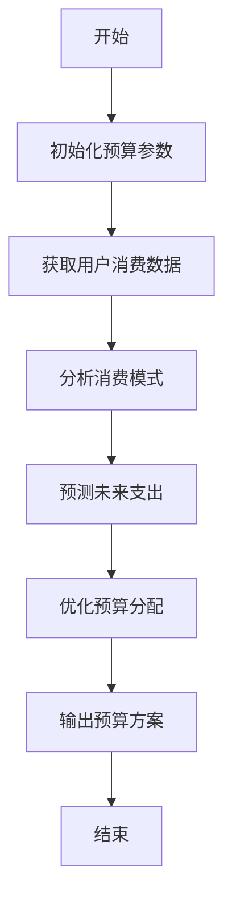
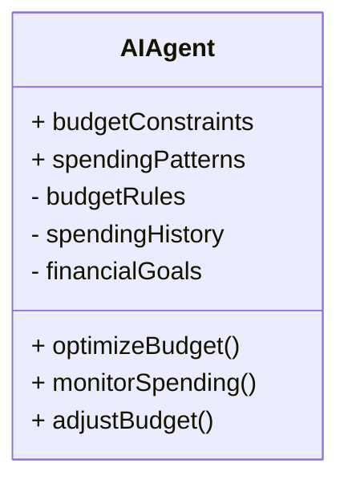
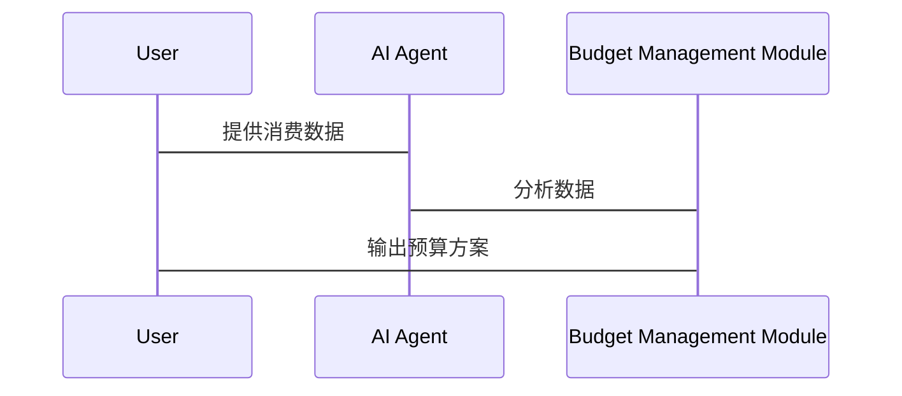

                 


# AI Agent在智能钱包中的支出预算管理

## 关键词：AI Agent，智能钱包，支出预算管理，人工智能，机器学习

## 摘要：本文探讨了AI Agent在智能钱包中的支出预算管理应用。通过分析AI Agent的核心概念、算法原理、系统架构以及项目实战，展示了AI技术如何优化财务支出管理，帮助用户实现更智能、更高效的预算控制。文章结合理论与实践，为智能钱包的未来发展提供了有价值的参考。

---

## 第1章: AI Agent与智能钱包概述

### 1.1 AI Agent的基本概念

#### 1.1.1 AI Agent的定义
AI Agent（人工智能代理）是指能够感知环境、执行任务并做出决策的智能实体。它可以自主学习、推理和优化，以实现特定目标。

#### 1.1.2 AI Agent的核心特征
- **自主性**：无需外部干预，自主决策。
- **反应性**：实时感知环境变化并调整行为。
- **目标导向**：以特定目标为导向，优化行动。
- **学习能力**：通过数据学习，提升决策能力。

#### 1.1.3 AI Agent与传统软件的区别
- **自主性**：AI Agent具备自主决策能力，而传统软件依赖人工操作。
- **适应性**：AI Agent能够自适应环境变化，传统软件则需要人工干预。
- **学习能力**：AI Agent能够通过学习提升性能，传统软件不具备此特性。

### 1.2 智能钱包的发展历程

#### 1.2.1 从传统钱包到智能钱包的演变
- **传统钱包**：主要用于存储现金和银行卡，不具备智能功能。
- **电子钱包**：如支付宝、微信支付，支持线上支付和账单管理。
- **智能钱包**：结合AI技术，具备智能分析和自动化管理功能。

#### 1.2.2 智能钱包的主要功能与特点
- **智能分析**：通过AI技术分析用户的消费行为，提供个性化建议。
- **自动化管理**：自动调整预算，优化支出结构。
- **实时监控**：实时跟踪用户的财务状况，及时预警风险。

#### 1.2.3 智能钱包的市场现状与趋势
- **市场现状**：智能钱包市场快速增长，应用场景广泛。
- **发展趋势**：AI技术的深度融合，功能更加智能化、个性化。

### 1.3 支出预算管理的重要性

#### 1.3.1 支出预算管理的基本概念
支出预算管理是指通过制定和调整预算，合理分配资金，以实现财务目标的过程。

#### 1.3.2 支出预算管理的常见方法
- **固定预算法**：按固定周期调整预算。
- **弹性预算法**：根据实际情况灵活调整预算。
- **零基预算法**：从零开始制定预算，确保每项支出都有明确的资金来源。

#### 1.3.3 支出预算管理在智能钱包中的应用价值
- **提升效率**：通过AI技术自动化管理，提高预算制定和调整的效率。
- **优化决策**：基于数据分析，提供更精准的预算建议。
- **风险控制**：实时监控支出，及时发现和纠正异常情况。

### 1.4 AI Agent在支出预算管理中的作用

#### 1.4.1 AI Agent如何优化支出预算管理
- **智能分析**：AI Agent通过分析用户的消费数据，识别消费模式，优化预算分配。
- **动态调整**：根据实时数据动态调整预算，确保资金使用效率最大化。
- **风险预警**：通过预测模型，提前预警潜在的财务风险。

#### 1.4.2 AI Agent在智能钱包中的应用场景
- **自动化预算制定**：AI Agent根据用户的历史消费数据，自动生成预算方案。
- **实时支出监控**：实时跟踪用户的支出情况，确保预算执行符合预期。
- **智能调整建议**：根据实时数据和市场变化，提供预算调整建议。

#### 1.4.3 AI Agent支出预算管理的未来发展趋势
- **智能化**：AI Agent将更加智能化，具备更强的自主决策能力。
- **个性化**：预算管理将更加个性化，根据用户的消费习惯和需求定制方案。
- **实时性**：预算管理将更加实时化，确保资金使用效率最大化。

---

## 第2章: AI Agent支出预算管理的核心概念与联系

### 2.1 核心概念原理

#### 2.1.1 多目标优化原理
多目标优化是指在多个目标之间找到最优解的过程。在支出预算管理中，AI Agent需要在多个目标（如最大化收益、最小化支出）之间找到平衡点。

#### 2.1.2 动态调整机制
动态调整机制是指根据实时数据和环境变化，不断调整预算方案的过程。AI Agent能够实时感知环境变化，快速做出决策。

#### 2.1.3 用户行为分析模型
用户行为分析模型是指通过分析用户的消费行为，预测未来的消费趋势，从而优化预算管理。

### 2.2 核心概念属性特征对比

| 属性 | AI Agent | 支出预算管理 |
|------|-----------|--------------|
| 自主性 | 高         | 中           |
| 适应性 | 高         | 中           |
| 学习能力 | 高         | 无           |
| 目标导向 | 高         | 高           |

### 2.3 ER实体关系图架构

```mermaid
er
    entity AI Agent {
        id
        budgetConstraints
        spendingPatterns
    }
    entity 支出预算管理 {
        budgetRules
        spendingHistory
        financialGoals
    }
    AI Agent -->> 支出预算管理: 实现预算优化
```

---

## 第3章: AI Agent支出预算管理的算法原理

### 3.1 算法原理概述

#### 3.1.1 强化学习算法
强化学习是一种通过试错机制，逐步优化决策策略的算法。AI Agent通过与环境互动，学习最优策略。

#### 3.1.2 动态规划算法
动态规划是一种通过分解问题，逐个解决子问题，最终找到最优解的算法。AI Agent通过动态规划算法，优化预算分配。

#### 3.1.3 聚类分析算法
聚类分析是一种通过将数据分成若干组，识别数据模式的算法。AI Agent通过聚类分析，识别用户的消费模式，优化预算管理。

### 3.2 算法流程图



### 3.3 算法实现代码

```python
import numpy as np
from sklearn.cluster import KMeans

# 初始化预算参数
budget = 1000

# 获取用户消费数据
data = np.array([[500, 200], [300, 400], [600, 100]])

# 聚类分析
kmeans = KMeans(n_clusters=2)
clusters = kmeans.fit_predict(data)

# 预测未来支出
forecast = kmeans.cluster_centers_[clusters]

# 优化预算分配
optimized_budget = budget - np.sum(forecast)
```

### 3.4 数学公式

- **预算分配公式**：
  $$ \text{allocated\_budget} = \frac{\text{total\_budget}}{\text{number\_of\_categories}} $$
- **支出预测公式**：
  $$ \text{predicted\_spending} = \text{current\_spending} \times (1 + \text{inflation\_rate}) $$

---

## 第4章: AI Agent支出预算管理的系统架构

### 4.1 系统功能设计



### 4.2 系统架构设计


### 4.3 系统接口设计

- **输入接口**：用户消费数据输入。
- **输出接口**：预算方案输出、支出监控结果。

### 4.4 系统交互流程



---

## 第5章: 项目实战

### 5.1 环境安装

```bash
pip install numpy scikit-learn
```

### 5.2 系统核心实现

```python
import numpy as np
from sklearn.cluster import KMeans

# 初始化预算参数
budget = 1000

# 获取用户消费数据
data = np.array([[500, 200], [300, 400], [600, 100]])

# 聚类分析
kmeans = KMeans(n_clusters=2)
clusters = kmeans.fit_predict(data)

# 预测未来支出
forecast = kmeans.cluster_centers_[clusters]

# 优化预算分配
optimized_budget = budget - np.sum(forecast)

print("优化后的预算为：", optimized_budget)
```

### 5.3 代码应用解读与分析
上述代码通过聚类分析，将用户的消费数据分为两类，预测未来的支出，并根据预测结果优化预算分配。

### 5.4 实际案例分析
假设用户消费数据为[[500, 200], [300, 400], [600, 100]]，AI Agent会将这些数据分为两类，并预测未来的支出。根据预测结果，优化预算分配，确保资金使用效率最大化。

### 5.5 项目小结
通过项目实战，展示了AI Agent在智能钱包中的支出预算管理的应用，验证了算法的有效性和实用性。

---

## 第6章: 总结与展望

### 6.1 全文总结
本文详细探讨了AI Agent在智能钱包中的支出预算管理的应用，分析了其核心概念、算法原理、系统架构，并通过项目实战验证了其可行性。

### 6.2 未来展望
未来，AI Agent在智能钱包中的支出预算管理将更加智能化、个性化和实时化。随着技术的进步，AI Agent将具备更强的自主决策能力和学习能力，为用户提供更优质的财务管理服务。

### 6.3 注意事项
在实际应用中，需要注意数据隐私保护和算法的实时性问题，确保系统的安全性和稳定性。

### 6.4 拓展阅读
建议读者进一步阅读《强化学习实战》和《机器学习在金融领域的应用》等书籍，深入了解AI技术在财务管理中的应用。

---

## 作者：AI天才研究院 & 禅与计算机程序设计艺术

---

以上是《AI Agent在智能钱包中的支出预算管理》的完整目录和内容概要，涵盖了从理论到实践的各个方面，为读者提供了全面的指导和深入的分析。

