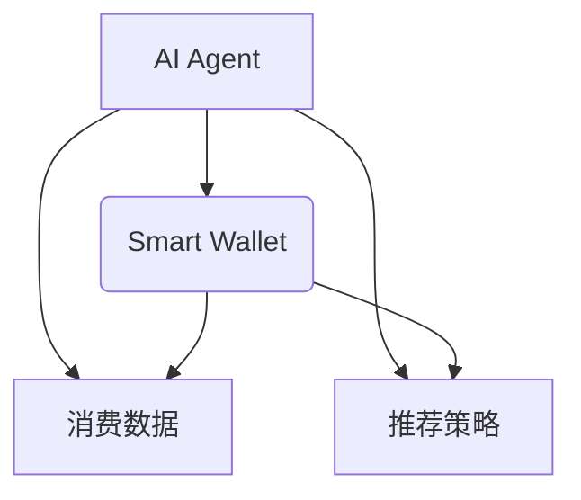
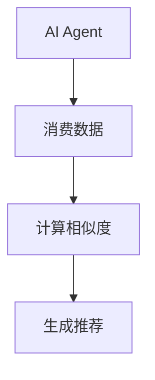
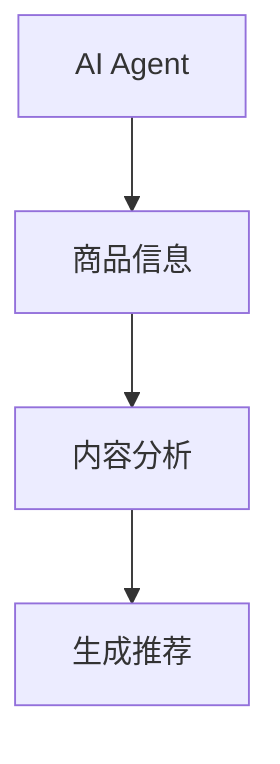
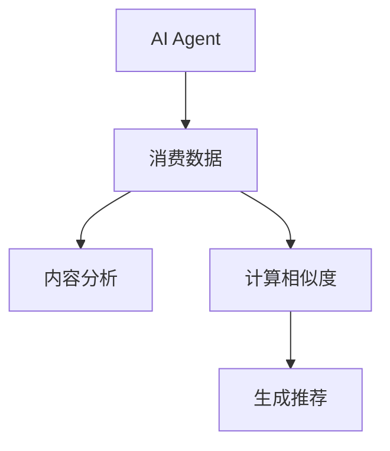
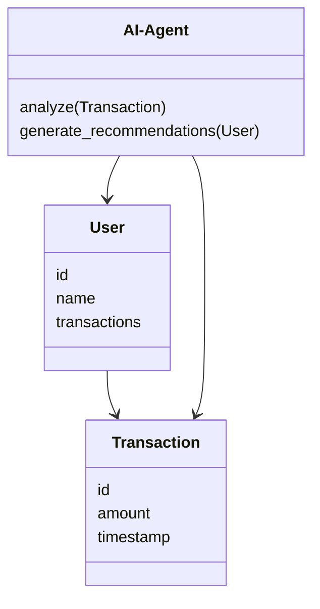

                 


# AI Agent在智能钱包中的消费习惯分析

> 关键词：AI Agent, 智能钱包, 消费习惯分析, 机器学习, 数据分析

> 摘要：本文探讨了AI Agent在智能钱包中的消费习惯分析，通过背景介绍、核心概念、算法原理、系统架构设计和项目实战，深入分析了AI Agent如何帮助用户优化消费行为，提升智能钱包的用户体验。

---

## 第一部分: AI Agent与智能钱包的背景介绍

### 第1章: AI Agent与智能钱包的基本概念

#### 1.1 AI Agent的定义与特点
##### 1.1.1 AI Agent的基本概念
AI Agent（人工智能代理）是一种能够感知环境、自主决策并执行任务的智能实体。它可以理解用户需求，主动提供服务，优化用户体验。AI Agent的核心在于其智能化和自主性，能够通过学习和适应不断改进其行为。

##### 1.1.2 AI Agent的核心特点
- **自主性**：无需外部干预，自主决策和执行任务。
- **反应性**：实时感知环境变化，动态调整行为。
- **学习能力**：通过数据学习，优化决策模型。
- **社交能力**：与用户和其他系统进行交互，理解需求。

##### 1.1.3 AI Agent与传统算法的区别
传统的算法通常基于规则或预设模型进行处理，而AI Agent具备自主学习和适应能力，能够根据实时数据动态调整策略。例如，传统推荐系统基于协同过滤，而AI Agent可以结合用户行为和环境变化，实时优化推荐结果。

#### 1.2 智能钱包的功能与作用
##### 1.2.1 智能钱包的定义
智能钱包是一种结合了区块链技术和人工智能的数字钱包，具备自动记账、消费分析、智能推荐等功能，能够帮助用户优化消费行为。

##### 1.2.2 智能钱包的主要功能
- **自动记账**：实时记录用户的消费数据。
- **消费分析**：通过AI技术分析用户的消费习惯。
- **智能推荐**：基于分析结果推荐合理的消费计划。
- **风险管理**：识别异常消费行为，预防金融风险。

##### 1.2.3 智能钱包在消费中的应用场景
智能钱包广泛应用于日常消费、投资理财、跨境支付等领域，帮助用户实现财务管理和优化。

#### 1.3 消费习惯分析的背景与意义
##### 1.3.1 消费习惯分析的重要性
消费习惯分析是帮助用户优化财务状况的重要手段，能够识别用户的消费模式，预测未来支出，帮助用户做出更明智的消费决策。

##### 1.3.2 AI Agent在消费习惯分析中的作用
AI Agent能够实时分析用户的消费数据，识别潜在的消费问题，提供个性化的消费建议。例如，识别用户的高支出类别，推荐节省方案。

##### 1.3.3 智能钱包消费数据的特点
智能钱包的消费数据具有实时性、连续性和多样性。通过分析这些数据，AI Agent能够准确捕捉用户的消费行为，提供精准的消费建议。

---

### 第2章: AI Agent在消费习惯分析中的技术背景

#### 2.1 数据驱动的消费行为分析
##### 2.1.1 数据采集与处理
智能钱包通过区块链技术记录用户的消费数据，确保数据的真实性和安全性。数据处理包括清洗、转换和存储，为后续分析提供基础。

##### 2.1.2 数据分析与挖掘
通过机器学习算法分析用户的消费数据，识别消费模式和趋势。常用的技术包括聚类分析、关联规则挖掘和时间序列分析。

##### 2.1.3 数据可视化
使用数据可视化工具展示消费数据，帮助用户和AI Agent更好地理解消费行为。例如，通过图表展示用户的月度支出分布。

#### 2.2 机器学习在消费习惯分析中的应用
##### 2.2.1 机器学习的基本概念
机器学习是一种通过数据训练模型的技术，能够帮助AI Agent识别数据中的模式和规律。

##### 2.2.2 常见的机器学习算法
- **监督学习**：如决策树、随机森林，用于分类和回归问题。
- **无监督学习**：如K-means、聚类分析，用于发现数据中的隐藏结构。
- **强化学习**：如Q-learning，用于动态决策问题。

##### 2.2.3 机器学习在消费习惯分析中的具体应用
机器学习算法可以用于预测用户的消费行为，识别异常交易，优化推荐策略。例如，使用随机森林模型预测用户的消费金额。

#### 2.3 智能钱包消费数据的特点
智能钱包的消费数据具有实时性、连续性和多样性。实时性体现在数据能够快速采集和处理，连续性体现在数据覆盖用户长期的消费行为，多样性体现在数据包含金额、时间、地点等多种信息。

---

## 第二部分: AI Agent的核心概念与联系

### 第2章: AI Agent的核心概念与联系

#### 2.1 AI Agent的核心概念原理
AI Agent通过感知、决策和执行三个步骤完成消费习惯分析任务。感知阶段采集用户的消费数据，决策阶段基于数据生成推荐策略，执行阶段将策略反馈给用户或系统。

#### 2.2 AI Agent的属性特征对比
以下是AI Agent与其他代理或系统的对比：

| 特性          | AI Agent              | 传统代理系统        |
|---------------|-----------------------|---------------------|
| 智能性         | 高，具备学习能力       | 低，基于规则执行     |
| 自主性         | 高，自主决策           | 低，依赖外部指令     |
| 适应性         | 高，能够动态调整策略   | 低，策略固定         |

#### 2.3 AI Agent与智能钱包的实体关系
以下是AI Agent与智能钱包的实体关系图：



---

## 第三部分: 算法原理

### 第3章: 推荐算法原理

#### 3.1 协同过滤算法
协同过滤是一种基于用户相似性推荐算法。以下是其流程图：



以下是协同过滤的Python实现：

```python
def compute_similarity(user, other_users):
    # 计算用户之间的相似度
    similarity = {}
    for other in other_users:
        similarity[other] = 1 - abs(user - other)
    return similarity
```

#### 3.2 基于内容的推荐算法
基于内容的推荐算法通过分析商品特征进行推荐。以下是其流程图：



以下是基于内容的推荐实现：

```python
from sklearn.feature_extraction.text import TfidfVectorizer

vectorizer = TfidfVectorizer()
tfidf_matrix = vectorizer.fit_transform(corpus)
```

#### 3.3 混合推荐算法
混合推荐算法结合了协同过滤和基于内容的推荐。以下是其流程图：



混合推荐算法的数学模型如下：

$$
\text{推荐评分} = \alpha \times \text{协同评分} + (1-\alpha) \times \text{内容评分}
$$

---

## 第四部分: 系统分析与架构设计

### 第4章: 系统分析与架构设计

#### 4.1 消费习惯分析的场景介绍
消费习惯分析的场景包括日常消费监控、预算管理、消费预测和风险管理。

#### 4.2 系统功能设计
以下是系统的领域模型：



#### 4.3 系统架构设计
以下是系统的架构图：


---

## 第五部分: 项目实战

### 第5章: 项目实战

#### 5.1 环境安装
安装必要的依赖：

```bash
pip install numpy pandas scikit-learn matplotlib
```

#### 5.2 核心代码实现
以下是核心代码：

```python
import pandas as pd
from sklearn.cluster import KMeans

# 加载数据
data = pd.read_csv('transactions.csv')

# 特征提取
features = data[['amount', 'category']]

# 模型训练
model = KMeans(n_clusters=3)
model.fit(features)

# 预测聚类
clusters = model.predict(features)
```

#### 5.3 实际案例分析
案例分析：识别用户的高支出类别。

#### 5.4 项目小结
通过本项目，我们了解了AI Agent在智能钱包中的应用，掌握了推荐算法和系统设计的方法。

---

## 第六部分: 总结与展望

### 第6章: 总结与展望

#### 6.1 总结
本文详细探讨了AI Agent在智能钱包中的消费习惯分析，介绍了核心概念、算法原理和系统设计。

#### 6.2 未来展望
未来，AI Agent在智能钱包中的应用将更加智能化和个性化，结合区块链和大数据技术，进一步提升用户体验。

---

作者：AI天才研究院/AI Genius Institute & 禅与计算机程序设计艺术 /Zen And The Art of Computer Programming

