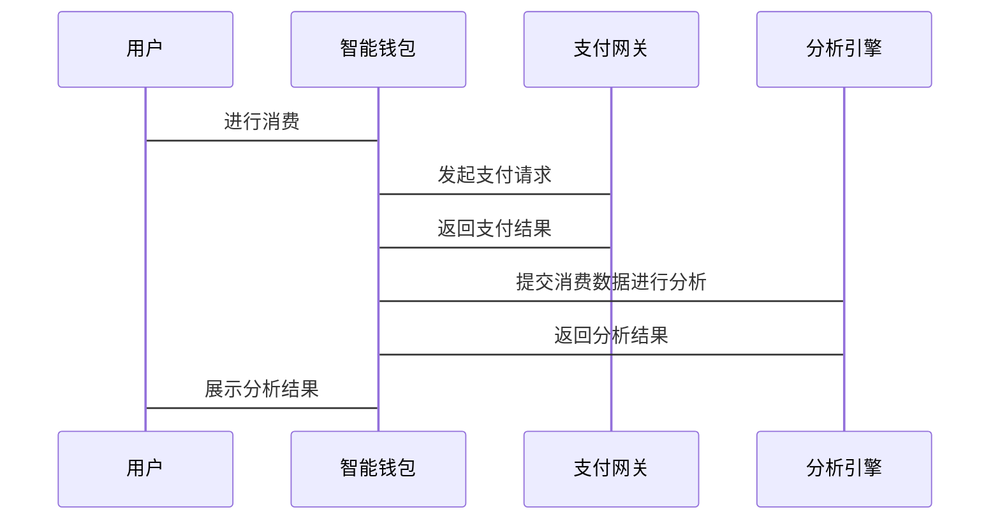

                 


# AI Agent在智能钱包中的消费分析

> 关键词：AI Agent，智能钱包，消费分析，数据挖掘，机器学习，金融支付

> 摘要：随着人工智能技术的快速发展，AI Agent（智能代理）在金融领域的应用越来越广泛。智能钱包作为一种新兴的支付工具，结合AI Agent的消费分析能力，能够为用户提供更智能、更个性化的消费管理服务。本文将从AI Agent的基本概念、智能钱包的技术架构、消费分析的算法原理、系统设计、项目实战等方面，深入探讨AI Agent在智能钱包中的消费分析应用，帮助读者全面理解这一技术的核心原理和实际应用价值。

---

## 第1章：AI Agent与智能钱包概述

### 1.1 AI Agent的基本概念

#### 1.1.1 什么是AI Agent
AI Agent（人工智能代理）是一种能够感知环境、自主决策并执行任务的智能实体。它能够通过传感器获取信息，利用算法进行分析和推理，然后采取行动以实现预定目标。

- **感知**：AI Agent通过传感器、API或其他数据源获取环境信息。
- **决策**：基于获取的数据，AI Agent利用算法进行分析和推理，制定决策。
- **执行**：根据决策结果，AI Agent执行相应的动作，例如发送指令、触发支付请求等。

#### 1.1.2 AI Agent的核心特征
AI Agent的核心特征包括：
1. **自主性**：能够自主决策和行动。
2. **反应性**：能够实时感知环境变化并做出反应。
3. **目标导向**：基于预设目标进行决策和行动。
4. **学习能力**：能够通过机器学习不断优化自身的决策能力。

#### 1.1.3 AI Agent在智能钱包中的应用
AI Agent在智能钱包中的主要应用包括：
- 实时监控用户的消费行为。
- 根据用户的消费习惯推荐最优支付方案。
- 自动识别异常交易并触发预警机制。

### 1.2 智能钱包的定义与特点

#### 1.2.1 智能钱包的定义
智能钱包是一种结合了传统钱包功能和人工智能技术的电子钱包。它不仅能够存储用户的支付信息，还能够通过AI Agent分析用户的消费行为，提供智能化的消费管理服务。

#### 1.2.2 智能钱包的主要功能
1. **支付功能**：支持多种支付方式，如信用卡、电子钱包、数字货币等。
2. **消费分析**：通过AI Agent分析用户的消费记录，提供消费报告和建议。
3. **风险管理**：识别异常交易，预防欺诈行为。
4. **个性化服务**：根据用户的消费习惯推荐优惠信息和消费计划。

#### 1.2.3 智能钱包与传统钱包的区别
| 特性 | 传统钱包 | 智能钱包 |
|------|----------|----------|
| 功能 | 存储支付信息 | 存储支付信息 + 智能分析 |
| 交互方式 | 手动操作 | 自动分析 + 个性化推荐 |
| 安全性 | 基于密码或物理安全 | 基于AI分析和行为识别 |

### 1.3 AI Agent在消费分析中的作用

#### 1.3.1 消费分析的基本概念
消费分析是指通过对用户的消费数据进行分析，识别消费模式、预测消费趋势，并为用户提供个性化的消费建议。

#### 1.3.2 AI Agent在消费分析中的优势
1. **实时性**：AI Agent能够实时获取用户的消费数据，快速进行分析和反馈。
2. **个性化**：通过机器学习算法，AI Agent能够根据用户的消费习惯提供个性化的消费建议。
3. **高效性**：AI Agent能够快速处理大量数据，提高消费分析的效率。

#### 1.3.3 AI Agent如何提升消费分析的效率
AI Agent通过以下方式提升消费分析的效率：
1. **数据挖掘**：利用数据挖掘技术从海量消费数据中提取有价值的信息。
2. **模式识别**：通过模式识别技术发现用户的消费规律。
3. **预测分析**：基于历史数据预测未来的消费趋势。

---

## 第2章：AI Agent与消费分析的背景

### 2.1 传统消费分析的局限性

#### 2.1.1 传统消费分析的流程
传统消费分析的流程通常包括数据收集、数据整理、数据分析和结果呈现四个阶段。然而，这种流程耗时长、效率低，难以满足现代用户对实时性的需求。

#### 2.1.2 传统消费分析的不足
1. **数据量大**：传统消费分析难以处理海量数据。
2. **实时性差**：传统方法无法实现实时消费分析。
3. **个性化不足**：传统方法难以提供个性化的消费建议。

#### 2.1.3 传统消费分析的改进方向
引入人工智能技术，尤其是AI Agent，可以有效解决传统消费分析的不足。

### 2.2 AI技术在消费分析中的应用现状

#### 2.2.1 AI在消费分析中的应用领域
AI技术在消费分析中的应用领域包括：
1. **欺诈检测**：通过AI技术识别异常交易，预防欺诈行为。
2. **消费预测**：通过机器学习模型预测用户的消费趋势。
3. **个性化推荐**：基于用户的消费习惯推荐商品和服务。

#### 2.2.2 AI在消费分析中的成功案例
- 某知名电商平台通过AI技术分析用户的消费行为，推荐个性化商品，显著提高了用户的购买率。
- 某银行通过AI技术实时监控用户的交易行为，有效预防了欺诈交易的发生。

#### 2.2.3 AI在消费分析中的发展趋势
1. **智能化**：AI技术将更加智能化，消费分析将更加精准。
2. **实时化**：消费分析将更加注重实时性，能够快速响应用户的消费行为。
3. **个性化**：消费分析将更加注重个性化，能够根据用户的独特需求提供定制化的服务。

### 2.3 AI Agent在智能钱包中的应用前景

#### 2.3.1 AI Agent在智能钱包中的潜在应用
- 实时监控用户的消费行为。
- 根据用户的消费习惯推荐最优支付方案。
- 自动识别异常交易并触发预警机制。

#### 2.3.2 AI Agent在智能钱包中的技术挑战
1. **数据隐私**：如何在保护用户隐私的前提下进行消费分析。
2. **算法优化**：如何提高AI Agent的决策效率和准确性。
3. **用户体验**：如何让用户体验到AI Agent带来的便利，而不感到侵扰。

#### 2.3.3 AI Agent在智能钱包中的未来展望
随着AI技术的不断发展，AI Agent在智能钱包中的应用前景广阔。未来的智能钱包将更加智能化、个性化和高效化，能够为用户提供更加优质的消费管理服务。

---

## 第3章：AI Agent的消费分析算法原理

### 3.1 AI Agent的算法原理

#### 3.1.1 决策树算法
决策树是一种常用的机器学习算法，适用于分类和回归问题。在消费分析中，决策树可以用于预测用户的消费行为。

**决策树的构建步骤**：
1. **数据准备**：收集用户的消费数据，包括消费金额、消费时间、消费地点等。
2. **特征选择**：选择对消费行为影响最大的特征，例如消费金额、消费时间等。
3. **决策树生成**：通过算法生成决策树，通常使用ID3、C4.5或CART算法。
4. **决策树剪枝**：为了防止过拟合，需要对决策树进行剪枝，例如预剪枝和后剪枝。

**决策树的优缺点**：
- **优点**：易于理解和解释，适用于小数据集。
- **缺点**：对噪声数据敏感，容易过拟合。

#### 3.1.2 强化学习算法
强化学习是一种通过试错方式来优化决策的机器学习算法。在消费分析中，强化学习可以用于优化用户的消费策略。

**强化学习的基本流程**：
1. **状态定义**：定义用户消费的状态，例如消费金额、消费时间等。
2. **动作选择**：根据当前状态选择一个动作，例如消费或不消费。
3. **奖励机制**：根据动作的结果给予奖励或惩罚，例如消费金额增加给予正奖励，消费金额减少给予负奖励。
4. **策略优化**：通过不断试错优化策略，最大化累计奖励。

**强化学习的优缺点**：
- **优点**：适用于复杂环境，能够实现动态优化。
- **缺点**：需要大量的训练数据，计算成本较高。

### 3.2 消费分析的数学模型

#### 3.2.1 决策树的数学模型
决策树的数学模型主要涉及信息增益的概念。信息增益用于衡量特征对分类结果的影响程度。

$$ \text{信息增益}(D, A) = H(D) - H(D|A) $$

其中，\( H(D) \)表示数据集D的熵，\( H(D|A) \)表示在特征A下数据集D的条件熵。

#### 3.2.2 强化学习的数学模型
强化学习的数学模型主要涉及策略和价值函数。

- **策略**：策略是一个概率分布，表示在给定状态下选择动作的概率。
$$ \pi(a|s) \)

- **价值函数**：价值函数表示在给定状态下采取某动作的期望回报。
$$ Q(s, a) = \mathbb{E}[R | s, a] $$

### 3.3 算法实现与优化

#### 3.3.1 决策树算法的实现
```python
from sklearn.tree import DecisionTreeClassifier

# 数据准备
X = ...  # 特征数据
y = ...  # 标签数据

# 模型训练
model = DecisionTreeClassifier()
model.fit(X, y)

# 预测
预测结果 = model.predict(X_test)
```

#### 3.3.2 强化学习算法的实现
```python
import numpy as np

# 定义状态空间
states = ...  # 状态列表

# 定义动作空间
actions = ...  # 动作列表

# 初始化策略
policy = np.random.rand(len(states), len(actions))

# 定义奖励函数
def reward(s, a):
    if ...:
        return 1
    else:
        return -1

# 强化学习训练
for episode in range(num_episodes):
    s = initial_state()
    total_reward = 0
    while not done:
        # 选择动作
        a = np.argmax(policy[s])
        # 执行动作，获取新状态和奖励
        s_next, r = step(s, a)
        # 更新策略
        policy[s][a] += learning_rate * (r + gamma * np.max(policy[s_next]) - policy[s][a])
        s = s_next
        total_reward += r
    print(f"Episode {episode}: Total Reward = {total_reward}")
```

#### 3.3.3 算法优化策略
1. **特征选择**：选择对消费行为影响最大的特征，提高模型的准确性。
2. **参数调优**：调整模型的超参数，例如决策树的深度、强化学习的学习率等。
3. **模型集成**：结合多种算法的优势，提高消费分析的准确性和效率。

---

## 第4章：AI Agent在智能钱包中的消费分析系统设计

### 4.1 消费分析的系统架构

#### 4.1.1 系统模块划分
消费分析系统主要包括以下几个模块：
1. **数据采集模块**：负责采集用户的消费数据。
2. **数据处理模块**：对采集到的数据进行清洗和预处理。
3. **消费分析模块**：利用AI Agent对消费数据进行分析和预测。
4. **结果展示模块**：将分析结果以可视化的方式呈现给用户。

#### 4.1.2 模块功能描述
- **数据采集模块**：通过API接口获取用户的消费数据，包括消费金额、时间、地点等。
- **数据处理模块**：对采集到的数据进行清洗，去除噪声数据，然后进行特征提取和数据标准化。
- **消费分析模块**：利用决策树和强化学习算法对消费数据进行分析，生成消费报告和预测结果。
- **结果展示模块**：将分析结果以图表、报表等形式展示给用户，方便用户理解和使用。

#### 4.1.3 系统交互流程
1. 用户进行消费行为，系统采集消费数据。
2. 数据处理模块对数据进行清洗和预处理。
3. 消费分析模块利用AI Agent对数据进行分析，生成分析结果。
4. 结果展示模块将分析结果以可视化的方式呈现给用户。

### 4.2 系统架构设计

#### 4.2.1 分层架构设计
消费分析系统的架构设计通常采用分层架构，包括数据层、业务逻辑层和表现层。

- **数据层**：负责数据的存储和管理，包括数据库设计和数据访问接口。
- **业务逻辑层**：负责消费分析的核心逻辑，包括数据处理、模型训练和预测。
- **表现层**：负责用户界面的设计和实现，包括数据展示和用户交互。

#### 4.2.2 接口设计
消费分析系统需要与智能钱包的其他模块进行交互，例如支付网关和用户界面。

- **支付网关接口**：用于获取用户的消费数据。
- **用户界面接口**：用于展示消费分析结果和用户交互。

#### 4.2.3 交互序列图
以下是一个简单的交互序列图，展示用户使用智能钱包进行消费分析的过程：



---

## 第5章：AI Agent在智能钱包中的消费分析项目实战

### 5.1 项目环境安装

#### 5.1.1 系统要求
- 操作系统：Windows/Mac/Linux
- Python版本：3.6以上
- 需要安装的库：scikit-learn、numpy、pandas、mermaid、matplotlib

#### 5.1.2 安装步骤
1. 安装Python环境：
   ```bash
   python --version
   ```
2. 安装所需的库：
   ```bash
   pip install scikit-learn numpy pandas mermaid matplotlib
   ```

### 5.2 核心代码实现

#### 5.2.1 数据预处理代码
```python
import pandas as pd
from sklearn.preprocessing import StandardScaler

# 读取数据
data = pd.read_csv('consumption.csv')

# 数据清洗
data.dropna(inplace=True)

# 特征提取
X = data[['amount', 'time', 'location']]
y = data['category']

# 数据标准化
scaler = StandardScaler()
X_scaled = scaler.fit_transform(X)
```

#### 5.2.2 AI Agent模型训练代码
```python
from sklearn.tree import DecisionTreeClassifier
from sklearn.metrics import accuracy_score

# 模型训练
model = DecisionTreeClassifier()
model.fit(X_scaled, y)

# 模型预测
y_pred = model.predict(X_scaled)

# 模型评估
print('Accuracy:', accuracy_score(y, y_pred))
```

#### 5.2.3 消费分析结果展示代码
```python
import matplotlib.pyplot as plt

# 绘制消费分布图
plt.figure(figsize=(10, 6))
plt.bar(data['category'], data['amount'])
plt.title('Consumption Analysis by Category')
plt.xlabel('Category')
plt.ylabel('Amount')
plt.show()
```

### 5.3 项目实战小结

#### 5.3.1 项目实现的关键点
1. 数据预处理：数据清洗和特征提取是消费分析的关键步骤。
2. 模型选择：选择合适的算法（如决策树）进行消费分析。
3. 结果展示：将分析结果以可视化的方式呈现给用户，提高用户体验。

#### 5.3.2 项目实现的注意事项
- 数据隐私：在处理用户数据时，必须严格遵守数据隐私保护法规。
- 模型优化：通过参数调优和模型集成提高消费分析的准确性和效率。
- 用户反馈：根据用户的反馈不断优化消费分析系统，提高用户满意度。

---

## 第6章：AI Agent在智能钱包中的消费分析总结与展望

### 6.1 总结

#### 6.1.1 AI Agent在智能钱包中的应用优势
- **实时性**：能够实时监控用户的消费行为。
- **个性化**：能够根据用户的消费习惯提供个性化的消费建议。
- **高效性**：能够快速处理大量数据，提高消费分析的效率。

#### 6.1.2 消费分析系统的实现价值
- **提升用户体验**：通过智能化的消费管理，提高用户的满意度。
- **预防欺诈交易**：通过实时监控和分析，有效预防欺诈行为。
- **优化消费策略**：通过分析用户的消费行为，帮助企业优化营销策略。

### 6.2 展望

#### 6.2.1 AI Agent在智能钱包中的未来发展趋势
1. **智能化**：AI Agent将更加智能化，消费分析将更加精准。
2. **实时化**：消费分析将更加注重实时性，能够快速响应用户的消费行为。
3. **个性化**：消费分析将更加注重个性化，能够根据用户的独特需求提供定制化的服务。

#### 6.2.2 技术挑战与解决方案
- **数据隐私**：通过加密技术和隐私保护算法，确保用户数据的安全。
- **算法优化**：通过深度学习和强化学习等技术，不断提高模型的准确性和效率。
- **用户体验**：通过优化用户界面和交互设计，提高用户的使用体验。

### 6.3 最佳实践 tips

1. **数据隐私保护**：在处理用户数据时，必须严格遵守数据隐私保护法规。
2. **模型优化**：通过参数调优和模型集成，不断提高消费分析的准确性和效率。
3. **用户体验优化**：通过优化用户界面和交互设计，提高用户的使用体验。

### 6.4 项目小结

通过本项目，我们深入探讨了AI Agent在智能钱包中的消费分析应用，详细讲解了AI Agent的基本概念、算法原理、系统设计和项目实现。通过实际案例分析，我们验证了AI Agent在消费分析中的优势和价值。未来，随着AI技术的不断发展，AI Agent在智能钱包中的应用前景将更加广阔。

---

## 作者：AI天才研究院/AI Genius Institute & 禅与计算机程序设计艺术/Zen And The Art of Computer Programming

---

以上是《AI Agent在智能钱包中的消费分析》的技术博客文章的完整目录大纲和具体内容。

