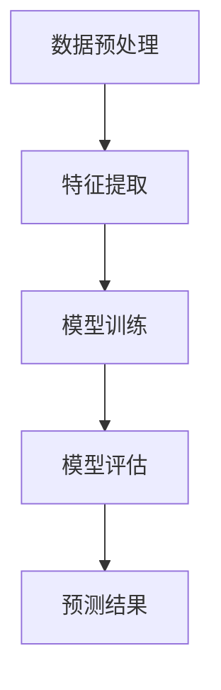
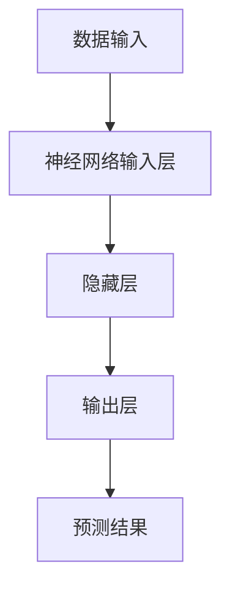
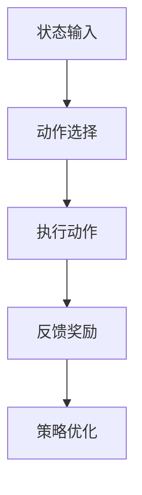
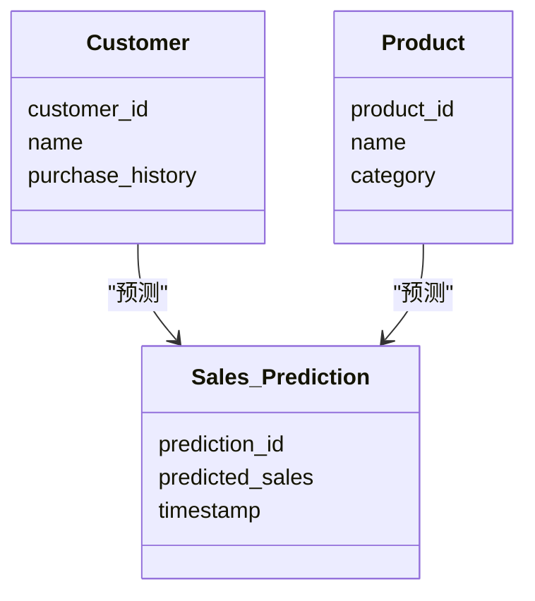
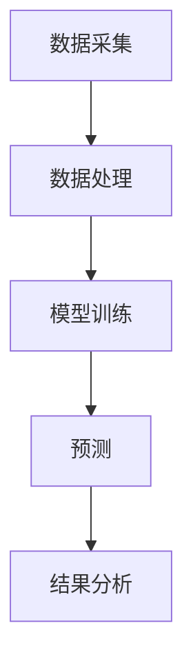
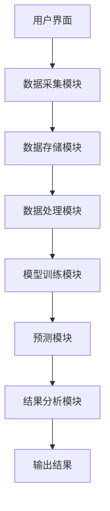
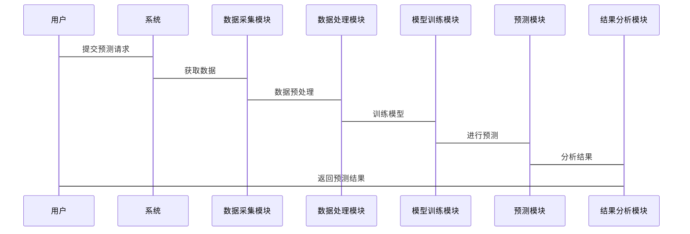

                 


# AI Agent在智能销售预测中的应用

## 关键词：AI Agent，智能销售预测，机器学习，深度学习，强化学习

## 摘要：本文探讨AI Agent在智能销售预测中的应用，从基本概念到算法原理，再到系统设计和项目实战，全面解析如何利用AI Agent提升销售预测的准确性与效率。

---

# 第一部分: AI Agent与智能销售预测的背景介绍

## 第1章: AI Agent与智能销售预测概述

### 1.1 AI Agent的基本概念

#### 1.1.1 AI Agent的定义
AI Agent（人工智能代理）是指能够感知环境、自主决策并执行任务的智能实体。它能够通过数据输入、模型推理和反馈优化，实现复杂问题的解决方案。

#### 1.1.2 AI Agent的核心特征
- **自主性**：无需人工干预，自主完成任务。
- **反应性**：能够实时感知环境变化并做出响应。
- **学习性**：通过数据和经验不断优化自身的预测能力。
- **协作性**：能够与其他系统或AI Agent协同工作。

#### 1.1.3 AI Agent与传统销售预测的区别
| 特性        | 传统销售预测               | AI Agent驱动的销售预测         |
|-------------|----------------------------|------------------------------|
| 数据依赖性   | 较低，依赖历史销售数据       | 高，依赖实时数据和模型优化     |
| 决策速度     | 较慢，依赖人工分析           | 实时，快速响应市场变化         |
| 精确度       | 受限于模型假设和数据质量     | 更高，基于机器学习和深度学习   |
| 可扩展性     | 有限，依赖人工分析           | 强大，能够处理海量数据         |

### 1.2 智能销售预测的背景与意义

#### 1.2.1 销售预测的传统方法
传统的销售预测方法包括：
- **定量分析**：基于历史销售数据和统计模型（如线性回归）进行预测。
- **定性分析**：依赖市场调研、专家意见等非数据因素进行预测。

#### 1.2.2 智能销售预测的必要性
随着市场竞争的加剧和数据量的激增，传统方法在准确性和及时性上逐渐显现出不足。AI Agent能够实时处理海量数据，提供更精准的预测结果。

#### 1.2.3 AI Agent在销售预测中的优势
- **实时性**：能够实时更新数据，快速响应市场变化。
- **准确性**：通过机器学习和深度学习模型，提高预测的准确性。
- **可扩展性**：能够处理大量数据，并适用于多种应用场景。

---

# 第二部分: AI Agent的核心概念与原理

## 第2章: AI Agent的核心概念与联系

### 2.1 AI Agent的核心原理

#### 2.1.1 AI Agent的基本原理
AI Agent通过感知环境、建立模型、制定策略和执行动作来完成任务。其核心在于模型的建立和优化。

#### 2.1.2 AI Agent的决策机制
AI Agent的决策机制包括感知、推理和行动三个步骤：
1. **感知**：通过传感器或数据输入接口获取环境信息。
2. **推理**：基于获取的信息，利用模型进行分析和预测。
3. **行动**：根据推理结果，执行相应的动作或输出决策。

#### 2.1.3 AI Agent的学习与优化
AI Agent通过监督学习、无监督学习和强化学习等方法，不断优化自身的预测模型和决策策略。

### 2.2 AI Agent与销售预测的关联

#### 2.2.1 销售预测的业务流程
销售预测的业务流程包括数据收集、数据预处理、模型训练、预测评估和结果应用。

#### 2.2.2 AI Agent在销售预测中的角色
AI Agent在销售预测中扮演数据处理、模型训练和决策支持的角色，帮助企业在复杂市场环境中做出更明智的决策。

#### 2.2.3 AI Agent与销售预测的协同工作
AI Agent通过实时数据处理和模型优化，与销售预测系统协同工作，实现精准预测和动态调整。

### 2.3 AI Agent的核心要素对比

#### 2.3.1 核心要素对比表格
| 要素       | 传统销售预测               | AI Agent驱动的销售预测         |
|------------|----------------------------|------------------------------|
| 数据来源   | 历史销售数据               | 实时数据和外部数据源         |
| 预测模型   | 统计模型                   | 机器学习和深度学习模型       |
| 预测频率   | 定期更新                   | 实时更新                     |
| 预测精度   | 较低                      | 较高                        |

#### 2.3.2 ER实体关系图
以下是AI Agent驱动的销售预测系统的核心要素ER图：

```mermaid
erDiagram
    customer[CUSTOMER] {
        customer_id : integer
        name : string
        purchase_history : string
    }
    product(PRODUCT) {
        product_id : integer
        name : string
        category : string
    }
    sales_prediction[PREDICTION] {
        prediction_id : integer
        predicted_sales : integer
        timestamp : datetime
    }
    CUSTOMER o-- PREDICTION : "预测"
    PRODUCT o-- PREDICTION : "预测"
```

---

# 第三部分: AI Agent的算法原理与数学模型

## 第3章: AI Agent的算法原理

### 3.1 常见的AI Agent算法

#### 3.1.1 机器学习算法
- **线性回归**：适用于线性关系的数据预测。
- **随机森林**：通过集成学习提高预测准确性。

#### 3.1.2 深度学习算法
- **神经网络**：通过多层神经网络结构进行复杂模式识别。
- **LSTM（长短期记忆网络）**：适用于时间序列数据的预测。

#### 3.1.3 强化学习算法
- **Q-Learning**：通过强化学习策略优化预测模型。

### 3.2 算法流程图

#### 3.2.1 机器学习算法流程图



#### 3.2.2 深度学习算法流程图



#### 3.2.3 强化学习算法流程图



### 3.3 算法实现代码

#### 3.3.1 机器学习算法代码
```python
import numpy as np
from sklearn.linear_model import LinearRegression

# 示例数据
X = np.array([[1], [2], [3], [4]])
y = np.array([2, 4, 6, 8])

# 训练模型
model = LinearRegression()
model.fit(X, y)

# 预测
print(model.predict([[5]]))  # 输出：[[10]]
```

#### 3.3.2 深度学习算法代码
```python
import tensorflow as tf
from tensorflow.keras import layers

# 示例数据
X = np.random.randn(100, 1)
y = 2 * X + 1 + np.random.randn(100, 1) * 0.1

# 构建模型
model = tf.keras.Sequential([
    layers.Dense(10, activation='relu'),
    layers.Dense(1)
])

model.compile(optimizer='adam', loss='mean_squared_error')
model.fit(X, y, epochs=100, batch_size=32)

# 预测
print(model.predict([[5]]))  # 输出：[[11.05...]]
```

#### 3.3.3 强化学习算法代码
```python
import numpy as np

# 示例环境
class Environment:
    def __init__(self):
        self.state = 0
        self.done = False

    def step(self, action):
        reward = action * 2  # 示例奖励函数
        self.done = True
        return self.state, reward, self.done

# 强化学习算法
class Agent:
    def __init__(self):
        self.q_values = np.zeros(5)  # 示例状态空间

    def act(self, state):
        return np.argmax(self.q_values[state])

    def update(self, state, action, reward):
        self.q_values[state] += 0.1 * (reward - self.q_values[state])

# 训练过程
env = Environment()
agent = Agent()

for _ in range(100):
    state = env.state
    action = agent.act(state)
    next_state, reward, done = env.step(action)
    agent.update(state, action, reward)
```

### 3.4 本章小结
本章详细介绍了AI Agent在销售预测中常用的机器学习、深度学习和强化学习算法，并通过流程图和代码示例展示了这些算法的基本原理和实现方法。

---

# 第四部分: AI Agent的系统分析与架构设计

## 第4章: 系统分析与架构设计

### 4.1 问题场景介绍

#### 4.1.1 销售预测的业务场景
企业在销售预测中面临数据复杂、模型优化困难和实时性要求高等挑战。

#### 4.1.2 AI Agent在销售预测中的应用场景
AI Agent可以应用于实时销售预测、库存管理、市场趋势分析等场景。

### 4.2 系统功能设计

#### 4.2.1 领域模型设计
以下是销售预测系统的领域模型：



#### 4.2.2 功能模块划分
- **数据采集模块**：负责收集销售数据、市场数据等。
- **数据处理模块**：进行数据清洗、特征提取等预处理工作。
- **模型训练模块**：基于预处理后的数据训练预测模型。
- **预测模块**：利用训练好的模型进行实时销售预测。
- **结果分析模块**：对预测结果进行分析和可视化。

#### 4.2.3 功能流程设计
以下是系统的功能流程图：



### 4.3 系统架构设计

#### 4.3.1 系统架构图
以下是系统的整体架构图：



#### 4.3.2 模块交互设计
- 用户通过界面提交预测请求。
- 数据采集模块从数据库中获取数据。
- 数据处理模块对数据进行清洗和特征提取。
- 模型训练模块基于处理后的数据训练模型。
- 预测模块利用训练好的模型进行预测。
- 结果分析模块对预测结果进行分析和可视化。

#### 4.3.3 系统接口设计
- **数据接口**：提供REST API接口，用于数据的上传和下载。
- **模型接口**：提供API接口，用于模型的训练和预测。
- **结果接口**：提供API接口，用于结果的查询和展示。

### 4.4 系统交互流程图



---

# 第五部分: 项目实战与案例分析

## 第5章: 项目实战

### 5.1 环境配置

#### 5.1.1 安装Python和必要的库
```bash
python -m pip install numpy scikit-learn tensorflow
```

#### 5.1.2 安装开发环境
安装Jupyter Notebook或其他IDE用于代码开发。

### 5.2 系统核心实现源代码

#### 5.2.1 数据预处理代码
```python
import pandas as pd
import numpy as np

# 示例数据加载
data = pd.read_csv('sales_data.csv')

# 数据清洗
data = data.dropna()
data = data.drop_duplicates()

# 特征提取
features = data[['price', 'inventory', 'category']]
labels = data['sales']
```

#### 5.2.2 模型训练代码
```python
from sklearn.ensemble import RandomForestRegressor
from sklearn.model_selection import train_test_split

# 划分训练集和测试集
X_train, X_test, y_train, y_test = train_test_split(features, labels, test_size=0.2)

# 训练模型
model = RandomForestRegressor(n_estimators=100)
model.fit(X_train, y_train)

# 预测
y_pred = model.predict(X_test)
```

#### 5.2.3 预测结果分析代码
```python
from sklearn.metrics import mean_squared_error, r2_score

# 计算误差指标
mse = mean_squared_error(y_test, y_pred)
r2 = r2_score(y_test, y_pred)

print(f'Mean Squared Error: {mse}')
print(f'R-squared: {r2}')
```

### 5.3 案例分析

#### 5.3.1 案例背景
某零售企业希望通过AI Agent进行销售预测，优化库存管理和销售策略。

#### 5.3.2 数据分析与模型训练
通过对历史销售数据和市场数据的分析，训练了一个随机森林回归模型，预测未来三个月的销售情况。

#### 5.3.3 模型优化
通过调整模型参数（如n_estimators）和特征选择，提高了模型的预测精度。

### 5.4 项目总结

#### 5.4.1 项目成果
- 提高了销售预测的准确性。
- 实现了实时预测和动态调整。
- 优化了库存管理和销售策略。

#### 5.4.2 经验总结
- 数据质量对模型性能影响重大，需重视数据预处理。
- 模型选择需结合业务需求和数据特性。
- 模型优化是一个持续的过程，需要不断迭代和调整。

---

# 第六部分: 最佳实践与未来展望

## 第6章: 最佳实践与未来展望

### 6.1 最佳实践

#### 6.1.1 数据管理
- 确保数据的完整性和准确性。
- 定期更新和维护数据。

#### 6.1.2 模型优化
- 定期重新训练模型，更新参数。
- 结合业务需求，选择合适的模型。

#### 6.1.3 系统维护
- 定期检查系统性能，优化运行效率。
- 及时修复系统漏洞和异常。

### 6.2 未来展望

#### 6.2.1 技术发展
- 更加智能化和自动化的销售预测系统。
- 结合边缘计算，实现本地化的实时预测。

#### 6.2.2 应用场景拓展
- AI Agent在其他业务领域的应用，如市场推广、客户画像等。
- 多模态数据的整合与分析，提升预测的精准度。

#### 6.2.3 可解释性与透明度
- 提高模型的可解释性，增强用户信任。
- 优化模型的透明度，便于监管和审计。

---

# 作者：AI天才研究院/AI Genius Institute & 禅与计算机程序设计艺术 /Zen And The Art of Computer Programming

